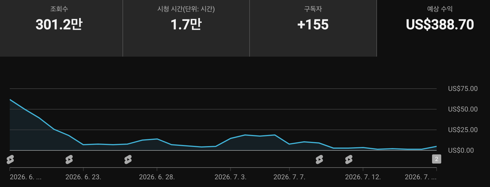

## 채널 엔트로피: '죽어가는' 자산의 역설적 가치

수많은 크리에이터 지망생과 1인 창업가들이 유튜브 채널의 화려한 성장과 달콤한 수익화에 대한 환상을 품고 출발선에 섭니다.  
그러나 초기 로켓처럼 폭발적인 성장을 경험한 직후, 예상치 못한 알고리즘의 차가운 외면으로 뼈아픈 채널 정체기를 맞닥뜨리는 경우가 허다합니다.  
제가 직접 운영하는 '1MIN DRAMA' 채널 역시 이러한 잔혹한 현실을 피해갈 수 없었습니다.  
**수익창출 승인이라는 힘겨운 문턱을 넘어선 환희도 잠시, 불과 한 달 만에 숏폼 알고리즘의 노출이 뚝 끊기며 사형 선고와도 같은 '죽어가는 채널'로 전락하고 말았습니다.**  
48시간 조회수가 4.2만 회 수준으로 곤두박질쳤으니, 대다수의 운영자라면 완전히 희망을 접고 채널을 황무지처럼 방치했을 것입니다.  
하지만 Lumen Insights의 대표로서 저는 이 절망적인 현상을 단순한 실패의 종착역이 아닌, **새로운 비즈니스 모델로 도약하기 위한 절호의 '피벗' 기회**로 해석했습니다.  
버려진 땅에서 광맥을 찾아내듯, 이것이 바로 제가 명명한 '방치된 자산의 역설'입니다.  
물론 알고리즘의 선택을 받지 못한 채널을 되살리는 것은 상당한 시간과 인내를 요구하는 고된 과정이라는 점을 인정해야 합니다.  

## 죽지 않는 채널: 데이터가 말하는 잠재력

감정을 배제하고 냉정하게 진단했을 때, '1MIN DRAMA'는 숏폼 알고리즘 관점에서 새로운 피드 노출이 멈춰버린 '죽어가는 채널'이 명백합니다.  
그러나 장막 뒤에 숨겨진 데이터는 겉모습과는 전혀 다른 흥미로운 진실을 속삭이고 있었습니다.  
현재 채널의 구독자 수는 3,758명을 유지하고 있으며, 최근 1년 누적 조회수는 자그마치 31,672,913회에 달하는 거대한 기록을 보유하고 있습니다.  
이보다 더욱 제 눈을 의심하게 만든 놀라운 사실이 하나 더 있습니다.  
**2026년 6월 18일 수익창출 최종 승인 이후 한 달이 채 안 되는 짧은 기간 동안, 심지어 영상 업로드가 단 4개에 불과한 먼지 쌓인 방치 상태에서도 누적 수익 388달러가 고요하게 발생했다는 점입니다.**  

  

첨부된 이미지를 자세히 살펴보면 전체 영상 업로드는 단 4번에 불과하며, 마지막에 보이는 2회는 바로 어제인 7월 18일에 간신히 업로드된 영상입니다.  
이러한 수치는 과연 우리에게 어떤 비즈니스적 통찰을 던져주고 있을까요?  
채널에 새로운 활력이 돌지 않아도, 과거 쌓아둔 유입량과 기존 구독자 기반이 마르지 않는 샘물처럼 미미하나마 꾸준히 수익을 길어 올리고 있다는 결정적 증거입니다.  
즉, 겉보기에는 **'죽어가는 채널'일지라도 실제로는 가치를 머금은 '잠자고 있는 자산'이며, 이는 단순한 콘텐츠 저장소를 넘어 비즈니스적 잠재력을 내포한 훌륭한 디지털 부동산과 같습니다.**  
이러한 알짜배기 자산을 섣불리 내다 버리는 것은 훌륭한 수익 파이프라인의 싹을 제 손으로 꺾어버리는 어리석은 행동과 다름없습니다.  
다만, 방치된 수익은 시간이 지남에 따라 점진적으로 우하향할 수밖에 없다는 한계점 역시 객관적으로 인지해야 합니다.  

## AI 피벗: 생산성 혁신을 통한 채널 회생 전략

채널 성장의 진짜 발목을 잡는 근본적인 문제는 운영의 극심한 비효율성과 그로 인해 크리에이터가 겪는 처절한 번아웃이었습니다.  
기존의 전통적인 수작업 방식인 쇼츠 기획, 대본 작성, 정밀한 편집은 사람의 진을 빼놓는 엄청난 시간과 노력을 요구하며, 이것이 채널 성장을 가로막는 거대한 장벽이었습니다.  
저는 이 꽉 막힌 병목 현상을 타개하기 위해 공장의 컨베이어 벨트처럼 매끄럽게 돌아가는 **'쇼츠 팩토리(Shorts Factory)' 시스템**을 치밀하게 구상했습니다.  
이 혁신적인 시스템의 핵심 가치는 "지루한 편집 시간을 10분의 1로 과감히 단축하고, 오직 조회수가 폭발하는 날카로운 기획에만 뇌를 집중하게 만든다"는 뚜렷한 목표에 있습니다.  
다행히 채널의 알고리즘 정체성이 '영화/드라마'라는 뾰족한 타겟으로 확고하게 잡혀 있었기에 가능성을 엿보았습니다.  
**채널의 주제를 무리하게 갈아엎는 대신, 영상을 찍어내는 제작 방식만 AI 기반의 최첨단 공정으로 피벗하는 현명한 전략을 채택했습니다.**  
클로드(Claude)와 제미나이(Gemini)와 같은 강력한 AI 툴을 브레인으로 활용하여, 시청자의 혼을 빼놓는 3초 훅(Hook)을 기계적으로 뽑아내는 프롬프트 엔지니어링을 치열하게 시도했습니다.  
여기에 캡컷(CapCut)의 세련된 템플릿과 Vrew, ElevenLabs 등 AI 더빙 기술을 톱니바퀴처럼 연동하는 자동화 파이프라인을 촘촘하게 구축했습니다.  
이러한 **AI 기반의 '쇼츠 팩토리'는 창작자의 발목을 잡는 저작권 리스크를 영리하게 헷지하고, 바닥에 떨어진 생산성을 수직 상승시키는 강력한 심폐소생술이 됩니다.**  
다만, AI가 생성한 결과물이 인간 특유의 미세한 감정선이나 디테일을 100% 완벽하게 구현하기에는 아직 한계가 존재한다는 점은 유의하며 모니터링해야 합니다.  
현재 이러한 치밀한 전략을 바탕으로 완벽한 **쇼츠 팩토리(Short Factory)** 개발을 멈추지 않고 적극적으로 진행 중입니다.  

## 월 100만원 수익 파이프라인 재설계: 지속 가능한 비즈니스를 향하여

저의 최종 목표는 단순히 호흡이 멎은 채널을 임시방편으로 '살려내는' 수준을 훨씬 뛰어넘습니다.  
궁극적으로는 **최소한의 리소스 투입만으로 매월 100만 원이라는 현금이 마르지 않고 흐르는 견고한 수익 파이프라인을 완벽하게 재설계하는 것입니다.**  
이것은 끝이 보이지 않는 무한한 성장만을 맹목적으로 쫓는 기존의 피곤한 유튜브 전략과는 궤를 완전히 달리하는 현실적인 접근 방식입니다.  
즉, 로또를 바라듯 운에 기대는 **'바이럴 사냥'에서 과감히 벗어나, 예측 가능하고 튼튼한 '파이프라인 안정화'로 비즈니스의 조타기를 돌리는 것입니다.**  
채널이 한때 죽음의 문턱까지 갔던 진짜 이유는, 뼈를 깎는 콘텐츠 생산의 고통이 지속 가능하지 않았기 때문입니다.  
그러나 똑똑한 AI 피벗은 톱니바퀴가 저절로 굴러가듯 이러한 무한한 지속 가능성을 비로소 현실로 만들어 줍니다.  
더 이상 퇴근 후 피곤한 몸을 이끌고 새벽까지 모니터 앞에서 편집에 매달리며 수명을 갉아먹을 필요가 없습니다.  
**"퇴근 후 단 1시간 만에 고퀄리티 쇼츠 3개를 뚝딱 찍어내는 마법 같은 루틴"을 환상이 아닌 여러분의 일상으로 만들 수 있습니다.**  
이는 채널 운영의 핵심 엔진인 크리에이터의 치명적인 번아웃을 사전에 차단하고, 끊임없는 양질의 콘텐츠 공급을 통해 까다로운 알고리즘에 지속적으로 긍정적인 신호를 보냅니다.  
결과적으로, 버려져 방치되었던 채널이라는 '죽어가는 자산'을 AI라는 첨단 도구를 통해 눈부시게 재활용하고, 마침내 예측 가능한 비즈니스 수익 모델로 탈바꿈시키는 위대한 여정입니다.  
모든 1인 창업가와 성공을 꿈꾸는 크리에이터 지망생 여러분께 제가 던지는 메시지는 무척이나 명확하고 단호합니다.  
여러분의 손안에서 멈춰버린 '죽어가는' 채널은 결코 쓰레기통에 버려야 할 실패작이 아닙니다.  
오히려 **AI의 압도적인 힘을 지렛대 삼아 언제든 새롭게 재설계될 수 있는, 폭발적인 잠재력을 숨긴 채 잠들어 있는 위대한 비즈니스 자산입니다.**  
지금 당장 도구를 쥐고, 먼지 덮인 채 깊게 잠자고 있는 여러분의 소중한 자산을 거칠게 깨워야 할 시간입니다.  

---
> 💡 **Lumen Insights로 유튜브 채널 성장을 자동화하세요!**
> 지금 바로 시작하기: [Lumen Insights](https://lumeninsights.kr/?utm_source=lumen_blog&utm_medium=blog_post&utm_campaign=auto_generated_post)
