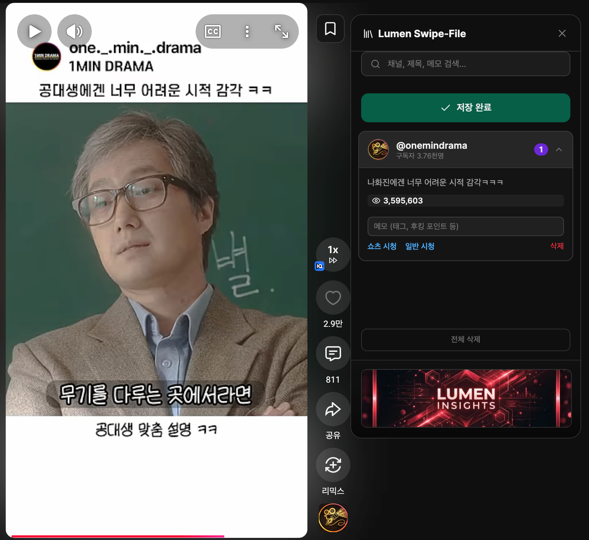
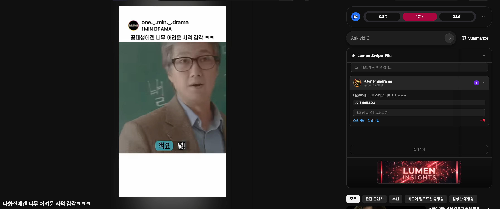

## 쇼츠 레퍼런스 수집의 고질적인 한계와 개발 배경

수많은 크리에이터들이 유튜브 쇼츠를 제작할 때 가장 어려워하는 부분 중 하나가 바로 **쇼츠 레퍼런스 수집**입니다.  
기존 유튜브 데스크톱 환경에서는 롱폼 영상과 달리 쇼츠 영상을 체계적으로 저장하고 직관적으로 분류하는 고유의 기능이 매우 부족합니다.  
마음에 드는 훌륭한 훅(Hook)이나 편집 기법을 발견하더라도 해당 쇼츠의 URL을 복사하여 개인 메모장, 카카오톡 나에게 보내기, 혹은 노션(Notion) 등에 일일이 붙여넣고 영상의 특징을 수기로 적어야 하는 번거로움이 존재합니다.  
이러한 비효율적인 단순 반복 작업은 양질의 콘텐츠 기획에 온전히 집중해야 할 1인 크리에이터의 소중한 시간과 에너지를 심각하게 갉아먹습니다.  
저 역시 **1MIN DRAMA** 채널을 운영하며 매일 수십 개의 경쟁사 레퍼런스와 트렌드 영상을 수집하는 과정에서 극심한 피로도와 한계를 뼈저리게 느꼈습니다.  
'어떻게 하면 이 지루한 과정을 자동화할 수 있을까'라는 고민 끝에, 쇼츠 시청 화면에서 클릭 한 번으로 모든 필수 메타 데이터를 즉시 캐싱하여 저장할 수 있는 **전용 크롬 확장 프로그램인 'Lumen Shorts Swipe-File'**을 직접 설계하고 개발하게 되었습니다.  
이는 마치 울퉁불퉁한 산길을 걷다가 아스팔트 고속도로를 직접 깔아버리는 것과 같은 발상의 전환이었습니다.  
본 도구는 오로지 작업 생산성의 극대화에 초점을 맞추어 기획되었지만, 브라우저 업데이트에 따라 확장 프로그램이 호환되지 않을 수 있는 유지보수의 잠재적 위험성도 항상 내포하고 있습니다.  

## 프라이버시를 지키는 로컬 퍼스트와 새로운 시청 경험

이번에 개발한 쇼츠 레퍼런스 수집 확장 프로그램의 가장 핵심적인 특징은 철저하게 사용자의 프라이버시를 보호하는 **로컬 퍼스트(Local-First) 아키텍처**를 채택했다는 점입니다.  
여러분이 스크랩하고 저장하는 모든 영상 데이터와 개인적인 메모는 크롬 브라우저에 내장된 로컬 스토리지(chrome.storage.local) 시스템에 100% 안전하게 저장됩니다.  
외부 서버로 어떠한 열람 기록이나 개인 정보도 전송되지 않기 때문에 해킹이나 유출에 대한 우려를 원천적으로 차단했습니다.  
확장 프로그램을 실행하면 브라우저 우측에 나타나는 슬라이드 패널을 통해 **채널의 프로필 이미지, 채널명, 실시간 구독자 수, 영상 고유의 조회수**까지 핵심 성과 지표를 한눈에 파악할 수 있습니다.  
또한, 이번 업데이트를 통해 **쇼츠 영상을 일반 롱폼 영상처럼 재생바(Seekbar)를 조절하며 시청할 수 있는 환경**이 간접적으로 지원됩니다.  
답답했던 쇼츠 플레이어의 한계를 벗어나 원하는 구간으로 자유롭게 이동하며 레퍼런스를 디테일하게 분석할 수 있다는 점은 현업 크리에이터들에게 엄청난 장점으로 다가올 것입니다.  
롱폼 영상 시청 시 방해가 되지 않도록 패널을 최소화하는 **접기(Collapse) 기능**도 탑재하여 가장 실용적이고 직관적인 사용자 경험을 완성했습니다.  
물론 브라우저 캐시를 무심코 지웠을 때 쌓아둔 레퍼런스 데이터가 한순간에 날아갈 수 있다는 로컬 스토리지 특유의 치명적인 단점도 존재하므로 정기적인 데이터 백업은 필수적입니다.  

## MVP 테스트 및 로컬 설치 사전 신청 안내

현재 개발을 완료한 **Lumen Shorts Swipe-File** 크롬 확장 프로그램은 핵심 아이디어가 모두 구현되고 안정성 테스트를 통과한 MVP 단계에 도달했습니다.  
구글 크롬 웹 스토어의 까다로운 심사 절차와 에셋 등록 과정이 남아있어 아직 공식 스토어에는 정식 배포되지 않은 상태입니다.  
하지만 정식 출시 전이라도 당장 오늘부터 쇼츠 레퍼런스 수집 자동화 기능이 절실하게 필요하신 분들을 위해, 특별히 로컬 설치 버전을 우선적으로 공유해 드리는 창구를 열어두었습니다.  
**루멘 인사이트 공식 텔레그램 1:1 문의 채널**을 통해 '확장 프로그램 사전 신청' 메시지를 남겨주시면, 복잡한 인증 절차 없이 즉시 설치하여 사용할 수 있는 확장 프로그램 압축 파일(ZIP)과 상세한 설치 가이드를 즉각 전달해 드리겠습니다.  
초기 사용자이신 현업 크리에이터 분들이 제공해 주시는 생생하고 날카로운 피드백을 바탕으로, 앞으로 폴더 분류 기능이나 고급 검색 등 더욱 완벽한 툴로 확장 프로그램을 고도화해 나갈 예정입니다.  
소수의 테스터에게만 열려 있는 폐쇄적인 환경이 당장은 피드백 수집의 표본을 작게 만들 수 있다는 객관적 한계도 인식하고 있습니다.  
그럼에도 불구하고 앞으로도 1인 창업가와 유튜브 크리에이터들의 콘텐츠 제작 허들을 획기적으로 낮추고, **압도적인 수익 창출**을 직접적으로 돕는 다양한 필수 생산성 도구를 지속적으로 연구하고 배포하겠습니다.  
