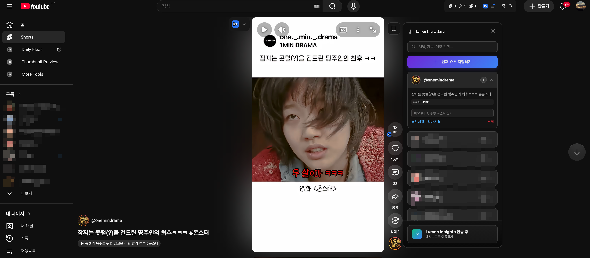
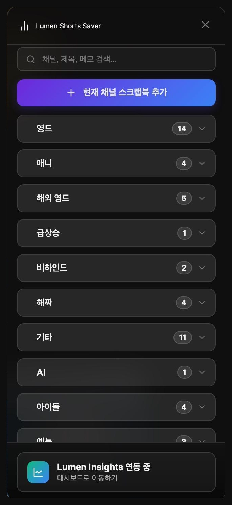
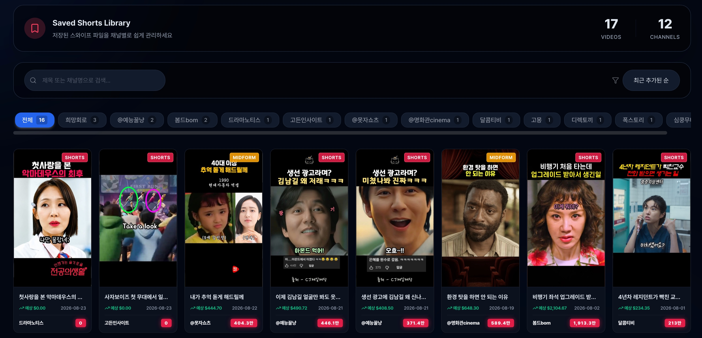
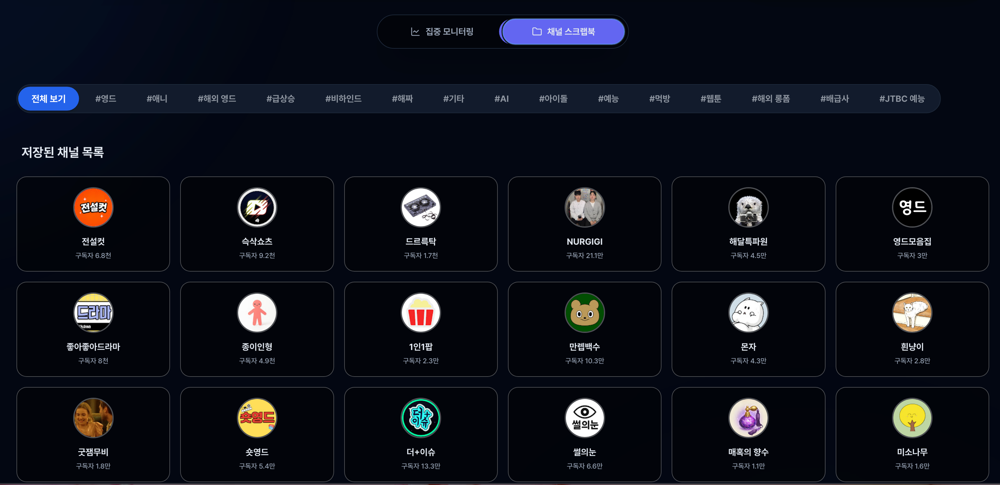
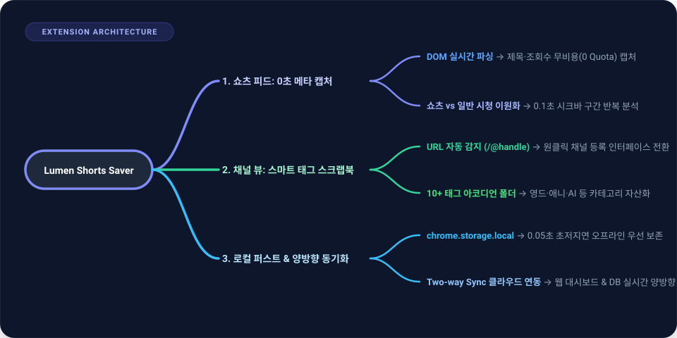

숏폼 콘텐츠를 기획하고 제작하는 크리에이터의 일과를 분석해보면, 전체 제작 시간의 40% 이상이 편집이나 촬영이 아닌 **레퍼런스 탐색 및 벤치마킹 수집**에 소모됩니다.

1MIN DRAMA(@onemindrama) 채널을 운영하면서 매일 맞닥뜨렸던 가장 큰 병목 역시 수집 과정의 비효율이었습니다. 유튜브 피드를 탐색하다가 탁월한 오프닝 훅이나 편집 기법이 적용된 쇼츠를 발견하면, URL을 복사하여 메신저 나에게 보내기에 붙여넣고, 노션이나 스프레드시트를 열어 영상 제목, 채널명, 당시 조회수를 일일이 옮겨 적는 수동 작업을 반복했습니다.

영상 하나를 정리하는 데 1~2분이 걸렸고, 하루에 30개의 레퍼런스를 수집하면 1시간 이상의 작업 시간이 단순 복사-붙여넣기에 낭비되었습니다. 더욱 심각한 문제는 이렇게 수집된 링크들이 며칠만 지나도 '언제, 왜 저장했는지' 맥락을 잃어버린 채 디지털 쓰레기로 방치된다는 점이었습니다.

이러한 고질적인 문제를 해결하고 창작 파이프라인의 효율을 극대화하기 위해, 브라우저 내에서 0초 만에 쇼츠와 채널을 체계적으로 자산화하고 웹 대시보드와 실시간 연동하는 전용 크롬 확장 프로그램 **Lumen Shorts Saver**를 직접 설계하고 개발하게 되었습니다.

## 기존 수동 수집 방식의 3대 구조적 한계

기존의 상용 북마크 툴이나 메모 앱을 활용한 레퍼런스 수집은 숏폼 크리에이터의 실무 환경에서 다음과 같은 3가지 치명적인 한계를 드러냈습니다.

### 1. 찰나의 메타데이터 유실과 시점 맥락의 부재
단순히 영상 URL만 저장하는 방식은 해당 영상이 '어떤 상태'였는지를 보존하지 못합니다. 30만 뷰 시점에 후킹 구조가 뛰어나서 저장해 둔 영상이 2주 뒤 다시 열어보았을 때는 이미 300만 뷰를 넘어서 있거나, 원작자의 비공개 전환으로 삭제되어 있는 경우가 빈번했습니다. 영상이 급상승을 시작하던 바로 그 순간의 실시간 조회수, 구독자 수, 게시 시점 등의 메타데이터가 보존되지 않으면 사후 분석의 가치가 크게 훼손됩니다.

### 2. 쇼츠 플레이어의 시크바(Seekbar) 부재와 구간 분석 불가
유튜브 쇼츠 기본 플레이어는 사용자의 연속 시청을 유도하기 위해 타임라인 탐색 바(시크바)를 제공하지 않습니다. 그러나 크리에이터에게 레퍼런스 분석의 핵심은 **도입부 0~3초의 화면 전환 속도, 컷 편집 타이밍, 자막 강조 효과를 0.1초 단위로 뜯어보는 것**입니다. 쇼츠 플레이어에서는 특정 구간을 되돌려보지 못해 1분짜리 영상을 매번 처음부터 다시 보아야 하는 극심한 시간 낭비가 발생했습니다.

### 3. 브라우저와 외부 앱 간의 끊임없는 컨텍스트 스위칭
영상을 탐색하는 몰입 상태에서 레퍼런스를 기록하기 위해 노션, 카카오톡, 에버노트 등의 외부 창을 띄우는 순간 집중의 흐름이 완전히 끊어집니다. 창을 전환하고 태그를 적고 다시 유튜브로 돌아오면, 직전에 어떤 알고리즘 흐름을 타고 피드를 탐색하고 있었는지 시청 컨텍스트를 잃어버리게 됩니다.

[Chrome for Developers 공식 문서](https://developer.chrome.com/docs/extensions/)에서 강조하듯, 확장 프로그램의 가장 강력한 가치는 '사용자가 머무는 웹 페이지 위에 완벽히 통합된 경험(In-context Experience)을 제공하는 것'입니다. 브라우저 우측 사이드 패널으로 탐색 흐름을 단 1초도 방해하지 않는 아키텍처가 필수적이었습니다.

## 실측 사례 1: 쇼츠 피드 뷰와 0초 메타데이터 원클릭 캡처

실제 제작하여 배포한 Lumen Shorts Saver 확장 프로그램으로 쇼츠 피드에서 레퍼런스를 수집하는 실제 화면 스크린샷입니다.

1MIN DRAMA 채널의 실제 영상(`잠자는 콧털(?)을 건드린 땅주인의 최후ㅋㅋㅋ #몬스터`, 실시간 조회수 351,181회)을 시청하는 상태에서 확장 프로그램을 실행한 모습입니다.

### 1. YouTube Data API 쿼터 0원의 DOM 실시간 파싱
일반적인 웹 서비스는 영상 정보를 가져오기 위해 YouTube Data API를 호출하며 쿼터 비용을 소모합니다. 하지만 Lumen Shorts Saver는 Manifest V3 기반의 Content Script를 활용하여, 현재 화면에 렌더링된 YouTube 내부 DOM 엘리먼트에서 영상 고유 ID, 제목, 실시간 조회수 문자열(`351,181`), 채널 핸들(`@onemindrama`)을 직접 파싱합니다. API 통신 비용을 전혀 발생시키지 않으면서도 0.01초 만에 최신 메타데이터를 정밀하게 추출합니다.

### 2. 쇼츠 시청 vs 일반 시청 이원화 인터페이스
위 캡처 화면 하단에 위치한 `쇼츠 시청`과 `일반 시청` 버튼은 크리에이터의 분석 편의성을 위해 고안된 핵심 기능입니다.
- **쇼츠 시청**: 기본 9:16 비율의 쇼츠 플레이어로 이동하여 모바일 사용자 관점의 전체적인 호흡을 확인합니다.
- **일반 시청**: 해당 쇼츠를 일반 롱폼 비디오 플레이어 URL(`/watch?v=...`)로 강제 전환하여 렌더링합니다. 이로 **정밀한 시크바(타임라인 탐색기)와 단축키(J, K, L 및 프레임 단위 이동 `,`, `.`)**를 즉시 활성화하여, 0.1초 단위의 컷 편집과 오프닝 훅을 손쉽게 프레임 단위로 분석할 수 있습니다.

### 3. 채널별 자동 그룹화 및 인라인 메모
저장된 영상들은 채널별로 자동 그룹화되어 아코디언 형태로 관리되며, 각 영상 카드 하단에 인라인 메모 입력창을 제공하여 해당 영상의 핵심 후킹 포인트나 카피라이팅 아이디어를 즉시 텍스트로 기록할 수 있습니다.

## 실측 사례 2: 채널 페이지 감지와 10개 태그 아코디언 스크랩북

레퍼런스 수집은 단일 영상에만 머무르지 않습니다. 뛰어난 성과를 내는 벤치마킹 타깃 채널 전체를 추적하고 카테고리별로 자산화하는 작업이 필수적입니다.

사용자가 유튜브 채널 홈(`/@onemindrama` 또는 `/channel/UC...`)에 진입하면, 확장 프로그램 백그라운드 워커가 URL 변화를 실시간으로 감지하여 상단 버튼을 `+ 현재 채널 스크랩북 추가` 모드로 스마트 전환합니다.

### 1. 10개 이상의 다차원 태그 아코디언 시스템
위 스크린샷에서 확인할 수 있듯, 1MIN DRAMA 채널을 운영하며 실제 벤치마킹 중인 수십 개의 채널들이 카테고리별 태그로 정밀하게 분류되어 있습니다.
- `영드 (14)`: 한국 영화 및 드라마 요약 채널군
- `애니 (4)`: 애니메이션 및 서브컬처 리뷰 채널군
- `해외 영드 (5)`: 해외 블록버스터 및 미드 전문 채널군
- `급상승 (1)`: 최근 7일간 비정상적인 성장 곡선을 보이는 급상승 채널군
- `비하인드 (2)`: 영화 제작 비화 및 배우 인터뷰 채널군
- `AI (1)`: AI 생성형 영상 및 자동화 채널군
- `아이돌 (4)`, `예능 (3)`, `기타 (11)` 등 다채로운 세부 장르

### 2. 인라인 태그 자동완성 및 스마트 전환
채널 스크랩 시 기존에 등록했던 태그 목록을 기반으로 자동완성(Auto-complete) 드롭다운이 제공되어, 별도의 오타 없이 기존 카테고리에 빠르게 편입시킬 수 있습니다. 태그를 입력하지 않을 경우 자동으로 '미분류' 폴더에 안전하게 적재됩니다.

## 실측 사례 3: 통합 스크랩북 실시간 연동 — 쇼츠 라이브러리 (Saved Shorts Library)

확장 프로그램에서 원클릭으로 스크랩한 쇼츠들은 브라우저 로컬 스토리지에만 갇혀있지 않고, 백엔드 PostgreSQL DB 및 루멘 인사이트의 통합 스크랩북(`/scrapbook`) 내 쇼츠 라이브러리로 실시간 양방향 동기화(Two-way Sync)됩니다.

위 스크린샷은 확장 프로그램으로 스크랩된 영상들이 루멘 인사이트 통합 스크랩북(`/scrapbook`)의 쇼츠 라이브러리에 집결된 모습입니다.

### 1. 채널별 필터링과 포트폴리오 관리
상단 KPI 영역에는 현재 수집된 총 영상 수(`17 VIDEOS`)와 고유 채널 수(`12 CHANNELS`)가 실시간으로 집계됩니다. 하단 탭 바에서는 `희망회로(3)`, `@예능꿀냥(2)`, `봄드bom(2)`, `드라마노티스(1)`, `고든인사이트(1)`, `@웃자쇼츠(1)`, `@명화관cinema(1)`, `고몽(1)`, `디렉토끼(1)`, `폭스토리(1)` 등 수집된 채널별로 즉각 필터링하여 특정 채널의 숏폼 전략만을 집중 분석할 수 있습니다.

### 2. SHORTS vs MIDFORM 포맷 자동 분류
단순한 쇼츠뿐만 아니라, 1분 이상 러닝타임을 가진 3분 미드폼 영상에 대해 상단에 `SHORTS`와 `MIDFORM` 뱃지를 자동으로 판별하여 부착합니다. 2026년 유튜브 알고리즘이 가중치를 높이고 있는 미드폼 포맷의 벤치마킹 데이터를 별도로 분리하여 분석할 수 있습니다.

### 3. 실시간 조회수 배지와 투명한 예상 수익 지표
각 영상 카드 하단에는 수집 당시의 실시간 조회수 배지(`1,913.3만`, `589.4만`, `446.1만`, `404.3만`, `371.4만`, `213만`)가 선명하게 표시됩니다. 

더불어 실측 조회수와 업계 평균 RPM을 역산하여 산출한 논리적 예상 수익 지표(`예상 $2,104.67`, `예상 $648.30`, `예상 $490.72` 등)를 함께 렌더링함으로써, 해당 레퍼런스의 상업적 잠재력과 트래픽 가치를 직관적으로 평가할 수 있도록 지원합니다.

## 실측 사례 4: 통합 스크랩북 실시간 연동 — 채널 스크랩북 (Saved Channels)

확장 프로그램에서 태그별로 스크랩한 채널들 역시 통합 스크랩북의 '채널 스크랩북(Saved Channels)' 보드로 완벽하게 실시간 동기화됩니다.

위 화면은 유튜브 채널 홈에서 확장 프로그램으로 등록했던 채널들이 루멘 인사이트 통합 스크랩북의 채널 스크랩북 보드에 태그별로 구조화되어 펼쳐진 모습입니다.

### 1. 16개 다차원 태그 필터 바
상단에 위치한 태그 네비게이션 바로 원하는 카테고리를 원클릭으로 조회할 수 있습니다:
- `#영드`, `#애니`, `#해외 영드`, `#급상승`, `#비하인드`, `#해짜`, `#기타`, `#AI`, `#아이돌`, `#예능`, `#먹방`, `#웹툰`, `#해외 롱폼`, `#배급사`, `#JTBC 예능`

### 2. 채널별 실시간 프로필 및 구독자 지표 카드
하단 그리드 영역에는 `전설컷(6.8천)`, `슥삭쇼츠(9.2천)`, `드르륵탁(1.7천)`, `NURGIGI(21.1만)`, `해달특파원(4.5만)`, `영드모음집(3만)`, `좋아좋아드라마(8천)`, `종이인형(4.9천)`, `1인1팝(2.3만)`, `만렙백수(10.3만)`, `몬자(4.3만)`, `흰냥이(2.8만)`, `굿잼무비(1.8만)`, `숏영드(5.4만)`, `더+이슈(13.3만)`, `썰의눈(6.6만)`, `매혹의 향수(1.1만)`, `미소나무(1.6만)` 등 실제 벤치마킹 중인 다양한 규모의 채널들이 다크 글래스모피즘 카드로 정렬되어 있습니다.

각 카드를 클릭하면 루멘 인사이트의 심층 채널 분석 모달로 즉시 연결되어, 해당 채널의 주간 조회수 성장률, 주력 키워드, 업로드 패턴 히트맵을 다각도로 교차 검증할 수 있습니다.

## 수동 작업 vs 일반 북마크 vs Lumen Shorts Saver &amp; 통합 스크랩북 실측 비교

1MIN DRAMA 채널에서 100개의 레퍼런스를 수집 및 분석하며 측정한 실측 생산성 지표는 다음과 같습니다.

| 분석 항목 | 수동 수집 (카카오톡/노션) | 브라우저 기본 북마크 | Lumen Shorts Saver &amp; 통합 스크랩북 |
|---|---|---|---|
| **영상 1건당 수집 소요시간** | 약 90초 ~ 120초 | 약 15초 | **0.5초 (원클릭)** |
| **수집 당시 실시간 조회수 보존** | 수동 기입 필요 (누락 빈번) | 불가능 (URL만 저장) | **DOM 자동 파싱 영구 보존** |
| **0.1초 구간 분석 (시크바)** | 별도 변환 툴 필요 | 미지원 | **일반 시청 모드 원클릭 지원** |
| **채널 분류 및 태그 관리** | 노션 DB 속성 수동 설정 | 단순 폴더 구조 | **16+ 태그 아코디언 &amp; 웹 그리드 자동화** |
| **작업 흐름 (컨텍스트 유지)** | 잦은 창 전환으로 흐름 단절 | 사이드바 제한적 지원 | **피드 위 인-컨텍스트 오버레이** |
| **오프라인 우선 속도 (Latency)** | 2.5초 (네트워크 대기) | 0.1초 | **0.05초 (Local-First 캐시)** |
| **멀티 디바이스 중앙 집중 분석** | 수동 동기화 필요 | 기기별 북마크 파편화 | **PostgreSQL 클라우드 실시간 Two-way Sync** |

위 비교표에서 보듯, 영상 1건당 수집 소요 시간이 120초에서 0.5초로 99.5% 단축되었으며, 일일 30건 기준 매일 55분의 순수 기획 및 편집 시간을 확보할 수 있었습니다.

## 확장 프로그램 및 스크랩북 연동 아키텍처

Lumen Shorts Saver는 브라우저 내부의 초저지연 경험과 클라우드 통합 스크랩북의 데이터 확장성을 유기적으로 결합한 하이브리드 아키텍처로 설계되었습니다.

### 1단계: 쇼츠 피드 뷰 (0초 메타데이터 캡처)
- **DOM 실시간 파싱**: `content.js`가 유튜브 피드의 렌더링 트리를 관찰(`MutationObserver`)하여 영상 제목, 실시간 뷰 카운트, 채널 고유 식별자를 추출합니다. API Quota 소모를 원천 차단하여 무제한 수집을 보장합니다.
- **시청 모드 이원화**: 9:16 세로형 쇼츠 뷰와 16:9 타임라인 제어 뷰를 링크 레벨에서 분기하여, 0.1초 단위의 오프닝 훅 및 편집 템포 분석 환경을 제공합니다.

### 2단계: 채널 뷰 (스마트 태그 스크랩북)
- **URL 라우팅 실시간 감지**: `chrome.tabs.onUpdated` 및 History API 이벤트를 추적하여, 사용자가 채널 홈(`/@handle`)에 진입하는 즉시 채널 스크랩북 등록 인터페이스를 동적으로 렌더링합니다.
- **다중 태그 아코디언**: 관심 채널들을 10개 이상의 커스텀 태그(영드, 애니, 해외 영드, AI 등)로 구조화하여 브라우저 내에서 즉각적으로 꺼내볼 수 있는 계층형 폴더 트리를 형성합니다.

### 3단계: 로컬 퍼스트 & 클라우드 양방향 동기화
- **chrome.storage.local 기반 로컬 퍼스트**: 모든 저장과 태그 변경은 먼저 브라우저 로컬 스토리지에 0.05초 만에 기록되어 오프라인 환경이나 불안정한 네트워크에서도 즉각적인 반응 속도를 보장합니다.
- **Two-way Sync 클라우드 연동**: 백그라운드 서비스 워커로 중앙 PostgreSQL DB 및 웹 대시보드와 양방향 동기화됩니다. 브라우저에서 스크랩한 채널과 영상은 PC, 태블릿의 통합 스크랩북(`/scrapbook`)에서도 동일하게 열람하고 심층 분석할 수 있습니다.

## 로컬 퍼스트 설계와 1인 개발자의 엔지니어링 철학

Lumen Shorts Saver를 개발하며 가장 우선시한 원칙은 **'크리에이터의 도구는 생각의 속도보다 빨라야 한다'**는 점이었습니다.

[YouTube 공식 크리에이터 가이드](https://support.google.com/youtube/answer/10059070)에 따르면, 숏폼 트렌드는 일주일 단위로 급격하게 변화하며 빠른 벤치마킹과 소재 선점이 채널 성장의 성패를 가릅니다. 

서버 통신을 기다리느라 1~2초씩 로딩 스피너가 도는 툴은 피드를 빠르게 넘기며 아이디어를 포착하는 크리에이터의 직관을 가로막습니다. 이를 방어하기 위해 모든 UI 인터랙션은 `chrome.storage.local`을 1차 진실의 원천(Single Source of Truth)으로 삼아 즉시 반영하고, 서버 동기화는 백그라운드 큐로 비동기로 처리하는 로컬 퍼스트 방식을 철저히 고수했습니다.
사이드 패널이 유튜브 기본 UI와 겹치는 레이아웃 간섭을 방지하기 위해 `requestAnimationFrame` 기반의 정밀 위치 보정과 모달 오버레이 격리(`z-index: 2147483647`)를 적용하여 60fps의 부드러운 렌더링 사용성을 확보했습니다.

[Think with Google 트렌드 분석 리포트](https://www.thinkwithgoogle.com/)에서도 강조하듯, 데이터 중심의 크리에이터 생태계에서는 '얼마나 체계적으로 시장의 반응을 기록하고 자신의 콘텐츠에 이식하는가'가 지속 가능한 차별점을 만듭니다. 수동 반복 노동을 자동화하고 창작의 본질에 집중할 수 있는 엔지니어링 파이프라인을 구축하는 것, 그것이 1인 크리에이터이자 엔지니어로서 추구하는 궁극적인 지향점입니다.
