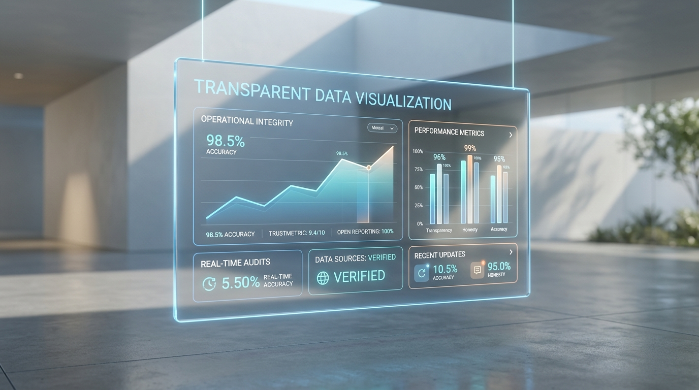

유튜브 API의 폐쇄성은 상상을 초월한다. 대시보드를 처음 띄웠을 때 화면 절반이 텅 비어 있었다. 그 자리에 아무 숫자나 집어넣고 싶은 유혹은 꽤 강렬했다. Math.random()을 굴려서라도 그럴싸한 지표를 보여주고 싶었다.

하지만 데이터는 SaaS의 목줄이다. 크리에이터 생계가 달린 지표에 눈속임을 섞는 건 그냥 자살행위다. 한 번 잘못된 데이터를 믿고 영상을 말아먹은 유저는 두 번 다시 돌아오지 않는다. 
우리는 데이터를 두 갈래로 찢었다. 구글 서버에서 직수입한 무결점 데이터, 그리고 수익처럼 절대 내어주지 않는 정보를 기반으로 한 추정 데이터. 업계 평균 CPM이나 국가별 시청 비율을 끼워 맞춰 산출하는 찌꺼기 값이다.

UI에는 이 구분을 날것으로 박아버렸다. 실측은 뚜렷하게, 추정은 반투명하게 처리하고 `[추정]`이라는 배지를 꼬리표처럼 달았다. 마우스를 올리면 어떤 억지 논리로 이 숫자를 뽑아냈는지 변명하는 툴팁이 뜬다. 데이터가 모자라면 수집 중이라는 상태를 그냥 노출시켰다.

UX가 난잡해진다는 내부 반발도 있었지만, 결과적으로 시장은 이런 강박적인 투명성에 반응했다. 경쟁사 대시보드를 보면 엉터리 추정값을 실제 수익인 양 포장해서 유저의 허영심을 부추긴다. 애드센스 실제 수익과 비교해보고 배신감을 느끼는 패턴의 반복. 우리는 아예 그 진흙탕에서 발을 뺐다. 수익 산정은 극한으로 보수적으로 잡고 그 빈약한 근거를 모조리 까발린다.

보여주는 데이터 중 단 하나라도 날조된 것이 있다면 서비스의 존재 이유가 무너진다. [Lumen Insights](https://app.lumeninsights.kr/?utm_source=lumen_blog&utm_medium=blog_post&utm_campaign=auto_generated_post)는 완벽해 보이려는 스타트업들의 흔한 발버둥 대신 그냥 결핍을 전시하는 쪽을 택했다. 데이터 없음을 보여주는 것도 어쨌든 정보니까.