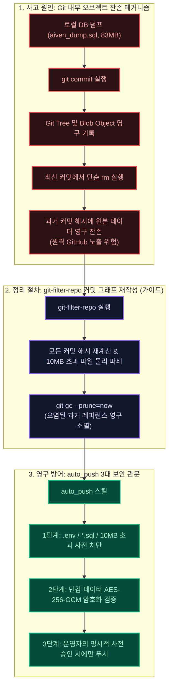

모든 것이 완벽하다고 생각했습니다.  
Next.js 미들웨어로 인증 가드를 세웠고, API 엔드포인트마다 권한 검사를 달았으며, 글로벌 에러 핸들러는 프로덕션 환경에서 스택 트레이스를 노출하지 않도록 마스킹 처리했습니다.  
코드베이스가 충분히 안전하다고 확신하며 서비스 배포를 준비하고 있었습니다.  

그 확신이 무너진 것은 외부 보안 감사(Red Teaming)를 진행한 지 불과 30분 만이었습니다.  
원격 깃허브(GitHub) 저장소의 커밋 이력 깊은 곳에 83MB 분량의 데이터베이스 백업 덤프 파일(`aiven_dump.sql`)과 101MB 크기의 전체 소스코드 압축본(`yt-shorts-mvp-source.zip`)이 고스란히 남아있었던 것입니다.  

## 커밋 이력 속에 잠들어 있던 100MB의 시한폭탄

사고의 원인은 단순하지만 치명적이었습니다.  
과거 로컬 백업을 위해 생성했던 대용량 덤프 파일이 `.gitignore`에 등록되기 전에 `git add .` 명령어로 스테이징되었고, 이후 파일 자체는 삭제했지만 Git의 커밋 오브젝트 트리 내부에는 영구 보존되어 원격 저장소로 밀려 올라갔던 것입니다.  

GitHub는 커밋 이력을 영구 보관하므로, 최신 커밋에서 파일을 지우더라도 과거 커밋 해시를 알면 누구나 다운로드할 수 있는 상태였습니다.  
이 덤프 파일 안에는 개발용 세션 토큰과 암호화되지 않은 환경변수들이 포함되어 있었습니다.  

| 보안 취약 지점 | 사고 당시 상태 | 긴급 조치 및 영구 규약 |
|---|---|---|
| Git 커밋 히스토리 | 83MB SQL 덤프 및 101MB 압축본 잔존 | 저장소 비공개 유지 + `git-filter-repo` 이력 정리(별도 일정으로 진행 예정) |
| 환경변수 및 API 키 | `.env` 파일 일부가 테스트 커밋에 포함 | 전 키 풀 무효화 후 재발급 및 AES-256-GCM 암호화 |
| 푸시 자동화 워크플로우 | 무검증 수동 `git push` 실행 | `auto_push` 스킬 도입 (비밀정보 100% 사전 스캔) |



## `git-filter-repo`를 통한 저장소 전역 이력 세척

단순히 커밋을 되돌리는(Revert) 것으로는 문제가 해결되지 않습니다.  
이력에서 파일을 완전히 제거하려면 저장소의 전체 커밋 그래프를 재작성해야 합니다. 권장 절차는 다음과 같습니다. (우리 저장소는 모든 키의 교체와 비공개 유지로 위험을 먼저 차단했고, 이력 재작성은 협업자 재클론과 강제 푸시가 필요해 별도 일정으로 진행할 계획입니다.)  

1. 원격 저장소 일시 격리: 추가적인 풀/푸시를 차단하여 커밋 그래프 오염을 방지합니다.  
2. `git-filter-repo` 실행: 10MB 이상의 대용량 파일 및 민감 확장자(`*.sql`, `*.dump`, `*.zip`)를 Git 오브젝트 데이터베이스에서 물리적으로 영구 삭제합니다.  
3. 가비지 컬렉션 및 강제 푸시: `git reflog expire` 및 `git gc --prune=now`를 수행하여 로컬 레퍼런스를 정리하고 원격 저장소와 동기화합니다. 이후 모든 협업자는 저장소를 새로 클론해야 합니다.  

```bash
# Git 이력에서 특정 대용량 덤프 파일을 영구 파쇄하는 명령
git-filter-repo --path aiven_dump.sql --invert-paths
git-filter-repo --path yt-shorts-mvp-source.zip --invert-paths
git-filter-repo --strip-blobs-bigger-than 10M
```

## 시스템 무결성을 지키는 3대 영구 보안 규약

이 뼈아픈 포스트모텀을 거치며, 우리는 `AGENTS.md`에 다음의 절대 규칙을 제정했습니다.  

1. 저장소 업로드 절대 금지 목록 확립: `.env` 및 모든 환경변수 파일, `*.sql`, `*.dump`, `*.zip`, `*.pem`, 그리고 10MB를 넘는 모든 파일은 어떤 이유로도 커밋할 수 없습니다.  
2. 양방향 대칭키 암호화(Crypto Helper): 데이터베이스에 저장되는 민감 필드(`youtube_access_token`, `phone` 등)는 반드시 AES-256-GCM 알고리즘으로 암호화하여 저장하고, 메모리 로드 시에만 복호화합니다.  
3. 자동 푸시 스킬 파이프라인: 모든 Git 작업은 사전 비밀정보 검사를 통과한 뒤에만 수행되는 자동화 스킬(`auto_push`)로서만 처리하도록 통제했습니다.  

루멘 인사이트 아키텍처는 이 사고를 계기로 인프라 보안을 기능 개발보다 우선순위에 두게 되었습니다.  
개발자의 안일함은 언제든 보안 사고로 이어질 수 있으며 엄격한 자동화 규율만이 시스템의 영구적인 안전을 보장합니다.  

---

참고 자료:
- [GitHub Docs — Removing sensitive data from a repository](https://docs.github.com/en/authentication/keeping-your-account-and-data-secure/removing-sensitive-data-from-a-repository)
- [OWASP Top 10:2021 — A07 Identification and Authentication Failures](https://owasp.org/Top10/A07_2021-Identification_and_Authentication_Failures/)
- [NIST SP 800-53 Rev. 5 — Security and Privacy Controls for Information Systems and Organizations](https://csrc.nist.gov/publications/detail/sp/800-53/rev-5/final)
