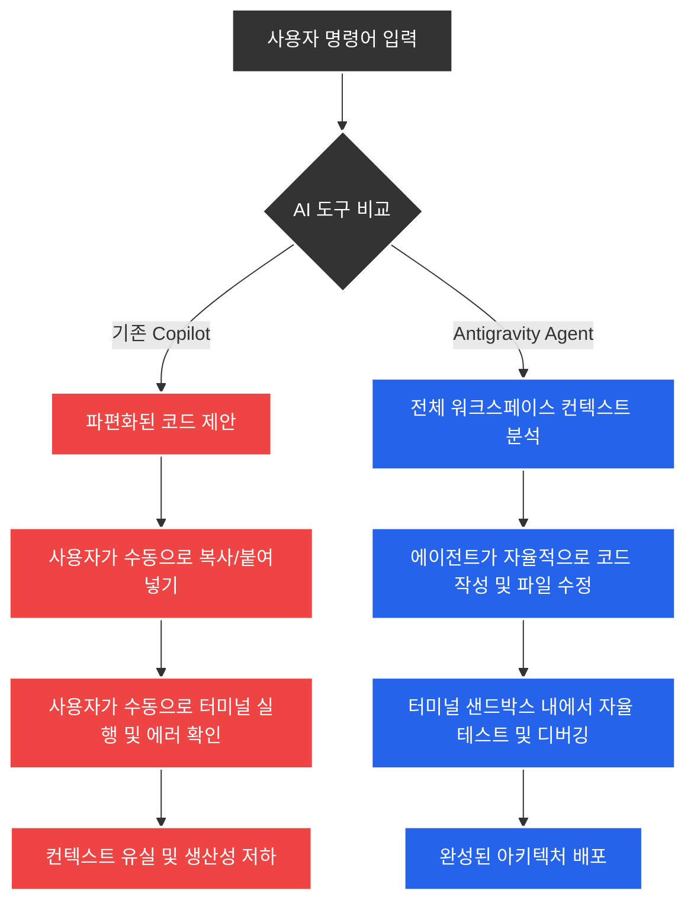

## 번아웃의 늪: 1인 개발자의 한계  

1인 창업가(Solo Founder)로서 웹서비스를 바닥부터 설계하고 배포하는 과정은 상상을 초월하는 고통을 수반합니다.  
기획부터 디자인, 프론트엔드(Next.js) 렌더링 최적화, 그리고 백엔드(Supabase) 데이터베이스 설계까지 모든 짐을 홀로 짊어져야 하기 때문입니다.  
과거 루멘 인사이트(Lumen Insights) V1 MVP 모델을 개발할 당시, 저는 매일 쏟아지는 버그 리포트와 500 에러 메시지 속에서 극심한 번아웃을 겪었습니다.  
인기 있는 AI 챗봇(ChatGPT, Claude)이나 코드 자동완성 에디터(Cursor)를 적극 활용했지만, 근본적인 갈증은 해소되지 않았습니다.  
이러한 도구들은 제가 코드를 복사해서 붙여넣고 터미널에서 실행 결과를 다시 입력해 주는 '수동적인 보조 작업자(Copilot)'에 불과했기 때문입니다.  
프로젝트의 규모가 커지고 파일이 수백 개로 늘어나자, 기존의 챗봇들은 전체 시스템의 문맥(Context)을 기억하지 못한 채 파편화된 코드 조각만을 뱉어내기 시작했습니다.  
제가 진정으로 필요로 했던 것은 코딩 스니펫을 짜주는 비서가 아니라, 제 로컬 환경을 직접 제어하며 능동적으로 사고하고 배포까지 책임지는 **완벽한 가상의 CTO**였습니다.  
이러한 치열한 고민 끝에, 저는 구글의 최신 에이전틱 플랫폼인 안티그라비티(Antigravity) 2.0과 제미나이(Gemini) 프로 모델을 전격 도입하기로 결단했습니다.  

## 왜 기존 모델들은 대규모 사이드 프로젝트에서 무너지는가?  

초기 스타트업이 개발 속도를 높이기 위해 흔히 범하는 실수는 AI 도구를 단순한 '코드 자판기'로 취급하는 것입니다.  
루멘 인사이트의 아키텍처를 V2로 마이그레이션하는 거대한 작업을 앞두고, 저는 기존 AI 개발 도구들의 치명적인 세 가지 한계점에 직면했습니다.  
첫째는 제한적인 컨텍스트 윈도우(Context Window)로 인해, 며칠에 걸친 긴 개발 세션에서 과거에 설정한 보안 규칙이나 DB 스키마를 AI가 까맣게 잊어버린다는 점이었습니다.  
둘째는 에디터나 웹 브라우저 창에 갇혀 있어, 깃허브(GitHub) 버전 관리나 npm 패키지 설치 같은 운영체제 레벨의 터미널(Terminal) 제어를 제가 직접 수행해야만 했습니다.  
셋째는 단일 스레드(Single Thread)의 한계로 인해, 프론트엔드 라우팅 버그를 잡는 동안 백엔드 크론잡(Cron Job) 스크립트 수정을 동시에 지시할 수 없었습니다.  
이러한 한계들은 개발 속도를 끌어올리기는커녕, AI의 실수를 제가 직접 수습해야 하는 '마이크로 매니지먼트의 지옥'으로 저를 몰아넣었습니다.  
개발자가 코딩에 집중하지 못하고 AI의 프롬프트를 다듬는 데 더 많은 시간을 쏟는다면, 그것은 도구로서의 가치를 상실한 것입니다.  

## 비개발자가 코더(Coder)의 툴 대신 구글 생태계를 택한 이유  

시중에는 이미 코딩에 특화된 훌륭한 AI 도구들이 많습니다.  
특히 클로드(Claude) 3.5나 커서(Cursor) 에디터는 현업 개발자들 사이에서 폭발적인 인기를 끌고 있습니다.  
하지만 전문 개발자가 아닌 제 입장에서, 이 도구들은 어딘가 모르게 '전문가들을 위한 복잡한 전문가용 장비'처럼 느껴졌습니다.  
제가 단축키나 터미널 명령어, 그리고 복잡한 프레임워크 구조를 꿰뚫고 있어야만 그들의 100% 성능을 이끌어낼 수 있을 것 같다는 심리적 장벽이 존재했습니다.  
반면 구글 안티그라비티는 AI를 깊이 이해하지 못하는 비개발자 입장에서도 접근 방식이 훨씬 직관적이고 쉬웠습니다.  
더불어 저는 이미 제미나이(Gemini) 프로(Pro) 요금제를 구독하며 구글 드라이브(Google Drive) 등 구글 생태계에 깊이 동화되어 있던 상태였습니다.  
익숙한 구글의 인터페이스 안에서 방대한 컨텍스트를 넘나들며 작업할 수 있다는 점은 저에게 완벽한 시너지를 제공했습니다.  
물론 저는 여전히 AI를 완벽하게 다루지 못하며 매일 새로운 에러와 싸우고 있습니다.  
하지만 코드를 던져주는 챗봇이 아니라, 제 컴퓨터 안에서 직접 폴더를 열고 서버를 띄워주는 에이전트와 대화하며 저 스스로가 눈부시게 성장하고 있음을 느낍니다.  

## CTO를 채용하다: 3단계 도입 프레임워크  

이러한 위기를 타개하기 위해 저는 **'AI 에이전트 채택의 3단계 의사결정 프레임워크'**를 수립하고, 이에 완벽하게 부합하는 안티그라비티(Antigravity)를 도입했습니다.  
1단계는 **'문맥 유지력(Context Retention)'**입니다. 안티그라비티는 데스크톱 일렉트론(Electron) 애플리케이션으로 동작하며, 200만 토큰에 달하는 제미나이(Gemini)의 거대한 컨텍스트 창을 활용해 수만 줄의 전체 코드베이스를 한 번에 파악합니다.  
2단계는 **'운영체제 장악력(OS Integration)'**입니다. 제가 승인만 내리면 에이전트가 터미널 샌드박스(Terminal Sandbox) 내부에서 스스로 npm install을 실행하고 서버를 재시작하며 로그를 분석합니다.  
3단계는 **'비용 효율성(Cost Efficiency)'**입니다. 막대한 토큰을 소모하는 에이전트 특성상 API 비용이 기하급수적으로 늘어날 수 있지만, 제미나이 기반의 생태계는 타사 모델 대비 압도적인 비용 효율을 자랑하여 자본이 부족한 1인 창업가에게 유일한 대안이 되었습니다.  
이 세 가지 프레임워크를 통과한 안티그라비티 2.0의 좌측 사이드바(Left-hand Sidebar) 설정 메뉴를 통해 저는 새로운 프로젝트 워크스페이스를 생성했습니다.  
그리고 챗 캔버스(Chat Canvas)에 단 한 줄의 프롬프트를 입력함으로써, 저만의 완벽한 가상 CTO를 무사히 온보딩시킬 수 있었습니다.  

## 코딩하는 손을 멈추고 지휘봉을 잡아라  

안티그라비티를 세팅하고 제미나이 엔진을 가동한 첫날, 저는 더 이상 직접 코드를 타이핑하지 않게 되었습니다.  
대신 프로젝트의 거대한 방향성을 고민하고, 서비스의 비즈니스 로직을 설계하는 데 모든 에너지를 쏟아부을 수 있게 되었습니다.  
단순한 챗봇을 버리고 자율형 에이전트를 시스템의 중심에 배치하는 것은, 평사원을 해고하고 유능한 임원급 엔지니어를 고용하는 것과 동일한 극적인 효과를 가져옵니다.  
이제 여러분도 키보드에서 손을 떼고 전체 비즈니스 오케스트라를 지휘하는 진정한 창업가(Founder)로 거듭나야 할 시점입니다.  
제가 이러한 에이전틱 AI의 힘을 빌려 실제 시장의 데이터를 가공하고 서비스화한 결과물이 궁금하시다면, 아래 링크를 통해 확인해 보시기 바랍니다.  
복잡한 유튜브 데이터와 급상승 트렌드를 누구나 쉽게 분석할 수 있도록, AI와 함께 밤을 새워가며 깎아낸 저의 첫 번째 SaaS 프로덕트입니다.  

Lumen Insights 솔루션 직접 경험해보기
