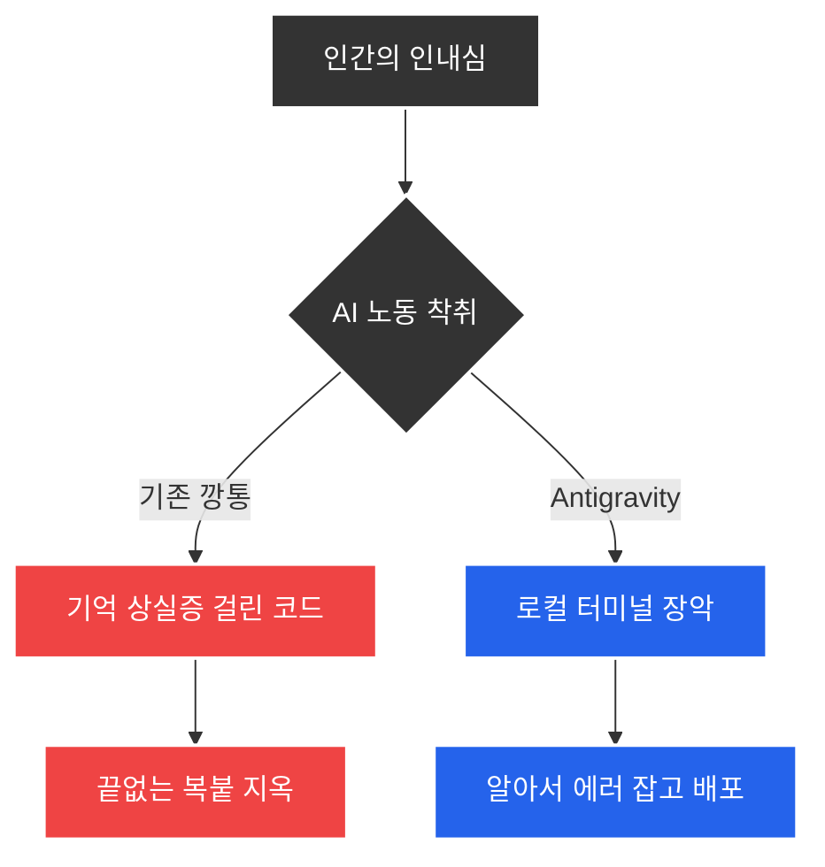

매일 밤 500 에러를 뒤집어쓰며 구역질이 났다. ChatGPT나 Cursor 같은 툴은 코드를 토해내는 자판기일 뿐이었다. 파일이 백 개를 넘어가자 이 깡통들은 내가 어제 말한 규칙조차 기억하지 못했다. 복사해서 붙여넣고, 에러 나면 다시 터미널 결과를 긁어서 프롬프트에 쑤셔 넣고. 나는 코더가 아니라 조잡한 AI의 뒤치다꺼리를 하는 청소부였다. 

더 이상은 못 해먹겠다 싶을 때 안티그라비티(Antigravity) 2.0과 제미나이 프로를 데스크탑에 깔았다. 내 컴퓨터의 터미널을 통째로 쥐어줬다. 에디터 창에 갇혀있는 멍청한 챗봇이 아니라 알아서 npm install을 치고 로그를 뒤지는 괴물이 필요했다. 200만 토큰의 컨텍스트 창이 로컬 폴더를 핥고 지나가며 수만 줄의 문맥을 집어삼켰다. 

비개발자인 내가 클로드나 커서의 단축키를 외우는 건 헛짓거리였다. 구글 생태계의 무식한 컨텍스트 파워가 훨씬 더 직관적이고 난폭했다. 에이전트가 내 터미널에서 스스로 폴더를 까집고 서버를 띄운다. 손가락을 멈추고 지시만 내리면 된다. 코딩 자판기를 버리고 내 로컬 환경을 통제하는 미친 독재자를 고용했다. 그 결과물이 [Lumen Insights](https://app.lumeninsights.kr/?utm_source=lumen_blog&utm_medium=blog_post&utm_campaign=auto_generated_post)의 데이터 가공 아키텍처다.
