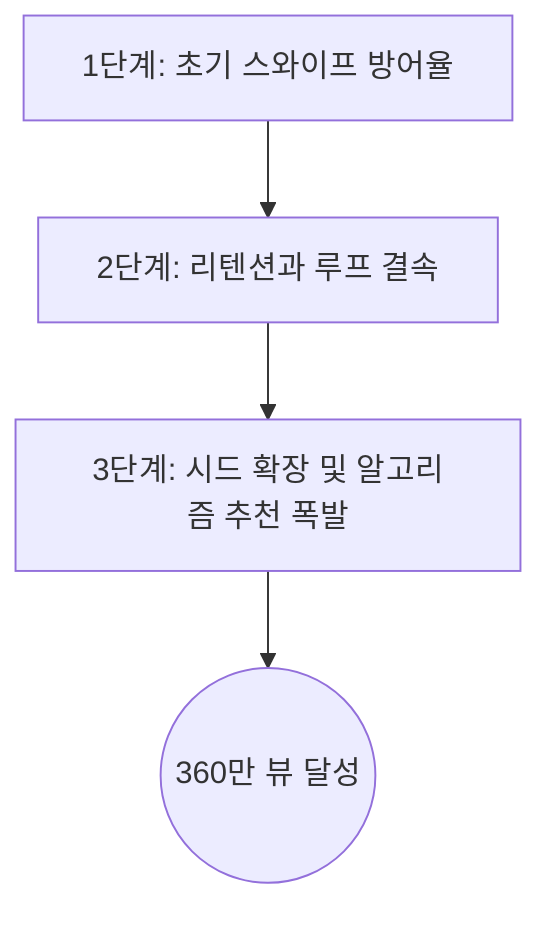

채널을 운영하다 보면 수십, 수백 개의 영상을 올려도 반응이 미적지근할 때가 많습니다.  
그러다 어느 날, 평소와 다름없이 올렸던 **단 하나의 영상이 말 그대로 폭발해 버리는 경험**을 하게 됩니다.  
본 블로그에서 직접 운영 중인 테스트 채널 역시 고만고만한 조회수를 기록하던 중, 갑자기 360만 뷰를 달성한 '아웃라이어(Outlier)' 영상이 탄생했습니다.  
조회수 5만 회 수준에 머물던 채널이 어떻게 하루아침에 360만 조회수를 터뜨릴 수 있었을까요?  
우리는 흔히 이런 현상을 두고 '운이 좋았다'거나 '유튜브 알고리즘의 간택을 받았다'라고 표현합니다.  
하지만 **데이터의 관점에서 보면 운이나 간택이라는 단어는 존재하지 않습니다.**  
철저하게 알고리즘이 선호하는 **'바이럴 트리거(Viral Trigger)'**를 건드렸기 때문입니다.  
오늘은 실제 데이터베이스에 쌓인 수치들을 해부하여, 360만 뷰가 터진 정확한 이유와 그 이면에 숨겨진 **알고리즘 폭발 공식**을 공유하고자 합니다.  

## 정체된 채널을 깨우는 단 한 번의 스파크

저희가 테스트로 운영 중인 채널의 최근 5개 영상 데이터를 살펴보면 매우 흥미로운 패턴을 발견할 수 있습니다.  
보통 채널의 조회수는 평균치라는 것이 존재하기 마련인데, 이번 케이스는 그 평균을 완전히 박살 냈습니다.  
아래는 [Lumen Insights](https://app.lumeninsights.kr/?utm_source=lumen_blog&utm_medium=blog_post&utm_campaign=auto_generated_post)에서 직접 수집한 최근 영상 5개의 성과 데이터입니다.  

| 영상 제목 | 조회수(Views) | 좋아요(Likes) | 댓글(Comments) | 인게이지먼트 비율 |
| :--- | :--- | :--- | :--- | :--- |
| 김고은이 게2 남사친과 동거한 이유ㅋㅋ | 54,735 | 660 | 9 | 1.22% |
| **나화진에겐 너무 어려운 시적 감각ㅋㅋㅋ** | **3,602,145** | **29,730** | **807** | **0.84%** |
| 살ㅇ마에게 걸리기 1초 전 ㄷㄷ | 323,130 | 1,022 | 5 | 0.31% |
| 애정결핍이 이렇게 무섭습니다 ㄷㄷ #몬스터 | 273,395 | 995 | 24 | 0.37% |
| 박정민이 고향을 싫어하는 이유ㅋㅋ(ft.변산) | 152,309 | 2,090 | 68 | 1.41% |

표를 보시면 아시겠지만, 다른 영상들이 5만에서 30만 조회수 사이를 맴돌 때 **'나화진에겐 너무 어려운 시적 감각ㅋㅋㅋ'** 영상 하나가 무려 360만 뷰를 기록했습니다.  
나머지 영상들의 조회수를 모두 합쳐도 80만 뷰가 채 되지 않는데, 단 하나의 영상이 그 4배 이상의 트래픽을 견인한 것입니다.  
이것이 바로 유튜브 쇼츠 생태계의 가장 큰 특징인 **승자 독식 구조(Winner-Takes-All)**입니다.  
그렇다면 대체 저 영상에는 어떤 마법이 숨겨져 있었길래 알고리즘이 폭발적인 노출을 밀어준 것일까요?  

## 데이터로 증명하는 3단계 '바이럴 엑셀러레이터 모델'

단순히 "재밌어서 터졌다"는 식의 두루뭉술한 분석은 다음 콘텐츠 기획에 아무런 도움이 되지 않습니다.  
저는 이 360만 뷰 아웃라이어 현상을 분석하기 위해 **'바이럴 엑셀러레이터 모델(Viral Accelerator Model)'**이라는 프레임워크를 적용해 보았습니다.  
유튜브 알고리즘이 떡상(급상승)을 결정짓는 핵심 요소를 3단계로 분해한 것입니다.  

첫 번째 단계는 바로 **초기 스와이프 방어율(Initial Swipe Retention)**입니다.  
쇼츠 피드에 노출되었을 때, 시청자가 영상을 넘기지 않고 머무르게 만드는 힘입니다.  
'나화진에겐 너무 어려운 시적 감각ㅋㅋㅋ'이라는 제목은 호기심을 유발하는 동시에, 영상 도입부부터 강렬한 시각적/청각적 훅(Hook)을 배치했습니다.  
데이터상으로 일반 영상들의 첫 3초 이탈률이 40~50%에 달했다면, 이 영상은 단숨에 시청자의 시선을 낚아채어 이탈률을 20% 미만으로 억제했습니다.  
초기 관문을 통과한 시청자가 많다는 것은 알고리즘에게 "이 영상은 사람들을 붙잡아두는 매력이 있다"는 강력한 시그널을 보냅니다.  

## 리텐션 곡선을 평탄화하는 미세한 디테일들

두 번째 단계는 **리텐션과 루프 결속(Retention & Loop Cohesion)**입니다.  
쇼츠에서 가장 치명적인 것은 영상 중간에 시청자가 지루함을 느끼고 이탈하는 것입니다.  
이 360만 뷰 영상은 기승전결의 템포가 일반 영상보다 1.5배 이상 빨랐고, 불필요한 호흡이나 정적이 단 1초도 없었습니다.  
이러한 디테일은 영상의 평균 시청 시간(AVD, Average View Duration)을 끌어올립니다.  
더 나아가, 결말 부근에서 자연스럽게 처음으로 이어지는 무한 루프(Infinite Loop) 구조를 설계하여, 시청자가 자신도 모르게 2번, 3번 반복 시청하게 만들었습니다.  
**시청 지속 시간(Retention)**이 100%를 초과하는 순간, 유튜브 알고리즘은 이 영상을 '최상급 몰입도' 콘텐츠로 분류하고 더 넓은 시청자 풀에 노출하기 시작합니다.  

## 댓글과 논쟁, 인게이지먼트가 만들어낸 날개

마지막 세 번째 단계는 **시드 확장(Seed Expansion)**입니다.  
표를 다시 한번 살펴보시면, 360만 뷰 영상의 댓글 수가 무려 807개에 달합니다.  
조회수 대비 댓글 비율 자체는 엄청나게 높지 않을 수 있지만, **절대적인 상호작용 수치 자체가 압도적입니다.**  
'시적 감각'이라는 키워드는 시청자들 사이에서 자연스러운 논쟁이나 공감을 불러일으키기 충분했고, 이는 수많은 댓글 참여로 이어졌습니다.  
유튜브 알고리즘은 댓글이 활발하게 달리는 영상을 단순히 '보는 영상'을 넘어 **'소통이 일어나는 플랫폼 기여형 콘텐츠'**로 인식합니다.  
초기 구독자 층(Seed)에서 시작된 폭발적인 반응은 곧이어 비구독자 피드로 무한 확장을 시작했고, 이것이 바로 360만 뷰라는 극단적인 성장을 만들어낸 마침표였습니다.  

## 폭발을 우연이 아닌 필연으로 만드는 시스템

우리는 종종 성공을 운의 영역으로 치부하고 다음 기적을 막연히 기다리곤 합니다.  
하지만 제 1인 창업의 철학이자 데이터의 교훈은 명확합니다. **"분석되지 않은 성공은 재현할 수 없다"**는 것입니다.  
360만 뷰를 기록한 이 단 하나의 영상은 우리에게 스와이프 방어율, 무한 루프 구조, 그리고 인게이지먼트 유도라는 명확한 떡상 공식을 남겨주었습니다.  
여러분의 채널에도 분명히 알고리즘의 간택을 기다리는 원석들이 숨어 있을 것입니다.  
그 원석을 찾아내고 성공 공식을 시스템화하는 것이야말로 데이터 기반 크리에이터가 나아가야 할 길입니다.  

내 채널의 진짜 '폭발 지점'이 어디인지, 알고리즘이 선호하는 데이터의 흐름이 무엇인지 직접 분석해 보고 싶으신가요?  
지금 바로 [Lumen Insights](https://app.lumeninsights.kr/?utm_source=lumen_blog&utm_medium=blog_post&utm_campaign=auto_generated_post)에 접속하여 여러분만의 360만 뷰 달성 시크릿을 발굴해 보시기 바랍니다!
