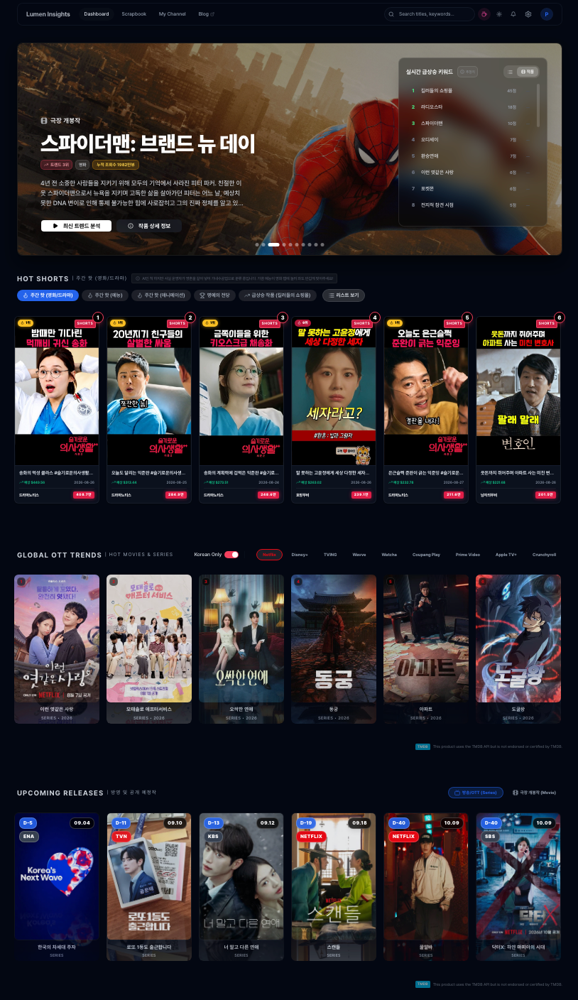

## 바이브 코딩 뒤에 찾아온 149개 색상의 파편화

초기 아이디어를 빠르게 검증하고 최소 기능 제품(MVP)을 신속하게 시장에 출시하는 데 있어 인공지능(AI)의 도움을 받아 코딩하는 '바이브 코딩(Vibe Coding)'은 비개발자 창업가에게 혁신적인 방법론을 제공합니다.  이 접근 방식은 저비용 고효율을 가능하게 하며, 1인 창업가로서 'Lumen Insights'의 초기 버전을 구축할 때 저 또한 이 방법론의 이점을 적극적으로 활용했습니다.  그러나 서비스의 규모가 확장되고 다양한 기능 페이지들이 빠르게 추가됨에 따라, 예상치 못한 심각한 문제에 직면하게 되었습니다.  바로 '디자인 파편화' 현상입니다.  이 현상은 단순히 미관상의 문제를 넘어, 사용자 경험(UX) 저하와 장기적인 유지보수 비용 증가는 물론, 브랜드 신뢰도에 치명적인 영향을 미칠 수 있음을 깨달았습니다.  끝없는 다크모드의 망령과 싸워 시스템의 일관성을 되찾기 위한 이 대규모 리팩토링은, 사용자에게 시각적인 신뢰를 제공하고 프로페셔널한 서비스로 거듭나기 위한 필수적인 과정이었습니다.

## CSS 코드 오디팅으로 발견한 다크모드 충돌

'Lumen Insights'의 성장이 가속화되던 어느 시점, 저는 프로젝트의 CSS 파일과 HTML 소스 코드를 면밀히 스캔하는 코드 오디팅을 단행했습니다.  그 결과는 실로 충격적이었습니다.  시스템 전체에 무려 **149개**에 달하는 서로 다른 16진수(Hex) 색상 코드가 아무런 통일성 없이 하드코딩되어 사용되고 있었던 것입니다.  이는 버튼, 텍스트, 아이콘, 차트 등 모든 UI 요소에 제각각의 색상값이 적용되어 있었음을 의미합니다.  가령, 삭제 버튼의 빨간색, 에러 메시지의 경고 빨간색, 주식 차트의 하락을 나타내는 빨간색이 미묘하게 다른 톤을 띠고 있어, 시각적인 일관성이 현저히 결여되어 있었습니다.  더욱이, 다크모드 기반의 사이트임에도 불구하고 `text-gray-800`과 같은 라이트 모드 전용 클래스가 곳곳에 잔존하여, 특정 환경에서 글씨가 배경에 묻혀 보이지 않거나 반대로 하얗게 뜨는 '눈뽕 현상'이 빈번하게 발생했습니다.  이러한 문제점들은 사용자에게 혼란을 야기하고 서비스의 완성도를 저해하는 심각한 요인으로 작용했습니다.  다음 표는 당시 'Lumen Insights' UI에서 발견된 주요 파편화 문제점을 요약한 것입니다.

| 문제 유형         | 세부 내용                                              | 발생 원인                      | 사용자 경험 영향             |
| :---------------- | :----------------------------------------------------- | :----------------------------- | :--------------------------- |
| **색상 파편화**   | 149개 이상의 고유 Hex 코드 사용                        | 무분별한 Hex 코드 하드코딩     | 시각적 불일치, 브랜드 혼란   |
| **다크모드 충돌** | 라이트 모드 전용 CSS 클래스 잔존 (`text-gray-800`)   | 테마 관리 부재                 | 텍스트 미표시, 눈부심 현상   |
| **아이콘 비일관성** | OS별 시스템 이모지 렌더링 차이                       | 시스템 기본 이모지 의존        | 시각적 불균형, 비전문적 인상 |
| **UI 정렬 오류**  | 아이콘-텍스트 베이스라인 어긋남, 패딩 붕괴             | 이모지 대체 과정의 예상치 못한 오류 | 메뉴 가독성 저하, 미완성감   |

## 시맨틱 토큰과 Lucide SVG로 전환하기 위한 설계

이러한 디자인 파편화 문제를 해결하기 위해 'Lumen Insights'는 두 가지 핵심 전략을 수립하고 실행에 옮겼습니다.

첫째, **시맨틱 토큰(Semantic Token) 개념의 전면 도입**입니다.  기존의 무분별한 Hex 코드 사용은 유지보수를 불가능하게 만들고 디자인 시스템의 확장을 저해하는 주범이었습니다.  이를 해결하기 위해, 코드 내에 `#EF4444`와 같은 직접적인 색상값을 절대 사용하지 못하도록 엄격한 규정을 마련했습니다.  대신, `background`, `foreground`, `destructive`, `muted`와 같이 의미 기반의 CSS 변수로 모든 색상값을 치환하는 작업을 진행했습니다.  이 전략의 핵심 가설은, 의미 기반 토큰을 통해 색상 팔레트의 일관성을 확보하고, 다크모드와 라이트모드 전환 시 각 토큰 값이 자동으로 치환되도록 `globals.css` 파일을 정밀하게 설계함으로써, 테마 관리의 효율성을 극대화할 수 있다는 것이었습니다.  이러한 접근 방식은 향후 새로운 테마 추가나 색상 변경 시에도 전체 시스템에 걸쳐 단일 지점에서 제어가 가능하게 하여 유지보수 비용을 획기적으로 절감할 것으로 기대했습니다.

둘째, **시스템 이모지에서 Lucide SVG 아이콘으로의 전환**입니다.  초창기 프로덕트에서는 빠른 구현과 직관성을 위해 탭이나 메뉴에 📌, 📊, ⚙️ 같은 시스템 기본 이모지들을 텍스트와 혼용하여 사용했습니다.  하지만 이 방식은 윈도우, 맥, 아이폰 등 운영체제에 따라 이모지의 렌더링 모양이 다르게 나타나 시각적인 통일성을 저해했습니다.  무엇보다 B2B SaaS 서비스로서의 진지하고 전문적인 인상보다는, 가벼운 토이 프로젝트 같은 느낌을 지울 수 없었습니다.  이에 대한 전략적 가설은, 모든 시스템 이모지를 `Lucide` 기반의 단색 SVG 아이콘으로 교체함으로써 운영체제에 독립적인 일관된 시각적 아이덴티티를 확립하고, 서비스의 전문성과 고급스러운 이미지를 강화할 수 있다는 것이었습니다.  이 과정에서 아이콘과 텍스트의 상하 베이스라인이 어긋나거나, 패딩(Padding)이 무너져 메뉴가 우측으로 쏠리는 등 예상치 못한 렌더링 꿀렁임 현상이 발생할 수 있음을 미리 예상하고, 이를 해결하기 위한 정밀한 CSS 튜닝 작업이 필요할 것이라는 가설을 세웠습니다.

## 픽셀 퍼펙트 정렬과 다크모드 안정화 결과

수립된 전략을 바탕으로 대규모 UI 리팩토링 작업을 실행했습니다.

위 화면은 시맨틱 토큰과 단색 SVG 아이콘 시스템을 정착시킨 후 실제 렌더링된 **Lumen Insights 웹 대시보드 스크린샷**입니다.
* **상단 히어로 & 실시간 랭킹**: 배경 투명도와 그라데이션이 어긋남 없이 블러 처리(Glassmorphism)되어 콘텐츠의 집중도를 극대화합니다.
* **Hot Shorts 카드 그리드**: 시스템 이모지 대신 일관된 뱃지와 시맨틱 컬러가 적용되어, 어떤 기기에서도 글자가 번지거나 깨지지 않고 안정적으로 렌더링됩니다.
* **Global OTT & Upcoming Releases 위젯**: D-Day 뱃지와 미디어 포스터가 완벽한 비율로 정렬되어 전문 B2B 분석 SaaS로서의 시각적 신뢰도를 제공합니다.

**시맨틱 토큰 도입의 성과:**
'무분별한 Hex 코드와의 전쟁'은 성공적으로 마무리되었습니다. 149개에 달했던 고유 Hex 코드는 `background`, `foreground`, `destructive`, `muted` 등 약 20여 개의 시맨틱 토큰으로 성공적으로 치환되었습니다. `globals.css`를 활용한 다크모드/라이트모드 자동 전환 시스템은 완벽하게 작동하여, 더 이상 배경이 하얗게 뜨거나 글씨가 보이지 않는 '눈뽕 현상'은 발생하지 않았습니다. 개발자들은 더 이상 색상값을 직접 고민할 필요 없이 의미론적인 토큰을 사용하게 되었고, 이는 새로운 UI 요소 개발 속도를 현저히 높였습니다. 이로 인해 디자인 일관성이 확립되었으며, 사용자들은 어떤 테마 환경에서도 불편함 없이 서비스를 이용할 수 있게 되었습니다.

**Lucide SVG 전환의 성과 및 예상치 못한 변수:**
시스템 이모지를 Lucide SVG 아이콘으로 교체하는 대공사 또한 성공적으로 완료되었습니다. 모든 아이콘은 운영체제에 관계없이 동일한 형태로 렌더링 되어 서비스의 시각적 통일성과 전문성을 크게 향상시켰습니다. 특히, 단색 SVG 아이콘은 미니멀하면서도 고급스러운 글래스모피즘(Glassmorphism) 디자인 룩을 완성하는 데 결정적인 기여를 했습니다.

그러나 이 과정에서 예상치 못했던 변수와 한계점도 분명히 존재했습니다. 아이콘과 텍스트를 나란히 배치했을 때 발생하는 렌더링 꿀렁임 현상은 예상보다 훨씬 집요하게 나타났습니다. 아이콘의 높이, 너비, 그리고 텍스트와의 상하 베이스라인 정렬 문제가 발생하여, 메뉴 항목들이 미묘하게 흔들리거나 정렬이 어긋나는 현상이 지속되었습니다. 이를 해결하기 위해 `display: inline-block`과 `vertical-align: -0.22em`과 같은 CSS 속성을 픽셀 단위로 정밀하게 튜닝하는 고된 수작업이 필요했습니다. 이는 초기 예측보다 훨씬 많은 시간과 노력을 요구했으며, 완벽한 '픽셀 퍼펙트(Pixel Perfect)'를 달성하기 위한 집요한 반복 작업의 연속이었습니다.

하지만 이러한 고난의 과정 끝에, 이모지처럼 자연스럽게 텍스트 라인에 안착하면서도 압도적으로 고급스러운 시각적 경험을 제공하는 UI를 완성할 수 있었습니다. 수익화가 되지 않으면 예쁜 쓰레기일 뿐이라는 뼈아픈 조언도 분명 존재하지만, 반대로 **디자인이 엉성하면 유저는 지갑을 열지 않습니다.** 시각적인 신뢰도(Trust)를 확보하기 위한 이 지독한 픽셀 퍼펙트 여정은 서비스의 브랜드 가치를 높이고, 궁극적으로는 사용자 전환율에 긍정적인 영향을 미칠 것이라는 확신을 주었습니다.

## 시각적 신뢰도가 1인 SaaS에 미치는 영향

UI 전면 리팩토링은 단순히 미관을 개선하는 작업을 넘어, 서비스의 확장성과 유지보수성, 그리고 가장 중요하게는 사용자 신뢰도를 확보하기 위한 전략적인 투자였습니다. 초기 '바이브 코딩'의 빠른 개발 속도는 스타트업에게 필수적이지만, 서비스가 성장함에 따라 발생하는 기술 부채, 특히 디자인 파편화 문제는 반드시 해결해야 할 과제임을 이번 경험을 통해 명확히 인식했습니다. 시맨틱 토큰 도입을 통한 색상 시스템 정립과 Lucide SVG 아이콘으로의 전환은 이러한 문제들을 근본적으로 해결하고, 서비스를 더욱 견고하고 전문적인 제품으로 발전시키는 기반을 마련했습니다.

이 과정에서 얻은 핵심 인사이트는 다음과 같습니다.
> 디자인은 단순한 미학적 요소가 아니라, 사용자와 서비스 간의 신뢰를 구축하는 핵심적인 요소이며, 이는 곧 비즈니스 성공과 직결됩니다. 기술적 완성도만큼이나 시각적 완성도에 대한 투자는 결코 낭비가 아님을 이번 UI 리팩토링 경험을 통해 증명했습니다. 효율적인 디자인 시스템의 구축은 단기적인 개발 비용을 넘어 장기적인 서비스의 지속 가능성과 브랜드 가치를 높이는 필수적인 과정입니다.

---

**참고 자료:**
- [Tailwind CSS Official — Designing with Semantic Tokens and Dark Mode](https://tailwindcss.com/docs/dark-mode)
- [Lucide Icons — Consistent & Clean Vector Icons for Modern Web](https://lucide.dev/)
- [Nielsen Norman Group — Visual Hierarchy and Trust in Software UX](https://www.nngroup.com/articles/visual-hierarchy-ux/)