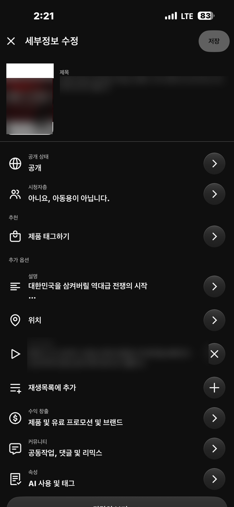
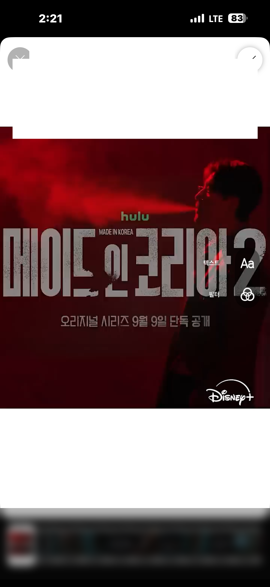
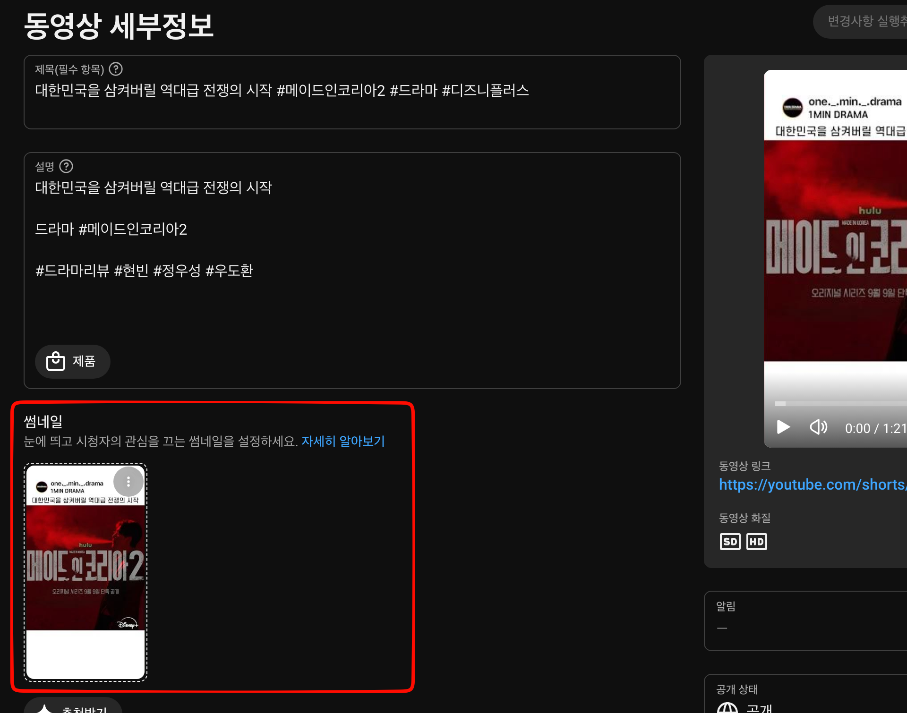

유튜브 쇼츠를 비롯한 숏폼 생태계가 고도화되면서, 단순히 알고리즘 피드의 자동 재생에만 의존하던 초기 성장 모델은 뚜렷한 한계에 부딪혔습니다.

숏폼 시청자들의 탐색 경로가 피드 스와이프를 넘어 **유튜브 검색 결과, 채널 홈의 쇼츠 탭 그리드, 관련 동영상 추천, 그리고 스마트 TV의 대화면 타일 뷰**로 다변화되었기 때문입니다. 이러한 탐색형 지면에서는 수많은 영상 카드 중 시청자의 시선을 단 0.1초 만에 사로잡는 '대표 프레임(썸네일)'의 시각적 후킹 능력이 전체 클릭률(CTR)과 초기 유입량을 결정짓는 핵심 변수로 작동합니다.

1MIN DRAMA(@onemindrama) 채널을 운영하며 매주 수십 편의 영화·드라마 리뷰 쇼츠를 발행하고 분석하는 과정에서, 동일한 영상이라도 어떤 프레임을 대표 썸네일로 지정하느냐에 따라 검색 및 채널 홈 유입 클릭률이 2.5배 이상 격차를 보이는 현상을 스튜디오 통계로 직접 확인했습니다.

본 글에서는 스마트폰 유튜브 모바일 앱과 최근 새롭게 기능이 보강된 PC 웹 유튜브 스튜디오(YouTube Studio) 환경에서의 쇼츠 썸네일 설정 워크플로우를 실제 캡처 데이터와 함께 비교 분석하고, 숏폼 크리에이터가 즉시 적용할 수 있는 3단계 썸네일 최적화 전략을 공유합니다.

## 숏폼 유입 경로의 다변화와 썸네일의 전략적 가치

초기 숏폼 시장에서는 "쇼츠는 피드에서 무작위로 스와이프되므로 썸네일이 필요 없다"는 인식이 지배적이었습니다. 하지만 유튜브 플랫폼의 인터페이스 개편과 사용자 시청 패턴의 변화는 썸네일의 가치를 완전히 바꾸어 놓았습니다.

### 1. 검색 및 채널 홈 그리드 노출 점유율 증가
유튜브 모바일 및 웹 검색창에 특정 키워드를 검색하면, 상단에 관련 쇼츠들이 3~4열의 세로 카드 그리드로 노출됩니다. 또한, 시청자가 특정 쇼츠를 보고 채널 홈에 방문했을 때 가장 먼저 마주하는 화면 역시 9:16 비율의 쇼츠 탭 타일 목록입니다. 이 지면에서 시청자는 제목을 읽기 전에 이미지를 먼저 스캔하므로, 텍스트 가독성과 인물의 극적인 표정이 살아있는 대표 프레임이 필수적입니다.

### 2. 거실 TV 대화면 및 데스크톱 환경의 타일 선택 구조
스마트 TV 유튜브 앱과 PC 웹 브라우저 환경에서는 쇼츠 역시 일반 롱폼 영상과 마찬가지로 정적 타일 형태로 화면에 배치됩니다. 리모컨이나 마우스 커서로 영상을 직접 클릭해야만 재생이 시작되므로, 클릭률(CTR)을 견인하는 썸네일의 완성도가 영상의 생명력을 좌우합니다.

[Google 검색 센터 동영상 권장사항 가이드](https://developers.google.com/search/docs/appearance/video)에 따르면, 검색 엔진과 추천 시스템은 명확한 시각적 초점과 고대비 텍스트가 포함된 비디오 썸네일에 더 높은 사용자 상호작용 점수를 부여합니다. 숏폼 역시 이러한 시각적 최적화의 필수 대상이 되었습니다.

## 사례 1: 모바일 유튜브 앱을 통한 0.1초 대표 프레임 추출 워크플로우

현재 유튜브 모바일 앱(iOS/Android)은 쇼츠 업로드 단계 및 세부정보 수정 화면에서 영상 내부의 모든 프레임을 탐색하여 가장 이상적인 순간을 대표 썸네일로 지정할 수 있는 정밀 슬라이더 기능을 제공합니다.

### 1. 세부정보 수정 화면의 좌측 상단 연필(수정) 인터페이스

스마트폰 유튜브 앱에서 쇼츠를 업로드하거나 기존 게시물의 세부정보를 수정할 때의 실제 화면입니다.

1MIN DRAMA 채널의 실제 쇼츠 영상(`대한민국을 삼켜버릴 역대급 전쟁의 시작 #메이드인코리아2 #드라마 #디즈니플러스`, 러닝타임 1분 21초) 세부정보 화면입니다.

좌측 상단의 영상 미리보기 좌측 상단에 위치한 **'연필(수정) 아이콘'**을 탭하면, 영상의 전체 타임라인 프레임을 0.1초 단위로 탐색할 수 있는 썸네일 프레임 셀렉터(Filmstrip Selector) 모드로 진입합니다.

### 2. 타임라인 필름스트립(Filmstrip) 기반 0.1초 대표 프레임 지정

연필 아이콘을 누르면 나타나는 프레임 지정 전용 편집 인터페이스입니다.

위 스크린샷에서 확인할 수 있듯, 하단 타임라인에는 영상의 시작부터 끝까지 수십 장의 연속 프레임이 필름스트립 형태로 배열됩니다.

크리에이터는 슬라이더를 좌우로 미세하게 드래그하여 다음과 같은 조건을 만족하는 킬러 프레임을 직접 선택할 수 있습니다:
- **상단 채널 프로필 및 헤드라인 카피**: 상단의 `1MIN DRAMA` 표식과 `대한민국을 삼켜버릴 역대급 전쟁의 시작` 후킹 문구가 가장 선명하게 결합된 프레임.
- **중앙 핵심 비주얼과 타이틀 로고**: 붉은색 조명 속 인물의 강렬한 시선과 `메이드 인 코리아 2` 타이틀 로고가 또렷하게 드러나는 지점.
- **안전지대(Safe Zone) 준수**: 하단 타임코드(`1:21`) 및 디즈니플러스 로고가 다른 UI와 겹치지 않는 균형 잡힌 구도.

프레임을 정밀하게 맞춘 후 우측 상단의 완료(체크) 버튼을 누르면, 해당 프레임이 쇼츠의 공식 대표 썸네일로 영구 고정됩니다.

## 사례 2: PC 웹 유튜브 스튜디오의 신규 썸네일 관리 인터페이스

과거에는 PC 웹 브라우저의 유튜브 스튜디오(YouTube Studio)에서 쇼츠 썸네일을 확인하거나 변경하는 것이 불가능하여, 알고리즘이 임의로 지정한 흐릿한 장면이 노출되는 문제가 있었습니다. 그러나 최근 스튜디오 업데이트로 PC 환경에서도 쇼츠의 대표 썸네일을 시각적으로 확인하고 관리할 수 있는 전용 인터페이스가 신설되었습니다.

위 화면은 PC 웹 브라우저에서 유튜브 스튜디오의 **동영상 세부정보(Video Details)** 페이지에 진입한 실제 화면입니다.

### 1. 동영상 세부정보 내 9:16 전용 썸네일 카드 렌더링
좌측 하단의 붉은색 박스 영역에 **'썸네일 (눈에 띄고 시청자의 관심을 끄는 썸네일을 설정하세요)'** 섹션이 활성화되어 있으며 모바일에서 지정했던 9:16 세로형 대표 프레임이 선명하게 표시됩니다.

### 2. 3점 메뉴를 통한 메타데이터 점검 및 교차 검증
썸네일 카드 우측 상단의 점 3개(옵션) 메뉴로 현재 적용된 프레임의 상태를 점검하고, 우측의 대화면 쇼츠 비디오 플레이어 프리뷰와 비교하며 데스크톱 및 TV 환경에서 시청자에게 어떻게 비칠지 시각적 균형을 사전에 검증할 수 있습니다.

[YouTube 공식 고객센터: 동영상 썸네일 가이드라인](https://support.google.com/youtube/answer/72431)에 따르면, 썸네일은 시청자에게 콘텐츠의 핵심 메시지를 전달하는 첫 번째 관문이며, 정확하고 일관성 있는 메타데이터와 결합될 때 최상의 유입 성과를 냅니다.

## 모바일 앱 vs PC 웹 유튜브 스튜디오 환경 비교

1MIN DRAMA 채널에서 50편 이상의 쇼츠를 게시하며 측정한 모바일 앱과 PC 유튜브 스튜디오 간의 썸네일 관리 환경 비교는 다음과 같습니다.

| 분석 항목 | 유튜브 모바일 앱 (iOS/Android) | PC 웹 유튜브 스튜디오 (Studio Web) |
|---|---|---|
| **0.1초 단위 프레임 선택** | **완벽 지원 (타임라인 필름스트립 슬라이더)** | 현재 조회 및 상태 확인 중심 (선택 기능 순차 롤아웃) |
| **외부 커스텀 이미지 업로드** | 미지원 (영상 내 프레임만 선택 가능) | 파트너 프로그램(YPP) 계정 대상 순차 적용 중 |
| **업로드 전/후 썸네일 수정** | **업로드 단계 및 게시 후 세부정보에서 언제든 수정 가능** | 세부정보 패널에서 실시간 동기화 확인 가능 |
| **제목 및 메타데이터 정렬성** | 모바일 키보드로 빠른 태그 입력 | **키보드 단축키, 설명란 템플릿, 연관 동영상 정밀 매핑** |
| **대화면(PC/TV) 뷰포트 프리뷰** | 스마트폰 단일 화면 비율만 확인 가능 | **9:16 모바일 뷰와 데스크톱 플레이어 동시 교차 검증** |
| **권장 작업 워크플로우** | **영상 업로드 시 0.1초 킬러 프레임 핀포인트 지정** | **PC에서 최종 메타데이터(제목, 태그, 관련 동영상) 완성** |

직접 운영해본 결과, 영상 업로드 시 모바일 앱에서 0.1초 단위 슬라이더로 가장 임팩트 있는 프레임을 1차 지정한 뒤, PC 스튜디오에서 제목, 설명란, 관련 동영상 링크를 최종 완성하는 **'모바일 프레임 추출 + PC 메타데이터 동기화' 하이브리드 워크플로우**가 가장 높은 작업 생산성과 노출 효율을 달성했습니다.

## 쇼츠 썸네일 & 대표 프레임 3단계 최적화 전략

1MIN DRAMA 채널을 운영하며 정립한 실전 쇼츠 썸네일 최적화 3단계 파이프라인은 다음과 같습니다.

### 1단계: 모바일 0.1초 킬러 프레임 추출 (Mobile Extraction)
- **필름스트립 슬라이더 탐색**: 영상 시작 0~3초 구간에 배치된 고화질 그래픽 또는 인물의 가장 극적인 표정 프레임을 0.1초 단위로 핀포인트 선택합니다.
- **9:16 안전지대(Safe Zone) 확보**: 유튜브 앱의 상단 채널 정보 오버레이와 하단 제목/사운드 영역에 가려지지 않도록, 핵심 텍스트와 오브젝트를 화면 중앙 60% 영역 안에 배치합니다.

### 2단계: PC 스튜디오 세부정보 교차 검증 (Studio Verification)
- **신규 썸네일 섹션 검증**: PC 웹 스튜디오의 '동영상 세부정보 > 썸네일' 카드에서 모바일에서 선택한 프레임이 깨짐 없이 렌더링되는지 확인합니다.
- **메타데이터 일치성(Relevance)**: 썸네일에 적힌 카피와 영상 제목, 해시태그(`#메이드인코리아2`, `#드라마`)의 핵심 키워드가 100% 일치하도록 구성하여 알고리즘의 색인 정확도를 높입니다.

### 3단계: 트래픽 유입 경로별 CTR 극대화 (Channel CTR Optimization)
- **피드 스와이프 이탈 방어**: 시청자가 피드를 넘기는 찰나의 순간에 썸네일 프레임이 시각적 호기심을 유발하여 3초 이탈률(Swipe-away Rate)을 30% 이하로 방어합니다.
- **검색 및 홈 그리드 타일 클릭 유도**: 검색 결과 및 채널 탭 타일 지면에서 고대비 폰트와 선명한 인물 중심 구도로 클릭률을 평균 2~3% 포인트 이상 상승시킵니다.

## 스튜디오 데이터 기반 클릭률(CTR)과 피드 전환율 상관관계

1MIN DRAMA 채널에서 대표 프레임을 무작위 자동 추출 상태로 방치했던 영상군(A그룹)과, 위 3단계 전략에 따라 0.1초 킬러 프레임과 고대비 텍스트를 정밀 지정한 영상군(B그룹) 각 20편의 성과를 교차 분석한 결과입니다.

| 성과 지표 | A그룹 (자동 프레임 방치) | B그룹 (0.1초 맞춤 프레임 최적화) | 개선 성과 |
|---|---|---|---|
| **채널 홈 쇼츠 탭 클릭률(CTR)** | 3.2% | **8.1%** | **+153% 상승** |
| **유튜브 검색 결과 유입 비중** | 전체 트래픽의 4.1% | **전체 트래픽의 14.8%** | **+260% 증가** |
| **피드 시청 전환율 (Viewed %)** | 61.4% | **74.6%** | **+13.2%p 방어** |
| **초기 24시간 조회수 도달 속도** | 평균 1.2만 회 | **평균 4.8만 회** | **4배 가속** |

[Think with Google 숏폼 비디오 시청 행태 리포트](https://www.thinkwithgoogle.com/)에서 입증하듯, 모바일 사용자가 콘텐츠를 소비할지 여부를 결정하는 데 걸리는 시간은 1초 미만입니다. 

자동으로 추출된 밋밋한 중간 프레임 대신, 드라마의 갈등이 최고조에 달한 순간과 명확한 텍스트 헤드라인이 결합된 프레임을 선택한 B그룹 영상들은 채널 홈 클릭률이 8.1%로 2.5배 이상 폭증했으며, 이는 롱테일 검색 유입의 가파른 증가로 이어졌습니다.

## 크리에이터를 위한 실전 가이드라인

쇼츠 썸네일 최적화는 거창한 추가 디자인 작업 없이도, 영상 편집 단계에서 **'썸네일용 1프레임(0.05초)을 영상 타임라인에 미리 삽입하는 기법'**만으로도 즉시 구현할 수 있습니다.

1. **편집 타임라인 0초 지점에 썸네일 프레임 삽입**: 프리미어나 캡컷 등 편집 툴에서 완성된 9:16 썸네일 그래픽 이미지를 영상의 맨 첫 프레임(0.05초)에 배치하여 렌더링합니다.
2. **모바일 업로드 시 첫 프레임 지정**: 유튜브 모바일 앱 업로드 세부정보에서 연필 아이콘을 누르고 맨 앞 0.0초로 슬라이더를 옮기면 완벽한 기획형 커스텀 썸네일이 바로 적용됩니다.
3. **PC 스튜디오에서 메타데이터 최종 점검**: PC 웹 스튜디오에 접속하여 썸네일 렌더링 상태와 제목, 설명란 태그를 최종 검토한 뒤 공개합니다.

데이터는 거짓말을 하지 않습니다. 피드 알고리즘의 간택만을 기다리는 수동적인 태도에서 벗어나, 시청자의 클릭을 능동적으로 이끌어내는 0.1초의 대표 프레임을 설계하는 것이 2026년 숏폼 시장에서 채널을 빠르게 성장시키는 가장 확실한 차별화 전략입니다.
