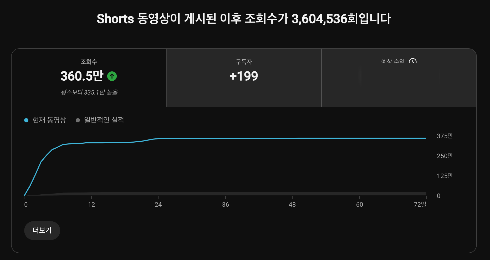
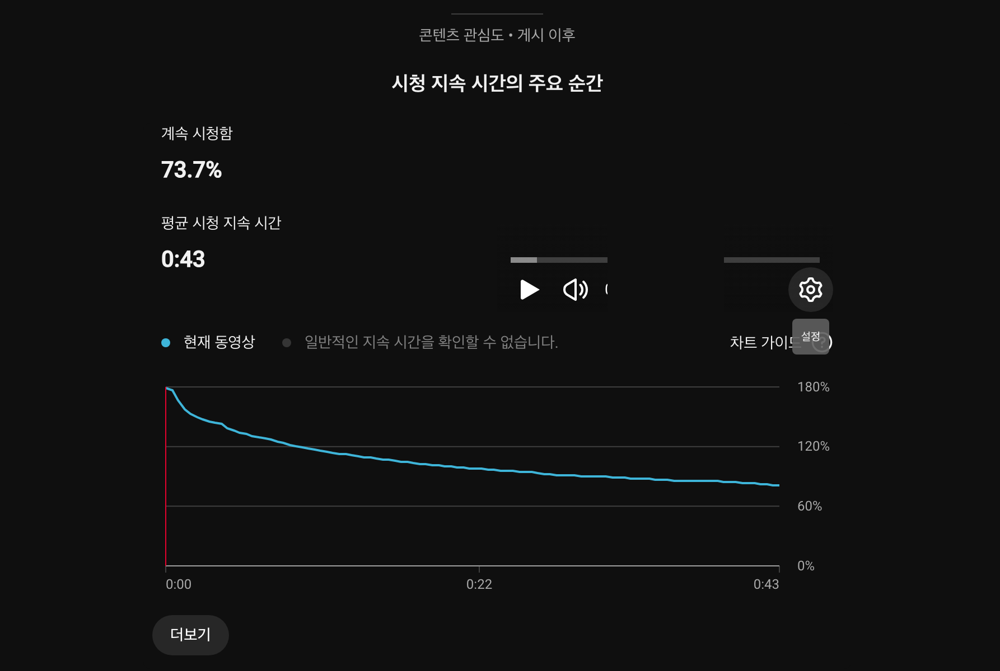
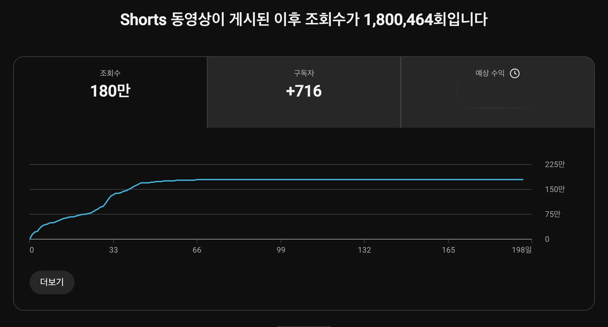
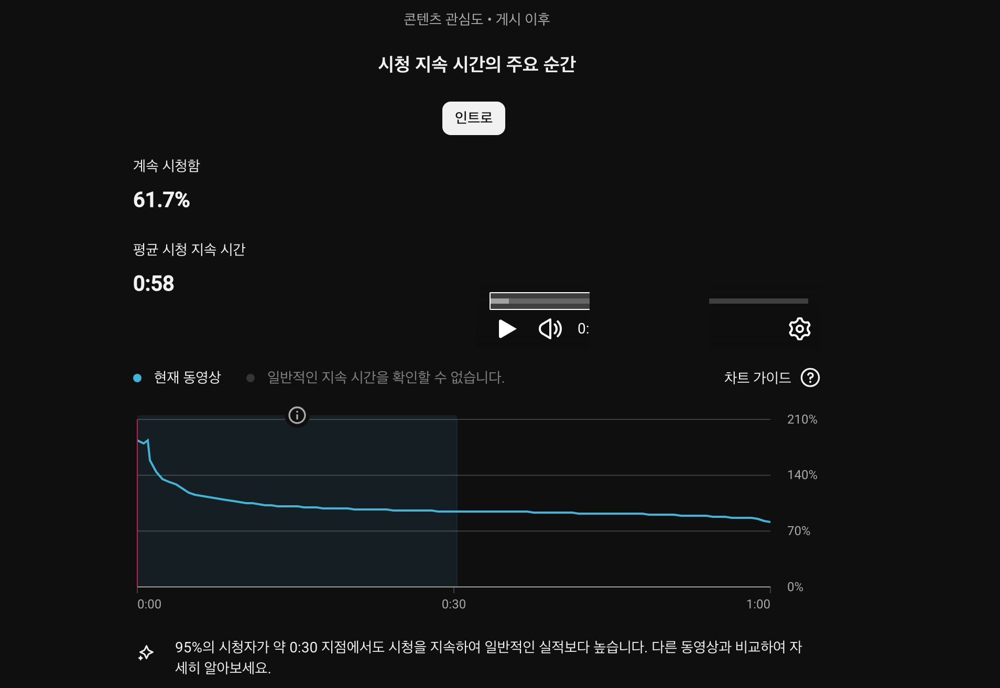
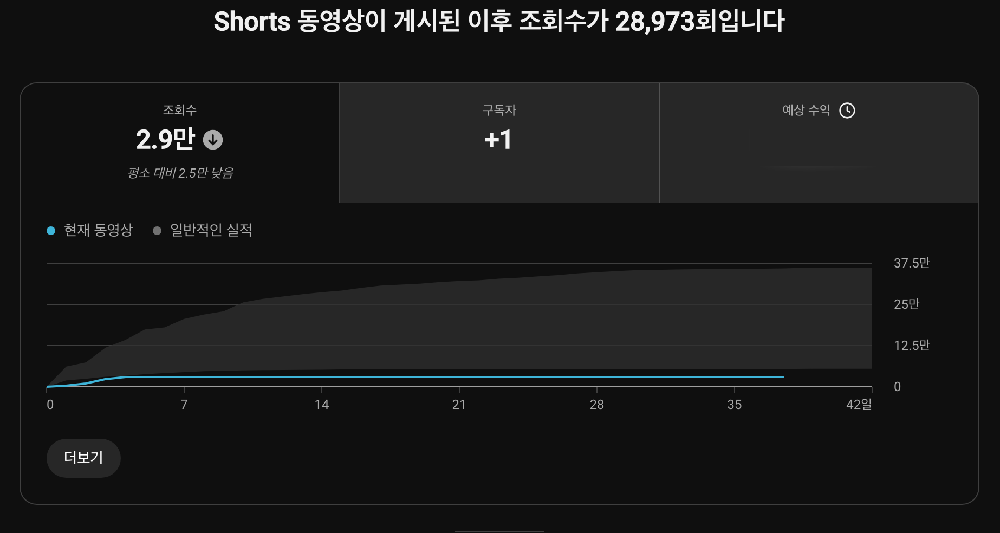
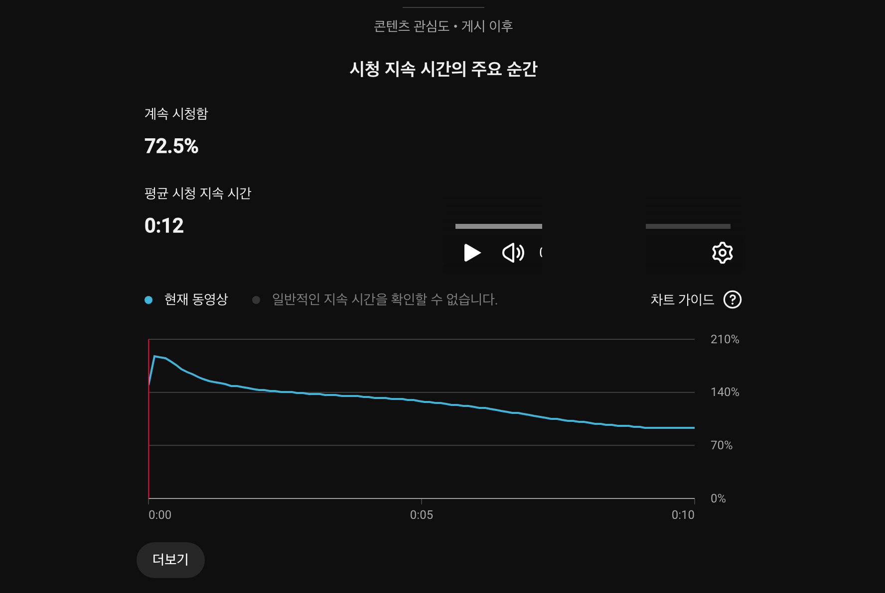
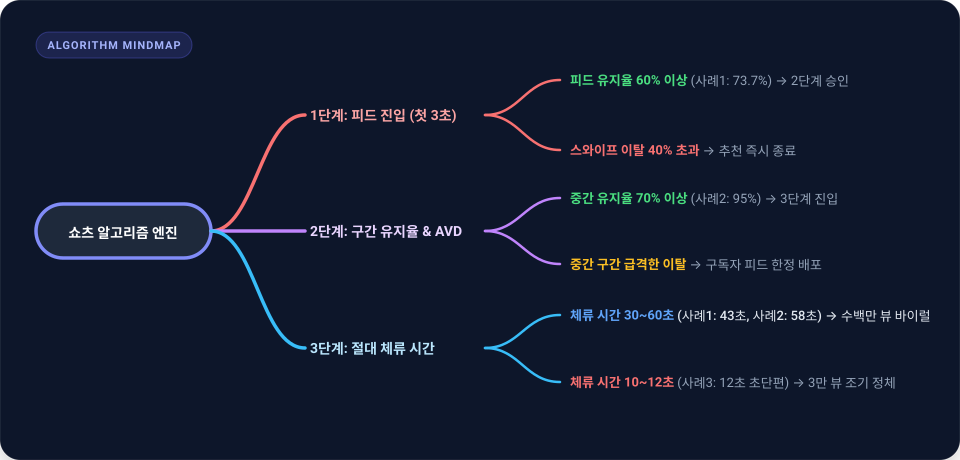

유튜브 쇼츠를 직접 기획하고 제작하는 크리에이터라면 누구나 한번쯤 풀리지 않는 의문에 부딪힙니다. 며칠 밤을 새워 공들여 만든 영상은 조회수 수천 회에 머무는 반면, 가벼운 마음으로 핵심만 담아 올린 영상은 며칠 만에 수백만 뷰를 돌파하는 기현상입니다. 

유튜브의 알고리즘은 블랙박스처럼 보이지만, 스튜디오의 시계열 분석 데이터를 열어 보면 시청자 행동에 일정한 패턴이 보입니다.

제가 운영하는 채널의 쇼츠 가운데 누적 조회수 360만 회를 기록한 영상, 180만 회의 1분 쇼츠, 2.9만 회에서 멈춘 영상, 이 세 편의 스튜디오 지표를 나란히 놓고 비교해 보았습니다.

## 쇼츠 피드 알고리즘의 2대 절대 평가 지표

일반적인 롱폼 영상(Long-form)은 썸네일과 제목을 보고 시청자가 클릭하는 클릭률(CTR)과 총 시청 시간(Watch Time)이 가장 핵심적인 지표로 작용합니다. 그러나 사용자가 손가락으로 화면을 위아래로 스와이프하며 끊임없이 영상을 탐색하는 쇼츠 피드 환경에서는 작동 원리가 근본적으로 다릅니다.

쇼츠 피드에서는 사용자가 영상을 클릭해서 들어오지 않습니다. 알고리즘이 먼저 피드에 영상을 띄워주고, 사용자는 1초에서 3초 이내에 이 영상을 계속 볼지, 아니면 다음 영상으로 넘길지(Swipe away)를 결정합니다. 

이러한 특성 때문에 유튜브 쇼츠 추천 시스템은 크게 두 가지 원인 지표를 최우선으로 평가합니다.

1. 피드 유지율 (Viewed vs Swiped Away): 피드에 영상이 노출되었을 때 스와이프하여 이탈하지 않고 시청을 선택한 사용자의 비율입니다.
2. 평균 시청 지속 시간 (AVD, Average View Duration) 및 완주율: 영상을 끝까지 보았는지, 그리고 반복해서 다시 보았는지(Loop Rate)를 나타내는 지표입니다.

[YouTube 고객센터의 쇼츠 분석 도움말](https://support.google.com/youtube/answer/12942217?hl=en&co=YOUTUBE._YTVideoType%3Dshorts)은 쇼츠 피드에서 시청자가 영상을 '보기로 선택한' 비율과 넘겨서 지나간 비율을 공식 지표로 제공합니다. 이 지표가 추천 범위 확장과 어떻게 연결되는지는 공식 문서에 설명되어 있지 않으므로, 아래에서는 실제 스튜디오 캡처 데이터를 근거로 그 동작을 추정해 살펴보겠습니다.

## 사례 1: 360만 뷰 영상의 73.7% 피드 유지율과 루프 시청 구조

첫 번째 사례는 자체 운영 채널에서 누적 조회수 360만 회(3,604,536회)를 달성한 영상의 스튜디오 데이터입니다.

위 스튜디오 대시보드를 살펴보면, 영상이 게시된 직후부터 약 10일간 가파른 수직 상승 곡선을 그리며 초기 250만 뷰를 돌파한 뒤 360만 뷰까지 지속적으로 확산되었습니다. 세부 시청 지속 시간 곡선을 보면 이 영상의 특징이 보입니다.

이 영상의 핵심 지표는 다음과 같습니다.

- 피드 유지율 (계속 시청함): 73.7% (스와이프 이탈률 26.3%)
- 전체 영상 길이: 43초 (0:43)
- 평균 시청 지속 시간 (AVD): 0:43 (완주율 100%)
- 시청 지속 시간 곡선 시작점: 170% (초반 루프 및 다회 시청)

0초 도입부에서 시청 그래프가 170%를 상회한다는 것은, 영상을 처음부터 끝까지 본 뒤 다시 재생해 본 시청이 많았다는 뜻으로 읽힙니다. 

더욱 주목할 점은 43초라는 긴 러닝타임 내내 시청 유지율이 80% 밑으로 떨어지지 않았다는 사실입니다. 70% 이상의 피드 유지율과 100%에 달하는 AVD가 결합되면, 이런 영상은 추천 범위가 크게 확장되는 것으로 보입니다(저자의 해석입니다).

## 사례 2: 180만 뷰 1분 롱 쇼츠의 구간별 방어력

두 번째 사례는 쇼츠의 최대 길이인 1분(60초) 풀타임으로 제작되었음에도 180만 회(1,800,464회)의 높은 조회수를 기록한 영상입니다.

60초 풀 영상을 끝까지 보게 만드는 것은 쉽지 않은 일입니다. 길이가 길어질수록 중간 이탈 지점이 많아져 AVD가 급격히 떨어지기 때문입니다. 그런데 이 영상의 상세 분석에서는 구간별 유지가 높게 나타났습니다.

- 피드 유지율 (계속 시청함): 61.7% (스와이프 이탈률 38.3%)
- 전체 영상 길이: 1분 (1:00)
- 평균 시청 지속 시간 (AVD): 0:58 (완주율 96.6%)
- 30초 중간 지점 유지율: 95% 유지

피드 유지율은 61.7%로 첫 번째 사례(73.7%)보다 다소 낮았지만, 일단 시청을 시작한 사용자들의 95%가 30초 이후까지 이탈하지 않고 시청을 지속했습니다. 

제 해석으로는 알고리즘이 피드 유지율뿐 아니라 총 체류 시간도 함께 보는 것 같습니다. 10초 영상의 완주보다 60초 영상의 58초 시청이 플랫폼에는 더 긴 시청으로 쌓이고, 이것이 180만 뷰까지 추천이 이어진 이유 중 하나일 거라고 추정합니다(공식 문서에 명시된 기준이 아닌 해석입니다).

## 사례 3: 지표는 좋았는데 2.9만 뷰에서 멈춘 10초 쇼츠

세 번째 사례는 조회수 2.9만 회(28,973회)에서 성장이 멈춘 영상입니다.

위 그래프를 보면 게시 후 초기 3일 동안 2만 뷰 수준까지 빠르게 진입했으나, 이후 그래프가 거의 수평선(플랫라인)을 그리며 성장이 멈췄습니다. 그런데 이 영상의 시청 지속 시간 지표를 열어 보면 겉보기에는 문제가 없어 보입니다.

- 피드 유지율 (계속 시청함): 72.5% (스와이프 이탈률 27.5%)
- 전체 영상 길이: 10초 (0:10)
- 평균 시청 지속 시간 (AVD): 0:12 (완주율 120%)

피드 유지율이 72.5%로 매우 훌륭하고, 10초 영상 대비 AVD가 12초(완주율 120%)에 달했음에도 불구하고 왜 이 영상은 3만 뷰를 넘지 못하고 멈췄을까요?

제 해석으로는 절대적인 시청 시간이 짧았던 것이 이유입니다. 영상의 길이가 10초에 불과하면 시청자가 1.2회 루프 시청을 하더라도 플랫폼에 머무는 절대 시간은 12초에 그칩니다. 

유튜브의 추천 시스템은 초기 테스트 그룹에서 완주율이 높더라도, 사용자 1인당 확보되는 체류 시간이 극단적으로 짧은 초단편 영상에 대해서는 대규모 피드 확산을 보수적으로 제한하는 것으로 보입니다(추정). 유튜브가 3분 길이의 쇼츠를 허용한 흐름과 맞닿아 있을 수 있다는 것이 저의 추정입니다.

## 3대 스튜디오 지표 종합 비교 및 알고리즘 판별 모델

세 영상의 스튜디오 데이터를 표로 정리해 대조하면 다음과 같은 경향이 보입니다.

| 분석 항목 | 사례 1 (360만 뷰) | 사례 2 (180만 뷰, 1분) | 사례 3 (2.9만 뷰) |
|---|---|---|---|
| 누적 조회수 | 3,604,536회 | 1,800,464회 | 28,973회 |
| 영상 러닝타임 | 43초 | 60초 (1:00) | 10초 |
| 피드 시청 비율 | 73.7% | 61.7% | 72.5% |
| 평균 시청 시간(AVD) | 0:43 (100%) | 0:58 (96.6%) | 0:12 (120%) |
| 1인당 절대 체류 시간 | 43.0초 | 58.0초 | 12.0초 |
| 구독자 순증 | +199명 | +716명 | +1명 |
| 조회수 흐름 | 초기 약 10일 급상승 | 한 달 넘게 증가 | 초기 3일 이후 정체 |

이 데이터를 바탕으로 유튜브 쇼츠 추천 알고리즘의 3단계 필터링 및 의사결정 구조를 시각화한 마인드맵은 다음과 같습니다.

## 크리에이터를 위한 실전 제작 가이드라인

이 세 영상의 지표를 보고 제가 정리한 제작 기준입니다. 감에 의존하는 편집보다 지표를 보고 기획하는 쪽이 낫다고 생각합니다.

### 1. 첫 3초의 스와이프 방어벽 구축
피드 유지율 60%를 넘지 못하면 아무리 훌륭한 반전이 뒤에 있어도 알고리즘의 1차 관문을 통과할 수 없습니다. 도입부 0~3초에는 상황 설명이나 오프닝 인트로를 전면 배제하고, 시청자가 화면을 넘기지 못하게 만드는 핵심 질문, 극적인 시각 자극, 혹은 결론부의 하이라이트를 전면에 배치하는 것이 효과적입니다.

### 2. 30초에서 45초 사이의 고밀도 러닝타임 설계
완주율 지표를 쉽게 얻기 위해 10초 미만의 초단편 영상을 만드는 것은 추천 확산의 한계를 자초하는 일입니다. 시청자가 지루함을 느끼지 않으면서도 플랫폼에 유의미한 체류 시간(30초 이상)을 선물할 수 있는 30~45초 구간의 서사 구조를 만드는 것이 제가 쓰는 안전한 선택입니다.

### 3. 자연스러운 끝과 시작의 루프 연결
사례 1처럼 시청 지속 시간 곡선이 100%를 초과하여 시작하게 만들려면, 영상의 마지막 문장과 첫 문장이 매끄럽게 이어지는 이른바 '무한 루프 구조'를 기획해야 합니다. 시청자가 영상이 끝났음을 인지하지 못하고 자연스럽게 1~2초를 더 보게 만드는 디테일이 AVD를 끌어올린다고 생각합니다.

알고리즘은 크리에이터를 괴롭히기 위한 장치가 아니라 시청자가 좋아하는 영상을 찾아주려는 시스템이라고 저는 이해합니다. 채널 스튜디오의 시청 유지율 곡선을 매주 꼼꼼히 점검하고, 데이터가 가리키는 이탈 지점을 하나씩 보완해 나가는 것이 지속 가능한 성장에 도움이 된다고 생각합니다.

