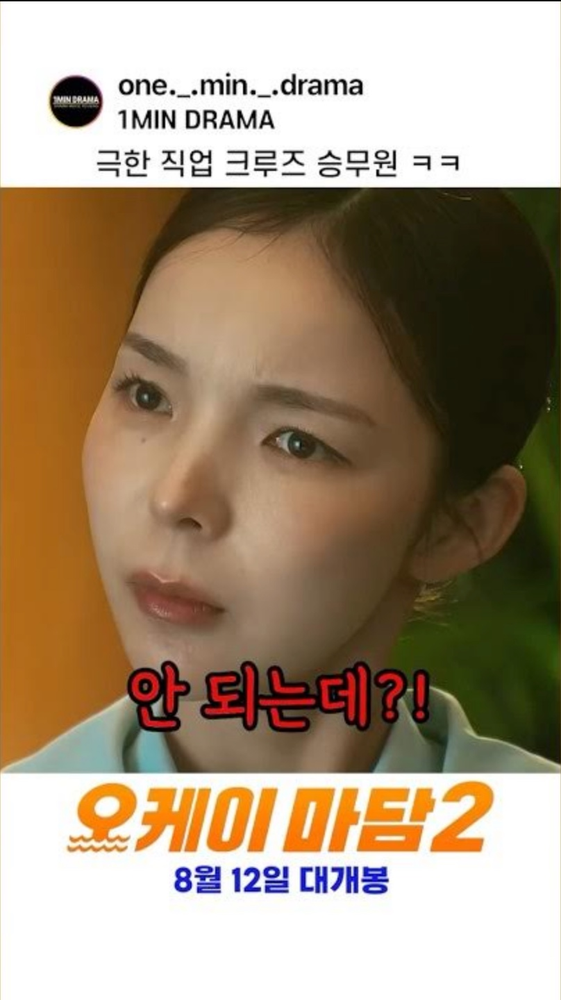
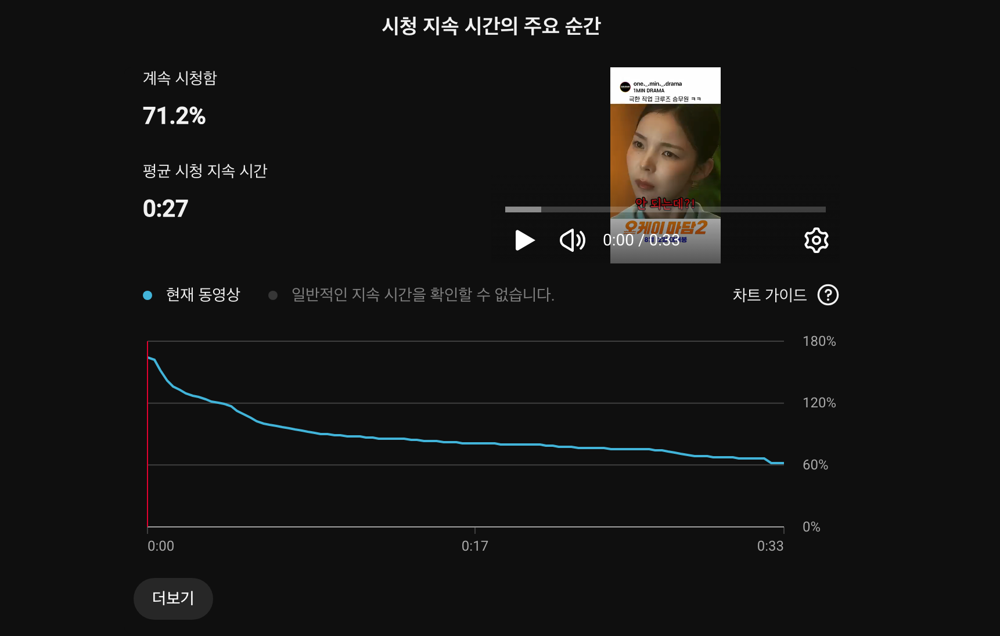
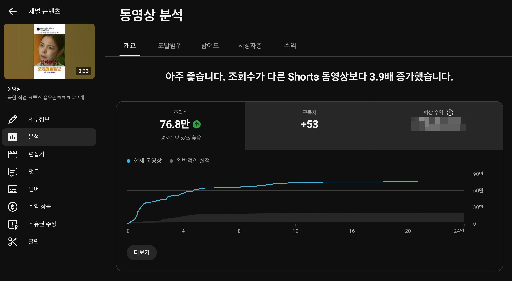

유튜브 쇼츠 피드에서 사용자가 다음 영상으로 화면을 넘기는 데 걸리는 시간은 평균 1.5초에서 2초에 불과합니다.

크리에이터가 아무리 뛰어난 스토리와 화려한 컷 편집, 충격적인 결말을 준비했더라도, 시청자의 손가락이 위로 스와이프되는 그 찰나의 순간을 붙잡지 못하면 영상의 나머지 95%는 세상의 빛을 보지 못한 채 알고리즘의 바닥으로 가라앉습니다.

유튜브 추천 알고리즘의 핵심 판별 기준은 명확합니다. **'첫 3초 동안 시청자가 스와이프하지 않고 머물렀는가(Viewed vs Swiped away)'**, 그리고 **'그 몰입이 영상 끝까지 유지되었는가(Average Percentage Viewed)'**입니다.

1MIN DRAMA(@onemindrama) 채널을 운영하며 수백 편의 영화·드라마 리뷰 쇼츠를 기획하고 분석하는 과정에서, 도입부 3초의 연출 방식을 어떻게 설계하느냐에 따라 영상의 시청 지속 시간 곡선과 최종 조회수가 완전히 달라지는 인과관계를 실측 데이터로 확인했습니다.

본 글에서는 누적 76.8만 회의 조회수와 71.2%의 경이로운 시청 유지율을 기록한 1MIN DRAMA의 실제 쇼츠 사례를 바탕으로, 시청자의 뇌를 즉각적으로 락인(Lock-in)시키는 0~3초 오프닝 훅의 시각·청각 설계 공식과 알고리즘 확장 메커니즘을 상세히 공개합니다.

## 손가락을 멈추게 하는 0~3초의 3중 후킹 메커니즘

쇼츠 피드를 무의식적으로 넘기던 시청자가 특정 영상에서 손가락을 멈추는 과정은 고도의 인지 심리학적 반응을 수반합니다. 시각(인물의 표정), 언어(헤드라인 텍스트), 청각(대사 및 효과음)의 3가지 자극이 0.5초 안에 동시에 뇌로 전달되어 "이 영상을 더 보지 않으면 궁금해서 견딜 수 없다"는 인지적 불일치(Cognitive Dissonance)를 유발해야 합니다.

[Think with Google 숏폼 소비자 행동 분석 리포트](https://www.thinkwithgoogle.com/)에 따르면, 모바일 사용자가 콘텐츠를 계속 시청할지 여부를 결정하는 뇌의 반응 속도는 1초 미만이며, 텍스트와 시각적 감정선이 일치할 때 정보 수용도가 3배 이상 급증합니다.

## 실측 사례 1: 0~3초 오프닝 훅의 시각·언어적 3중 결합 설계

실제 누적 조회수 76.8만 회를 돌파한 1MIN DRAMA 채널의 쇼츠 영상(`극한 직업 크루즈 승무원ㅋㅋㅋ #오케이마담2`, 러닝타임 33초)의 도입부 0초 지점 실제 캡처 화면입니다.

위 실측 화면에는 시청자의 이탈을 방어하기 위한 3가지 핵심 훅 장치가 유기적으로 배치되어 있습니다.

### 1. 상단 상황 요약 헤드라인: 0.2초 인지 앵커링
상단에 위치한 `1MIN DRAMA` 채널 로고 바로 아래에 `극한 직업 크루즈 승무원 ㅋㅋ`이라는 직관적인 상황 요약 카피를 배치했습니다. 시청자는 영상을 재생하자마자 "아, 크루즈 승무원이 겪는 코믹하고 난감한 상황이 펼쳐지겠구나"라는 시청 맥락(Context)을 0.2초 만에 완벽히 이해합니다.

### 2. 인물의 극적인 당황 표정 클로즈업: 감정 미러링
화면 중앙을 가득 채운 승무원 인물의 흔들리는 눈빛과 굳어버린 표정은 시청자에게 즉각적인 감정 전이(Emotional Mirroring)를 일으킵니다. "도대체 무슨 일이 벌어졌길래 저런 표정을 짓고 있는가?"라는 본능적인 호기심을 유도합니다.

### 3. 고대비 대사 자막 훅: "안 되는데?!" 위기 고조
인물의 대사인 `안 되는데?!`를 붉은색 외곽선과 굵은 고딕 폰트로 화면 중앙에 배치했습니다. 금지와 위기를 암시하는 강렬한 한마디는 시청자에게 다음 장면에 어떤 사고가 터질지 확인하고 싶은 강력한 긴장감을 부여합니다.

이처럼 **'상단 상황 정리 + 중앙 감정 클로즈업 + 고대비 위기 대사'**가 9:16 안전지대 안에서 완벽한 삼각형 구도를 이루며 피드 스와이프를 원천 차단했습니다.

## 실측 사례 2: 3초 훅이 만들어낸 71.2% 시청 지속 시간 곡선

위와 같이 정교하게 기획된 오프닝 훅이 실제 시청자들의 이탈 방어에 어떤 수치적 결과를 만들어냈는지, 유튜브 스튜디오의 실측 분석 데이터를 확인해 봅니다.

위 화면은 해당 33초 쇼츠 영상의 **유튜브 스튜디오 '시청 지속 시간의 주요 순간'** 분석 그래프입니다.

### 1. 계속 시청함 71.2% 달성
그래프 상단에 명시된 **'계속 시청함: 71.2%'** 수치는, 피드에서 이 영상을 마주한 시청자 10명 중 7명 이상이 스와이프하지 않고 3초 이상 영상을 계속 시청했음을 입증합니다. 일반적인 쇼츠의 평균 계속 시청 비율이 50~60% 선에 머무는 것과 비교하면 압도적인 수치입니다.

### 2. 평균 시청 지속 시간 27초 (완주율 81.8%)
총 33초 러닝타임 중 **평균 시청 지속 시간은 27초**를 기록했습니다. 이는 전체 영상의 **81.8%**에 해당하는 길이입니다. 초반 3초의 훅을 통과한 시청자 대다수가 중간에 이탈하지 않고 결말부까지 영상을 소비했음을 의미합니다.

### 3. 이상적인 리텐션 감쇄 곡선
그래프를 보면 0:00 지점에서 140% 이상의 초기 지수로 시작하여, 3초(0:03) 지점을 통과한 이후에도 완만한 하향 곡선을 그리며 영상 종료 시점(0:33)까지 60% 이상의 높은 유지율을 끝까지 방어합니다. 초반 후킹이 영상 전체의 체류 시간을 견인하는 지렛대 역할을 완벽히 수행했습니다.

[YouTube Creators 공식 블로그 가이드](https://blog.youtube/creator-and-artist-stories/)에 따르면, 유튜브 숏폼 알고리즘은 첫 3초 이탈률이 낮고 시청 지속 시간이 총 길이의 70%를 상회하는 영상에 가장 높은 추천 가중치를 부여합니다.

## 실측 사례 3: 높은 리텐션이 견인한 76.8만 뷰 알고리즘 폭발

초반 3초 훅과 71.2%의 높은 유지율이 결합되었을 때, 유튜브 추천 엔진이 해당 영상을 어떻게 평가하고 확장시켰는지 최종 성과를 확인해 봅니다.

위 화면은 유튜브 스튜디오 동영상 분석 [개요] 탭의 실측 성과 지표입니다.

### 1. 조회수 76.8만 회 (채널 평소 대비 3.9배 폭증)
상단 안내 문구에 명시되었듯 **"아주 좋습니다. 조회수가 다른 Shorts 동영상보다 3.9배 증가했습니다."**라는 알고리즘 진단과 함께, 누적 **76.8만 회(평소보다 57만 회 높음)**의 폭발적인 트래픽을 기록했습니다.

### 2. 초기 4일 만의 수직 상승 성장 곡선
시간대별 조회수 그래프를 보면, 영상 게시 직후 0~4일 차 구간에서 가파른 수직 상승 곡선을 그리며 순식간에 50만 뷰를 돌파한 뒤 76만 뷰 이상으로 안착했습니다. 초반 높은 시청 유지율 데이터를 확인한 알고리즘이 피드 노출 풀(Pool)을 광범위하게 확장시켰기 때문입니다.

### 3. 구독자 순증 +53명 및 채널 성장 기여
높은 완주율과 만족스러운 시청 경험은 영상 1편만으로 **53명의 순수 구독자 유입**을 이끌어내며 채널의 기초 체력을 강화했습니다.

## 성공적인 3초 훅 vs 일반적인 오프닝 이탈 패턴 실측 비교

1MIN DRAMA 채널에서 분석한 고성과 쇼츠와 초반 이탈률이 높았던 일반 쇼츠 간의 도입부 설계 차이는 다음과 같습니다.

| 분석 항목 | 고성과 3초 훅 쇼츠 (76.8만 뷰 실측) | 초반 이탈 쇼츠 (평균 1만 뷰 미만) |
|---|---|---|
| **0~1초 첫 시각 요소** | **인물의 극적인 감정 표정 클로즈업** | 밋밋한 풍경, 배경, 또는 채널 인트로 |
| **상단 텍스트 앵커** | **직관적 상황 요약 카피 (`극한 직업...`)** | 텍스트 없음 또는 모호한 추상적 문구 |
| **첫 대사 및 오디오** | **위기·갈등 유발 대사 (`안 되는데?!`)** | "안녕하세요", 자기소개, 또는 정적 |
| **자막 디자인 및 배치** | **고대비 폰트, 화면 중앙 안전지대 배치** | 작고 얇은 폰트, 상·하단 UI 가림 영역 |
| **계속 시청함 (Viewed %)** | **71.2% (10명 중 7명 락인)** | 45.0% ~ 52.0% (과반수 즉시 스와이프) |
| **평균 시청 유지율 (AVD)** | **81.8% (33초 중 27초 완주)** | 40.0% ~ 50.0% (중반부 급격한 이탈) |
| **알고리즘 피드 확장 여부** | **추천 트래픽 3.9배 폭증 (76만 뷰 도달)** | 초기 테스트 피드 1만 회 미만에서 노출 중단 |

[Google 검색 센터 동영상 권장사항 지침](https://developers.google.com/search/docs/appearance/video)에서도 강조하듯, 시청자에게 콘텐츠의 핵심 가치를 가장 빠르게 전달하는 직관적인 오프닝 설계는 검색 및 추천 시스템 전반에서 영상의 노출 품질을 결정짓는 핵심 척도입니다.

## 크리에이터가 즉시 적용 가능한 4가지 오프닝 후킹 공식

1MIN DRAMA 채널을 운영하며 검증한, 쇼츠 기획 시 즉시 적용할 수 있는 4가지 실전 오프닝 후킹 공식은 다음과 같습니다.

### 1. 감정 미러링 훅 (Emotional Mirroring)
영상 시작과 동시에 인물의 가장 충격적이거나, 억울하거나, 분노하거나, 황당해하는 표정을 풀샷이 아닌 타이트한 바스트/클로즈업 샷으로 배치합니다. 인간의 뇌는 타인의 강렬한 표정을 보는 순간 거울 신경세포(Mirror Neuron)를 작동시켜 같은 감정 상태로 동기화됩니다.

### 2. 갈등 선제시 훅 (Inverted Conflict)
기승전결의 전통적인 서사 구조를 완전히 뒤집어야 합니다. 사건의 발단이나 배경 설명을 모두 잘라내고, 영상의 클라이맥스나 가장 당황스러운 위기 대사(예: "안 되는데?!", "이게 왜 여기 있어?")를 0.0초 지점에 먼저 터뜨린 후 과거 시점으로 되돌아가는 역피라미드 구조를 취합니다.

### 3. 상단 텍스트 앵커링 (Context Anchor)
소리를 켜지 않고 무음으로 쇼츠를 넘겨보는 시청자들을 위해, 상단 안전지대에 상황을 단 5~10글자로 요약하는 텍스트 앵커를 항상 배치합니다. 시청자가 영상을 이해하기 위해 머리를 쓸 필요 없이 즉시 상황에 몰입할 수 있도록 뇌의 인지 부하를 제로(0)로 만들어 줍니다.

### 4. 자이가르닉 미완성 효과 (Zeigarnik Effect)
"이 사건의 결말이 어떻게 될까?", "이 위기를 어떻게 모면할까?"라는 질문을 던져놓고 답을 후반부로 미룹니다. 인간은 미완성된 과제나 풀리지 않은 궁금증을 끝까지 해결하려는 심리적 본능이 있으므로, 초반 3초에 심어둔 의문은 30초 이상의 높은 완주율로 직결됩니다.

## 오프닝 3초에 전체 편집 시간의 50%를 투자하라

쇼츠 제작에서 가장 흔히 범하는 실수는 영상의 후반부 완성도에 대부분의 에너지를 쏟고, 정작 시청자가 처음 마주하는 0~3초 구간은 영상 원본의 시작 부분을 그대로 이어 붙이는 것입니다.

1MIN DRAMA의 76.8만 뷰 실측 데이터가 증명하듯, **첫 3초에서 시청자를 락인시키지 못하면 아무리 훌륭한 후반부도 존재하지 않는 것과 같습니다.**

편집 타임라인을 열었을 때, 다음 3가지를 스스로에게 질문해 보시기 바랍니다:
1. 0.0초 시작 화면에서 인물의 시선과 표정이 시청자의 시선을 즉각 사로잡고 있는가?
2. 상단 헤드라인과 자막 카피가 어떤 상황인지 0.5초 만에 설명하고 있는가?
3. 첫 대사가 시청자에게 "왜?"라는 궁금증을 강하게 유발하고 있는가?

이 3가지 조건을 충족하는 정교한 3초 훅을 설계하는 데 전체 편집 시간의 절반을 투자하십시오. 71.2%의 시청 유지율과 알고리즘의 폭발적인 트래픽 확장은 바로 그 찰나의 3초에서 시작됩니다.
