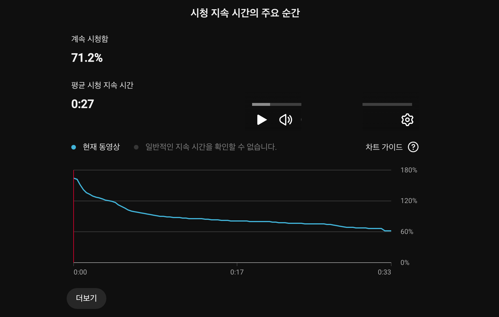
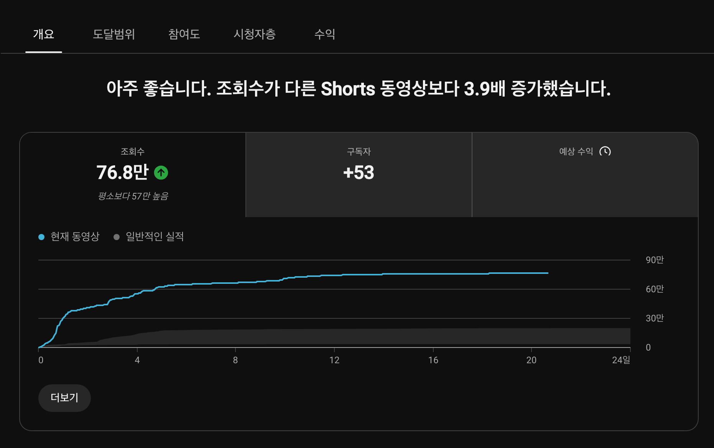

> 업데이트(2026-10-07): 이 글의 사례는 한 영상의 관측입니다. 이후 사례(피드 잔존율 55~58%에서도 250만 뷰 도달)에서는 높은 잔존율이 유일한 조건이 아니었습니다. 자세한 내용은 [쇼츠 알고리즘의 역설](/blog/2026-09-11-shorts-retention-vs-watch-time-share-algorithm/)에서 다룹니다.

제 관찰로는 유튜브 쇼츠 피드에서 사용자가 다음 영상으로 화면을 넘기는 데 걸리는 시간은 대체로 1.5~2초 안팎입니다.

크리에이터가 아무리 뛰어난 스토리와 화려한 컷 편집, 충격적인 결말을 준비했더라도, 시청자의 손가락이 위로 스와이프되는 그 찰나의 순간을 붙잡지 못하면 영상의 나머지 95%는 세상의 빛을 보지 못한 채 알고리즘의 바닥으로 가라앉습니다.

유튜브 추천 알고리즘의 핵심 판별 기준은 명확합니다. '첫 3초 동안 시청자가 스와이프하지 않고 머물렀는가(Viewed vs Swiped away)', 그리고 '그 몰입이 영상 끝까지 유지되었는가(Average Percentage Viewed)'입니다.

제가 운영하는 스토리 쇼츠 채널의 영상을 기획하고 분석하면서, 도입부 3초를 어떻게 설계하느냐에 따라 시청 지속 시간 곡선이 달라지는 경향을 스튜디오 통계로 관측했습니다.

이 글에서는 누적 조회수 76.8만 회, 계속 시청 비율 71.2%를 기록한 제 채널의 쇼츠 한 편을 사례로, 0~3초 오프닝 훅을 어떻게 설계했는지와 그 뒤에 관측된 변화를 정리합니다.

## 손가락을 멈추게 하는 0~3초의 3중 후킹 메커니즘

쇼츠 피드를 넘기던 시청자의 손가락을 멈추게 하려고, 저는 시각(인물의 표정), 언어(헤드라인 텍스트), 청각(대사 및 효과음) 세 가지를 첫 0.5초 안에 함께 보여 주는 규칙을 씁니다. "이 영상을 더 보면 궁금한 게 풀리겠다"고 느끼게 하는 것이 목표입니다.

시각(표정)과 텍스트의 감정선이 일치할 때 시청자가 상황을 더 빨리 이해한다는 것이 제 편집 경험입니다(실험으로 검증한 수치는 아닙니다).

## 분석 사례 1: 0~3초 오프닝 훅의 시각·언어적 3중 결합 설계

사례는 누적 조회수 76.8만 회를 기록한 33초 쇼츠 한 편입니다. 이 영상의 도입부 0초 지점은 세 가지 장치로 구성했습니다.

### 1. 상단 상황 요약 헤드라인
화면 상단에 상황을 한 줄로 요약한 카피를 배치했습니다. 시청자는 재생하자마자 어떤 상황이 펼쳐질지 짐작할 수 있습니다.

### 2. 인물의 당황한 표정 클로즈업
화면 중앙을 가득 채운 인물의 흔들리는 눈빛과 굳은 표정으로 시작했습니다. "도대체 무슨 일이 벌어졌길래 저런 표정을 짓고 있는가?"라는 궁금증을 노린 연출입니다.

### 3. 고대비 대사 자막 훅: "안 되는데?!" 위기 고조
인물의 대사인 `안 되는데?!`를 붉은색 외곽선과 굵은 고딕 폰트로 화면 중앙에 배치했습니다. 금지와 위기를 암시하는 한마디라서, 다음 장면에서 무슨 일이 터질지 궁금해지도록 의도했습니다.

'상단 상황 정리 + 중앙 감정 클로즈업 + 고대비 위기 대사' 세 요소를 9:16 안전지대 안에 모아 배치했습니다. 이 영상에서는 첫 3초 이탈이 적게 나타났습니다.

## 분석 사례 2: 71.2%의 계속 시청 비율과 시청 지속 시간 곡선

이 오프닝 훅 뒤에 시청 지속 시간이 어떻게 나왔는지 유튜브 스튜디오 데이터로 확인해 봅니다.

위 화면은 해당 33초 쇼츠 영상의 유튜브 스튜디오 '시청 지속 시간의 주요 순간' 분석 그래프입니다.

### 1. 계속 시청함 71.2% 달성
그래프 상단에 명시된 '계속 시청함: 71.2%' 수치는, 피드에서 이 영상을 마주한 시청자 10명 중 7명 이상이 스와이프하지 않고 3초 이상 영상을 계속 시청한 것으로 나타났습니다.

### 2. 평균 시청 지속 시간 27초 (완주율 81.8%)
총 33초 러닝타임 중 평균 시청 지속 시간은 27초를 기록했습니다. 이는 전체 영상의 81.8%에 해당하는 길이입니다. 초반 3초를 지난 시청자 상당수가 결말부 가까이까지 시청한 것으로 보입니다.

### 3. 이상적인 리텐션 감쇄 곡선
그래프를 보면 0:00 지점에서 140% 이상의 초기 지수로 시작하여, 3초(0:03) 지점을 통과한 이후에도 완만한 하향 곡선을 그리며 영상 종료 시점(0:33)까지 60% 이상의 높은 유지율을 끝까지 방어합니다. 초반 유지율이 높게 시작해 영상 전체의 시청 지속 시간을 받쳐 준 것으로 보입니다.

제 채널 데이터에서는 첫 3초 이탈이 적고 시청 지속 시간이 영상 길이의 70%를 넘는 영상이 더 넓게 추천되는 경향이 있었습니다(공식 문서에 명시된 기준이 아닌 관측입니다).

## 분석 사례 3: 76.8만 뷰까지 이어진 조회수 곡선

이 영상이 이후 어떤 조회수 곡선을 그렸는지 확인해 봅니다.

위 화면은 유튜브 스튜디오 동영상 분석 [개요] 탭의 실제 성과 지표입니다.

### 1. 조회수 76.8만 회 (다른 쇼츠 대비 3.9배)
스튜디오 상단에 "아주 좋습니다. 조회수가 다른 Shorts 동영상보다 3.9배 증가했습니다."라는 안내가 떴고, 누적 조회수는 76.8만 회로 평소보다 57만 회 높았습니다.

### 2. 초기 4일 안에 가팔랐던 조회수 곡선
시간대별 조회수 그래프를 보면 게시 직후 4일 안에 50만 뷰를 넘겼고, 이후 76만 뷰 이상에서 완만해졌습니다. 이 곡선의 이유를 높은 시청 유지율 하나로 단정할 근거는 없고, 한 영상에서 관측된 모양입니다.

### 3. 구독자 +53명
이 영상 한 편으로 구독자가 53명 늘었습니다.

## 성공적인 3초 훅 vs 일반적인 오프닝 이탈 패턴 비교

이 글의 사례와 초반 이탈이 많았던 쇼츠를 비교하면 도입부 설계에서 이런 차이가 있었습니다. 오른쪽 열은 제 채널에서 본 경향을 정리한 것이고, 영상 수와 수치로 집계한 값은 아닙니다.

| 분석 항목 | 이 글의 사례 쇼츠 (76.8만 뷰) | 초반 이탈이 많았던 쇼츠 |
|---|---|---|
| 0~1초 첫 시각 요소 | 인물의 극적인 감정 표정 클로즈업 | 밋밋한 풍경, 배경, 또는 채널 인트로 |
| 상단 텍스트 앵커 | 직관적 상황 요약 카피 | 텍스트 없음 또는 모호한 추상적 문구 |
| 첫 대사 및 오디오 | 위기·갈등 유발 대사 (`안 되는데?!`) | "안녕하세요", 자기소개, 또는 정적 |
| 자막 디자인 및 배치 | 고대비 폰트, 화면 중앙 안전지대 배치 | 작고 얇은 폰트, 상·하단 UI 가림 영역 |
| 계속 시청함 (Viewed %) | 71.2% (10명 중 7명이 3초 이상 시청) | 낮음 (즉시 스와이프가 많음) |
| 평균 시청 유지율 (AVD) | 81.8% (33초 중 27초 시청) | 낮음 (중반부 이탈이 큼) |
| 알고리즘 피드 확장 여부 | 다른 쇼츠 대비 조회수 3.9배 (76.8만 뷰) | 조회수가 크게 늘지 않음 |

## 크리에이터가 즉시 적용 가능한 4가지 오프닝 후킹 공식

제가 쇼츠를 기획할 때 쓰는 오프닝 규칙 4가지를 정리합니다. 실험으로 검증한 것은 아니고, 제 채널에서 써 본 방식입니다.

### 1. 감정 클로즈업 훅
영상 시작과 동시에 인물의 가장 충격적이거나, 억울하거나, 분노하거나, 황당해하는 표정을 풀샷이 아닌 타이트한 바스트/클로즈업 샷으로 배치합니다. 표정이 강하게 보이면 시청자가 상황을 더 빨리 이해한다는 것이 제 편집 경험입니다.

### 2. 갈등 선제시 훅 (Inverted Conflict)
기승전결의 전통적인 서사 구조를 완전히 뒤집어야 합니다. 사건의 발단이나 배경 설명을 모두 잘라내고, 영상의 클라이맥스나 가장 당황스러운 위기 대사(예: "안 되는데?!", "이게 왜 여기 있어?")를 0.0초 지점에 먼저 터뜨린 후 과거 시점으로 되돌아가는 역피라미드 구조를 취합니다.

### 3. 상단 텍스트 앵커링 (Context Anchor)
소리를 켜지 않고 무음으로 쇼츠를 넘겨보는 시청자들을 위해, 상단 안전지대에 상황을 단 5~10글자로 요약하는 텍스트 앵커를 항상 배치합니다. 시청자가 상황을 이해하는 데 머리를 쓰지 않아도 되도록 돕는 것이 목적입니다.

### 4. 궁금증 유발과 결말 지연
"이 사건의 결말이 어떻게 될까?", "이 위기를 어떻게 모면할까?"라는 질문을 먼저 던져놓고 핵심 결말을 후반부로 미룹니다. 초반에 던진 의문이 영상 끝까지 보게 하는 힘이 되기를 기대하고 쓰는 방식입니다. 이 사례의 평균 시청 지속 시간이 27초였다는 점은 그 방향의 관측입니다.

## 오프닝 3초에 전체 편집 시간의 50%를 투자하라

쇼츠 제작에서 가장 흔히 범하는 실수는 영상의 후반부 완성도에 대부분의 에너지를 쏟고, 정작 시청자가 처음 마주하는 0~3초 구간은 영상 원본의 시작 부분을 그대로 이어 붙이는 것입니다.

76.8만 뷰 쇼츠 한 편의 스튜디오 지표에서 저는 첫 3초의 중요성을 확인했습니다. 첫 3초에서 시청자를 붙잡지 못하면 후반부는 보여 줄 기회가 없습니다.

편집 타임라인을 열었을 때, 다음 3가지를 스스로에게 질문해 보시기 바랍니다:
1. 0.0초 시작 화면에서 인물의 시선과 표정이 시청자의 시선을 즉각 사로잡고 있는가?
2. 상단 헤드라인과 자막 카피가 어떤 상황인지 0.5초 만에 설명하고 있는가?
3. 첫 대사가 시청자에게 "왜?"라는 궁금증을 강하게 유발하고 있는가?

이 3가지 조건을 충족하는 정교한 3초 훅을 설계하는 데 전체 편집 시간의 절반을 투자하십시오. 이 사례의 71.2%라는 숫자도 바로 그 3초를 지난 시청자의 비율입니다.
