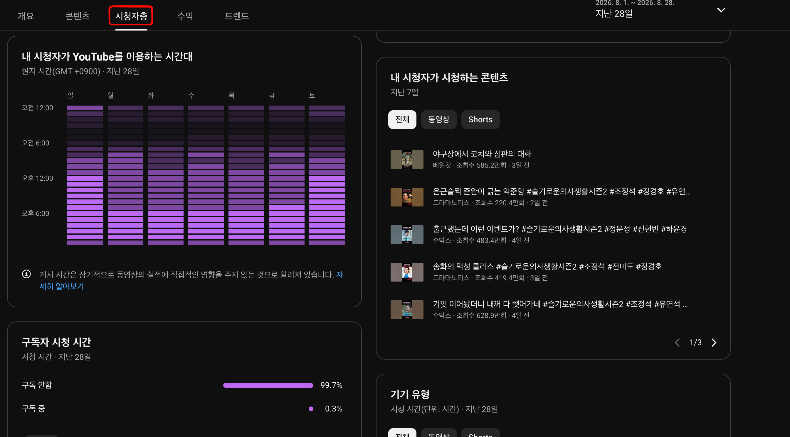

## 저녁 8시 업로드가 정답이 아닌 이유

유튜브 쇼츠를 운영하는 크리에이터들 사이에서 가장 자주 나오는 질문 중 하나가 바로 "몇 시에 올려야 하나요?"입니다.
SNS 마케팅 가이드북에는 "저녁 7~9시가 황금 시간대"라는 공식이 자주 등장합니다.
하지만 이 공식이 쇼츠에도 동일하게 적용되는지에 대해서는 면밀한 검토가 필요합니다.

1MIN DRAMA(@onemindrama) 채널을 운영하며 60편 이상의 쇼츠를 시간대별로 테스트한 결과, 이 공식이 맞는 경우도 있지만 틀리는 경우가 더 많았습니다. 업로드 시간보다 훨씬 결정적인 변수들이 존재했고, 그 변수들을 어떻게 읽어내느냐가 초기 조회수와 알고리즘 배포 규모를 가르는 핵심이었습니다.

일반적인 유튜브 긴 영상(Long-form)과 달리, 쇼츠는 피드 기반의 자동 추천 방식으로 배포됩니다.
따라서 업로드 시점의 초기 반응 속도가 알고리즘의 추천 확산 여부에 직접적인 영향을 미칩니다.
같은 영상이라도 **시청자가 많이 활성화된 시간대에 업로드**할수록 초기 반응 지표가 빠르게 쌓이고, 알고리즘이 더 많은 사람에게 배포하는 선순환이 일어납니다.

## 쇼츠 피드 배포의 3단계 구조

업로드 타이밍이 왜 중요한지를 제대로 이해하려면, 먼저 유튜브가 새로운 쇼츠를 어떻게 배포하는지를 알아야 합니다.

[YouTube for Creators 공식 문서](https://www.youtube.com/creators)와 크리에이터 커뮤니티에서 반복적으로 확인된 패턴에 따르면, 새로 업로드된 쇼츠는 다음 3단계를 거칩니다.

첫 번째 단계는 소규모 테스트 배포입니다. 업로드 직후 유튜브는 소수의 시청자 그룹(보통 수천 명 수준)에게 영상을 노출합니다. 이 테스트 그룹의 시청 완주율(AVD)과 스와이프 이탈률이 알고리즘의 1차 품질 판정 기준이 됩니다.

두 번째 단계는 확장 배포 여부 결정입니다. 1차 테스트에서 시청 완주율 60% 이상(스와이프 이탈률 40% 미만)을 충족하면, 알고리즘은 더 큰 규모의 시청자 그룹으로 배포를 확대합니다. 이 확장 배포가 시작되는 시점이 중요합니다. 피크 타임에 맞물리면 순식간에 수만 건의 추가 노출이 발생합니다.

세 번째 단계는 지속 배포입니다. 영상 품질이 지속적으로 확인되면 이후 수일에서 수주에 걸쳐 추가 배포가 이어집니다. 쇼츠 알고리즘은 업로드 후 2~3일이 지난 영상에도 폭발적인 조회수를 부여하는 경우가 있습니다.

## 채널 스튜디오 히트맵으로 내 시청자 피크타임 찾기

"몇 시가 황금 시간대냐"는 질문에 대한 가장 정직한 답은 "채널마다 다르다"입니다. 드라마 스토리 클립을 주로 올리는 1MIN DRAMA와 재테크 정보를 다루는 채널의 시청자층은 생활 패턴이 완전히 다릅니다.

유튜브 스튜디오에는 이 문제를 정확하게 해결해주는 데이터가 존재합니다.

위 화면은 실제 1MIN DRAMA(@onemindrama) 채널 스튜디오의 **'시청자층'** 분석 대시보드 스크린샷입니다.

* **요일별/시간대별 활성 히트맵**: 월요일부터 일요일까지, 오후 12시(점심)와 저녁 6시~10시(퇴근 후) 구간에 보라색 타일이 가장 짙게 집중되어 있습니다. 특히 금요일과 일요일 저녁에 피크 트래픽이 형성되는 것을 확인할 수 있습니다.
* **구독자 시청 시간의 극단적 비율**: 하단 '구독자 시청 시간' 지표를 보면 **'구독 안 함 99.7%'**, **'구독 중 0.3%'**라는 압도적인 수치가 나타납니다. 이는 쇼츠 채널의 트래픽 99% 이상이 기존 구독자가 아닌, 알고리즘이 실시간으로 공급하는 탐색 피드에서 발생한다는 결정적 증거입니다.

**채널 스튜디오 히트맵 조회 방법**

1. [YouTube Studio](https://studio.youtube.com) 접속
2. 좌측 메뉴 [분석] 클릭
3. 상단 탭에서 [시청자층] 선택
4. "내 시청자가 YouTube를 이용하는 시간대" 히트맵 확인

이 히트맵은 내 채널의 잠재 시청자들이 유튜브에 접속해 있는 시간대를 28일 기준으로 색상 농도로 시각화합니다. 보라색이 가장 짙은 구간이 내 시청자들이 가장 많이 활성화된 피크 타임입니다. 인터넷에 떠도는 불특정 평균값 대신, 내 채널의 실제 데이터이기 때문에 이것이 가장 신뢰할 수 있는 타이밍 지표입니다.

> 핵심 원칙: 업계 평균 황금 시간대가 아닌, 내 채널의 시청자가 언제 가장 활성화되어 있는지를 채널 스튜디오 데이터로 직접 확인하는 것이 가장 정확합니다.

## 1MIN DRAMA 채널 운영에서 검증된 타이밍 전략

1MIN DRAMA 채널 운영 경험에서 도출된 업로드 타이밍 원칙은 다음과 같습니다.

**피크 타임 1~2시간 전 업로드**

히트맵에서 확인된 가장 짙은 시간대보다 1~2시간 먼저 업로드합니다. 예를 들어 시청자 피크가 저녁 8시라면, 오후 6~7시에 업로드합니다. 업로드 직후 유튜브가 초기 품질 평가를 위해 소수의 사용자에게 먼저 배포하는 단계가 있는데, 이 평가가 완료되어 본격적인 추천이 시작될 즈음에 시청자 피크 타임과 맞물리게 하는 전략입니다.

이 방법을 적용한 후 동일 품질의 영상 대비 초기 24시간 내 조회수가 평균 1.3~1.5배 증가하는 효과를 경험했습니다. 단, 이 수치는 영상 완주율과 오프닝 훅의 품질에 따라 편차가 크게 발생합니다.

**요일별 접근 차별화**

일요일과 월요일은 국내 유튜브 전체 트래픽이 주중 대비 높은 날로 알려져 있습니다. 경쟁 채널들도 이 시간대에 집중 업로드하는 경향이 있어 경쟁이 치열하지만, 알고리즘에 의해 배포되는 절대 규모도 크기 때문에 완성도가 높은 영상을 업로드하기에 적합합니다. 화요일~목요일은 경쟁이 상대적으로 낮아 실험적인 포맷이나 신규 시리즈를 테스트하기에 유리합니다.

## 시간대보다 중요한 두 가지 변수

업로드 타이밍을 최적화하는 것은 분명히 효과가 있습니다. 하지만 현장에서 60편 이상의 영상을 올리며 깨달은 것은, 시간대보다 훨씬 더 결정적인 변수가 두 개 있다는 사실입니다.

**초기 3초의 오프닝 훅 품질**이 핵심입니다. 피크 타임에 올렸더라도 오프닝 훅이 약하면 알고리즘이 1단계 배포 이후 확장을 멈춥니다. 1MIN DRAMA 채널의 실측 데이터에서, 동일한 피크 타임에 올린 영상들 중 오프닝 훅이 강한 영상(스와이프 이탈률 30% 미만)은 약한 영상(55% 이상)에 비해 최종 조회수가 최대 8배 이상 차이를 보였습니다.

**업로드 주기의 일관성** 역시 빠질 수 없습니다. 알고리즘은 특정 시간대에만 활성화되는 채널보다 일관된 주기로 업로드하는 채널에 더 높은 신뢰도를 부여한다는 것이 크리에이터 커뮤니티에서 반복적으로 보고되고 있습니다. 최적 시간대를 지키되, 업로드 주기의 규칙성이 더 중요합니다. [YouTube Help Center](https://support.google.com/youtube/answer/6167546)에서도 일관된 업로드 일정의 중요성을 명시하고 있습니다.

## 타이밍 최적화 실전 체크리스트

업로드 전에 확인해야 할 순서를 정리하면 다음과 같습니다.

| 순서 | 확인 항목 | 방법 |
|------|-----------|------|
| 1 | 내 채널 시청자 피크 타임 확인 | YouTube Studio > 분석 > 시청자 > 히트맵 |
| 2 | 피크 타임 1~2시간 전 업로드 예약 | YouTube Studio 예약 업로드 기능 활용 |
| 3 | 오프닝 3초 훅 최종 검토 | 직접 쇼츠 피드에서 스와이프 시뮬레이션 |
| 4 | 업로드 후 첫 3시간 스와이프 이탈률 모니터링 | Studio > 콘텐츠 > 해당 영상 > 분석 |
| 5 | 이탈률 50% 초과 시 제목/설명 즉시 수정 | A/B 테스트 개념으로 반복 |

## 결국 시간대보다 중요한 건 이것

쇼츠 업로드 최적 시간대는 채널마다 다르며, '일반적인 황금 시간대'를 맹목적으로 따르는 것보다 채널 스튜디오 히트맵을 기반으로 개인화된 최적 타이밍을 찾는 것이 훨씬 효과적입니다.
피크 타임 1~2시간 전 업로드 전략과, 일관된 업로드 주기 유지를 동시에 실천하는 것이 현재까지 확인된 가장 효과적인 접근법입니다.

다만 이 모든 타이밍 최적화는 오프닝 훅이 탄탄한 영상을 전제로 합니다. 좋은 영상에 좋은 타이밍이 더해질 때 시너지가 발생하는 것이지, 타이밍만으로 약한 콘텐츠를 구해낼 수는 없다는 것이 1MIN DRAMA 채널에서 일관되게 관찰된 결론입니다.

---

**참고 자료:**
- [YouTube Studio 시청자 분석 공식 도움말](https://support.google.com/youtube/answer/6167546)
- [YouTube Creators — 쇼츠 업로드 가이드](https://www.youtube.com/creators)
- [Think with Google — 모바일 영상 소비 패턴 분석](https://www.thinkwithgoogle.com/marketing-strategies/video/youtube-shorts-strategy/)
