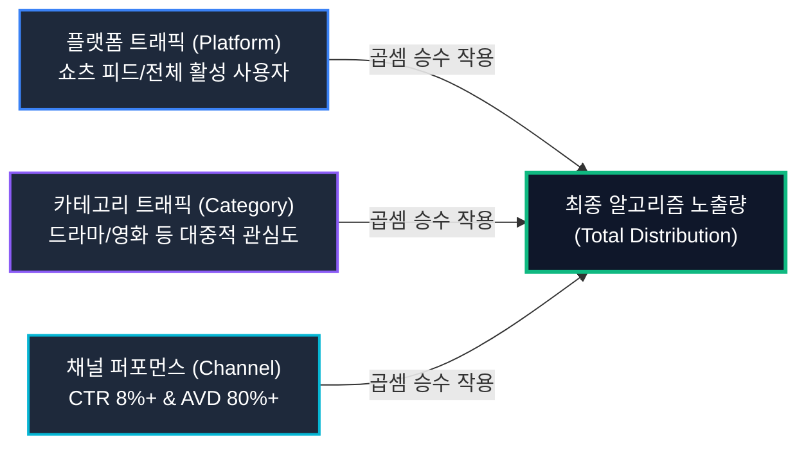
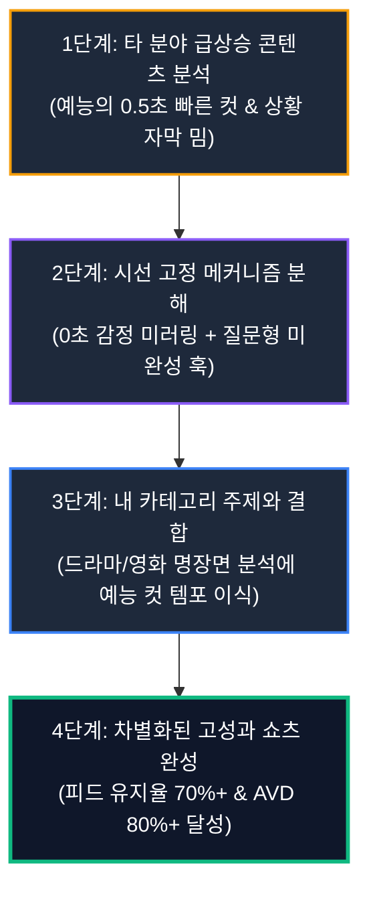

## 노력보다 중요한 것은 파도의 크기

유튜브 채널을 운영하는 많은 크리에이터들이 조회수가 정체될 때마다 편집 기술, 썸네일 색상, 자막 폰트와 같은 지엽적인 요소에서 원인을 찾으려 합니다.  
하지만 거시 시장 전체가 하락세일 때 개별 기업이 주가를 방어하기 어렵듯이, 유튜브 채널의 성과 역시 개별 크리에이터의 순수한 제작 역량만으로 결정되지 않습니다.  
성과는 플랫폼의 흐름과 카테고리의 트렌드라는 거대한 외부 변동성과 채널의 내부 역량이 맞물리는 접점에서 발생합니다.  

서핑에 비유하자면 플랫폼과 카테고리는 바다의 **파도(Wave)**이고, 크리에이터의 제작 능력은 **서핑 실력(Skill)**에 해당합니다.  
세계 최고의 서퍼라 할지라도 파도가 치지 않는 잔잔한 호수에서는 서핑보드를 타고 나아갈 수 없습니다. 반대로 파도가 집채만 하게 일어나는 바다에서는 다소 서툰 서퍼라 할지라도 파도의 추진력을 받아 먼 거리까지 미끄러져 나아갈 수 있습니다.  

1MIN DRAMA(@onemindrama) 채널을 운영하면서도 뼈저리게 체감한 사실은, 아무리 밤을 새워 정교하게 컷을 쪼갠 영상이라도 대중의 관심이 식은 카테고리에서는 알고리즘의 선택을 받기 어렵다는 점이었습니다. 지속 가능한 가파른 성장을 만들어내기 위해서는 맹목적인 노동 투입을 멈추고, 현재 내가 위치한 바다에 파도가 치고 있는지 구조적으로 분석하는 안목이 선행되어야 합니다.

## 알고리즘을 지배하는 성장의 3대 변동성 요인

유튜브 채널이 마주하는 트래픽은 독립된 단일 변수가 아니라 3가지 핵심 요소의 **곱셈(Multiplication)** 공식으로 작동합니다.  
플랫폼 트래픽, 카테고리 트래픽, 그리고 채널 퍼포먼스가 곱해져 최종적인 노출량과 조회수가 결정됩니다. 이 중 크리에이터가 직접 통제할 수 있는 영역과 통제할 수 없는 환경적 요인을 명확히 구분하여 바라보는 것이 전략의 출발점입니다.

| 구분 | 정의 | 통제 가능 여부 | 핵심 대응 전략 |
|---|---|---|---|
| **플랫폼 트래픽 (Platform)** | 유튜브, 숏폼 피드 전체의 활성 이용자 수 및 체류 시간 | 통제 불가 (외부 환경) | 유튜브 쇼츠 알고리즘 우선 배포 및 글로벌 뷰 확장 |
| **카테고리 트래픽 (Category)** | 특정 주제(영화/드라마, 예능, AI 등)에 대한 대중적 관심도 | 통제 불가 (위치 선정 가능) | 상승기 카테고리 진입 및 신작 런칭 트렌드 믹스 |
| **채널 퍼포먼스 (Channel)** | 동일 카테고리 내에서 발휘되는 클릭률(CTR), 시청 지속 시간(AVD) | 통제 가능 (실행 영역) | 0초 오프닝 훅, 0.1초 썸네일 지정, 구조 전이 프레임워크 적용 |

**플랫폼 트래픽(Platform Traffic)**은 유튜브라는 생태계 자체의 볼륨입니다. 롱폼에서 숏폼으로 플랫폼의 중심축이 이동하는 시기에 숏폼을 적극 도입한 채널들이 가파른 상승세를 탄 것이 대표적인 사례입니다. [YouTube 공식 크리에이터 가이드](https://support.google.com/youtube/answer/10059070)에서도 밝혔듯, 추천 시스템은 시청자들의 실시간 소비 패턴 변화에 즉각적으로 반응하여 트래픽 풀을 재배치합니다.

**카테고리 트래픽(Category Traffic)**은 대중의 관심이 특정 주제로 쏠리는 파도입니다. OTT 신작 드라마가 공개되거나 화제의 영화가 천만 관객을 돌파할 때, 관련 쇼츠 영상들이 일제히 알고리즘 피드를 장악하는 현상입니다. [Think with Google 트렌드 분석 보고서](https://www.thinkwithgoogle.com/)에 따르면, 대중의 검색량과 소비량이 급증하는 카테고리 파도에 올라탈 때 동일한 제작 리소스로도 수 배 이상의 오가닉 노출을 확보할 수 있습니다.

**채널 퍼포먼스(Channel Performance)**는 크리에이터가 오롯이 통제할 수 있는 실행 영역입니다. 썸네일 클릭률(CTR), 3초 피드 유지율, 평균 시청 지속 시간(AVD), 그리고 영상 전반의 몰입감이 여기에 해당합니다. 앞선 두 가지 파도가 준비되었을 때 비로소 이 채널 퍼포먼스가 결합되어 가파른 도약이 완성됩니다.

## 검증된 공식을 복제하는 구조 전이 전략

빠른 성장을 달성하는 크리에이터들은 콘텐츠를 기획할 때 **주제(Subject)**와 **구조(Structure)**를 분리하여 생각합니다.  
주제는 드라마, 영화, 게임, 요리 등 '무엇을 다루는가'에 관한 내용이고, 구조는 '어떤 템포와 연출 문법으로 전달하는가'에 관한 형식입니다.

완전히 새로운 전달 방식을 맨땅에서 발명하려 애쓰기보다는, 이미 다른 시장에서 검증된 성공 공식을 자신의 분야로 옮겨오는 **구조 전이(Structure Transfer)** 방식이 훨씬 높은 성공 확률을 보장합니다.

게임이나 예능 카테고리는 유튜브 생태계에서 가장 치열한 경쟁이 벌어지는 격전지이며, 그만큼 시청자의 주의를 끄는 도파민 중심의 연출 문법이 극한으로 고도화되어 있습니다.  
1MIN DRAMA 채널에서도 진지한 정통 드라마 리뷰 문법 대신, 예능 프로그램 특유의 빠른 컷 전환과 상황 요약 자막(예: "극한 직업 크루즈 승무원ㅋㅋㅋ")을 결합했을 때 피드 유지율이 71.2%까지 수직 상승하는 결과를 실측했습니다.

내용의 깊이는 유지하되 전달의 그릇을 트렌디한 문법으로 갈아 끼우는 번역가의 역할을 자처하는 것, 이것이 바로 상위 1% 크리에이터들이 알고리즘을 뚫어내는 본질적인 메커니즘입니다.

## 데이터 기반 실행: 파도를 예측하고 파도를 타는 법

결국 유튜브에서의 성공은 운에 기대는 막연한 시도가 아니라, 체계적인 확률 게임입니다. 성장하는 플랫폼 위에 올라타고, 상승하는 카테고리 트래픽에 노출되며, 다른 분야에서 검증된 세련된 구조를 차용하여 나만의 가치를 채워 넣는 것이 성장 공식의 요체입니다.

[Google 검색 센터 크리에이터 가이드라인](https://developers.google.com/search/docs/fundamentals/creating-helpful-content)에서도 강조하듯, 독창적인 인사이트와 검증된 전달 구조가 결합된 콘텐츠만이 알고리즘과 검색 엔진 모두에서 장기적인 신뢰를 얻습니다. 시장의 파도가 어디로 흐르는지 데이터를 먼저 확인하고, 검증된 구조를 내 채널에 이식하여 지속 가능한 성장의 궤도에 올라서시길 권합니다.
