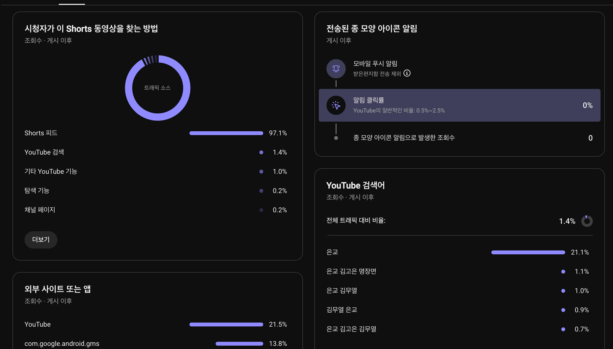
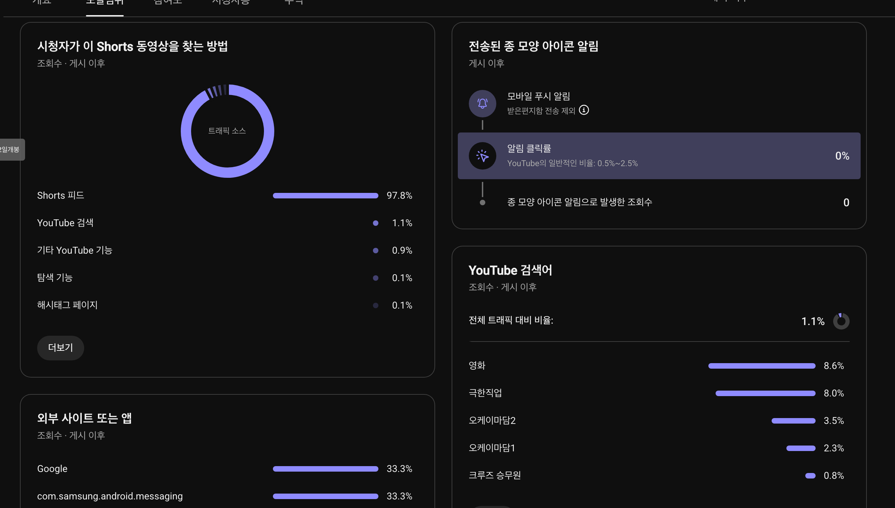
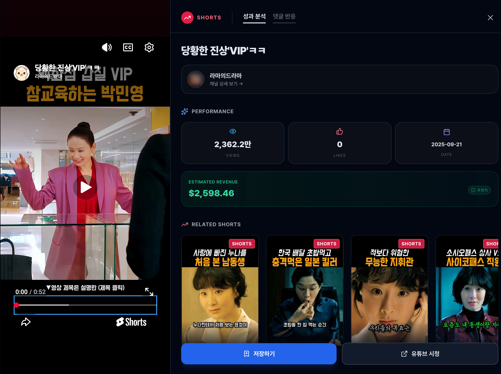

## 제목에 키워드를 넣을수록 클릭률이 떨어지는 이유

쇼츠를 만들 때 누구나 비슷한 고민을 합니다. 피드에서 스크롤을 멈추게 하려면 직관적이고 자극적인 상황 묘사가 필요한데, 그렇게 쓰다 보면 검색 유입을 위한 '작품명'이나 '인물명' 같은 핵심 키워드가 빠지게 됩니다. 반대로 검색어에 맞춰 정직하게 제목을 지으면 피드에서 지나치게 밋밋해져 초기 클릭률이 바닥을 칩니다.

실제로 제가 운영하는 1MIN DRAMA 채널과 루멘 인사이트 분석 데이터를 들여다보면 흥미로운 공통점이 있습니다. **피드에서 수백만 뷰가 터진 쇼츠일수록, 제목과 실제 유입되는 검색 키워드가 전혀 딴판인 경우가 많습니다.**

처음에는 검색 최적화(SEO)가 빗나간 것 아닌가 생각하기 쉽지만, 이는 쇼츠 알고리즘의 작동 방식을 제대로 활용한 결과입니다. 피드 추천과 검색 유입을 동시에 챙기는 구조가 어떻게 만들어지는지 제 유튜브 스튜디오 데이터로 직접 살펴보겠습니다.

## 제목에 '은교'를 한 글자도 안 썼는데 검색 1위로 잡힌 까닭

1MIN DRAMA에 올렸던 영화 리뷰 쇼츠 중 *"나화진에겐 너무 어려운 시적 감각ㅋㅋㅋ"*이라는 영상이 있습니다.

제목만 보면 어떤 영화인지 전혀 알 수 없습니다. 오직 영상 속 캐릭터의 웃긴 상황에만 집중해서 제목을 붙였습니다. 그런데 이 영상의 유튜브 스튜디오 도달범위 탭을 열어보고 깜짝 놀랐습니다.

데이터가 보여주는 결과는 명확했습니다.
* **전체 트래픽의 97.1%는 쇼츠 피드**에서 발생했습니다. 상황 중심의 제목이 시청자의 스크롤을 멈추는 역할을 제대로 해낸 것입니다.
* **놀랍게도 검색어 1위는 21.1%의 비중을 차지한 '은교'**였습니다. 이어서 '은교 김고은 명장면', '은교 김무열' 같은 원작 관련 키워드들이 줄줄이 뒤를 이었습니다.

제목에 영화 이름을 단 한 자도 넣지 않았음에도 이런 검색 유입이 가능한 이유는, 유튜브 알고리즘이 영상의 음성과 자막, 그리고 뒤에 붙은 해시태그를 통해 이미 이 영상이 어떤 작품을 다루고 있는지 스스로 이해하고 색인(Indexing)하기 때문입니다. 

즉, 굳이 피드 클릭률을 깎아먹으면서까지 제목 앞부분에 딱딱한 고유명사를 채워 넣을 필요가 없다는 뜻입니다.

## 상황 설명은 제목 앞에, 고유명사는 해시태그 뒤로 넘기는 분리법

그렇다면 피드 클릭과 검색 유입을 둘 다 잡으려면 제목을 어떻게 구성해야 할까요? 제가 다음으로 시도했던 *"극한 직업 크루즈 승무원ㅋㅋㅋ #오케이마담2 #영화 #8월12개봉"* 영상의 데이터를 보면 그 답이 명확해집니다.

이 영상의 검색어 유입 결과를 살펴보면 매우 전략적인 분산이 일어난 것을 볼 수 있습니다:
* **'영화' (8.6%)**: 가장 대중적이고 포괄적인 탐색 키워드가 잡혔습니다.
* **'극한직업' (8.0%)**: 제목 앞부분에 배치한 공감형 밈 키워드를 통해 대규모 트래픽이 유입되었습니다.
* **'오케이마담2' (3.5%), '오케이마담1' (2.3%)**: 제목 맨 뒤 해시태그에 넣어둔 실제 작품명이 검색 엔진에 정확히 걸려들었습니다.

| 위치 | 실제 텍스트 | 역할 및 노림수 |
|---|---|---|
| 제목 앞단 (1~15자) | "극한 직업 크루즈 승무원ㅋㅋㅋ" | 피드에서 3초 안에 눈길을 사로잡고 상황에 공감하게 만듦 |
| 제목 뒷단 해시태그 | "#오케이마담2 #영화" | 유튜브 검색 알고리즘에 영상의 정확한 주제 및 원작명 전달 |
| 추가 해시태그 | "#8월12개봉" | 개봉 시기에 맞춘 실시간 시의성 탐색 트래픽 확보 |

제목 앞부분은 사람이 읽고 반응하는 '심리적 후킹'에 집중시키고, 검색 엔진이 읽어야 할 고유명사는 뒷부분의 '해시태그'로 완전히 분리해 넘겨주는 방식입니다.

## 2,300만 뷰 대박 쇼츠인데 좋아요가 0개로 잡힌 이유

타 채널의 대형 쇼츠들을 모니터링할 때도 이와 비슷한 원리가 발견됩니다. 숏폼 분석 중 레퍼런스 영상(*"당황한 진상'VIP'ㅋㅋ"*, 라마의드라마)에서 흥미로운 지표 패턴을 관찰했습니다.

무려 **2,362.2만 뷰**에 달하는 초대형 영상인데, 시스템에서 수집된 **좋아요(LIKES) 숫자는 0**으로 찍혀 있습니다. 

이는 크리에이터가 좋아요 표시를 비공개로 설정하여 유튜브 Data API에서 값이 비어 온 것이지만, 쇼츠를 만드는 사람 입장에서 곱씹어볼 만한 본질을 담고 있습니다:

* **알고리즘을 움직이는 건 겉보기 숫자가 아닙니다**: 2,300만 명을 끌어모은 힘은 좋아요 수가 아니라, 영상 첫 머리의 *"VIP 참교육"* 자막과 제목이 만든 긴장감 넘치는 상황 구도였습니다.
* **쇼츠 조회수의 특성**: 쇼츠는 재생되는 순간부터 바로 카운트가 올라가기 때문에, 결국 시작 3초 동안 시청자를 붙잡아두는 제목과 화면의 정합성이 배포량을 결정짓는 가장 결정적인 요소입니다.

## 피드 클릭률과 검색 롱테일을 모두 챙기는 제목 작성법

실제 스튜디오 운영과 수많은 레퍼런스 분석을 거치며 정리한 쇼츠 제목 작성 요령은 다음과 같습니다.

1. **앞 15자에는 감정과 상황만 담기**: 설명을 포기하고, 시청자가 머릿속으로 장면을 상상할 수 있는 단어(진상, 멘붕, 대참사, 실수 등)를 먼저 던집니다.
2. **작품명과 브랜드는 해시태그로 빼기**: 검색 유입에 필요한 고유명사는 제목 뒤편 해시태그(#)에 넣어 피드에서의 가독성을 해치지 않도록 합니다.
3. **자막과 제목의 역할 분담**: 영상 속 첫 자막과 제목이 똑같은 말을 반복하지 않고, 서로 다른 호기심을 자극하도록 배치합니다.
4. **잘 만든 레퍼런스 뜯어보기**: 수천만 뷰를 기록한 영상들의 제목 문장 구조와 실제 유입 검색어의 상관관계를 주기적으로 관찰하고 내 채널에 맞춰 변형해 봅니다.

---

**참고 자료:**
- [YouTube Creators — 영상 제목 및 설명 최적화 가이드](https://www.youtube.com/creators)
- [Google 검색 센터 — 효과적인 제목 링크 작성 권장사항](https://developers.google.com/search/docs/appearance/title-link?hl=ko)
- [Think with Google — 모바일 시청자의 콘텐츠 탐색 행동 연구](https://www.thinkwithgoogle.com/marketing-strategies/video/youtube-shorts-strategy/)
