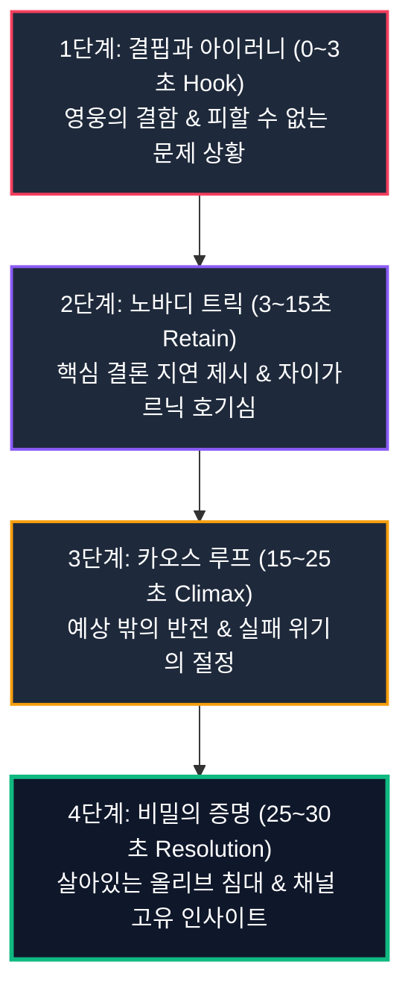
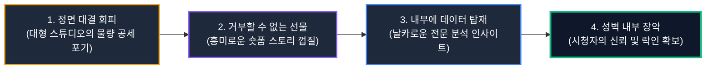

## 3,000년 동안 살아남은 불패의 스토리텔링 문법

유튜브 플랫폼에서 영상의 흥행을 좌우하는 가장 결정적인 지표는 클릭률(CTR)과 함께 **평균 시청 지속 시간(AVD, Average View Duration)**입니다.  
시청자가 첫 3초를 넘겨 영상의 끝까지 이탈하지 않고 머물게 만드는 힘은 화려한 3D 그래픽이나 고가의 촬영 장비에서 나오지 않습니다. 인간의 뇌가 본능적으로 반응하도록 설계된 **서사 구조(Narrative Structure)**가 영상의 뼈대를 지탱하고 있어야 합니다.

서양 문학의 양대 기둥 중 하나이자 현대 모든 모험담의 원형으로 꼽히는 호메로스의 대서사시 **오디세이아(Odyssey)**는 무려 3,000년 가까운 세월 동안 인간을 매료시켜 온 이야기의 정점입니다.  
크리스토퍼 놀란의 영화, 스타워즈, 해리 포터부터 수백만 뷰를 기록하는 유튜브 다큐멘터리와 숏폼 드라마에 이르기까지, 대중의 시선을 사로잡는 모든 콘텐츠는 오디세우스의 여정에서 완성된 서사 문법을 충실히 따르고 있습니다. 고전의 지혜를 현대 유튜브 영상 기획에 접목하면 시청자의 이탈을 방어하는 완벽한 락인(Lock-in) 구조를 완성할 수 있습니다.

## 시청자를 몰입시키는 오디세우스 서사 4단계 프레임워크

오디세우스의 영웅담은 완벽한 초인이 등장하여 모든 적을 무찌르는 단순한 액션물이 아닙니다. 끊임없는 결핍, 인간적인 실수, 그리고 절체절명의 위기를 지략으로 돌파하는 정교한 심리적 장치들로 가득 차 있습니다.  
이 3,000년 된 고전의 전개 방식을 유튜브 쇼츠의 30초~60초 타임라인에 맞추어 4단계 프레임워크로 재구성할 수 있습니다.

| 서사 단계 | 오디세이아의 핵심 원리 | 유튜브 영상 기획 적용법 | 기대 효과 |
|---|---|---|---|
| **1단계: 결핍과 아이러니 (Hook)** | 영웅의 징집과 피할 수 없는 맹세 | 완벽하지 않은 상태와 시청자의 결핍 공감 제시 | 초반 3초 내 스와이프 이탈 방지 (유지율 70%+) |
| **2단계: 노바디(Nobody) 트릭** | 거인을 속이는 정체 숨기기와 정보 지연 | 핵심 결론을 숨긴 채 궁금증을 증폭시키는 자이가르닉 연출 | 1차 이탈 구간(10초 지점) 락인 |
| **3단계: 카오스 루프 (Climax)** | 세이렌의 유혹과 자만의 대가 | 예상치 못한 반전과 갈등의 폭발 | 중반부 시청 유지율(AVD) 및 완주율 견인 |
| **4단계: 비밀의 증명 (Resolution)** | 올리브 침대 비밀과 궁극적 귀환 | 채널 고유의 독창적 해결책과 반전 결말 | 완주율 80%+ 달성 및 루프 재시청 유도 |

**결핍과 아이러니의 도입부(The Irony Hook)**는 완벽하지 않은 결함에서 출발합니다.  
오디세우스는 전쟁 영웅이 되기 위해 기쁘게 출전한 것이 아니라, 갓 태어난 아들과 떨어지기 싫어 미친 척을 하다가 억지로 끌려가는 지극히 인간적인 인물입니다.  
유튜브 영상에서도 "저는 이렇게 완벽하게 성공했습니다"라는 거만한 도입부보다, "저 역시 이 치명적인 실수로 채널이 정체될 뻔했습니다"라는 결핍과 공감의 훅이 시청자의 방어 기제를 무너뜨립니다.

**노바디(Nobody) 트릭을 통한 정보의 지연 제시**는 인지적 호기심을 극대화합니다.  
외눈박이 거인 폴리페모스에게 붙잡힌 오디세우스가 자신의 이름을 '아무도 아님(Nobody)'이라 속여 위기를 모면했듯이, 영상 초반에 모든 해답을 다 보여주지 않고 핵심 단서를 단계적으로 배치해야 합니다. [Think with Google 스토리텔링 연구](https://www.thinkwithgoogle.com/)에 따르면, 질문을 먼저 던지고 결론을 지연시키는 자이가르닉 연출은 시청자의 체류 시간을 평균 40% 이상 연장시킵니다.

**시련과 인과의 순환(Chaos Loop)**으로 중반부의 지루함을 분쇄합니다.  
탈출에 성공한 직후 자만심에 빠져 자신의 본명을 외쳤다가 10년의 방랑이라는 가혹한 대가를 치르는 오디세우스의 이야기는 영상에 강력한 긴장감을 부여합니다. 순탄한 성공기 나열을 피하고, 뼈아픈 실패와 예상 밖의 장애물을 극복하는 과정을 보여줄 때 시청자는 스와이프를 멈추고 끝까지 집중하게 됩니다.

**고유한 비밀의 증명(The Secret Proof)**으로 신뢰를 완성합니다.  
20년 만에 돌아온 남편을 시험하기 위해 부부만이 알고 있는 '살아있는 올리브 나무 침대'의 비밀을 묻는 페넬로페의 시험처럼, 영상의 마지막에는 오직 이 채널에서만 얻을 수 있는 진정성 있는 독창적 결론이 제시되어야 합니다.

## 무력보다 강한 지략: 1인 크리에이터의 트로이 목마 전략

오디세우스가 다스리던 이타카는 그리스 세계에서 손꼽히는 약소국이었습니다. 아킬레우스처럼 타고난 무력이 압도적이지도 않았고, 아가멤논처럼 막강한 군대를 거느리지도 못했습니다.  
하지만 10년 동안 뚫리지 않던 트로이의 철옹성을 무너뜨린 것은 아킬레우스의 창이 아니라 오디세우스의 **'트로이 목마'**라는 정교한 지략이었습니다.

이는 거대한 자본과 전문 인력을 투입하는 대형 엔터테인먼트 스튜디오 사이에서 생존해야 하는 1인 크리에이터와 솔로 창업가에게 매우 중요한 시사점을 던집니다.  
단순한 물량 공세나 자본력으로 대기업 채널과 정면 승부를 벌이는 것은 패배로 가는 지름길입니다. 오디세우스처럼 **눈치와 임기응변, 그리고 데이터에 기반한 정밀한 타겟팅(Niche Strategy)**으로 대형 플레이어들이 미처 보지 못하는 틈새를 공략해야 합니다.

1MIN DRAMA 채널에서도 대형 방송사의 클립과 맞붙을 때 동일한 풀버전 요약 대신, 인물의 감정 갈등 찰나를 33초로 압축하고 0초에 질문을 던지는 방식으로 76.8만 뷰와 71.2% 시청 지속 시간을 달성할 수 있었습니다.

## 데이터로 검증하는 완성도 높은 서사 아키텍처

결국 위대한 서사는 감에만 의존하는 영감이 아니라, 시청자의 심리적 호흡을 철저히 계산한 구조적 설계도 위에서 탄생합니다.  
영상의 어느 지점에서 시청자가 호기심을 느끼고, 어느 구간에서 지루함을 느껴 이탈하는지 스튜디오 데이터로 정확히 추적해야만 서사의 약점을 보완할 수 있습니다.

[YouTube 크리에이터 공식 아카데미](https://support.google.com/youtube/answer/10059070) 및 [Google 검색 센터 도움말](https://developers.google.com/search/docs/fundamentals/creating-helpful-content)에서도 언급하듯, 시작 3초의 훅과 후반부 해결책의 일치성은 이탈률 방어와 시청 만족도 평가의 핵심 기준입니다. 3,000년을 관통해 온 고전의 서사 공식과 현대의 정밀한 데이터 분석을 결합하여, 시청자를 끝까지 사로잡는 콘텐츠 구조를 설계해 보시길 바랍니다.
