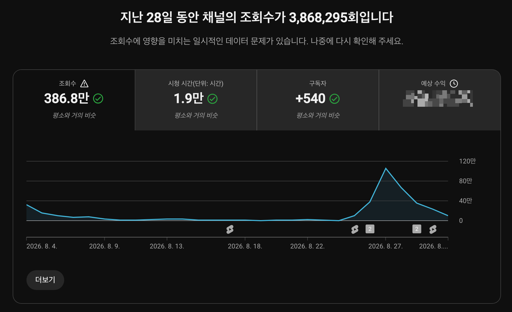
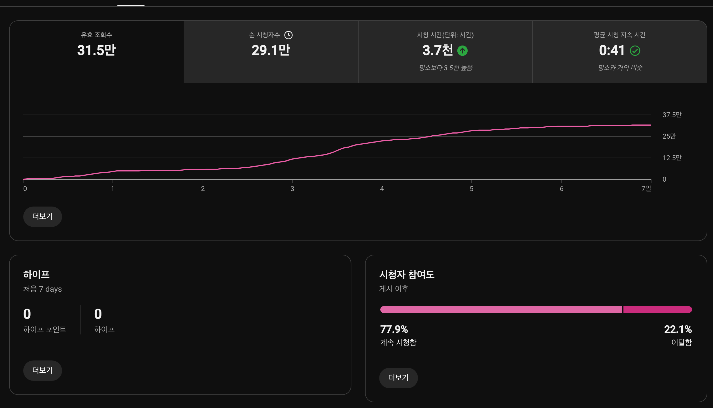
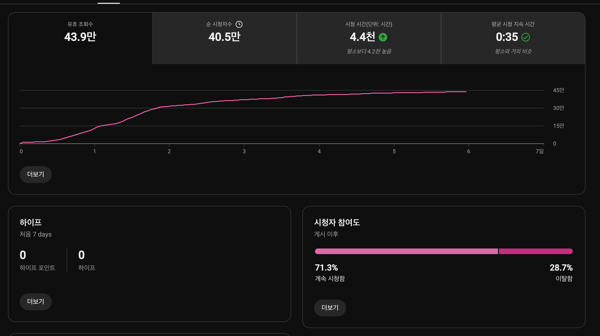
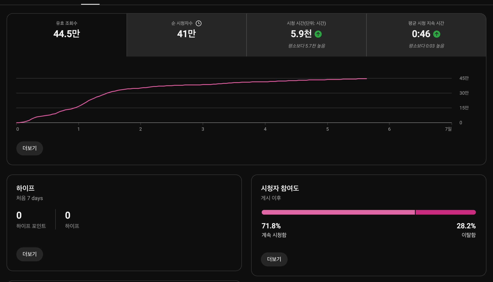
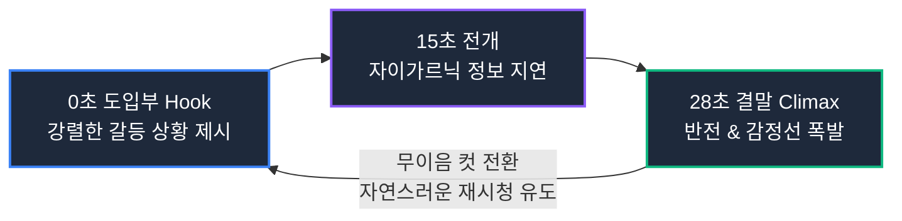
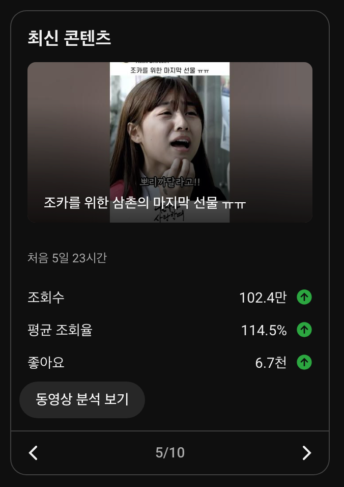
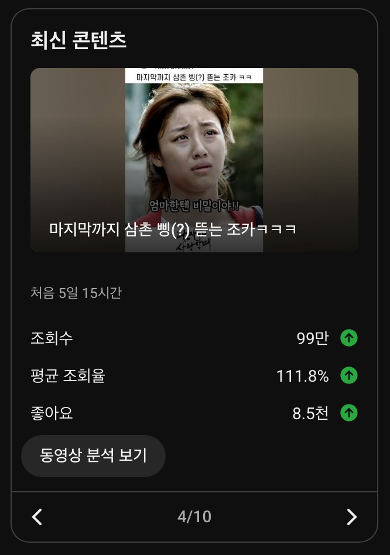
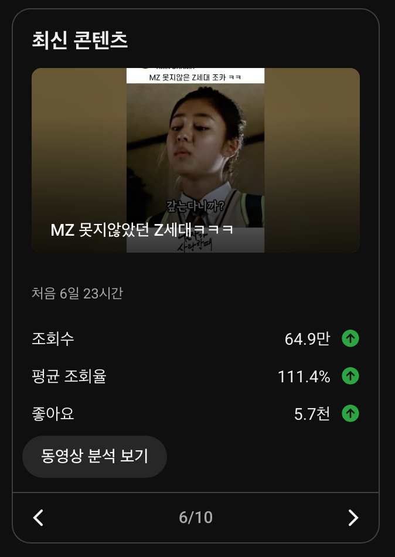

유튜브 채널을 직접 운영하는 크리에이터라면 누구나 한 번쯤 업로드를 며칠 쉬었더니 채널이 완전히 죽어버린 것은 아닐까 하는 깊은 불안감에 휩싸이곤 합니다. 실제로 유튜브 플랫폼에서는 업로드 주기가 불규칙해지거나 수 주간 공백이 발생하면 일일 조회수와 알고리즘 추천 빈도가 바닥으로 곤두박질치는 현상이 자주 발생합니다.

하지만 알고리즘의 본질을 데이터로 추적해 보면 죽어버린 채널이라는 개념은 존재하지 않습니다. 유튜브 추천 시스템은 과거의 업로드 공백이라는 채널 단위의 과거 이력보다, 새로 올라온 단 한 편의 영상이 현재 시청자들에게 만들어내는 초반 3초 잔존율과 평균 시청 지속 시간(AVD)이라는 정량적 지표에 즉각적으로 반응하기 때문입니다.

공식 채널 1MIN DRAMA(@onemindrama)에서 약 3주간의 업로드 중단으로 일일 조회수가 0에 가깝게 정체되었던 상태에서, 연속으로 발행한 3개의 쇼츠 콘텐츠만으로 28일 누적 386만 뷰(3,868,295회)를 달성하며 완벽한 V자 급반등을 이뤄낸 실제 유튜브 스튜디오 데이터를 공개하고 그 핵심 구조를 분석합니다.

---

## 3주간의 공백과 극적인 V자 반등 그래프

아래 대시보드는 1MIN DRAMA 채널의 최근 28일간 전체 채널 통계 지표입니다.

그래프의 흐름을 살펴보면 8월 초부터 8월 22일까지 약 3주 동안 새로운 영상 업로드가 중단되면서 일일 조회수 곡선이 바닥에 붙어 완전히 정체되어 있었습니다. 많은 크리에이터들이 이 단계에서 알고리즘의 저주에 걸렸다거나 채널을 새로 파야 한다고 오판하곤 합니다.

그러나 8월 25일부터 27일까지 단 3편의 핵심 숏폼 드라마 영상을 전략적으로 연이어 발행하자, 조회수 곡선은 수직에 가까운 각도로 솟구치며 하루 100만 회 이상의 피크를 돌파했고, 최종적으로 누적 조회수 386.8만 회, 시청 시간 1.9만 시간, 순수 신규 구독자 540명 순증이라는 폭발적인 반등을 기록했습니다.

이러한 급반등을 견인한 3개 영상의 유튜브 스튜디오 세부 지표를 비교 분석해 보면, 알고리즘이 침체된 채널을 다시 메인 피드로 끌어올리는 명확한 임계점을 발견할 수 있습니다.

---

## 반등을 견인한 3연타 쇼츠의 세부 지표 비교

| 콘텐츠 (영상 길이) | 누적 조회수 | 평균 조회율 (AVD) | 계속 시청 (Stayed) | 순 시청자수 |
| :--- | :---: | :---: | :---: | :---: |
| 조카를 위한 삼촌의 마지막 선물 (31초) | 102.4만 회 | 114.5% (0:35) | 71.3% | 40.5만 명 |
| 마지막까지 삼촌 삥 뜯는 조카 (42초) | 99.0만 회 | 111.8% (0:46) | 71.8% | 41.0만 명 |
| MZ 못지않았던 Z세대 (37초) | 64.9만 회 | 111.4% (0:41) | 77.9% | 29.1만 명 |

위 3개 영상의 데이터에는 침체된 알고리즘을 강제로 깨워내는 2가지 절대적인 공통점이 존재합니다:
1. 모든 영상의 피드 유지율(계속 시청함)이 71% 이상(최고 77.9%)을 기록하여 첫 3초 이탈 방어에 완벽히 성공했습니다.
2. 모든 영상의 평균 시청 지속 시간(AVD)이 본편 길이를 초과하는 111%~114%를 기록하여 시청자의 자발적 루프(반복 재생)를 이끌어냈습니다.

---

## 알고리즘 제1관문: 70% 이상의 피드 유지율(Stayed Rate)

쇼츠 피드 알고리즘에서 가장 냉혹한 지표는 피드 유지율(Viewed vs Swiped Away)입니다. 롱폼 영상처럼 시청자가 썸네일을 클릭하고 들어오는 것이 아니라, 알고리즘이 시청자의 화면에 영상을 무작위로 밀어 넣기 때문에 시청자는 첫 1~3초 안에 영상을 넘겨버릴지 끝까지 볼지를 결정합니다.

[YouTube 고객센터 공식 쇼츠 추천 메커니즘](https://support.google.com/youtube/answer/10059070)에 따르면, 피드에 노출된 직후 시청자가 머무르는 비율(Stayed Rate)은 영상의 품질을 판단하는 1차 게이트키퍼 역할을 수행합니다.

### 1. 77.9%의 잔존율: MZ 못지않았던 Z세대

위 스크린샷은 37초 길이의 영상이 기록한 시청자 참여도 지표입니다.
- 계속 시청함 (Stayed): 77.9%
- 이탈함 (Swiped away): 22.1%
- 순 시청자수: 29.1만 명

10명의 시청자 중 거의 8명이 손가락을 멈추고 시청을 지속했습니다. 이탈률이 22%에 불과하다는 것은 도입부 0~3초 구간에서 시청자가 피드를 넘길 틈을 주지 않는 강력한 시각적·청각적 훅이 작동했음을 증명합니다. 75%를 넘는 피드 유지율을 확인한 알고리즘은 즉시 30만 명 규모의 순 시청자 풀을 열어주었습니다.

### 2. 71.3%의 방어선: 조카를 위한 삼촌의 마지막 선물

- 계속 시청함 (Stayed): 71.3%
- 순 시청자수: 40.5만 명
- 시청 시간: 4.4천 시간

감동과 여운을 다룬 31초 드라마 영상으로, 71.3%의 높은 잔존율을 기록하며 무려 40만 명 이상의 순 시청자를 확보했습니다.

### 3. 71.8%의 지지선: 마지막까지 삼촌 삥 뜯는 조카

- 계속 시청함 (Stayed): 71.8%
- 순 시청자수: 41.0만 명
- 시청 시간: 5.9천 시간

42초라는 다소 긴 숏폼 러닝타임에도 불구하고 71.8%의 시청자가 피드에 머물렀으며, 유효 조회수 44.5만 회와 순 시청자 41만 명을 기록하며 대형 추천 피드를 온전히 장악했습니다.

---

## 알고리즘 제2관문: 100%를 초과하는 루프(Looping) 완주율

피드 유지율 70%가 알고리즘의 문을 여는 열쇠라면, 조회수를 수십만에서 100만 단위로 증폭시키는 핵심 엔진은 100%를 초과하는 평균 조회율(AVD)입니다.

일반적으로 100%의 조회율은 영상을 끝까지 시청했다는 것을 뜻합니다. 하지만 111%~114%가 나온다는 것은, 시청자가 영상을 끝까지 본 직후 앞부분을 다시 한번 재생하여 시청했다는 루프(Loop) 현상을 의미합니다.

### 1. 102.4만 뷰 달성: 114.5% AVD (조카를 위한 삼촌의 마지막 선물)

- 조회수: 102.4만 회 (밀리언 뷰 달성)
- 평균 조회율: 114.5% (31초 영상에서 평균 35초 시청)
- 좋아요: 6.7천 개

31초짜리 영상의 평균 시청 시간이 35초를 기록했습니다. 마지막 대사의 여운이 끝나기 전에 첫 장면의 복선과 맞물리도록 편집한 구조 덕분에, 시청자가 영상을 1회 완주한 뒤 무의식중에 앞부분을 4~5초간 더 시청하면서 114.5%라는 높은 AVD가 형성되었습니다.

### 2. 99만 뷰 달성: 111.8% AVD (마지막까지 삼촌 삥 뜯는 조카)

- 조회수: 99.0만 회
- 평균 조회율: 111.8% (42초 영상에서 평균 46초 시청)
- 좋아요: 8.5천 개

42초 러닝타임에서 46초의 평균 시청 시간을 기록했습니다. 유머러스한 티키타카 대사가 끊김 없이 이어지며 시청자의 재감상을 유도했고, 좋아요 8.5천 개라는 참여 신호가 더해지며 100만 뷰에 육박하는 성과를 거두었습니다.

### 3. 64.9만 뷰 달성: 111.4% AVD (MZ 못지않았던 Z세대)

- 조회수: 64.9만 회
- 평균 조회율: 111.4% (37초 영상에서 평균 41초 시청)
- 좋아요: 5.7천 개

37초 영상에서 41초 시청을 기록하며 111.4%의 완주율을 달성했습니다.

[Think with Google의 비디오 크리에이티브 분석 리포트](https://www.thinkwithgoogle.com/)에서도 언급하듯, 숏폼 비디오에서 끝 지점과 시작 지점의 시각적 연속성을 매끄럽게 연결하는 무이음 루프(Seamless Loop) 기법은 시청자의 체류 시간을 산술적으로 20% 이상 증가시키는 가장 효과적인 연출 기법입니다.

---

## 연타석 발행이 만드는 알고리즘 모멘텀(Algorithmic Momentum)

많은 크리에이터들이 범하는 또 하나의 실수는 좋은 영상 하나를 올린 뒤 며칠 동안 다음 영상 없이 관망하는 것입니다. 하지만 이번 386만 뷰 V자 반등의 진정한 원동력은 8월 25일부터 27일까지 단 3일 사이에 유사한 결의 고품질 쇼츠 3편을 연쇄적으로 투입한 데 있습니다.

1. 첫 번째 영상(25일): 77.9% 잔존율로 알고리즘의 닫혀있던 피드를 강제로 개방하고 29만 명의 시청자를 채널로 유입시킴.
2. 두 번째 영상(26일): 1편을 본 시청자들의 피드에 2편(102만 뷰)이 연이어 추천되면서 40.5만 명의 순 시청자 풀을 단숨에 확보.
3. 세 번째 영상(27일): 1편과 2편에서 누적된 시청 데이터가 3편(99만 뷰)의 초기 추천 속도를 가속화하여 채널 전체 일 조회수를 100만 뷰 이상으로 끌어올림.

단 한 편의 영상으로 끝나는 것이 아니라, 동일 타깃 시청자가 연속해서 소비할 수 있는 고밀도 콘텐츠를 3일 연속으로 배치함으로써 채널 단위의 누적 시청 시간(Watch Time)을 1.9만 시간까지 끌어올린 것이 침체된 채널을 완벽하게 부활시킨 결정적 요인이었습니다.

---

## 침체된 채널을 되살리는 4단계 실전 체크리스트

업로드가 뜸해져 정체기를 겪고 있는 크리에이터라면 다음 4가지 기준을 충족하는 콘텐츠를 준비해야 합니다:

1. 과거 공백에 대한 집착 버리기: 알고리즘은 채널의 과거 공백을 징벌하지 않습니다. 오직 새로 올라온 영상의 첫 3초만 평가합니다.
2. 첫 3초 이탈 방어율 70% 사수: 0~3초 구간에 인트로 자막, 로고, 불필요한 인사를 완전히 배제하고 갈등의 최고조 장면을 배치하십시오.
3. 110%를 노리는 루프 컷 편집: 마지막 대사의 질문이나 여운이 첫 장면의 대답과 맞물리도록 설계하여 시청자의 무의식적 2회차 재생을 유도하십시오.
4. 최소 3편의 연타석 투입: 1편만 올리고 반응을 기다리지 말고, 동일한 퀄리티의 영상 3편을 24~48시간 간격으로 릴레이 투입하여 알고리즘 모멘텀을 형성하십시오.

유튜브 쇼츠 알고리즘은 철저히 정량적 데이터로 움직입니다. 70%의 피드 유지율과 110%의 완주율을 달성할 수 있다면, 아무리 오랜 기간 멈춰있던 채널이라도 언제든 300만 뷰 이상의 대형 피드로 다시 뛰어오를 수 있습니다.