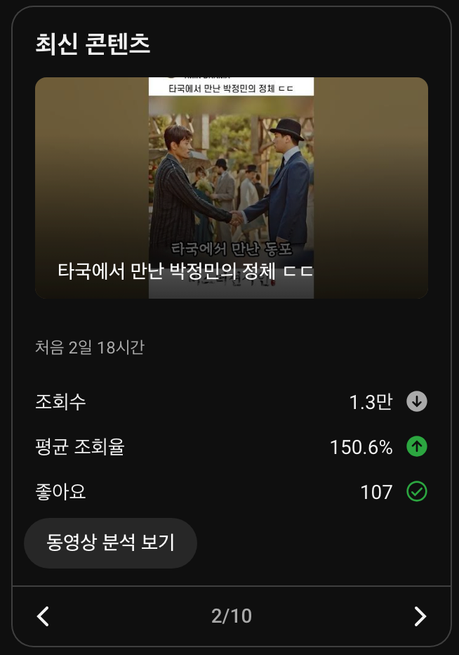
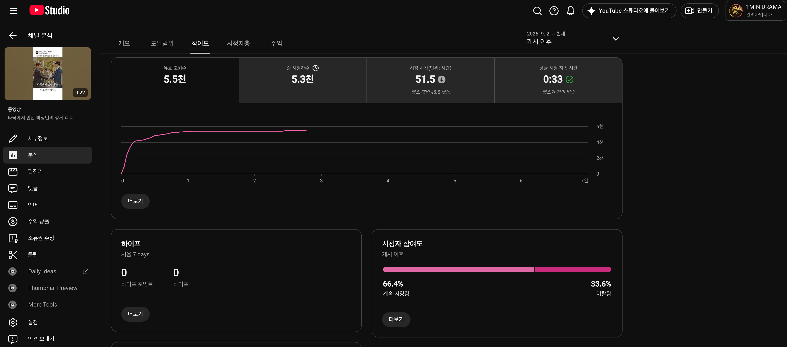
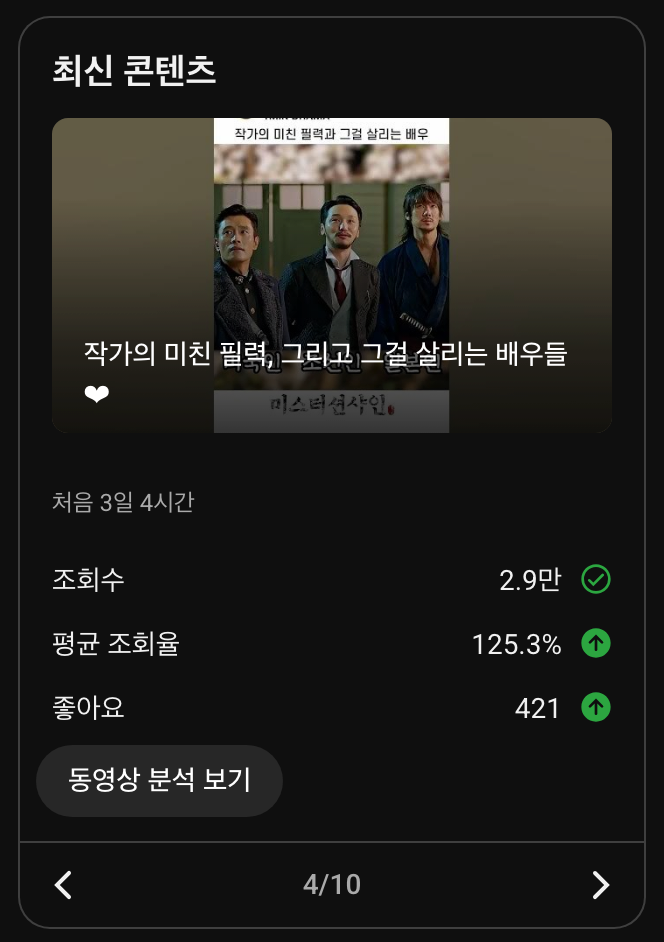
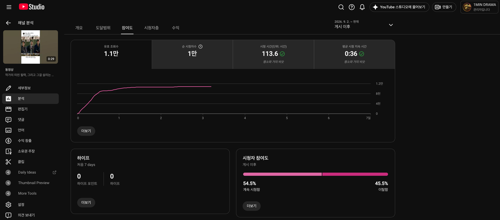
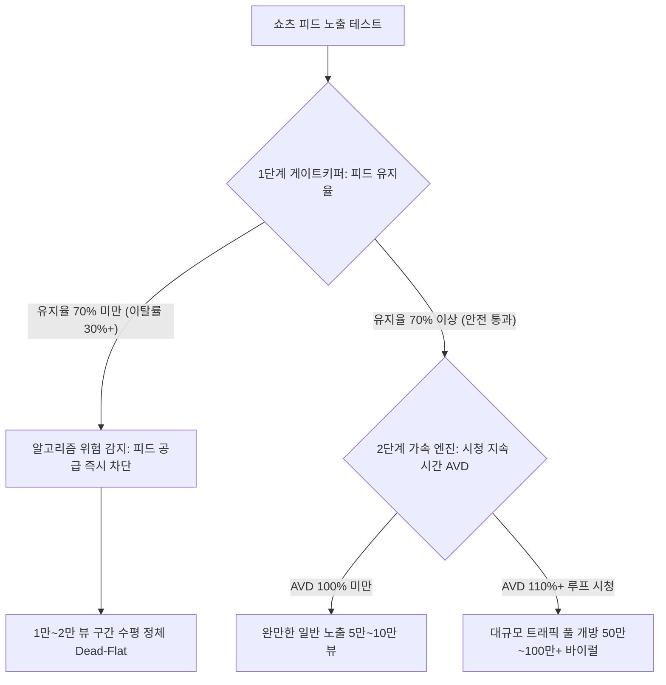

유튜브 쇼츠를 제작하는 창작자에게 가장 당혹스러운 순간 중 하나는 스튜디오 대시보드에 찍힌 압도적인 수치와 처참한 조회수 사이의 괴리를 마주할 때입니다. 새로 올린 숏폼 영상의 세부 분석을 열었을 때 평균 조회율이 120%를 넘어 150%를 가리키며 선명한 녹색 상승 화살표가 떠 있다면, 누구나 이 영상이 수십만 혹은 수백만 뷰로 뻗어나갈 것이라 기대하게 됩니다. 150%라는 수치는 시청자들이 영상을 끝까지 다 보고도 다시 한 번 반복해서 시청했다는 뜻이기 때문입니다.

하지만 기대와 달리 조회수 그래프는 1만 회 안팎에서 완벽한 수평선(Dead-Flat)을 그리며 멈춰 섭니다. 더 이상 추천 피드에 노출되지도 않고, 새로운 시청자 유입도 완전히 끊겨버립니다. 영상을 1.5번씩이나 돌려볼 정도로 몰입도가 높은데, 대체 왜 유튜브 알고리즘은 추천 공급을 차단해버린 것일까요?

공식 채널 1MIN DRAMA(@onemindrama)에서 최근 게시된 2편의 실제 스튜디오 데이터를 공개하고, 완주율(AVD)이라는 수치가 만들어내는 치명적인 착시와 알고리즘의 실제 작동 메커니즘을 심층 분석합니다.

---

## 150% 완주율과 멈춰버린 그래프: 2편의 실제 스튜디오 데이터

아래 지표는 최근 1MIN DRAMA 채널에 업로드된 2편의 숏폼 드라마 콘텐츠의 실제 성과 지표입니다.

### 1. 22초 영상: 타국에서 만난 박정민의 정체

게시 후 2일 18시간이 경과한 시점의 요약 화면입니다.
- 누적 조회수: 1.3만 회 (하향 화살표)
- 평균 조회율: 150.6% (상향 녹색 화살표)
- 좋아요: 107개

평균 조회율 150.6%는 매우 이례적으로 높은 수치입니다. 세부 분석 대시보드를 열어보면 이 영상의 실제 시청 행태가 더욱 극명하게 드러납니다.

- 영상 길이: 22초
- 평균 시청 지속 시간: 33초 (본편 길이보다 11초를 더 시청)
- 유효 조회수: 5.5천 회
- 피드 참여도: 계속 시청함 66.4% / 이탈함 33.6%

영상 길이가 22초인데 시청자들의 평균 시청 시간은 33초에 달했습니다. 시청자들이 자발적으로 영상을 반복해서 시청(루프 재생)했음을 증명하는 지표입니다. 하지만 유효 조회수는 5.5천 회에서 피드가 완전히 잠겼고, 누적 조회수 1.3만 회에서 곡선은 수평으로 누웠습니다.

### 2. 29초 영상: 작가의 미친 필력과 배우들의 연기

게시 후 3일 4시간이 지난 또 다른 영상의 지표입니다.
- 누적 조회수: 2.9만 회
- 평균 조회율: 125.3% (상향 녹색 화살표)
- 좋아요: 421개

이 영상 역시 125%가 넘는 높은 평균 조회율을 기록했습니다. 하지만 세부 대시보드의 참여도 지표를 보면 결정적인 약점이 나타납니다.

- 영상 길이: 29초
- 평균 시청 지속 시간: 36초 (125.3% 완주)
- 유효 조회수: 1.1만 회
- 피드 참여도: 계속 시청함 54.5% / 이탈함 45.5%

29초짜리 영상을 평균 36초 동안 시청했음에도 불구하고, 피드에 노출되었을 때 손가락을 넘기지 않고 머무른 사람의 비율(Stayed Rate)은 54.5%에 그쳤습니다. 10명 중 무려 4.5명이 초반 1~3초 안에 영상을 넘겨버린 것입니다.

---

## 100만 뷰 바이럴 쇼츠 vs 1만 뷰 정체 쇼츠 1:1 대조

이 미스터리를 풀기 위해서는 지난 9월 1일 채널을 V자로 반등시키며 65만~100만 뷰를 기록했던 3편의 바이럴 쇼츠 데이터와 이번 정체 쇼츠 2편의 데이터를 나란히 비교해보아야 합니다.

| 콘텐츠 구분 | 영상 길이 | 평균 조회율 (AVD) | 계속 시청 (Stayed) | 스와이프 이탈 (Swiped) | 최종 조회수 성과 |
| :--- | :---: | :---: | :---: | :---: | :---: |
| 조카를 위한 삼촌의 선물 | 31초 | 114.5% | **71.3%** | 28.7% | **102.4만 회 (메가히트)** |
| 삼촌 삥 뜯는 조카 | 42초 | 111.8% | **71.8%** | 28.2% | **99.0만 회 (메가히트)** |
| MZ 못지않은 Z세대 | 37초 | 111.4% | **77.9%** | 22.1% | **64.9만 회 (급상승)** |
| **타국에서 만난 박정민** | 22초 | **150.6% (최고)** | **66.4%** | 33.6% | **1.3만 회 (정체)** |
| **작가의 미친 필력** | 29초 | **125.3% (우수)** | **54.5% (최저)** | 45.5% | **2.9만 회 (정체)** |

위 비교표에는 크리에이터의 통념을 완전히 뒤흔드는 역설이 담겨 있습니다.

100만 뷰를 돌파한 대박 영상들의 평균 조회율은 111%~114% 수준이었습니다. 반면 1.3만 뷰에 그친 영상의 평균 조회율은 150.6%로, 대박 영상들보다 무려 35%p 이상 높았습니다.

단순히 "평균 조회율이 높을수록 알고리즘이 밀어준다"는 공식이 맞다면, 150%를 기록한 영상이 100만 뷰를 가고 111%를 기록한 영상이 1만 뷰에 멈췄어야 합니다. 하지만 결과는 정반대였습니다. 두 집단을 가른 유일한 차이는 바로 **피드 유지율(계속 시청함 비율)**이었습니다.

---

## 유튜브 쇼츠 추천 알고리즘의 2단계 파이프라인

이러한 현상이 발생하는 이유는 유튜브 쇼츠 추천 시스템이 단일 지표로 영상을 평가하지 않고, 엄격한 2단계 깔때기(Funnel) 필터를 거치기 때문입니다.

### 제1단계: 노출 안전성을 검증하는 게이트키퍼 (피드 유지율)
쇼츠 피드는 롱폼과 달리 시청자가 썸네일을 보고 선택하는 것이 아니라, 알고리즘이 화면에 강제로 밀어 넣는 무작위 탐색 구조입니다. 따라서 알고리즘에게 가장 중요한 첫 번째 목표는 **"이 영상을 불특정 다수의 화면에 띄웠을 때 시청자가 불쾌감을 느끼고 피드를 꺼버리지 않는가"**입니다.

[YouTube 공식 고객센터 쇼츠 추천 메커니즘 문서](https://support.google.com/youtube/answer/10059070)에 명시되어 있듯, 피드 노출 후 시청자가 머무르는 비율(Stayed vs Swiped away)은 추천 시스템이 콘텐츠의 대중적 매력도를 평가하는 1차 관문 역할을 합니다. 

유튜브 스튜디오 데이터 분석 결과, 이 1차 관문의 통과 기준선은 대략 **피드 유지율 70% (이탈률 30% 이하)**에 형성되어 있습니다. 
* 피드 유지율이 66.4%나 54.5%로 떨어지면, 10명 중 3.4~4.5명이 첫 1~3초 안에 손가락을 위로 올려버렸다는 뜻입니다.
* 알고리즘 입장에서 이 영상은 "대중에게 더 넓게 노출했다가는 플랫폼 전체의 시청 흐름을 끊어버릴 위험이 있는 콘텐츠"로 판정됩니다. 따라서 1차 게이트에서 즉시 밸브를 잠가버립니다.

### 제2단계: 폭발적 확산을 결정하는 가속 엔진 (AVD와 루프 시청)
1단계 게이트를 통과하여 70% 이상의 피드 잔존율을 증명한 영상에 한해서만, 비로소 2단계 평가인 **평균 시청 지속 시간(AVD)**이 작동합니다.

비유하자면 **평균 시청 지속 시간(AVD)은 자동차의 고옥탄 연료이고, 피드 잔존율은 연료 밸브**입니다. 밸브(70% 잔존율)가 열려 있지 않으면 아무리 150%라는 최고급 연료가 준비되어 있어도 엔진으로 흘러 들어가지 못합니다.

### 150% 완주율이 만들어낸 착시의 본질
그렇다면 박정민 영상의 150.6% 완주율은 왜 만들어졌을까요?
* 초반 3초에 손가락을 넘겨버린 33.6%의 시청자는 빠르게 이탈했습니다.
* 하지만 영상을 넘기지 않고 끝까지 본 66.4%의 소수 시청자들은 영상의 짧은 호흡(22초)과 매력적인 대사에 매료되어 영상을 2번, 3번 반복해서 시청했습니다.
* 즉, **150%라는 숫자는 전체 시청자의 반응이 아니라, 이미 걸러진 소수 매니아 층의 루프 시청이 만들어낸 국소적인 통계 왜곡**이었던 것입니다.

알고리즘은 소수의 열광보다 대중의 거부감(33.6%의 즉각 이탈)을 더 치명적인 신호로 해석합니다. [Think with Google의 숏폼 시청자 행동 연구](https://www.thinkwithgoogle.com/)에서도 사용자가 피드 진입 직후 겪는 초기 인지 저항이 플랫폼 체류 시간에 가장 결정적인 영향을 미친다고 분석합니다.

---

## 루프의 함정에서 벗어나 70% 잔존율을 방어하는 3가지 실전 솔루션

결말을 첫 장면과 자연스럽게 잇는 무이음 루프(Seamless Loop) 편집은 훌륭한 테크닉이지만, 1단계 게이트를 넘지 못하면 아무런 힘을 쓰지 못합니다. 150%의 헛된 완주율 대신 70%의 피드 잔존율을 사수하기 위해 반드시 점검해야 할 제작 원칙 3가지입니다.

### 1. 첫 0.5초 안에 영상의 핵심 갈등을 시각화하기
박정민 쇼츠(22초)의 패인은 오프닝 0~2초 구간에 있었습니다. 두 인물이 악수를 나누는 장면으로 시작되었는데, 대사가 본격적으로 시작되기 전까지 시청자는 이 영상이 어떤 긴장감을 다루는지 알 수 없었습니다. 그 2초 동안 33%의 시청자가 화면을 넘겨버렸습니다.

반면 77.9%의 잔존율을 기록했던 바이럴 영상들은 시작과 동시에 인물의 당황한 표정 클로즈업, 즉각적인 고성이나 반전 텍스트 바를 노출하여 시청자가 손가락을 움직일 틈 자체를 주지 않았습니다.

### 2. 모호한 호기심 유발보다 직관적인 상황 제시하기
미스터 션샤인 쇼츠(29초)의 경우 상단 텍스트 바가 "작가의 미친 필력, 그리고 그걸 살리는 배우들"이었습니다. 이는 영상의 내용을 설명하기보다 제작자의 주관적 감상을 적어둔 것에 가깝습니다.

시청자는 피드를 넘기며 텍스트를 읽는 순간 "이게 무슨 상황이지?"를 파악하지 못하면 즉시 스와이프합니다. "미국인 조선인 일본인"처럼 인물들의 극단적 대립 관계를 한눈에 직관적으로 보여주는 객관적 상황 텍스트를 배치해야 이탈률을 20%대로 묶어둘 수 있습니다.

### 3. 결말 반전보다 도입부의 군더더기 1초를 쳐내기
많은 크리에이터들이 영상 마지막에 1초를 더 보게 만들려고 엔딩 컷을 다듬는 데 많은 시간을 씁니다. 하지만 영상 끝부분의 1초보다 **영상 시작 부분의 정적 0.5초**가 조회수에 미치는 영향력이 100배 이상 큽니다.

대사가 시작되기 전 숨을 고르는 찰나, 배경음악만 흐르는 도입부 컷은 무조건 잘라내야 합니다. 시청자의 귀에 음성이 꽂히는 순간과 화면 전환이 0초 프레임에서 정확히 동시에 시작되어야 70%의 수비벽을 세울 수 있습니다.

---

## 데이터가 말해주는 본질

유튜브 쇼츠에서 100%를 넘는 완주율은 분명 창작자에게 자부심을 주는 훌륭한 지표입니다. 하지만 1단계 게이트키퍼인 피드 잔존율 70%가 무너진 상태에서의 완주율은, 문이 닫힌 방 안에서 소수의 인원이 음악을 크게 틀어놓고 있는 것과 같습니다.

[Google 검색 센터의 콘텐츠 품질 평가 가이드라인](https://developers.google.com/search/docs/fundamentals/creating-helpful-content)이 강조하듯, 시스템은 첫인상에서의 대중적 수용성과 심층적인 사용자 경험이 조화를 이룰 때만 배포 범위를 확장합니다.

"어떻게 영상을 두 번 보게 만들까"를 고민하기 전에, **"어떻게 첫 3초 안에 손가락을 멈추게 만들 것인가"**를 먼저 해결해야 합니다. 70%의 수비선이 확보된 뒤에 더해지는 110%의 완주율만이 100만 뷰를 향해 달리는 진짜 엔진이 되어줄 것입니다.
