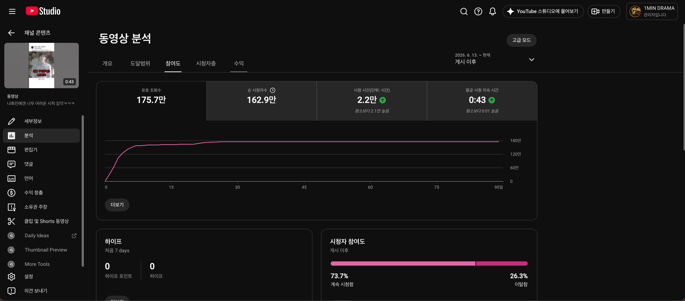
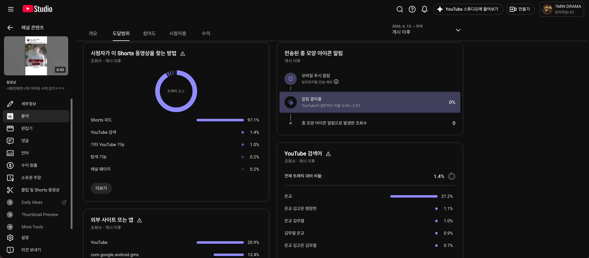
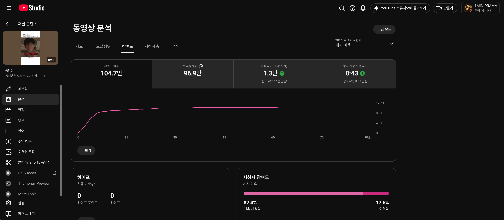
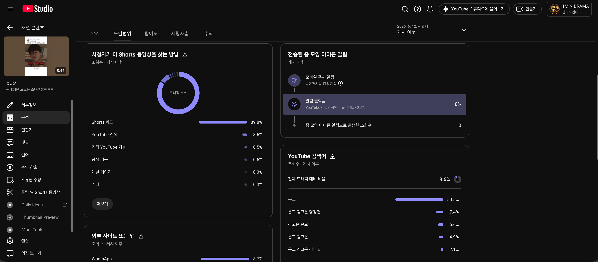
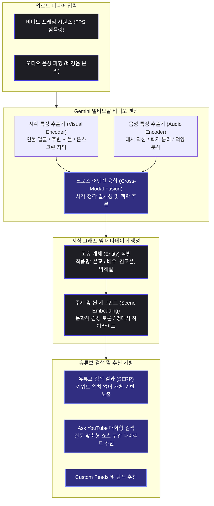

유튜브에 영상을 올릴 때마다 설명란 하단에 수십 개의 관련 태그를 빽빽하게 적어 넣고, 해시태그를 종류별로 조합하던 시절이 있었습니다. 검색 결과 상단을 차지하기 위해 제목에 핵심 키워드를 어색하게 반복 배치하거나, 조금이라도 연관 검색어에 걸리기 위해 메타데이터를 채워 넣던 방식은 지난 10년간 유튜브 검색 최적화(SEO)의 정석처럼 여겨졌습니다.

그러나 최근 해외 유튜브 크리에이터 커뮤니티를 중심으로 심상치 않은 변화가 감지되고 있습니다. 수많은 구독자를 보유한 테크 크리에이터들이 일제히 "유튜브의 전통적인 SEO는 완전히 끝났다"고 선언하기 시작했습니다. 2026년 9월 초 공개된 한 유명 분석 영상에서는 크리에이터가 공들여 작성한 태그와 메타데이터가 검색 노출에 미치는 영향력이 사실상 0에 수렴하며, 알고리즘이 전혀 다른 방식으로 영상을 읽어 들이고 있다는 충격적인 테스트 결과가 공유되었습니다.

이 변화의 실체는 무엇이며, 단순한 일시적 오류일까요? 공식 채널 1MIN DRAMA(@onemindrama)에서 지난 6월 업로드했던 2편의 실제 스튜디오 유입 지표와 구글의 인공지능 인프라 로드맵을 대조하여, 차세대 유튜브 검색 알고리즘이 작동하는 물리적 원리를 추적했습니다.

---

## 2026년 9월의 파동: 해외 크리에이터들이 마주한 '태그 무용론'과 AI 검색의 습격

2026년 9월 4일, 해외 테크 크리에이터 댄(Dan the creator)은 "유튜브의 새로운 SEO 업데이트가 모든 것을 바꿨다(YouTube's New SEO Update Changes EVERYTHING)"라는 제목의 분석 영상을 공개하며 크리에이터 생태계에 큰 화두를 던졌습니다. 영상의 골자는 명확했습니다. 크리에이터가 수동으로 입력한 제목 키워드나 태그 목록에 의존하던 유튜브의 레거시 검색 엔진이, 영상 내부의 음성과 화면을 직접 해독하는 인공지능 시스템으로 전면 대체되었다는 것입니다.

특히 주목받은 부분은 검색 환경 자체의 근본적인 재편이었습니다. 유튜브가 실험적으로 도입한 대화형 검색 도구인 'Ask YouTube'와 시청자의 관심사를 문맥 단위로 묶어주는 'Custom Feeds'가 전면 배치되면서, 단순 키워드 매칭은 자취를 감추었습니다. 시청자가 자연어로 질문을 던지면, 인공지능은 10분짜리 영상 전체를 보여주는 대신 질문에 대한 정확한 답변이 담긴 15초 분량의 쇼츠 구간이나 특정 타임라인 챕터를 직접 골라내어 추천합니다.

그 결과 태그를 정교하게 채워 넣은 영상보다, 영상 속 인물이 명확한 발음으로 핵심 개념을 설명하고 화면에 관련 시각 정보가 뚜렷하게 노출된 영상이 검색 결과 최상단을 독점하기 시작했습니다. 반대로 영상 내부의 배경 간판이나 의도치 않은 소품 속 텍스트를 인공지능이 오인하여 엉뚱한 국가나 카테고리로 영상을 분류해 버리는 부작용까지 보고되었습니다. 크리에이터가 작성한 텍스트 메타데이터를 알고리즘이 더 이상 신뢰하지 않는다는 명백한 증거였습니다.

---

## 구글 I/O에서 시작된 백엔드 인프라: Gemini 비디오 멀티모달 엔진의 정체

해외 크리에이터들은 9월에 접어들어서야 이러한 급변을 체감하고 목소리를 높이고 있지만, 엔지니어링 관점에서 이 변화는 이미 수개월 전 예고된 필연적인 수순이었습니다. 지난 2026년 5월 19일 개최된 연례 개발자 회의(Google I/O 2026)에서 구글은 자사의 최첨단 멀티모달 모델인 Gemini Omni 엔진을 유튜브의 핵심 백엔드 인프라에 통합하겠다고 공식 발표한 바 있습니다.

당시 구글이 공개한 기술의 핵심은 '비디오 시퀀스의 실시간 다중 모달 디코딩'이었습니다. 기존의 검색 봇은 영상의 압축 파일 내부를 들여다볼 수 없었기 때문에, 업로더가 적어준 텍스트 설명이나 자동 생성 자막 텍스트(STT) 파일에 의존하여 색인을 생성했습니다.

하지만 Gemini 기반의 비디오 파이프라인은 업로드된 비디오의 매 프레임(Vision)을 시각 특징 벡터로 변환하고, 배경 음악과 잡음을 분리한 고해상도 오디오 음성(Audio Waveform)을 1밀리초 단위로 동시 분석합니다. 여기에 2026년 9월 초 공식화된 '에이전틱 비디오 이해(Agentic Video Understanding)' 모델이 더해지며, 인공지능은 영상 속 등장인물의 얼굴, 소품, 대사의 문맥, 행동의 인과관계를 종합적으로 파악하여 스스로 지식 그래프(Knowledge Graph) 형태의 고유 개체(Entity) 프로필을 구축하게 된 것입니다.

---

## 3개월 전 이미 증명된 스튜디오 지표: 제목에 없던 '은교'가 검색 1위를 차지한 2편의 기록

이러한 인공지능 멀티모달 인덱싱은 연구실의 이론에 머물지 않고 이미 수개월 전부터 실제 쇼츠 추천 시스템에서 동작하고 있었습니다. 이를 가장 극명하게 증명하는 데이터가 바로 1MIN DRAMA 채널에서 지난 6월 12일과 13일에 업로드했던 2편의 숏폼 드라마 지표입니다.

### 1. 43초 쇼츠: 나화진에겐 너무 어려운 시적 감각

첫 번째 영상은 2026년 6월 13일에 게시된 43초 길이의 쇼츠입니다. 제목은 *"나화진에겐 너무 어려운 시적 감각ㅋㅋㅋ"*으로 설정되었습니다. 제목과 공식 태그(Tags) 설정란 어디에도 영화 제목('은교')이나 배우들의 이름은 적지 않았으며, 설명란 하단에 짧게 `영화 #은교 #김무열 #박해일 #김고은` 해시태그만 기재해 둔 상태였습니다.

스튜디오의 세부 참여도 대시보드를 확인해 보면 경이로운 수치가 확인됩니다.
- 유효 조회수: 175.7만 회
- 순 시청자수: 162.9만 명
- 시청 시간: 2.2만 시간
- 평균 시청 지속 시간: 0:43 / 0:43 (완주율 100%)
- 피드 참여도: 계속 시청함 73.7% / 이탈함 26.3%

43초 전체를 완벽하게 시청하게 만드는 높은 리텐션으로 175만 뷰를 달성한 이 영상의 도달범위 탭을 열었을 때, 검색 유입어에서 매우 흥미로운 현상이 발견되었습니다.

유튜브 검색창으로 유입된 시청자들의 검색어 분포입니다.
- **은교: 21.2% (압도적 1위)**
- 은교 김고은 명장면: 1.1%
- 은교 김무열: 1.0%
- 김무열 은교: 0.9%
- 은교 김고은 김무열: 0.7%

제목에는 '나화진'과 '시적 감각'이라는 상황 묘사만 존재했고 공식 태그 설정도 비어 있었음에도, 유입 검색어의 상위 5개는 100% 영화 '은교'와 출연 배우들의 이름으로 채워져 있었습니다.

### 2. 44초 쇼츠: 공대생은 모르는 소녀갬성

더욱 결정적인 데이터는 하루 앞선 2026년 6월 12일에 게시된 44초 길이의 두 번째 쇼츠에서 나타났습니다. 제목은 *"공대생은 모르는 소녀갬성ㅋㅋㅋ"*이었습니다.

- 유효 조회수: 104.7만 회
- 순 시청자수: 96.9만 명
- 시청 시간: 1.3만 시간
- 평균 시청 지속 시간: 0:43 / 0:44 (완주율 97.7%)
- 피드 참여도: 계속 시청함 82.4% / 이탈함 17.6%

이 영상 역시 100만 회가 넘는 높은 조회수를 기록했는데, 도달범위 대시보드에서는 일반적인 숏폼의 상식을 파괴하는 트래픽 구조가 찍혀 있었습니다.

- Shorts 피드 유입: 89.8%
- **YouTube 검색 유입: 8.6%**
- **YouTube 검색어 1위: 은교 50.5%**
- 은교 김고은 명장면: 7.4%
- 김고은 은교: 5.6%
- 은교 김고은: 4.9%
- 은교 김고은 김무열: 2.1%

일반적으로 쇼츠의 검색 유입 비중은 1% 미만에 불과합니다. 하지만 이 영상은 전체 트래픽의 무려 8.6%(누적 9만 회 이상)가 순수 유튜브 검색으로 유입되었습니다. 더욱 놀라운 사실은 검색창으로 들어온 시청자의 절반이 넘는 50.5%가 '은교'라는 단어를 입력해 이 영상을 찾아냈다는 점입니다.

여기서 한 가지 의문이 생길 수 있습니다. "설명란에 `#은교` 해시태그를 포함했으니 검색에 걸린 것이 당연하지 않은가?"라는 점입니다.

하지만 과거 유튜브 검색 최적화의 정석을 돌이켜보면, **제목(Title)에 핵심 키워드가 빠진 채 설명란에 해시태그 몇 줄을 적는 것만으로는 대형 키워드 검색 1위를 차지할 수 없었습니다.** 수많은 영상들이 설명란에 인기 해시태그를 적어 넣지만, 대부분 검색 결과 수십 페이지 밖으로 밀려납니다. 단순 텍스트 해시태그만으로 검색 1위가 보장된다면 모든 낚시성 영상이 검색 상단을 장악했을 것입니다.

비밀은 '교차 검증(Cross-Validation)'에 있었습니다. 설명란에 적힌 `#은교`라는 텍스트 단서가, 영상 본편에서 배우들이 대사를 주고받으며 언급한 "은교..."라는 실제 육성 대사와 배우 김고은·박해일의 얼굴 프레임과 100% 일치한 것입니다. 5월 I/O 이후 가동된 Gemini 멀티모달 엔진이 설명란의 해시태그를 단순 텍스트로 보지 않고, 영상 내부의 음성과 시각 개체(Entity)와 대조하여 진성성을 검증한 뒤 검색 최상단과 8.6%라는 검색 트래픽을 배정한 것입니다.

---

## AI 비디오 파이프라인 아키텍처: 프레임과 음성이 검색 엔진으로 변환되는 과정

유튜브의 차세대 검색 인덱싱 파이프라인은 텍스트 파싱 단계를 건너뛰고 비디오와 오디오를 병렬 처리하는 심층 신경망 구조로 이루어져 있습니다.

크리에이터가 영상을 업로드하는 순간, 백엔드 엔진은 시각과 청각 정보를 분리하여 각 인코더로 전달합니다. 시각 인코더는 프레임 단위로 배우의 이목구비, 의상, 화면에 타이핑된 자막을 읽어 들이고, 오디오 인코더는 배경음악 뒤에 숨겨진 실제 대사를 음소 단위로 추출합니다.

두 정보는 크로스 어텐션(Cross-Attention) 계층에서 결합하여 하나의 완성된 지식 개체(Entity)로 응축됩니다. 화면에 박해일의 얼굴이 비치고 오디오에서 "은교"라는 대사가 교차 검증되는 순간, 인공지능은 100%의 확신도로 이 영상에 '은교'라는 메타데이터를 자체적으로 부여합니다. 이 개체 벡터는 데이터베이스에 영구 색인되어, 시청자가 유튜브 검색창에 '은교'나 '은교 명장면'을 검색했을 때 제목과 무관하게 쇼츠 추천 결과 상위에 꽂히게 되는 것입니다.

---

## 레거시 키워드 SEO vs 차세대 Gemini 멀티모달 SEO 대조

과거의 검색 최적화 전략과 Gemini 멀티모달 시대의 검색 전략은 평가 기준과 제작 방식 전반에서 완전히 상반된 방향을 지향합니다.

| 구분 항목 | 과거 레거시 키워드 SEO | 차세대 Gemini 멀티모달 SEO |
| :--- | :--- | :--- |
| **핵심 색인 대상** | 제목 텍스트, 설명란, 업로더 수동 태그, 해시태그 | 비디오 프레임 시퀀스, 오디오 음성 대사, 화면 자막 |
| **검색 매칭 원리** | 검색어 문자열과 메타데이터 문자열의 단순 텍스트 일치 | 영상 속 대사와 인물, 장면 맥락의 개체(Entity) 추출 |
| **키워드 스터핑 효과** | 태그 및 설명란 도배 시 제한적 노출 기회 획득 | 노이즈로 간주하여 알고리즘 가중치 사실상 0% 처리 |
| **쇼츠 검색 노출** | 롱폼 영상 하단에 미미하게 노출 (유입 비중 1% 미만) | 8~10% 수준의 높은 검색 점유율 및 맞춤 구간 추천 |
| **오디오/자막 중요도** | 단순 보조 수단 (시청자 편의용) | 핵심 색인 자산 (초반 3초 발음 딕션이 검색 순위 결정) |
| **인식 오류 리스크** | 오타나 잘못된 키워드로 인한 검색 누락 | 배경 소품 텍스트나 발음 뭉개짐으로 인한 오인 분류 |

---

## 태그 입력 시간을 버리고 집중해야 할 차세대 3대 쇼츠 제작 공식

수동 태그 작성이 무력화되고 인공지능이 영상 자체를 시청하는 시대에는, 제작자가 에너지를 쏟아야 할 포인트 역시 완전히 달라져야 합니다. 1MIN DRAMA 채널의 데이터와 알고리즘 동작 원리로 도출한 3대 실전 제작 지침입니다.

### 1. 초반 3초 오디오의 발음 명확성과 핵심 고유명사 선제시

인공지능 오디오 인코더가 영상의 메인 주제를 가장 빠르게 파악하는 구간은 오프닝 3초입니다. 배경음악 볼륨이 지나치게 커서 인물의 첫 마디 대사가 묻히거나, 발음이 뭉개지면 인공지능은 해당 영상의 음성 트랙을 의미 있는 텍스트로 전환하지 못하고 색인 우선순위에서 밀어냅니다.

다루고자 하는 핵심 주제, 인물명, 고유명사를 초반 3~5초 이내에 명확한 딕션(Diction)으로 발음해야 합니다. 1MIN DRAMA의 은교 영상이 제목 없이도 폭발적인 검색 유입을 확보할 수 있었던 근본적인 이유는, 영상 시작과 동시에 인물의 대사에서 원작의 핵심 키워드가 깨끗한 음질로 전달되었기 때문입니다.

### 2. 온스크린 텍스트 앵커링을 통한 시각적 개체 인식 보정

인공지능의 시각 인식 모델은 화면 중앙과 상단에 배치된 고대비 텍스트 자막을 비디오 프레임 분석 시 최우선 가중치로 인식합니다. 음성만으로 고유명사를 전달하기 모호한 상황이라면, 화면 상단이나 중앙에 명확한 폰트의 자막 텍스트를 배치하여 인공지능 시각 인코더에 '앵커(Anchor)'를 걸어주어야 합니다.

배경의 복잡한 시각적 노이즈(거리의 간판, 무관한 브랜드 로고 등)로 인해 알고리즘이 영상의 타깃을 오인하는 사고를 방지하려면, 크리에이터가 의도한 메인 키워드를 고대비 자막으로 박아 넣어 시각 인코더가 엉뚱한 배경 사물 대신 해당 텍스트를 개체로 인식하도록 유도해야 합니다.

### 3. 무의미한 낚시성 메타데이터 폐기와 주제 일관성 방어

제목이나 썸네일에 자극적인 낚시성 단어를 적어두고 정작 본편 영상 내부에서는 해당 내용을 1초도 다루지 않는 영상은, 차세대 인공지능 추천 시스템에서 가장 먼저 도태됩니다. Gemini 엔진은 영상 프레임과 오디오 대사를 종합하여 '제목-본편 일치도' 점수를 실시간으로 산출하기 때문입니다.

더 이상 태그 입력창을 열어놓고 10분씩 고민하며 연관 검색어를 복사해 넣을 이유가 없습니다. 그 시간에 본편 대사의 잡음을 제거하고, 음성 레벨을 정돈하며, 시청자가 검색할 만한 가치 있는 지식을 영상 속에서 실제 육성으로 정확하게 언급하는 것이 100만 뷰를 넘어 지속적인 검색 유입을 만들어내는 가장 확실한 최적화 전략입니다.

---

### 참고 공식 레퍼런스
- [Google Cloud: Gemini Multimodal Video Understanding Architecture](https://cloud.google.com/vertex-ai/generative-ai/docs/multimodal-overview)
- [YouTube Creators: How YouTube Search and Discovery Systems Work](https://support.google.com/youtube/answer/141805)
- [Think with Google: The Evolution of Video Discovery and AI-Powered Intent](https://www.thinkwithgoogle.com/consumer-insights/consumer-trends/youtube-video-discovery-trends/)
