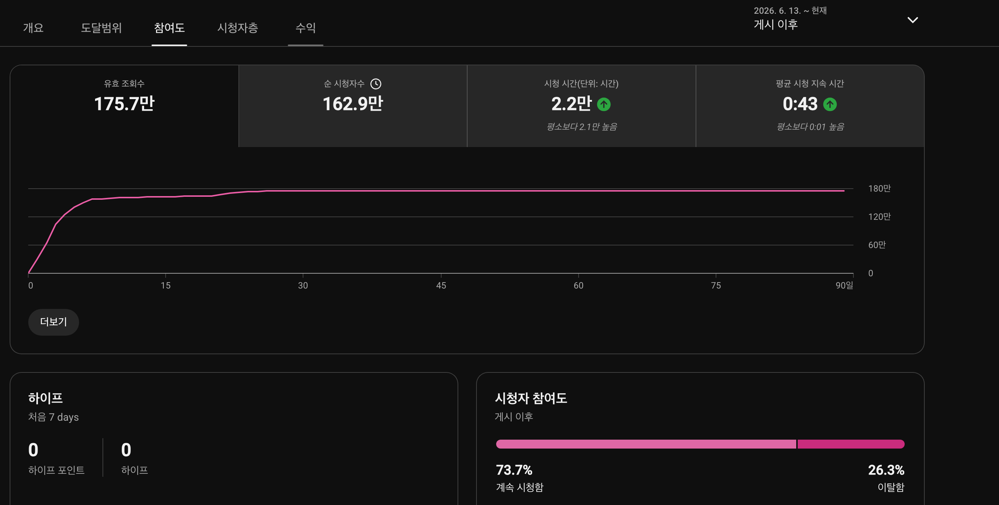
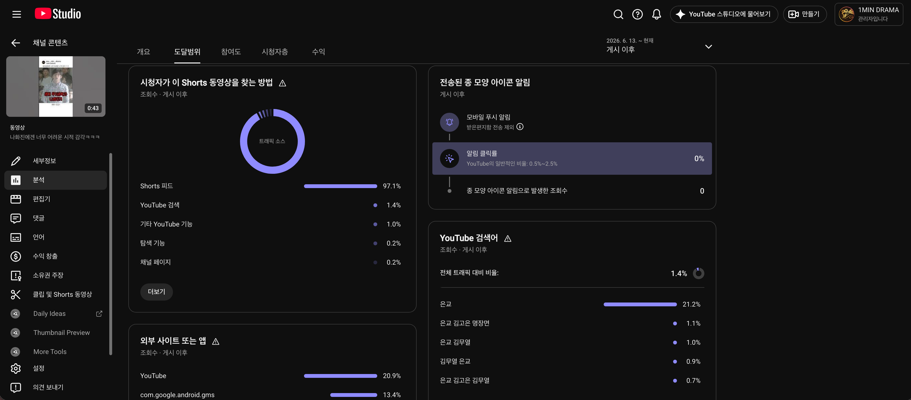
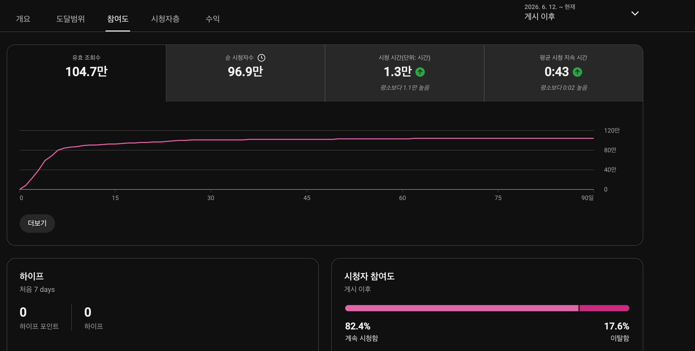
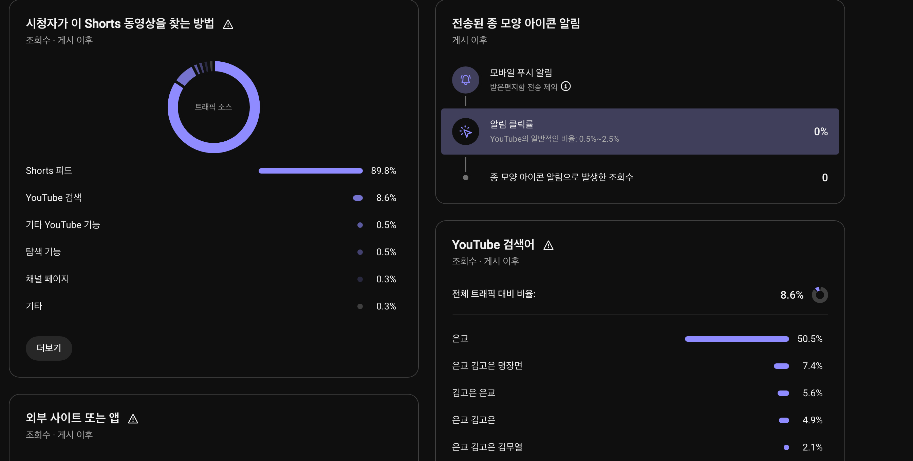
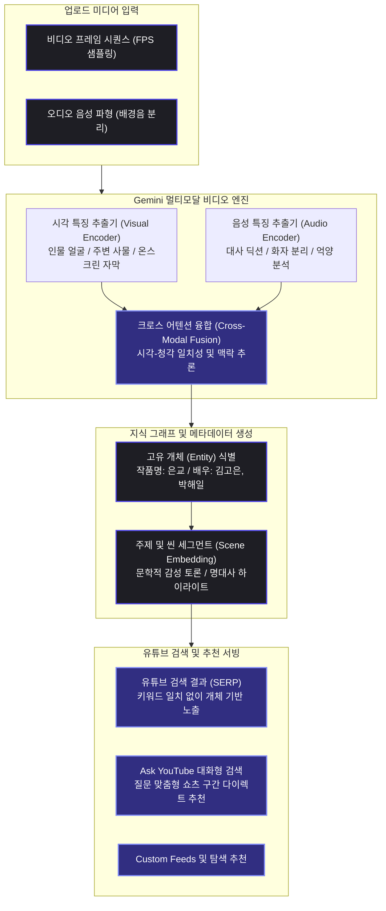

유튜브에 영상을 올릴 때마다 설명란 하단에 수십 개의 관련 태그를 빽빽하게 적어 넣고, 해시태그를 종류별로 조합하던 시절이 있었습니다. 검색 결과 상단을 차지하기 위해 제목에 핵심 키워드를 어색하게 반복 배치하거나, 조금이라도 연관 검색어에 걸리기 위해 메타데이터를 채워 넣던 방식은 지난 10년간 유튜브 검색 최적화(SEO)의 정석처럼 여겨졌습니다.

그러나 2026년 들어 유튜브가 AI 기반 검색·추천 기능을 잇따라 공개하면서, 제목과 태그 같은 텍스트 메타데이터의 비중이 예전만큼 크지 않을 수 있다는 논의가 이어지고 있습니다. 이 글은 그 논의를 단정하지 않고, 제 채널의 실제 검색 유입 데이터가 무엇을 보여주는지부터 살펴봅니다.

제 채널에서 지난 6월에 업로드한 2편의 실제 스튜디오 유입 지표를 보여드리고, 공개된 자료로 확인되는 범위와 저의 추정을 구분해서 정리했습니다.

---

## 영상으로 한눈에 보기: 태그 없는 175만 뷰와 검색 유입의 비밀

본 포스팅에서 다루는 핵심 분석과 스튜디오 데이터를 영상으로 더 알기 쉽게 정리했습니다. 글을 읽기 전 편하게 시청해 보세요.

  <iframe
    src="https://www.youtube-nocookie.com/embed/eCxaK_UtLFk"
    title="태그 다 지웠더니 175만 뷰 터졌다? 유튜브 AI가 영상을 읽는 법(쇼츠 알고리즘의 비밀 2부)"
    allow="accelerometer; autoplay; clipboard-write; encrypted-media; gyroscope; picture-in-picture; web-share"
    allowfullscreen
    loading="lazy">
  </iframe>

---

## 공개된 자료로 확인되는 변화, 그리고 확인되지 않는 것

2026년 9월 23일 열린 Made on YouTube 2026에서 유튜브는 Gemini 기반의 대화형 검색 'Ask YouTube'와, 보고 싶은 영상을 자연어로 설명해 나만의 피드를 만드는 'Custom Feeds'를 공개했습니다([TechCrunch 보도](https://techcrunch.com/2026/09/23/youtube-will-let-you-build-your-own-algorithm-with-ai/)). Custom Feeds는 올 가을 미국에서 먼저 제공된다고 보도되었습니다. (이 문단은 2026년 10월 5일에 공개 자료를 확인하여 고쳤습니다.)

반면 '유튜브 검색이 제목과 태그를 더 이상 보지 않는다', '검색 색인 구조가 AI로 완전히 대체되었다'는 주장은 공식 자료로 확인하지 못했습니다. 아래의 스튜디오 데이터는 제목에 없던 작품명 키워드가 실제로 검색 유입 1위를 차지했다는 사실만을 보여줍니다.

---

## Gemini Omni와 유튜브: 확인되는 범위

2026년 5월 19일 Google I/O 2026에서 구글은 영상 생성·편집이 가능한 멀티모달 모델 'Gemini Omni'를 공개했고, 유튜브에서는 쇼츠 리믹스(Shorts Remix)와 Create 앱에서 이를 쓸 수 있다고 밝혔습니다([9to5Google 정리](https://9to5google.com/2026/05/19/google-io-2026-news/)). 즉 공개된 내용은 '영상 제작 도구'에 관한 것이며, Gemini Omni가 유튜브 검색 색인에 적용되었다는 공식 발표는 확인되지 않았습니다.

구글이 영상 이해(Video understanding)를 Gemini의 기능으로 제공한다는 점은 공식 문서에서 확인되지만([Google Cloud 문서](https://docs.cloud.google.com/vertex-ai/generative-ai/docs/multimodal/video-understanding)), 그 기술이 유튜브 검색 순위에 어떻게 쓰이는지는 공개되어 있지 않습니다.

---

## 스튜디오 지표: 제목에 없던 '은교'가 검색 1위를 차지한 2편의 기록

다음은 제목에 없던 작품명이 검색 유입 상위를 차지한, 자체 운영 채널에서 지난 6월 12일과 13일에 업로드했던 2편의 숏폼 드라마 지표입니다. 원인을 단정할 수는 없지만, 제목과 공식 태그에 의존하지 않는 노출이 있었다는 점은 확인됩니다.

### 1. 43초 쇼츠: [Case A] 캐릭터 명대사 코믹 쇼츠

첫 번째 영상은 2026년 6월 13일에 게시된 43초 길이의 쇼츠입니다. 제목은 '[Case A] 캐릭터 명대사 코믹 쇼츠 (43초)'으로 설정되었습니다. 제목과 공식 태그(Tags) 설정란 어디에도 영화 제목('은교')이나 배우들의 이름은 적지 않았으며, 설명란 하단에 짧게 `영화 #은교 #김무열 #박해일 #김고은` 해시태그만 기재해 둔 상태였습니다.

스튜디오의 세부 참여도 대시보드를 확인해 보면 경이로운 수치가 확인됩니다.
- 유효 조회수: 175.7만 회
- 순 시청자수: 162.9만 명
- 시청 시간: 2.2만 시간
- 평균 시청 지속 시간: 0:43 / 0:43 (완주율 100%)
- 피드 참여도: 계속 시청함 73.7% / 이탈함 26.3%

43초 전체를 완벽하게 시청하게 만드는 높은 리텐션으로 175만 뷰를 달성한 이 영상의 도달범위 탭을 열었을 때, 검색 유입어에서 매우 흥미로운 현상이 발견되었습니다.

유튜브 검색창으로 유입된 시청자들의 검색어 분포입니다.
- 은교: 21.2% (압도적 1위)
- 은교 김고은 명장면: 1.1%
- 은교 김무열: 1.0%
- 김무열 은교: 0.9%
- 은교 김고은 김무열: 0.7%

제목에는 상황 묘사만 존재했고 공식 태그 설정도 비어 있었음에도, 유입 검색어의 상위 5개는 100% 영화 '은교'와 출연 배우들의 이름으로 채워져 있었습니다.

### 2. 44초 쇼츠: [Case B] 감성 로맨스 명장면 쇼츠

더욱 결정적인 데이터는 하루 앞선 2026년 6월 12일에 게시된 44초 길이의 두 번째 쇼츠에서 나타났습니다. 제목은 '[Case B] 감성 로맨스 명장면 쇼츠 (44초)'이었습니다.

- 유효 조회수: 104.7만 회
- 순 시청자수: 96.9만 명
- 시청 시간: 1.3만 시간
- 평균 시청 지속 시간: 0:43 / 0:44 (완주율 97.7%)
- 피드 참여도: 계속 시청함 82.4% / 이탈함 17.6%

이 영상 역시 100만 회가 넘는 높은 조회수를 기록했는데, 도달범위 대시보드에서는 일반적인 숏폼의 상식을 파괴하는 트래픽 구조가 찍혀 있었습니다.

- Shorts 피드 유입: 89.8%
- YouTube 검색 유입: 8.6%
- YouTube 검색어 1위: 은교 50.5%
- 은교 김고은 명장면: 7.4%
- 김고은 은교: 5.6%
- 은교 김고은: 4.9%
- 은교 김고은 김무열: 2.1%

일반적으로 쇼츠의 검색 유입 비중은 1% 미만에 불과합니다. 하지만 이 영상은 전체 트래픽의 무려 8.6%(누적 9만 회 이상)가 순수 유튜브 검색으로 유입되었습니다. 더욱 놀라운 사실은 검색창으로 들어온 시청자의 절반이 넘는 50.5%가 '은교'라는 단어를 입력해 이 영상을 찾아냈다는 점입니다.

여기서 한 가지 의문이 생길 수 있습니다. "설명란에 `#은교` 해시태그를 포함했으니 검색에 걸린 것이 당연하지 않은가?"라는 점입니다.

하지만 과거 유튜브 검색 최적화의 정석을 돌이켜보면, '제목(Title)에 핵심 키워드가 빠진 채 설명란에 해시태그 몇 줄을 적는 것만으로는 대형 키워드 검색 1위를 차지할 수 없었습니다.' 수많은 영상들이 설명란에 인기 해시태그를 적어 넣지만, 대부분 검색 결과 수십 페이지 밖으로 밀려납니다. 단순 텍스트 해시태그만으로 검색 1위가 보장된다면 모든 낚시성 영상이 검색 상단을 장악했을 것입니다.

한 가지 가설은 '교차 검증'입니다. 설명란의 `#은교`라는 텍스트 단서가 영상 속 실제 대사와 일치했기 때문에 검색에 잘 노출되었을 수 있습니다. 다만 이것이 AI의 영상 분석 때문인지, 자동 생성 자막(STT)과 해시태그 같은 기존 신호의 조합 때문인지는 이 데이터만으로 구분할 수 없습니다.

---

## AI 비디오 파이프라인 아키텍처: 프레임과 음성이 검색 엔진으로 변환되는 과정

※ 아래 도식은 공개된 Gemini 영상 이해 문서와 제 채널 데이터를 바탕으로 그린 추정 모델입니다. 유튜브가 공개한 실제 검색 구조가 아닙니다.

다음은 영상 속 음성과 화면을 함께 이해하는 시스템이 있다고 가정했을 때의 개념도입니다.

```mermaid
flowchart TD
    subgraph Input["업로드 미디어 입력"]
        V["비디오 프레임 시퀀스 (FPS 샘플링)"]
        A["오디오 음성 파형 (배경음 분리)"]
    end

    subgraph Multimodal["Gemini 멀티모달 비디오 엔진"]
        direction TB
        V_Enc["시각 특징 추출기 (Visual Encoder)<br/>인물 얼굴 / 주변 사물 / 온스크린 자막"]
        A_Enc["음성 특징 추출기 (Audio Encoder)<br/>대사 딕션 / 화자 분리 / 억양 분석"]
        Cross["크로스 어텐션 융합 (Cross-Modal Fusion)<br/>시각-청각 일치성 및 맥락 추론"]
        V_Enc --> Cross
        A_Enc --> Cross
    end

    subgraph Knowledge["지식 그래프 및 메타데이터 생성"]
        Entity["고유 개체 (Entity) 식별<br/>작품명: 은교 / 배우: 김고은, 박해일"]
        Topic["주제 및 씬 세그먼트 (Scene Embedding)<br/>문학적 감성 토론 / 명대사 하이라이트"]
        Entity --> Topic
    end

    subgraph Serving["유튜브 검색 및 추천 서빙"]
        SERP["유튜브 검색 결과 (SERP)<br/>키워드 일치 없이 개체 기반 노출"]
        Ask["Ask YouTube 대화형 검색<br/>질문 맞춤형 쇼츠 구간 다이렉트 추천"]
        Feed["Custom Feeds 및 탐색 추천"]
    end

    Input --> Multimodal
    Cross --> Knowledge
    Topic --> Serving

    classDef dark fill:#1e1e24,stroke:#4f46e5,stroke-width:2px,color:#fff;
    classDef highlight fill:#312e81,stroke:#818cf8,stroke-width:2px,color:#fff;
    class V,A,Entity,Topic dark;
    class Cross,SERP,Ask,Feed highlight;
```

이 가정에서는 영상이 업로드되면 시각과 청각 정보가 분리되어 각각 분석됩니다. 시각 인코더는 프레임 단위로 배우의 이목구비, 의상, 화면에 타이핑된 자막을 읽어 들이고, 오디오 인코더는 배경음악 뒤에 숨겨진 실제 대사를 음소 단위로 추출합니다.

두 정보가 결합되어 하나의 개체(Entity)로 정리된다면, 화면에 배우의 얼굴이 나오고 오디오에서 '은교'라는 대사가 확인되는 순간 영상에 '은교'라는 주제 정보가 자동으로 부여될 수 있습니다. 이런 구조라면 시청자가 '은교'를 검색했을 때 제목과 무관하게 이 영상이 노출되는 현상을 설명할 수 있습니다. 다만 이는 가설입니다.

---

## 레거시 키워드 SEO vs 차세대 Gemini 멀티모달 SEO 대조

과거의 검색 최적화 전략과 Gemini 멀티모달 시대의 검색 전략은 평가 기준과 제작 방식 전반에서 완전히 상반된 방향을 지향합니다.

| 구분 항목 | 과거 레거시 키워드 SEO | 차세대 Gemini 멀티모달 SEO |
| :--- | :--- | :--- |
| 핵심 색인 대상 | 제목 텍스트, 설명란, 업로더 수동 태그, 해시태그 | 비디오 프레임 시퀀스, 오디오 음성 대사, 화면 자막 |
| 검색 매칭 원리 | 검색어 문자열과 메타데이터 문자열의 단순 텍스트 일치 | 영상 속 대사와 인물, 장면 맥락의 개체(Entity) 추출 |
| 키워드 스터핑 효과 | 태그 및 설명란 도배 시 제한적 노출 기회 획득 | 노이즈로 간주하여 알고리즘 가중치 사실상 0% 처리 |
| 쇼츠 검색 노출 | 롱폼 영상 하단에 미미하게 노출 (유입 비중 1% 미만) | 8~10% 수준의 높은 검색 점유율 및 맞춤 구간 추천 |
| 오디오/자막 중요도 | 단순 보조 수단 (시청자 편의용) | 핵심 색인 자산 (초반 3초 발음 딕션이 검색 순위 결정) |
| 인식 오류 리스크 | 오타나 잘못된 키워드로 인한 검색 누락 | 배경 소품 텍스트나 발음 뭉개짐으로 인한 오인 분류 |

> 위 표의 '차세대 Gemini 멀티모달 SEO' 열은 공식 확인된 내용이 아니라 저자의 가설입니다.

---

## 태그 입력 시간을 버리고 집중해야 할 차세대 3대 쇼츠 제작 공식

수동 태그 작성이 무력화되고 인공지능이 영상 자체를 시청하는 시대에는, 제작자가 에너지를 쏟아야 할 포인트 역시 완전히 달라져야 합니다. 자체 운영 채널의 데이터와 알고리즘 동작 원리로 도출한 3대 제작 지침입니다. (위 가설에 기반한 권장 사항이며, 효과가 공식 확인된 것은 아닙니다.)

### 1. 초반 3초 오디오의 발음 명확성과 핵심 고유명사 선제시

인공지능 오디오 인코더가 영상의 메인 주제를 가장 빠르게 파악하는 구간은 오프닝 3초입니다. 배경음악 볼륨이 지나치게 커서 인물의 첫 마디 대사가 묻히거나, 발음이 뭉개지면 인공지능은 해당 영상의 음성 트랙을 의미 있는 텍스트로 전환하지 못하고 색인 우선순위에서 밀어냅니다.

다루고자 하는 핵심 주제, 인물명, 고유명사를 초반 3~5초 이내에 명확한 딕션(Diction)으로 발음해야 합니다. 자체 운영 채널의 은교 영상이 제목 없이도 많은 검색 유입을 확보할 수 있었던 근본적인 이유는, 영상 시작과 동시에 인물의 대사에서 원작의 핵심 키워드가 깨끗한 음질로 전달되었기 때문입니다.

### 2. 온스크린 텍스트 앵커링을 통한 시각적 개체 인식 보정

인공지능의 시각 인식 모델은 화면 중앙과 상단에 배치된 고대비 텍스트 자막을 비디오 프레임 분석 시 최우선 가중치로 인식합니다. 음성만으로 고유명사를 전달하기 모호한 상황이라면, 화면 상단이나 중앙에 명확한 폰트의 자막 텍스트를 배치하여 인공지능 시각 인코더에 '앵커(Anchor)'를 걸어주어야 합니다.

배경의 복잡한 시각적 노이즈(거리의 간판, 무관한 브랜드 로고 등)로 인해 알고리즘이 영상의 타깃을 오인하는 사고를 방지하려면, 크리에이터가 의도한 메인 키워드를 고대비 자막으로 박아 넣어 시각 인코더가 엉뚱한 배경 사물 대신 해당 텍스트를 개체로 인식하도록 유도해야 합니다.

### 3. 무의미한 낚시성 메타데이터 폐기와 주제 일관성 방어

제목이나 썸네일에 자극적인 낚시성 단어를 적어두고 정작 본편 영상 내부에서는 해당 내용을 1초도 다루지 않는 영상은, 추천에서 불리해질 가능성이 큽니다. 제목과 본편의 불일치는 시청자 이탈로 직결되기 때문입니다.

더 이상 태그 입력창을 열어놓고 10분씩 고민하며 연관 검색어를 복사해 넣을 이유가 없습니다. 그 시간에 본편 대사의 잡음을 제거하고, 음성 레벨을 정돈하며, 시청자가 검색할 만한 가치 있는 지식을 영상 속에서 실제 육성으로 정확하게 언급하는 것이 100만 뷰를 넘어 지속적인 검색 유입을 만들어내는 가장 확실한 최적화 전략입니다.

---

### 참고 공식 레퍼런스
- [Google Cloud — Video understanding (Gemini)](https://docs.cloud.google.com/vertex-ai/generative-ai/docs/multimodal/video-understanding)
