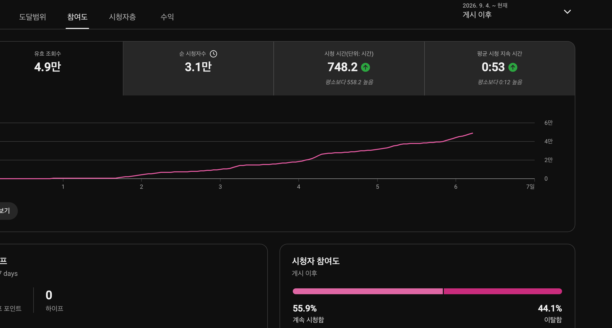
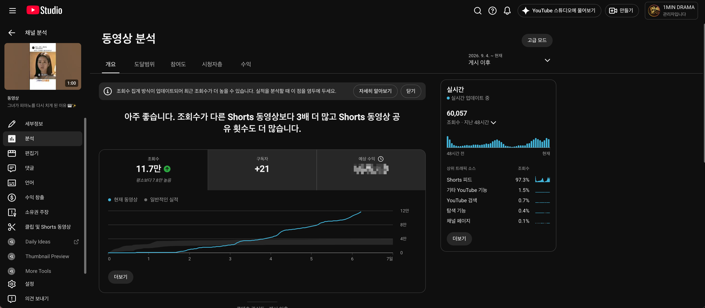
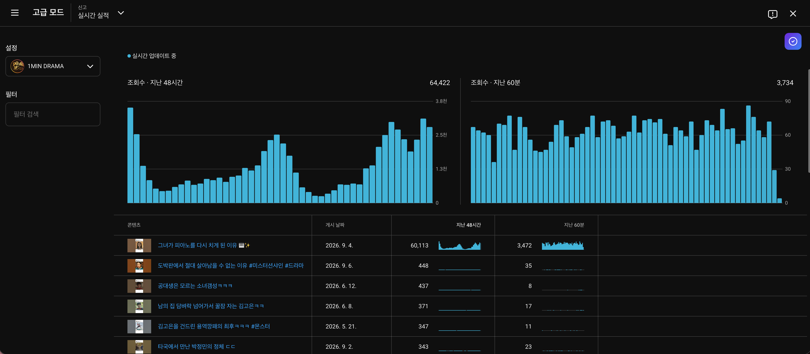
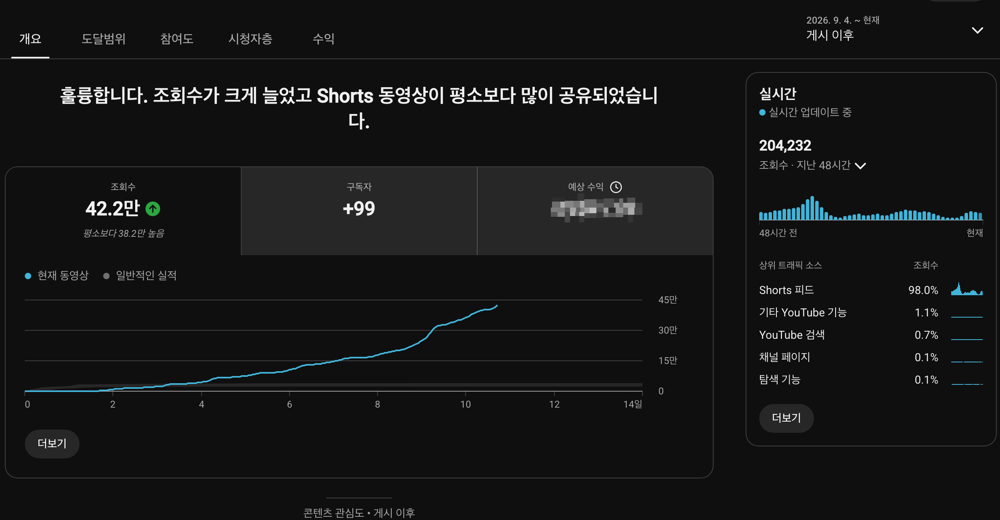
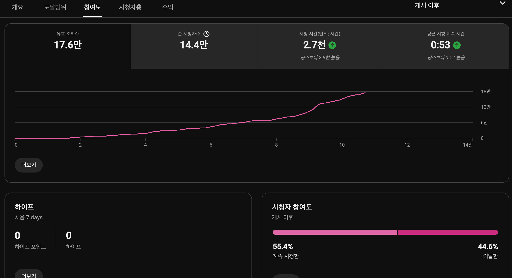
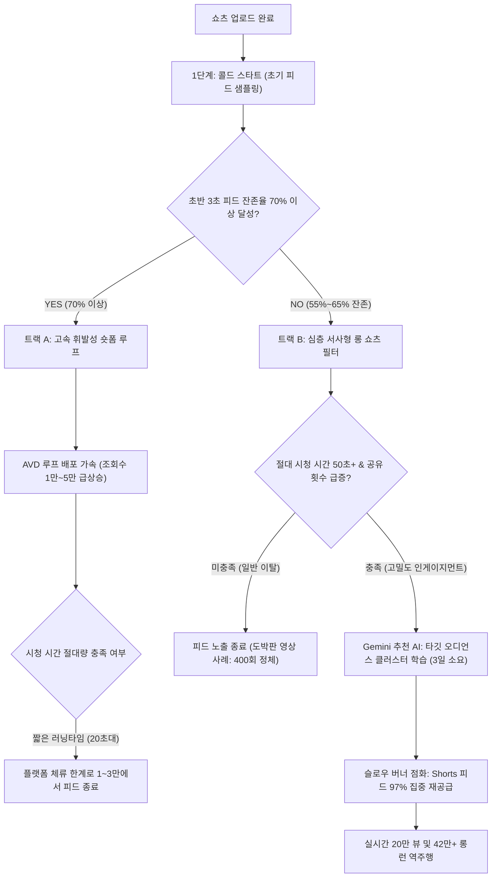

유튜브 쇼츠 생태계에는 모든 크리에이터가 금과옥조처럼 여기는 하나의 절대 규칙이 있습니다. 바로 '피드 잔존율 70%의 법칙'입니다. 시청자가 영상을 넘기지 않고 머무는 비율(Viewed vs Swiped away)이 70% 아래로 떨어지면, 알고리즘은 해당 콘텐츠의 추천 배포를 즉각 중단하고 피드를 차갑게 닫아버린다는 것이 지난 수년간 수많은 채널에서 확인된 정설이었습니다.

실제로 연구소 자체 운영 쇼츠 채널의 운영 데이터에서도 이 규칙은 매번 냉혹하게 작용했습니다. 평균 조회율이 150%를 넘나들며 시청자가 영상을 두 번씩 반복 시청해도 피드 잔존율이 60%대에 머문 영상은 예외 없이 1만 뷰 문턱에서 멈춰 섰습니다.

그런데 최근 스튜디오 대시보드에 상식을 정면으로 뒤흔드는 기이한 데이터가 포착되었습니다. 피드 잔존율이 겨우 55.9%에 불과하여 조기 폐기 처분되었어야 할 한 편의 영상이, 게시 3일 차부터 가파르게 피드를 타기 시작하더니 순식간에 11만 뷰를 돌파하며 채널의 실시간 트래픽을 집어삼킨 것입니다.

알고리즘의 문지기 기준에 미달한 영상이 어떻게 97.3%의 순수 쇼츠 피드 트래픽을 끌어모으며 역주행할 수 있었을까요? 실제 스튜디오 지표를 대조하며 유튜브 추천 엔진의 숨겨진 가중치 체계를 추적했습니다.

---

## 스튜디오 실측 데이터 영상 요약: 42만 뷰 역주행의 전말

본 분석에서 다루는 핵심 지표와 2트랙 추천 알고리즘의 동작 메커니즘을 4분 22초 분량의 모션 그래픽으로 시각화한 비디오 리포트입니다. 텍스트를 읽기 전 영상으로 전체적인 데이터 흐름을 먼저 확인하실 수 있습니다.

  <iframe
    src="https://www.youtube-nocookie.com/embed/1dCibxRrrfQ"
    title="쇼츠 알고리즘의 역설: 피드 잔존율 55% 영상이 42만 뷰를 돌파한 절대 시청 시간과 공유의 힘"
    allow="accelerometer; autoplay; clipboard-write; encrypted-media; gyroscope; picture-in-picture; web-share"
    allowfullscreen
    loading="lazy">
  </iframe>

---

## 스튜디오 데이터의 충돌: 완주율 150%의 정체와 잔존율 55%의 역주행

현상을 규명하기 위해 동일 채널에서 비슷한 시기에 발행된 쇼츠 세 편의 스튜디오 핵심 지표를 나란히 배치했습니다. 

| 비교 항목 | [Case X] 서스펜스 대화 쇼츠 (22초) (9/2) | [Case Y] 시대극 명대사 쇼츠 (29초) (9/1) | [Case Z] 피아노 연주 서사 쇼츠 (60초) (9/4) |
|---|---|---|---|
| 영상 길이 | 22초 | 29초 | **60초 (풀타임 쇼츠)** |
| 완주율 (AVD %) | **150.6%** (루프 발생) | **125.3%** | 88.3% |
| 피드 잔존율 (Viewed) | 66.0% | 54.5% | **55.9%** |
| **절대 시청 시간** | **33초** | **36초** | **53초 (압도적 우위)** |
| 총 시청 시간 | 120.4시간 | 289.1시간 | **748.2시간** |
| 누적 유효 조회수 | 1.3만 회 (피드 종료) | 2.9만 회 (피드 종료) | **11.7만 회 (실시간 진행 중)** |
| 알고리즘 진단 | 70% 미달로 추천 정체 | 피드 이탈로 조기 종료 | **공유 횟수 급증 & 피드 97.3% 재배포** |

표를 살펴보면 상식적인 통계의 인과관계가 완전히 뒤집혀 있음을 알 수 있습니다.

9월 2일에 올린 22초 영상은 평균 조회율이 무려 150.6%에 달했습니다. 시청자들이 영상을 평균 1.5회 반복 시청했다는 뜻입니다. 그러나 피드 잔존율이 66%에 머무르자 추천 엔진은 1.3만 회에서 곡선을 수평으로 꺾어버렸습니다. 9월 1일의 29초 영상 역시 125.3%라는 높은 완주율을 기록했음에도 54.5%의 낮은 피드 잔존율 때문에 2.9만 회에서 배포가 멈췄습니다.

반면 9월 4일에 게시된 *"[Case Z] 피아노 연주 서사 쇼츠 (60초)"*는 피드 잔존율이 55.9%로 세 영상 중 최하위권에 머물렀습니다. 10명 중 4명 이상(44.1%)이 영상을 보자마자 손가락을 올려 넘겨버렸다는 의미입니다. 그런데도 이 영상은 11.7만 회를 훌쩍 넘어 실시간으로 매시간 수천 회씩 조회수를 뿜어내고 있습니다.

이 모순된 데이터 뒤에는 크리에이터들이 간과하기 쉬운 두 가지 거대한 알고리즘 변수가 자리 잡고 있습니다.

---

## 첫 번째 단서: 비율(%)의 함정을 깨부순 53초의 절대 체류 시간

해답의 실마리는 참여도 탭의 세부 시청 지표에서 드러납니다.

위 스튜디오 화면에서 주목해야 할 수치는 백분율이 아닌 '평균 시청 지속 시간 0:53(53초)'과 '총 시청 시간 748.2시간'입니다.

유튜브 추천 알고리즘의 최우선 목적함수(Objective Function)는 시청자를 플랫폼 내에 단 1초라도 더 오래 묶어두는 것입니다. 알고리즘은 화면에 표시되는 완주율 퍼센티지(%)만 단순 평가하지 않고, 한 명의 시청자가 실제로 소비한 '절대 물리 시간(Absolute Seconds)'을 정밀하게 계산합니다.

* 22초 길이 쇼츠에서 150% 완주가 발생했을 때: 1인당 시청 시간은 **33초**입니다.
* 29초 길이 쇼츠에서 125% 완주가 발생했을 때: 1인당 시청 시간은 **36초**입니다.
* 60초 길이 쇼츠에서 88.3%를 시청했을 때: 1인당 시청 시간은 무려 **53초**에 달합니다.

22초짜리 짧은 영상은 시청자가 아무리 반복해서 시청해도 플랫폼에 기여하는 절대 체류 시간이 30초 내외에 머뭅니다. 그러나 60초 분량을 꽉 채운 롱 쇼츠에서 시청자가 53초간 머물렀다면, 플랫폼 입장에서는 한 사람당 20초 이상의 체류 시간을 추가로 확보한 셈이 됩니다.

결국 55.9%라는 낮은 피드 진입률로 인한 감점 요인을, 영상을 끝까지 본 시청자들이 누적시킨 748.2시간의 압도적인 플랫폼 잔류 기여도가 완전히 상쇄하고도 남았던 것입니다.

또 하나 눈여겨볼 점은 조회수 증가 곡선의 형태입니다. 게시 후 0일부터 2일까지는 완만한 바닥을 기어가다가, 3일 차를 기점으로 각도가 가파르게 꺾이며 지속 상승하는 전형적인 '슬로우 버너(Slow Burner)' 궤적을 그리고 있습니다. 초반의 낮은 잔존율로 인해 대중 탐색 피드에서 밀려났던 영상이 특정 계기로 다시 점화되었음을 암시합니다.

---

## 두 번째 단서: 스튜디오가 직접 지목한 '공유(Share)' 가중치

조회수 곡선이 3일 차에 재점화된 원인은 개요 대시보드 상단의 공식 시스템 안내문에서 확인할 수 있습니다.

유튜브 스튜디오는 영상의 실적을 분석하여 다음과 같은 이례적인 시스템 진단을 표시했습니다.

> *"아주 좋습니다. 조회수가 다른 Shorts 동영상보다 3배 더 많고 Shorts 동영상 공유 횟수도 더 많습니다."*

유튜브가 대시보드 상단 텍스트로 특정 지표를 직접 언급하는 경우는 알고리즘 내부 평가에서 해당 신호가 비정상적인 가중치로 작용했을 때뿐입니다. 바로 **'공유(Share)'** 횟수입니다.

추천 시스템의 신호 체계에서 시청 행위는 성격에 따라 위계가 나뉩니다.

1. **1차 수동적 신호 (Passive Consumption)**: 스와이프하지 않고 화면을 보는 행위(피드 잔존율), 단순히 끝까지 틀어두는 행위(완주율).
2. **2차 능동적 신호 (Active Engagement)**: 좋아요 클릭, 댓글 작성.
3. **3차 확산적 신호 (Viral Social Signal)**: 외부 메신저나 SNS로 링크를 전송하는 **공유(Share)**.

단순 시청이나 좋아요는 1인 1회의 소비로 끝나지만, 공유는 시청자가 자발적인 콘텐츠 배포자가 되는 행위입니다. 카카오톡 단체 대화방, 인스타그램 DM, 블로그 등으로 공유된 링크는 새로운 시청자를 유튜브 플랫폼 내부로 끌어들이는 외부 유입 통로가 됩니다.

더 중요한 사실은 공유 링크를 타고 들어온 시청자의 질적 가치입니다. 지인의 추천으로 유입된 시청자는 피드에서 무작위로 영상을 넘겨보는 일반 이용자에 비해 첫 장면 이탈률이 극히 낮고, 60초 영상의 마지막 장면까지 높은 몰입도로 완주합니다. 

이러한 고순도 시청 신호가 축적되자, 알고리즘은 이 영상을 단순 숏폼이 아닌 '이탈률을 감수하고서라도 특정 타깃층에게 적극 추천할 만한 가치가 있는 고밀도 서사 자산'으로 재분류했습니다. 그 결과 실시간 트래픽의 **97.3%**를 Shorts 피드로 강제 주입하는 거대한 재배포 루프가 형성되었습니다.

---

## 세 번째 단서: 채널 실시간 트래픽의 93%를 독점한 오디언스 클러스터

실시간 실적 대시보드를 열어보면 이 영상이 채널 전체에 미친 파급력이 더욱 뚜렷하게 드러납니다.

채널 자체 운영 채널의 지난 48시간 전체 조회수 64,422회 중, *"[Case Z] 피아노 연주 서사 쇼츠 (60초)"* 한 편이 기록한 조회수는 **60,113회**로 전체 트래픽의 **93.3%**를 차지했습니다. 지난 60분간 발생한 3,734회 중에서도 3,472회가 이 영상에 집중되었습니다.

반면 9월 6일에 올린 *"도박판에서 절대 살아남을 수 없는 이유"*는 지난 48시간 동안 448회에 그쳤습니다. 동일한 드라마 리뷰 장르임에도 왜 한 영상은 피드를 집어삼키고 다른 영상은 초기 단계에서 멈추었을까요?

이것이 바로 머신러닝 기반 추천 시스템이 작동하는 '타깃 오디언스 클러스터(Audience Cluster)의 발견' 과정입니다.

피아노 영상은 초반 48시간 동안 무작위 대중에게 배포되었을 때 44.1%의 높은 이탈을 겪었습니다. 그러나 영상을 끝까지 보고 공유를 누른 55.9% 시청자의 데이터(선호하는 음악 태그, 시청 시간대, 유사 감동 드라마 소비 이력)를 AI가 정밀 분석하면서, 3일 차부터 '감정적 카타르시스와 클래식/피아노 서사를 선호하는 정밀 타깃 군집'을 발견해 낸 것입니다.

클러스터가 확정되자 알고리즘은 불특정 다수가 아닌 해당 군집의 피드에 영상을 집중 배포하기 시작했고, 그 결과 전환율과 공유 횟수가 폭발하며 60분당 3,500회라는 실시간 공급 가속을 이끌어냈습니다.

---

## 종단 추적 실측: 11만에서 42만 뷰로의 2차 급상승과 공유 엔진의 위력

최초 실측 분석을 기록한 9월 10일(게시 6일 차) 이후, 연구소는 이 영상의 추천 알고리즘 궤적을 5일간 추가 추적했습니다. 일반적인 쇼츠 영상이 1~2차 피드 배포 후 1주일 이내에 트래픽이 완전히 소진되는 것과 달리, 이 영상은 8일 차부터 곡선의 기울기를 한 번 더 가파르게 세우며 42만 뷰를 돌파하는 2차 퀀텀 점프를 기록했습니다.

11.7만 뷰 당시의 1차 실측 데이터와 42.2만 뷰에 도달한 2차 실측 데이터를 나란히 대조한 결과는 다음과 같습니다.

| 분석 시점 | 1차 실측 (게시 6일 차, 9/10) | 2차 실측 (게시 11일 차, 9/15) | 변화량 및 알고리즘 해석 |
|---|---|---|---|
| **누적 조회수** | 11.7만 회 | **42.2만 회** | **+260% (3.6배 폭증)** |
| **유효 조회수** | 4.9만 회 | **17.6만 회** | 3.6배 동반 상승 (안정적 집계 유지) |
| **순 시청자수** | 3.1만 명 | **14.4만 명** | **총 조회수 대비 34% (1인당 2.9회 반복 및 공유 소비)** |
| **총 시청 시간** | 748.2시간 | **2,700시간 (2.7천 시간)** | **플랫폼 체류 시간 압도적 축적 (3.6배 기여)** |
| **평균 시청 지속 시간** | **0:53 (53초)** | **0:53 (53초 고정 유지)** | **모수 4배 확장에도 퀄리티 1초도 저하 없음** |
| **피드 잔존율 (Viewed)** | 55.9% | **55.4%** | 대중 탐색 확장에도 55% 지지선 방어 |
| **실시간 48시간 조회수** | 60,057회 | **204,232회** | **20만 뷰 이상 거대 스파이크 지속 유지** |
| **스튜디오 시스템 진단** | "조회수 3배, 공유 횟수 더 많음" | **"Shorts 동영상이 평소보다 많이 공유되었습니다"** | **공유 신호가 2차 가속 엔진으로 작용** |

위 스튜디오 대시보드는 숏폼 알고리즘이 대규모 확장 단계에서 어떻게 반응하는지 명확한 3가지 메커니즘을 입증합니다.

### 1. 모수가 4배로 늘어나도 무너지지 않은 '53초의 불변성'
통상적으로 영상의 조회수가 10만에서 40만 이상으로 폭증하면, 영상에 관심이 적은 광범위한 불특정 대중에게 피드가 확장되면서 평균 시청 시간과 잔존율이 급락하는 것이 일반적입니다.

그러나 이번 실측에서 가장 경이로운 지표는 **'평균 시청 지속 시간 0:53(53초)'이 11.7만 회 때와 42.2만 회 때 완벽히 동일하게 유지**되었다는 점입니다. 피드 잔존율 역시 55.9%에서 55.4%로 겨우 0.5%p 변동에 그쳤습니다. 

이것은 추천 알고리즘이 무차별적으로 피드를 뿌린 것이 아니라, 53초 동안 영상을 몰입해서 볼 확률이 높은 유사 오디언스 군집을 연쇄적으로 찾아내어 정밀 타깃팅을 계속 확장했음을 보여줍니다. 60초 풀타임 영상에서 2,700시간이라는 절대 체류 시간을 지속적으로 플랫폼에 공급하자, 추천 엔진은 이 영상을 '플랫폼 잔류 가치가 극대화된 슈퍼 에셋'으로 분류하여 피드 공급의 고삐를 늦추지 않았습니다.

### 2. 순 시청자 14.4만 대비 총 조회수 42.2만 (2.9회 증폭률)
참여도 탭에서 새롭게 드러난 핵심 지표는 **'순 시청자수 14.4만 명'**입니다. 전체 조회수 42.2만 회 중 순수하게 영상을 시청한 고유 사용자는 14.4만 명으로, 전체의 약 34% 수준입니다.

즉, 한 명의 순 시청자가 이 영상을 평균 **2.9회** 소비했다는 계산이 나옵니다. 60초짜리 서사형 영상을 그 자리에서 3번 연속 돌려보거나, 며칠 뒤 다시 찾아보거나, 외부 링크를 통해 재방문했다는 의미입니다. 단순 스와이프 피드 소비에서는 결코 나타날 수 없는 비정상적인 다회 시청 배율입니다.

### 3. 스튜디오가 공인한 '공유 엔진'과 48시간 20만 트래픽 유지
개요 대시보드 상단의 시스템 진단 문구는 11만 뷰 당시의 안내문에서 한 단계 더 진화하여 다음과 같이 명시되었습니다:

> *"훌륭합니다. 조회수가 크게 늘었고 Shorts 동영상이 평소보다 많이 공유되었습니다."*

게시 8일 차부터 곡선이 수직으로 다시 치솟은 2차 급상승의 핵심 동력은 피드 자체의 우연이 아니라, **시청자들의 자발적인 '외부 공유(카카오톡, 인스타그램, 커뮤니티)'**였습니다. 공유 링크를 통해 유입된 시청자들은 이미 지인의 추천이라는 사전 맥락을 가지고 진입하기 때문에 53초 완주율이 극히 높았고, 이것이 다시 유튜브 내부 머신러닝의 추천 점수를 자극하여 실시간 48시간 204,232회라는 거대한 트래픽 폭포수를 지속시킨 것입니다.

---

## 쇼츠 추천 엔진의 2트랙 아키텍처

이러한 일련의 메커니즘을 추천 파이프라인 관점에서 도식화하면 다음과 같습니다.

위 구조에서 확인되듯, 유튜브 쇼츠의 추천 통로는 단 하나가 아닙니다.

* **트랙 A (고속 휘발성 루프)**: 15~30초 분량의 짧은 영상이 초반 3초 후킹으로 잔존율 70% 이상을 방어하여 빠르게 피드를 확장하는 경로입니다. 다만 영상 길이가 너무 짧으면 반복 시청이 일어나도 절대 체류 시간의 한계로 인해 수만 회 선에서 피드가 닫히기 쉽습니다.
* **트랙 B (심층 서사형 슬로우 버너)**: 50~60초 분량의 롱 쇼츠가 선택하는 경로입니다. 호불호로 인해 초반 피드 잔존율은 55~65% 수준으로 낮게 시작하지만, 끝까지 시청한 사람들의 '50초 이상의 절대 체류 시간'과 '자발적 공유 신호'가 결합하면 머신러닝이 전용 클러스터를 찾아내며 수십만 뷰 이상으로 롱런합니다.

---

## 크리에이터가 취해야 할 2대 쇼츠 제작 전략

이 실증 분석이 크리에이터에게 주는 실천적 함의는 명확합니다. 채널의 모든 영상을 억지로 초반 3초 후킹과 빠른 컷 편집에만 얽매이게 만들 필요가 없다는 점입니다. 콘텐츠의 목적에 따라 두 가지 전략을 명확히 분리해야 합니다.

### 1. 20초 숏 쇼츠: 잔존율 중심의 게릴라 훅 전략
* **목표**: 70% 이상의 피드 잔존율 확보 및 120% 이상의 루프 완주.
* **적용 장르**: 직관적인 유머, 반전 결말, 시각적 트릭, 밈(Meme).
* **핵심 지침**: 설명과 서사를 과감히 걷어내고 첫 1초부터 본론을 던져야 합니다. 결말과 시작이 자연스럽게 이어지는 무이음 루프(Seamless Loop) 설계로 20초 이내에 승부를 보아야 합니다.

### 2. 60초 롱 쇼츠: 서사와 공유 중심의 감정 몰입 전략
* **목표**: 50초 이상의 절대 시청 시간 유지 및 시청자의 능동적 공유 유도.
* **적용 장르**: 영화/드라마 하이라이트, 감동 실화, 심층 지식 전달, 인간적 공감대 서사.
* **핵심 지침**: 초반 잔존율이 55% 수준으로 떨어지는 것을 두려워할 필요가 없습니다. 대신 영상을 끝까지 본 사람에게 눈물, 감동, 깨달음 등 '타인에게 보여주고 싶다'는 강한 동기를 심어주어야 합니다. 결말부에 여운을 남기는 배경음악과 서사를 배치하여 공유 버튼을 누르게 만드는 것이 70% 잔존율보다 훨씬 강력한 추천 레버리지가 됩니다.

---

## 데이터가 증명하는 알고리즘의 본질

유튜브 쇼츠는 단순한 스와이프 도박판이 아닙니다. 숫자로 표시되는 단편적인 잔존율 퍼센티지 이면에는, 시청자가 실제로 보낸 시간의 무게와 타인과 나누고 싶어 했던 감정의 크기를 측정하는 고도화된 인공지능 평가 엔진이 가동되고 있습니다.

단순한 수치 하나에 일희일비하기보다, 내 영상이 시청자에게 어떤 방식으로 시간을 소비하게 만들고 있는지 구조적으로 들여다보는 통찰이 필요한 시점입니다.

---

### 공식 권위 참고 자료 (References)
* [YouTube Creators Official Guide: Understanding Shorts Analytics](https://support.google.com/youtube/answer/9314418) - 유튜브 고객센터 쇼츠 참여도 및 조회수 분석 공식 가이드
* [Think with Google: How Viewers Engage with Short-Form Video](https://www.thinkwithgoogle.com/marketing-strategies/video/) - 숏폼 비디오 인게이지먼트 및 플랫폼 체류 행동 분석 리포트
* [Google Research: Deep Neural Networks for YouTube Recommendations](https://research.google/pubs/pub45530/) - 구글 리서치 유튜브 추천 시스템의 체류 시간 및 가중치 최적화 모델 논문
