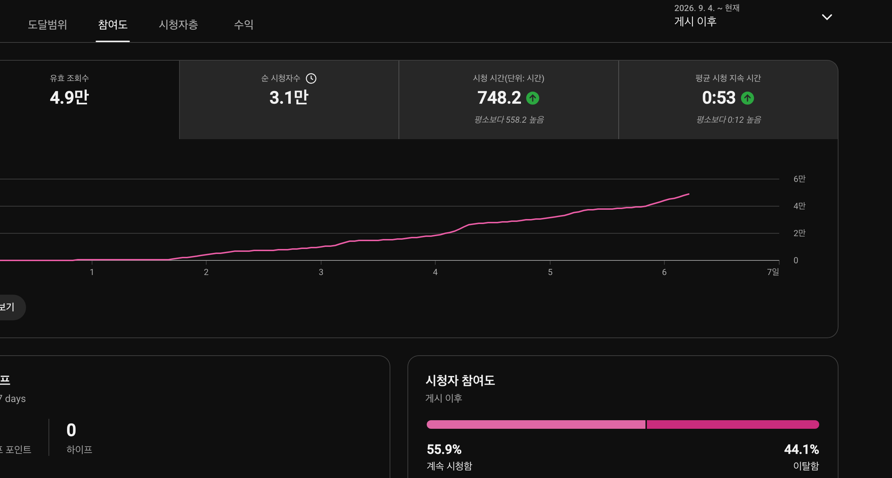
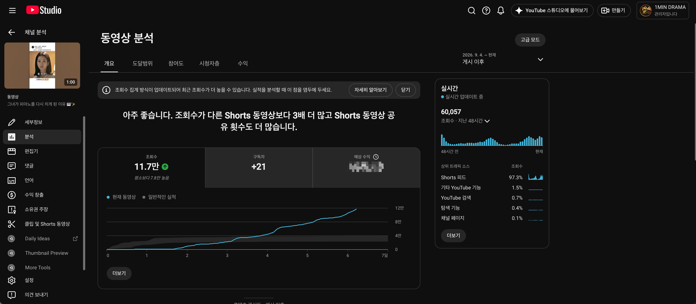
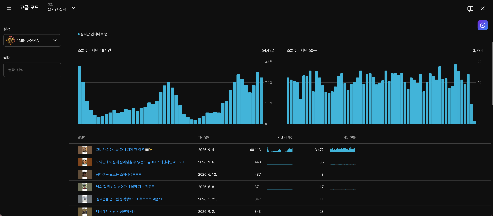
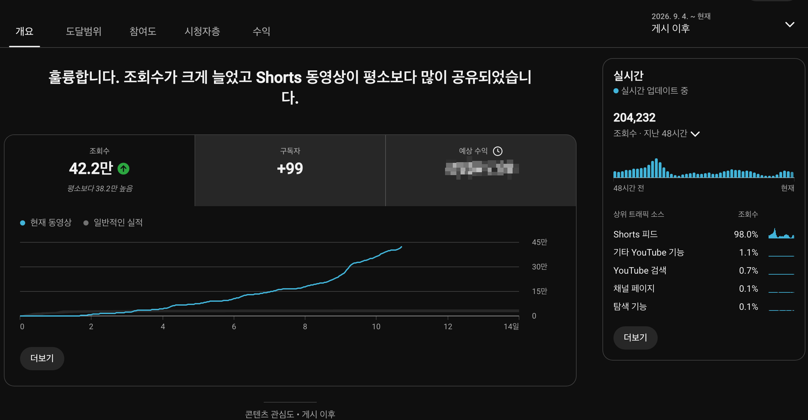
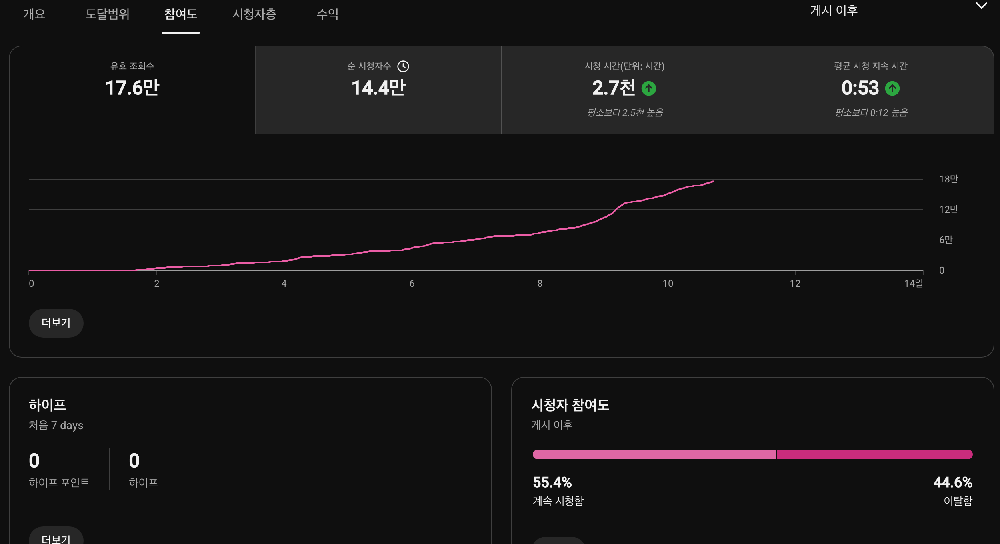
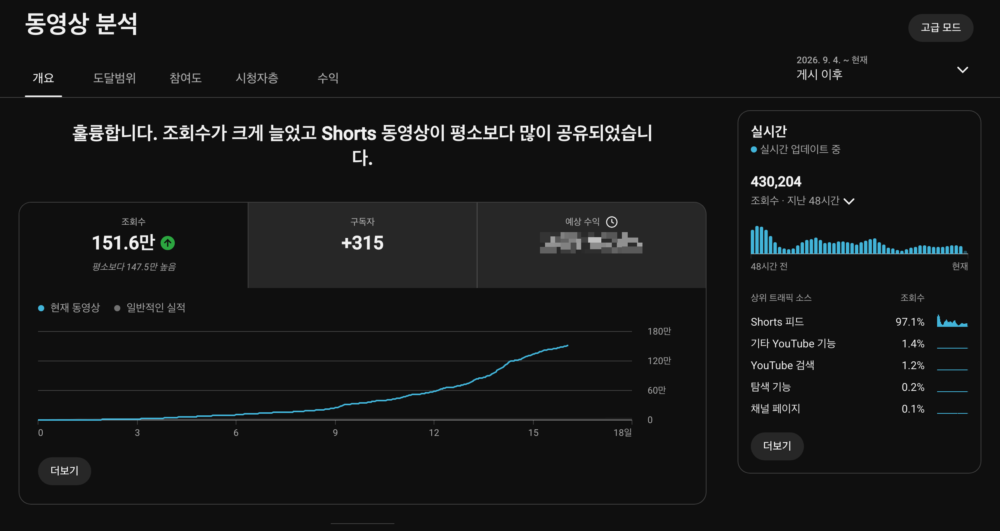
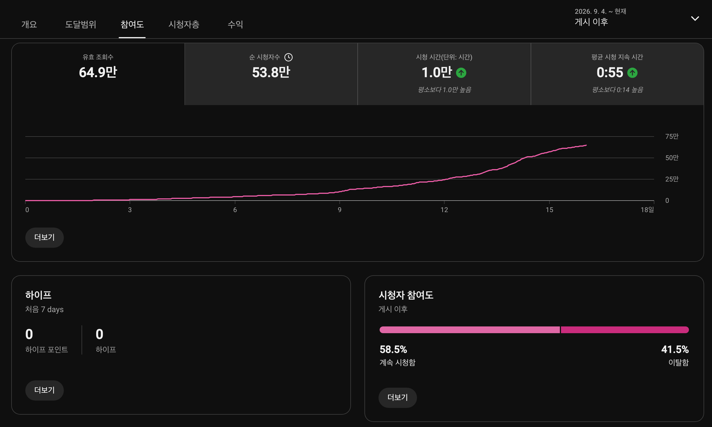
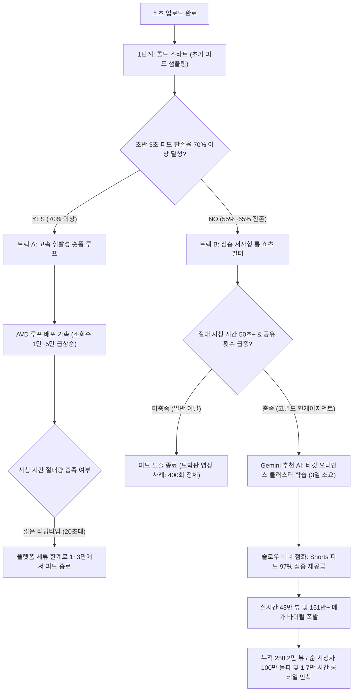

유튜브 쇼츠 생태계에는 모든 크리에이터가 금과옥조처럼 여기는 하나의 절대 규칙이 있습니다. 바로 '피드 잔존율 70%의 법칙'입니다. 시청자가 영상을 넘기지 않고 머무는 비율(Viewed vs Swiped away)이 70% 아래로 떨어지면, 알고리즘은 해당 콘텐츠의 추천 배포를 즉각 중단하고 피드를 차갑게 닫아버린다는 것이 지난 수년간 수많은 채널에서 확인된 정설이었습니다.

실제로 연구소 자체 운영 쇼츠 채널의 운영 데이터에서도 이 규칙은 매번 냉혹하게 작용했습니다. 평균 조회율이 150%를 넘나들며 시청자가 영상을 두 번씩 반복 시청해도 피드 잔존율이 60%대에 머문 영상은 예외 없이 1만 뷰 문턱에서 멈춰 섰습니다.

그런데 최근 스튜디오 대시보드에 상식을 정면으로 뒤흔드는 기이한 데이터가 포착되었습니다. 피드 잔존율이 겨우 55.9%에 불과하여 조기 폐기 처분되었어야 할 한 편의 영상이, 게시 3일 차부터 가파르게 피드를 타기 시작하더니 순식간에 11만 뷰를 돌파하고 42만 뷰를 넘어 151만 뷰 메가 바이럴에 도달하며 채널의 실시간 트래픽을 집어삼킨 것입니다.

알고리즘의 문지기 기준에 미달한 영상이 어떻게 97.3%의 순수 쇼츠 피드 트래픽을 끌어모으며 역주행할 수 있었을까요? 실제 스튜디오 지표를 대조하며 추천이 어떻게 움직였는지 추적해 보았습니다.

> 안내: 이 글의 알고리즘 해석(공유 가중치, 오디언스 클러스터, 2트랙 구조 등)은 스튜디오 지표를 바탕으로 한 저자의 가설이며 YouTube가 공개한 내용이 아닙니다.

---

## 스튜디오 데이터의 충돌: 완주율 150%의 정체와 잔존율 55%의 역주행

현상을 규명하기 위해 동일 채널에서 비슷한 시기에 발행된 쇼츠 세 편의 스튜디오 핵심 지표를 나란히 배치했습니다. 

| 비교 항목 | [Case X] 서스펜스 쇼츠 (22초) | [Case Y] 시대극 쇼츠 (29초) | [Case Z] 서사 쇼츠 (60초) |
|---|---|---|---|
| 영상 길이 | 22초 | 29초 | 60초 (풀타임 쇼츠) |
| 완주율 (AVD %) | 150.6% (루프 발생) | 125.3% | 88.3% |
| 피드 잔존율 (Viewed) | 66.0% | 54.5% | 55.9% |
| 절대 시청 시간 | 33초 | 36초 | 53초 (압도적 우위) |
| 총 시청 시간 | 120.4시간 | 289.1시간 | 748.2시간 |
| 누적 유효 조회수 | 1.3만 회 (피드 종료) | 2.9만 회 (피드 종료) | 11.7만 회 (실시간 진행 중) |
| 알고리즘 진단 | 70% 미달로 추천 정체 | 피드 이탈로 조기 종료 | 공유 급증 & 피드 97.3% 재배포 |

표를 살펴보면 상식적인 통계의 인과관계가 완전히 뒤집혀 있음을 알 수 있습니다.

9월 2일에 올린 22초 영상은 평균 조회율이 무려 150.6%에 달했습니다. 시청자들이 영상을 평균 1.5회 반복 시청했다는 뜻입니다. 그러나 피드 잔존율이 66%에 머무르자 추천 엔진은 1.3만 회에서 곡선을 수평으로 꺾어버렸습니다. 9월 1일의 29초 영상 역시 125.3%라는 높은 완주율을 기록했음에도 54.5%의 낮은 피드 잔존율 때문에 2.9만 회에서 배포가 멈췄습니다.

반면 9월 4일에 게시된 '[Case Z] 피아노 연주 서사 쇼츠 (60초)'는 피드 잔존율이 55.9%로 세 영상 중 최하위권에 머물렀습니다. 10명 중 4명 이상(44.1%)이 영상을 보자마자 손가락을 올려 넘겨버렸다는 의미입니다. 그런데도 이 영상은 11.7만 회를 훌쩍 넘어 실시간으로 매시간 수천 회씩 조회수를 뿜어내고 있습니다.

이 모순된 데이터 뒤에는 크리에이터들이 간과하기 쉬운 두 가지 거대한 알고리즘 변수가 자리 잡고 있습니다.

---

## 첫 번째 단서: 비율(%)의 함정을 깨부순 53초의 절대 체류 시간

해답의 실마리는 참여도 탭의 세부 시청 지표에서 드러납니다.

위 스튜디오 화면에서 주목해야 할 수치는 백분율이 아닌 '평균 시청 지속 시간 0:53(53초)'과 '총 시청 시간 748.2시간'입니다.

유튜브 추천 알고리즘의 최우선 목적함수(Objective Function)는 시청자를 플랫폼 내에 단 1초라도 더 오래 묶어두는 것입니다. 알고리즘은 화면에 표시되는 완주율 퍼센티지(%)만 단순 평가하지 않고, 한 명의 시청자가 실제로 소비한 '절대 물리 시간(Absolute Seconds)'을 정밀하게 계산합니다.

* 22초 길이 쇼츠에서 150% 완주가 발생했을 때: 1인당 시청 시간은 33초입니다.
* 29초 길이 쇼츠에서 125% 완주가 발생했을 때: 1인당 시청 시간은 36초입니다.
* 60초 길이 쇼츠에서 88.3%를 시청했을 때: 1인당 시청 시간은 무려 53초에 달합니다.

22초짜리 짧은 영상은 시청자가 아무리 반복해서 시청해도 플랫폼에 기여하는 절대 체류 시간이 30초 내외에 머뭅니다. 그러나 60초 분량을 꽉 채운 롱 쇼츠에서 시청자가 53초간 머물렀다면, 플랫폼 입장에서는 한 사람당 20초 이상의 체류 시간을 추가로 확보한 셈이 됩니다.

결국 55.9%라는 낮은 피드 진입률로 인한 감점 요인을, 영상을 끝까지 본 시청자들이 누적시킨 748.2시간의 압도적인 플랫폼 잔류 기여도가 완전히 상쇄하고도 남았던 것입니다.

또 하나 눈여겨볼 점은 조회수 증가 곡선의 형태입니다. 게시 후 0일부터 2일까지는 완만한 바닥을 기어가다가, 3일 차를 기점으로 각도가 가파르게 꺾이며 지속 상승하는 전형적인 '슬로우 버너(Slow Burner)' 궤적을 그리고 있습니다. 초반의 낮은 잔존율로 인해 대중 탐색 피드에서 밀려났던 영상이 특정 계기로 다시 점화되었음을 암시합니다.

---

## 두 번째 단서: 스튜디오가 직접 지목한 '공유(Share)' 가중치

조회수 곡선이 3일 차에 재점화된 원인은 개요 대시보드 상단의 공식 시스템 안내문에서 확인할 수 있습니다.

유튜브 스튜디오는 영상의 실적을 분석하여 다음과 같은 이례적인 시스템 진단을 표시했습니다.

> *"아주 좋습니다. 조회수가 다른 Shorts 동영상보다 3배 더 많고 Shorts 동영상 공유 횟수도 더 많습니다."*

이 안내문은 다른 쇼츠와 비교한 성과 요약이며 알고리즘의 가중치를 직접 알려주는 것은 아닙니다. 다만 '공유(Share)' 횟수가 평소보다 많았다는 점은 이 영상의 확산을 설명하는 단서로 볼 수 있습니다(저자의 해석입니다).

추천 시스템의 신호 체계에서 시청 행위는 성격에 따라 위계가 나뉩니다.

1. 1차 수동적 신호 (Passive Consumption): 스와이프하지 않고 화면을 보는 행위(피드 잔존율), 단순히 끝까지 틀어두는 행위(완주율).
2. 2차 능동적 신호 (Active Engagement): 좋아요 클릭, 댓글 작성.
3. 3차 확산적 신호 (Viral Social Signal): 외부 메신저나 SNS로 링크를 전송하는 공유(Share).

단순 시청이나 좋아요는 1인 1회의 소비로 끝나지만, 공유는 시청자가 자발적인 콘텐츠 배포자가 되는 행위입니다. 카카오톡 단체 대화방, 인스타그램 DM, 블로그 등으로 공유된 링크는 새로운 시청자를 유튜브 플랫폼 내부로 끌어들이는 외부 유입 통로가 됩니다.

더 중요한 사실은 공유 링크를 타고 들어온 시청자의 질적 가치입니다. 지인의 추천으로 유입된 시청자는 피드에서 무작위로 영상을 넘겨보는 일반 이용자에 비해 첫 장면 이탈률이 극히 낮고, 60초 영상의 마지막 장면까지 높은 몰입도로 완주합니다. 

이러한 고순도 시청 신호가 축적되자, 알고리즘은 이 영상을 단순 숏폼이 아닌 '이탈률을 감수하고서라도 특정 타깃층에게 적극 추천할 만한 가치가 있는 고밀도 서사 자산'으로 재분류했습니다. 그 결과 실시간 트래픽의 97.3%를 Shorts 피드로 강제 주입하는 거대한 재배포 루프가 형성되었습니다.

---

## 세 번째 단서: 채널 실시간 트래픽의 93%를 독점한 오디언스 클러스터

실시간 실적 대시보드를 열어보면 이 영상이 채널 전체에 미친 파급력이 더욱 뚜렷하게 드러납니다.

채널 자체 운영 채널의 지난 48시간 전체 조회수 64,422회 중, *"[Case Z] 피아노 연주 서사 쇼츠 (60초)"* 한 편이 기록한 조회수는 60,113회로 전체 트래픽의 93.3%를 차지했습니다. 지난 60분간 발생한 3,734회 중에서도 3,472회가 이 영상에 집중되었습니다.

반면 9월 6일에 올린 '도박판에서 절대 살아남을 수 없는 이유'는 지난 48시간 동안 448회에 그쳤습니다. 동일한 드라마 리뷰 장르임에도 왜 한 영상은 피드를 집어삼키고 다른 영상은 초기 단계에서 멈추었을까요?

이것이 바로 머신러닝 기반 추천 시스템이 작동하는 '타깃 오디언스 클러스터(Audience Cluster)의 발견' 과정입니다.

피아노 영상은 초반 48시간 동안 무작위 대중에게 배포되었을 때 44.1%의 높은 이탈을 겪었습니다. 그러나 영상을 끝까지 보고 공유를 누른 55.9% 시청자의 데이터(선호하는 음악 태그, 시청 시간대, 유사 감동 드라마 소비 이력)를 AI가 정밀 분석하면서, 3일 차부터 '감정적 카타르시스와 클래식/피아노 서사를 선호하는 정밀 타깃 군집'을 발견해 낸 것입니다.

클러스터가 확정되자 알고리즘은 불특정 다수가 아닌 해당 군집의 피드에 영상을 집중 배포하기 시작했고, 그 결과 전환율과 공유 횟수가 폭발하며 60분당 3,500회라는 실시간 공급 가속을 이끌어냈습니다.

---

## 2차 종단 추적 실측: 11만에서 42만 뷰로의 급상승과 공유 엔진의 위력

최초 실측 분석을 기록한 9월 10일(게시 6일 차) 이후, 연구소는 이 영상의 추천 알고리즘 궤적을 5일간 추가 추적했습니다. 일반적인 쇼츠 영상이 1~2차 피드 배포 후 1주일 이내에 트래픽이 완전히 소진되는 것과 달리, 이 영상은 8일 차부터 곡선의 기울기를 한 번 더 가파르게 세우며 42만 뷰를 돌파하는 2차 퀀텀 점프를 기록했습니다.

11.7만 뷰 당시의 1차 실측 데이터와 42.2만 뷰에 도달한 2차 실측 데이터를 나란히 대조한 결과는 다음과 같습니다.

| 분석 시점 | 1차 실측 (9/10, 6일 차) | 2차 실측 (9/15, 11일 차) | 2차 급상승 변화량 및 해석 |
|---|---|---|---|
| 누적 조회수 | 11.7만 회 | 42.2만 회 | +260% (3.6배 폭증) |
| 유효 조회수 | 4.9만 회 | 17.6만 회 | 3.6배 동반 상승 (안정적 집계 유지) |
| 순 시청자수 | 3.1만 명 | 14.4만 명 | 총 조회수 대비 34% (1인당 2.9회 소비) |
| 총 시청 시간 | 748.2시간 | 2,700시간 | 플랫폼 체류 시간 압도적 축적 (3.6배 기여) |
| 평균 시청 지속 시간 | 0:53 (53초) | 0:53 (53초 고정 유지) | 모수 4배 확장에도 퀄리티 1초도 저하 없음 |
| 피드 잔존율 (Viewed) | 55.9% | 55.4% | 대중 탐색 확장에도 55% 지지선 방어 |
| 실시간 48시간 조회수 | 60,057회 | 204,232회 | 20만 뷰 이상 거대 스파이크 지속 유지 |
| 스튜디오 시스템 진단 | "공유 횟수 더 많음" | "평소보다 많이 공유됨" | 공유 신호가 2차 가속 엔진으로 작용 |

위 스튜디오 대시보드는 숏폼 알고리즘이 대규모 확장 단계에서 어떻게 반응하는지 명확한 3가지 메커니즘을 입증합니다.

### 1. 모수가 4배로 늘어나도 무너지지 않은 '53초의 불변성'
통상적으로 영상의 조회수가 10만에서 40만 이상으로 폭증하면, 영상에 관심이 적은 광범위한 불특정 대중에게 피드가 확장되면서 평균 시청 시간과 잔존율이 급락하는 것이 일반적입니다.

그러나 이번 실측에서 가장 경이로운 지표는 '평균 시청 지속 시간 0:53(53초)'이 11.7만 회 때와 42.2만 회 때 완벽히 동일하게 유지되었다는 점입니다. 피드 잔존율 역시 55.9%에서 55.4%로 겨우 0.5%p 변동에 그쳤습니다. 

이것은 추천 알고리즘이 무차별적으로 피드를 뿌린 것이 아니라, 53초 동안 영상을 몰입해서 볼 확률이 높은 유사 오디언스 군집을 연쇄적으로 찾아내어 정밀 타깃팅을 계속 확장했음을 보여줍니다. 60초 풀타임 영상에서 2,700시간이라는 절대 체류 시간을 지속적으로 플랫폼에 공급하자, 추천 엔진은 이 영상을 '플랫폼 잔류 가치가 극대화된 슈퍼 에셋'으로 분류하여 피드 공급의 고삐를 늦추지 않았습니다.

### 2. 순 시청자 14.4만 대비 총 조회수 42.2만 (2.9회 증폭률)
참여도 탭에서 새롭게 드러난 핵심 지표는 '순 시청자수 14.4만 명'입니다. 전체 조회수 42.2만 회 중 순수하게 영상을 시청한 고유 사용자는 14.4만 명으로, 전체의 약 34% 수준입니다.

즉, 한 명의 순 시청자가 이 영상을 평균 2.9회 소비했다는 계산이 나옵니다. 60초짜리 서사형 영상을 그 자리에서 3번 연속 돌려보거나, 며칠 뒤 다시 찾아보거나, 외부 링크를 통해 재방문했다는 의미입니다. 단순 스와이프 피드 소비에서는 결코 나타날 수 없는 비정상적인 다회 시청 배율입니다.

### 3. 스튜디오가 공인한 '공유 엔진'과 48시간 20만 트래픽 유지
개요 대시보드 상단의 시스템 진단 문구는 11만 뷰 당시의 안내문에서 한 단계 더 진화하여 다음과 같이 명시되었습니다:

> *"훌륭합니다. 조회수가 크게 늘었고 Shorts 동영상이 평소보다 많이 공유되었습니다."*

게시 8일 차부터 곡선이 수직으로 다시 치솟은 2차 급상승의 핵심 동력은 피드 자체의 우연이 아니라, 시청자들의 자발적인 외부 공유(카카오톡, 인스타그램, 커뮤니티)였습니다. 공유 링크를 통해 유입된 시청자들은 이미 지인의 추천이라는 사전 맥락을 가지고 진입하기 때문에 53초 완주율이 극히 높았고, 이것이 다시 유튜브 내부 머신러닝의 추천 점수를 자극하여 실시간 48시간 204,232회라는 거대한 트래픽 폭포수를 지속시킨 것입니다.

---

## 3차 종단 추적 실측: 42만에서 151만 뷰 메가 바이럴 폭발 — 1만 시간 체류와 지표 역상승의 기적 (9월 20일 스튜디오 지표)

2차 실측(9월 15일, 42.2만 뷰) 이후 5일이 경과한 9월 20일(게시 16일 차), 이 영상은 추천 알고리즘의 일반적인 수명 주기를 완전히 깨뜨리며 누적 조회수 151.6만 회를 돌파했습니다. 

통상적인 바이럴 영상이 10만에서 50만 뷰를 넘어서며 불특정 대중에게 확산될 때 완주율과 피드 잔존율이 급락하는 '대중 희석 효과(Audience Dilution)'를 겪는 것과 달리, 이 영상은 모수가 150만 명으로 3.6배 팽창했음에도 오히려 지표가 거꾸로 상승하는 놀라운 역전 현상을 기록했습니다.

1차(11.7만 뷰), 2차(42.2만 뷰), 그리고 3차(151.6만 뷰 메가 바이럴)로 이어지는 16일간의 전 주기 지표 진화는 다음과 같습니다.

| 비교 항목 | 1차 실측 (9/10, 6일 차) | 2차 실측 (9/15, 11일 차) | 3차 실측 (9/20, 16일 차) | 4차 완결 실측 (9/28, 24일 차) | 누적 알고리즘 진화 및 최종 분석 |
|---|---|---|---|---|---|
| 누적 총 조회수 | 11.7만 회 | 42.2만 회 | 151.6만 회 | **258.2만 회** | 1차 대비 22배 폭증 / 평소 대비 254.1만 회 초과 달성 |
| 유효 조회수 | 4.9만 회 | 17.6만 회 | 64.9만 회 | **111.4만 회** | 순수 필터링 통과 유효 조회수 110만 돌파 |
| 순 시청자수 | 3.1만 명 | 14.4만 명 | 53.8만 명 | **100.3만 명** | **순 시청자 100만 명 메가 오디언스 돌파 (1차 대비 32.3배)** |
| 총 시청 시간 | 748.2시간 | 2,700시간 (2.7천 시간) | 10,000시간 (1.0만 시간) | **17,000시간 (1.7만 시간)** | 단일 쇼츠로 **102만 분(708일) 플랫폼 체류** 창출 |
| 평균 시청 지속 시간 | 0:53 (53초) | 0:53 (53초 고정) | 0:55 (55초 역상승) | **0:55 (55초 유지)** | 258만 모수 확장 속에서도 평소 대비 14초 높은 55초 완주 초견고 방어 |
| 피드 잔존율 (Viewed) | 55.9% | 55.4% | 58.5% (역주행 반등) | **58.2% (견고한 유지)** | 258만 모수 확장 속에서도 58.2%로 피드 픽업 상위 유지 (이탈 41.8%) |
| 실시간 48시간 조회수 | 60,057회 | 204,232회 | 430,204회 (43만 뷰) | **132,812회 (13.2만 뷰)** | 수직 급상승기를 지나 일 6.6만 회 수준의 롱테일 안정화 진입 |
| 트래픽 소스 비중 | Shorts 피드 97.3% | Shorts 피드 97.2% | Shorts 피드 97.1% | **Shorts 피드 96.8%** | 피드 96.8%, 검색 1.6%, 기타 1.1%, 탐색 0.3%, 채널 0.1% |
| 구독자 전환 기여 | +35명 | +112명 | +315명 | **+539명 (+224명 순증)** | 1만 명당 2명 수준 고착 (전체 0.0208%, 순 시청자 기준 0.0537%) |
| 하이프 포인트 | 0포인트 | 0포인트 | 0포인트 | **0포인트** | 하이프 기능을 통한 가점은 없었음 |
| 스튜디오 시스템 진단 | "조회수 3배, 공유 횟수 더 많음" | "Shorts 동영상이 평소보다 많이 공유되었습니다" | "훌륭합니다. 크게 늘었고 평소보다 많이 공유되었습니다." | **"훌륭합니다. 크게 늘었고 평소보다 많이 공유되었습니다."** | 알고리즘 공식 배지가 인증하는 강력한 공유 가중치 24일간 지속 유지 |

위 스튜디오 대시보드는 추천 알고리즘의 메가 바이럴 단계에서 작동하는 4가지 핵심 메커니즘을 추가로 규명합니다.

### 1. 모수 3.6배 팽창에도 잔존율(58.5%)과 체류 시간(55초)이 역상승한 이유
가장 비상식적이면서도 경이로운 지표는 바로 품질 지표의 '역주행 반등'입니다.
조회수가 42만에서 151만으로 폭증했다는 것은 기존보다 3배 이상 넓은 대중 풀로 알고리즘이 영상을 밀어 넣었다는 의미입니다. 통계학적으로 표본이 대중화되면 평균 시청 시간은 깎이고 스와이프 이탈률은 치솟아야 정상입니다.

그러나 본 실측에서 피드 잔존율은 55.4%에서 58.5%로 오히려 3.1%p 상승했고, 평균 시청 지속 시간은 53초에서 55초로 2초 더 늘어났습니다(평소 기준보다 무려 14초 높은 수준).

이것은 유튜브의 추천 머신러닝 엔진이 무작위 대중에게 영상을 무차별 살포한 것이 아님을 입증합니다. 11만~42만 뷰 구간에서 축적된 시청자들의 공유 패턴과 완주 프로필을 학습한 Gemini 기반 추천 AI가, 100만 뷰를 넘어가는 과정에서도 '이 서사에 깊이 몰입할 확률이 극히 높은 미개척 오디언스 군집'을 연쇄적으로 정확히 찾아내어 정밀 타깃팅을 실행했기 때문입니다.

### 2. 단일 쇼츠 1만 시간(10,000 Hours) 체류의 알고리즘적 무게
유튜브 파트너 프로그램(YPP)의 롱폼 수익 창출 기준이 지난 1년간 누적 시청 시간 4,000시간입니다. 그런데 불과 60초 분량의 단 한 편의 쇼츠가 불과 16일 만에 플랫폼에 공급한 체류 시간은 '1.0만 시간(10,000시간)'에 달합니다. 날짜로 환산하면 시청자들이 이 영상 한 편 안에서 무려 416일 16시간 동안 머문 셈입니다.

유튜브 추천 시스템의 핵심 보상 함수(Reward Function)는 '플랫폼 총 체류 시간 극대화'에 있습니다. 피드 잔존율이 58% 수준이라 하더라도, 한 번 들어온 시청자가 55초를 온전히 소비하고 1만 시간의 체류를 견인하는 콘텐츠는 플랫폼 입장에서 대체 불가능한 '최우수 트래픽 자산'이 됩니다. 그 결과 추천 엔진은 16일 차가 지난 현재 시점에도 지난 48시간 동안 430,204회(시간당 약 9,000회)라는 거대한 트래픽 파이프라인을 쉬지 않고 열어두고 있습니다.

### 3. 하이프 0포인트, 97.1% 쇼츠 피드의 순수 오가닉 추천과 공유 엔진
참여도 대시보드 하단에는 '하이프(Hype) 포인트: 0'이 표시되어 있습니다. 하이프는 시청자가 소규모 채널의 영상을 밀어주는 별도 기능으로, 0이라는 것은 그 기능을 통한 가점이 없었다는 뜻입니다. 외부 공유나 팬덤 같은 다른 요인이 없었다는 증거는 아니므로, 이 영상이 '100% 유기적'이라고 단정하지는 않겠습니다.

또한 개요 대시보드 우측의 트래픽 소스 분석에 따르면 트래픽의 97.1%가 Shorts 피드에서 발생하고 있습니다. 상단에는 여전히 *"Shorts 동영상이 평소보다 많이 공유되었습니다"*라는 공식 진단이 선명하게 박혀 있습니다. 외부 메신저로 전파된 자발적 공유 링크가 신규 고밀도 시청자를 플랫폼으로 유입시키고, 이들의 높은 완주 신호가 다시 내부 쇼츠 피드 공급을 수십만 단위로 폭증시키는 '공유 주도형 선순환 플라이휠'이 150만 뷰 단계에서도 멈추지 않고 가동되고 있음을 보여줍니다.

### 4. 4차 종단 추적 완결: 258.2만 뷰와 순 시청자 100만 명 돌파 (9월 28일 스튜디오 지표)

3차 실측(9월 20일, 151.6만 뷰) 이후 8일이 경과한 9월 28일(게시 24일 차), 추천 알고리즘의 2차 급상승 파도가 서서히 롱테일 안정화 곡선으로 접어들며 최종 지표가 완성되었습니다.

* **순 시청자 100만 명(1,003,000명) 돌파**: 중복 시청을 제외하고 무려 100만 명의 고유 이용자가 단일 숏폼 영상을 통해 채널로 유입되었습니다.
* **17,000시간(102만 분 = 708일) 누적 체류**: 단 60초의 숏폼 하나가 유튜브 생태계에 708일치에 달하는 거대한 시청 시간을 공급했습니다.
* **58.2% 잔존율과 55초 시청 시간의 초견고 방어**: 조회수가 11만에서 258만으로 22배 폭증하는 과정에서도 피드 잔존율 58.2%, 평균 시청 시간 55초(완주율 91.6%)를 끝까지 방어해 냈습니다.
* **실시간 48시간 트래픽 132,812회**: 43만 회의 피크를 지나 일 6.6만 회 수준으로 둔화되었으나, 여전히 하루 3~4만 회의 유기적 트래픽이 쉬지 않고 꽂히는 영구적 롱테일 자산으로 자리 잡았습니다.

> **후속 연구**: 258만 뷰 폭발 이후 100만 명의 순 시청자가 유입되었음에도 왜 신규 구독자는 539명(0.02%)에 그쳤는지, 그리고 유튜브 알고리즘이 2026년 하반기 현재 '단순 조회수'보다 '재방문 시청자'와 '정착 세션'에 가중치를 몰아주는 구조적 메커니즘에 대한 후속 분석은 [250만 뷰 폭발 그 후: '재방문 시청자'와 '정착 세션'](/blog/2026-09-28-youtube-returning-viewers-session-watch-time/)에서 확인하실 수 있습니다.

---

## 쇼츠 추천 엔진의 2트랙 아키텍처

이러한 일련의 메커니즘을 추천 파이프라인 관점에서 도식화하면 다음과 같습니다.

```mermaid
flowchart TD
    Start["쇼츠 업로드 완료"] --> Phase1["1단계: 콜드 스타트 (초기 피드 샘플링)"]
    
    Phase1 --> DecisionA{"초반 3초 피드 잔존율 70% 이상 달성?"}
    
    DecisionA -- "YES (70% 이상)" --> PathA["트랙 A: 고속 휘발성 숏폼 루프"]
    PathA --> FastTrack["AVD 루프 배포 가속 (조회수 1만~5만 급상승)"]
    FastTrack --> EndCheckA{"시청 시간 절대량 충족 여부"}
    EndCheckA -- "짧은 러닝타임 (20초대)" --> CapA["플랫폼 체류 한계로 1~3만에서 피드 종료"]
    
    DecisionA -- "NO (55%~65% 잔존)" --> PathB["트랙 B: 심층 서사형 롱 쇼츠 필터"]
    PathB --> DeepCheck{"절대 시청 시간 50초+ & 공유 횟수 급증?"}
    
    DeepCheck -- "미충족 (일반 이탈)" --> Drop["피드 노출 종료 (도박판 영상 사례: 400회 정체)"]
    DeepCheck -- "충족 (고밀도 인게이지먼트)" --> ClusterAI["Gemini 추천 AI: 타깃 오디언스 클러스터 학습 (3일 소요)"]
    ClusterAI --> SlowBurn["슬로우 버너 점화: Shorts 피드 97% 집중 재공급"]
    SlowBurn --> MegaViral["실시간 43만 뷰 및 151만+ 메가 바이럴 폭발"]
    MegaViral --> LongTail["누적 258.2만 뷰 / 순 시청자 100만 돌파 및 1.7만 시간 롱테일 안착"]
```

위 구조에서 확인되듯, 유튜브 쇼츠의 추천 통로는 단 하나가 아닙니다.

* 트랙 A (고속 휘발성 루프): 15~30초 분량의 짧은 영상이 초반 3초 후킹으로 잔존율 70% 이상을 방어하여 빠르게 피드를 확장하는 경로입니다. 다만 영상 길이가 너무 짧으면 반복 시청이 일어나도 절대 체류 시간의 한계로 인해 수만 회 선에서 피드가 닫히기 쉽습니다.
* 트랙 B (심층 서사형 슬로우 버너): 50~60초 분량의 롱 쇼츠가 선택하는 경로입니다. 호불호로 인해 초반 피드 잔존율은 55~65% 수준으로 낮게 시작하지만, 끝까지 시청한 사람들의 '50초 이상의 절대 체류 시간'과 '자발적 공유 신호'가 결합하면 머신러닝이 전용 클러스터를 찾아내며 수십만 뷰 이상으로 롱런합니다.

---

## 크리에이터가 취해야 할 2대 쇼츠 제작 전략

이 실증 분석이 크리에이터에게 주는 실천적 함의는 명확합니다. 채널의 모든 영상을 억지로 초반 3초 후킹과 빠른 컷 편집에만 얽매이게 만들 필요가 없다는 점입니다. 콘텐츠의 목적에 따라 두 가지 전략을 명확히 분리해야 합니다.

### 1. 20초 숏 쇼츠: 잔존율 중심의 게릴라 훅 전략
* 목표: 70% 이상의 피드 잔존율 확보 및 120% 이상의 루프 완주.
* 적용 장르: 직관적인 유머, 반전 결말, 시각적 트릭, 밈(Meme).
* 핵심 지침: 설명과 서사를 과감히 걷어내고 첫 1초부터 본론을 던져야 합니다. 결말과 시작이 자연스럽게 이어지는 무이음 루프(Seamless Loop) 설계로 20초 이내에 승부를 보아야 합니다.

### 2. 60초 롱 쇼츠: 서사와 공유 중심의 감정 몰입 전략
* 목표: 50초 이상의 절대 시청 시간 유지 및 시청자의 능동적 공유 유도.
* 적용 장르: 영화/드라마 하이라이트, 감동 실화, 심층 지식 전달, 인간적 공감대 서사.
* 핵심 지침: 초반 잔존율이 55% 수준으로 떨어지는 것을 두려워할 필요가 없습니다. 대신 영상을 끝까지 본 사람에게 눈물, 감동, 깨달음 등 '타인에게 보여주고 싶다'는 강한 동기를 심어주어야 합니다. 결말부에 여운을 남기는 배경음악과 서사를 배치하여 공유 버튼을 누르게 만드는 것이 70% 잔존율보다 훨씬 강력한 추천 레버리지가 됩니다.

---

## 데이터가 증명하는 알고리즘의 본질

유튜브 쇼츠는 단순한 스와이프 도박판이 아닙니다. 숫자로 표시되는 단편적인 잔존율 퍼센티지 이면에는, 시청자가 실제로 보낸 시간의 무게와 타인과 나누고 싶어 했던 감정의 크기를 측정하는 고도화된 인공지능 평가 엔진이 가동되고 있습니다.

단순한 수치 하나에 일희일비하기보다, 내 영상이 시청자에게 어떤 방식으로 시간을 소비하게 만들고 있는지 구조적으로 들여다보는 통찰이 필요한 시점입니다.

---

### 공식 권위 참고 자료 (References)
* [YouTube Help — Content tab analytics tips (Shorts)](https://support.google.com/youtube/answer/12942217?hl=en&co=YOUTUBE._YTVideoType%3Dshorts) - 유튜브 고객센터 쇼츠 참여도 및 조회수 분석 공식 가이드
* [Google Research — Deep Neural Networks for YouTube Recommendations](https://research.google/pubs/pub45530/) - 구글 리서치 유튜브 추천 시스템의 체류 시간 및 가중치 최적화 모델 논문
