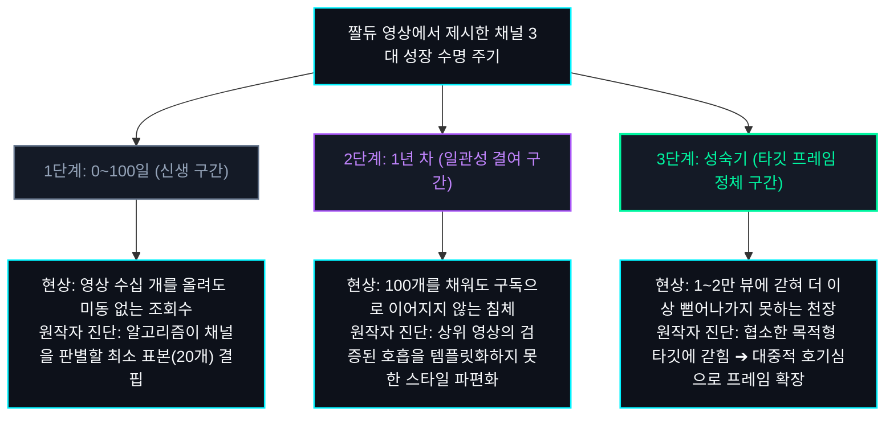
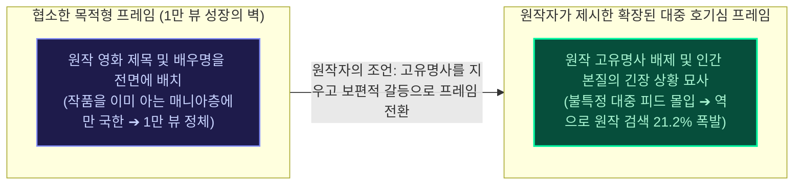

유튜브 생태계에는 정답이 없습니다. 그리고 알고리즘에도 모든 채널을 한 번에 열어젖히는 만능 열쇠란 존재하지 않습니다. 수십억 명의 시청자가 각자의 기분과 시간에 따라 손가락을 움직이고, 매초 수만 편의 영상이 업로드되는 복잡계 속에서 절대적인 성공 공식을 단언하는 것은 불가능에 가깝습니다.

최신 쇼츠 알고리즘 환경에서 채널을 직접 운영하고 지표를 관측해 온 지 이제 1년 차에 접어들었지만, 매일 아침 스튜디오 대시보드를 열어볼 때마다 데이터의 변곡점 앞에서 깊은 고민에 빠지곤 합니다. 며칠 밤을 새워 정성스레 만든 영상이 조회수 48회에서 미동도 하지 않을 때의 답답함, 혹은 순풍을 타고 오르던 조회수가 어느 날 갑자기 알 수 없는 벽에 부딪혀 완벽한 침묵으로 돌아설 때의 의문입니다.

그러던 중 200만 구독자 쇼츠 채널 '짤컷'을 총괄 기획·운영하고 현재 채널 성장 인사이트를 전하는 '짤듀' 채널에서 [채널 성장이 멈추는 3대 단계별 원인과 해결책](https://www.youtube.com/watch?v=427pmUjW9UI)이라는 영상을 접했습니다. 영상을 보는 내내 깊은 영감과 함께 감탄할 수밖에 없었습니다. 개별 영상의 지표 관측만으로는 거시적으로 조망하기 어려웠던 채널 전체의 수명 주기와 알고리즘 정체의 본질이, 그 영상 안에 너무나 명쾌하고 체계적으로 정리되어 있었기 때문입니다.

이 글은 필자 개인의 성공 공식을 자랑하기 위한 글이 결코 아닙니다. 200만 대형 채널을 키워낸 원작자(짤듀)의 영상 속 핵심 이론을 꼼꼼히 짚어보고, 최신 알고리즘 환경에서 우리가 매일 스튜디오 대시보드를 마주하며 관측했던 실측 데이터들을 대조해 보며 '원작자의 조언이 실제 현장에서 어떻게 작동하는지'를 교차 검증하고 배운 분석 기록입니다.

---

## 영상으로 한눈에 보기: 200만 채널의 3단계 성장 주기와 프레임 확장론

본 포스팅에서 다루는 핵심 분석과 스튜디오 실측 데이터를 영상으로 더 알기 쉽게 정리했습니다. 글을 읽기 전 편하게 시청해 보세요.

  <iframe
    src="https://www.youtube-nocookie.com/embed/uQWzv-UuiNQ"
    title="200만 쇼츠 채널이 밝힌 알고리즘 정체 3단계: 1년 차 연구소가 스튜디오 실데이터로 배운 프레임의 힘"
    allow="accelerometer; autoplay; clipboard-write; encrypted-media; gyroscope; picture-in-picture; web-share"
    allowfullscreen
    loading="lazy">
  </iframe>

---

## 원작자가 짚어낸 3대 정체 구간의 지도

영상에서 짤듀 님은 채널의 성장이 멈춰 서는 이유를 운영 기간과 규모에 따라 세 가지 구간으로 명확히 구분하여 진단합니다. 개설 초기 0~100일의 신생 구간, 1년 차 100개 업로드 슬럼프 구간, 그리고 구독자가 쌓인 뒤 마주하는 성숙기 성장의 벽입니다.

많은 크리에이터들이 조회수가 나오지 않으면 편집 기술이나 화려한 효과가 부족한 탓으로 돌리곤 합니다. 하지만 원작자의 설명을 들으며 깨달은 것은, 문제의 본질이 영상 내부의 기교보다 채널이 서 있는 단계에 맞는 본질적인 처방을 내리지 못했기 때문이라는 점이었습니다.

---

## [1구간: 0~100일] 신생 채널의 터널: 원작자의 진단과 스튜디오 실측 대조

원작자는 채널 개설 초기 3~4개월, 누적 영상 20~30개 미만인 구간에서 겪는 정체는 영상 퀄리티의 문제가 아니라고 단언합니다. 추천 알고리즘이 해당 채널이 어떤 성격의 시청자 군집에게 적합한지 판단할 최소한의 학습 표본 데이터가 부족하기 때문이라는 설명입니다.

이 설명을 들으며 채널을 열고 첫 두 달 동안 겪었던 막막함이 떠올랐습니다. 나름대로 정성 들여 컷을 나누고 배경음을 골라 올린 영상들이 하루 조회수 50회, 100회를 넘기지 못할 때, '이 주제는 틀렸나 보다' 싶어 포기하고 싶은 유혹이 컸습니다. 실제로 주위에서 유튜브를 시작했다가 3개월을 넘기지 못하고 접는 분들의 대부분이 이 구간의 침체를 버티지 못합니다.

하지만 [Google Search Central](https://support.google.com/youtube/answer/141805) 추천 문서와 원작자의 조언을 함께 살펴보면 답은 명확해집니다. 추천 엔진은 개별 영상 하나만 보는 것이 아니라, 채널 전체가 특정 관심사의 시청자들에게 지속적으로 반응을 끌어내는지 교차 검증합니다. 영상이 대여섯 개밖에 없는 상태에서는 인공지능 역시 이 채널을 누구에게 추천해야 할지 모수 자체가 없는 상태인 셈입니다.

원작자의 조언대로 흔들리지 않고 포맷을 고정한 채 주 3회 발행을 기계처럼 지키며 버텼을 때, 실제로 우리 스튜디오에서도 개설 80일 차(누적 25편 안팎) 무렵 특정 영상 한 편이 380만 뷰를 기록하며 추천 피드로 수직 상승하는 변곡점을 경험했습니다. 짤듀 님이 강조한 '초기 100일간 알고리즘에 일관된 표본을 먹여주는 인내'가 왜 신생 채널의 유일한 돌파구인지 스튜디오 로그로 깊이 체감할 수 있었습니다.

---

## [2구간: 1년 차 슬럼프] 앞으로 닥칠 정체기에 대한 원작자의 경고

영상을 꾸준히 쌓아가다 보면 누구나 1년 차 슬럼프라는 큰 벽을 마주하게 된다고 합니다. 편집 손놀림은 빨라졌고 썸네일도 그럴듯하게 만드는데, 100개 가까이 영상을 올려도 구독자가 늘지 않고 제자리걸음을 걷는 구간입니다.

원작자는 이 단계의 원인을 '채널의 일관성 결여'라고 짚었습니다. 시청자 입장에서 "내가 굳이 이 채널을 구독하고 다음 영상을 계속 챙겨봐야 할 이유"를 찾지 못한다는 것입니다. 어떤 영상은 20초 만에 끝나고 어떤 영상은 60초를 꽉 채우며 영상마다 톤이 제각각이면, 지난번 영상이 좋아 들어온 시청자도 다음 영상의 낯선 분위기에 실망해 이탈하게 됩니다.

원작자가 제시한 해법은 외부 트렌드를 쫓는 것이 아니라, 내 채널에서 조회수가 가장 높았던 상위 5개 영상의 공통 DNA를 역추적해 단일 템플릿으로 고정하라는 것이었습니다.

이제 1년 차에 접어드는 연구소의 입장에서도, 이 조언은 앞으로 다가올 슬럼프를 예방하는 데 있어 소중한 예방주사 같았습니다. 곧바로 스튜디오 대시보드를 열어 우리 채널에서 비교적 높은 반응을 얻었던 상위 영상들을 역분석해 보았습니다.

실제로 한 편의 쇼츠가 42만 뷰를 넘어서며 역주행했을 때의 지표를 보면 흥미로운 점이 있습니다. 흔히 절대 기준으로 여겨지는 '피드 잔존율'은 55.4%로 평범했지만, 평균 시청 지속 시간이 53초에 달했습니다. 시청자가 우리 채널에 기대하는 것은 가벼운 짤막 영상이 아니라 긴장감을 끌고 가는 '53초의 완결된 호흡'이었던 것입니다. 원작자의 말처럼 상위 영상에서 검증된 이 고유의 호흡과 템포를 흔들림 없이 지켜내는 것이 향후 1년 차 정체기를 건너는 핵심 기준이 되겠다는 확신을 얻었습니다.

---

## [3구간: 성장의 벽] 원작자가 제시한 '프레임 확장'의 통찰

짤듀 님의 영상에서 가장 신선한 충격을 주었던 대목은 바로 3단계 성장의 벽을 돌파하는 '타깃 프레임 확장론'이었습니다. 구독자가 모이고 팬이 생겼음에도 매번 1만 뷰나 2만 뷰 안팎의 천장에 갇히는 현상을 해결하는 방법입니다.

원작자는 두 가지 명쾌한 비유를 들었습니다:
* "일본 여행 갈 때 유용한 팁 5가지"라고 적으면 일본 여행을 계획 중인 사람만 봅니다. 하지만 "한국인은 잘 모르는데 일본에서는 이게 가능합니다"라고 바꾸면 여행 계획이 없던 사람도 호기심에 클릭합니다.
* "다이소 추천 꿀템 5종"이라고 하면 다이소를 자주 가는 사람만 보지만, "1,000원짜리 2개로 10만 원짜리 대체하는 법"이라고 하면 다이소에 관심 없던 사람도 지갑 사정을 생각하며 클릭합니다.

전달하려는 내용물은 똑같은 여행 정보와 다이소 물건입니다. 하지만 포장지의 프레임을 '특정 목적'에서 '인간의 보편적인 호기심과 실익'으로 넓히는 순간 반응하는 시청자 모수의 크기가 근본적으로 달라진다는 분석이었습니다.

### 175만 뷰 쇼츠의 기억: 원작자의 설명으로 비로소 풀린 의문

원작자의 이 설명을 들었을 때, 과거 우리 스튜디오에서 겪었던 풀리지 않던 의문이 단번에 풀리는 느낌을 받았습니다.

스토리 쇼츠를 제작하던 초기에는 원작 영화 제목과 유명 배우 이름을 썸네일과 설명란에 가득 채워 넣곤 했습니다. 결과는 늘 1만 뷰 안팎에서 멈췄습니다. 그 영화를 이미 알고 있거나 관심 있는 좁은 웅덩이를 돌고 나면 피드가 조용히 닫혔습니다.

그러다 어느 날 실험 삼아 영화 원작 제목과 배우 이름을 단 한 글자도 적지 않고, 오직 인간 본능의 숨 막히는 긴장 상황만을 짧은 가제로 달아 피드에 올려보았습니다.

| 관찰 항목 | 좁은 고유명사 프레임 (과거 1만 뷰 정체) | 원작자의 프레임 확장을 대입해 본 결과 (175만 뷰) |
|---|---|---|
| 제목 구성 | 영화 원작 스토리 및 명장면 요약 | 상황 자체를 묘사하는 짧은 가제 (원작명 제외) |
| 메타데이터 태그 | 공식 영화 태그 및 출연 배우 이름 기입 | 태그 입력창 공란 유지 |
| 추천 배포 범위 | 해당 영화 관심 군집에 제한 배포 | 쇼츠 피드를 넘기던 전체 불특정 대중으로 확장 |
| 도달 성과 | 1.2만 회에서 추천 종료 | 175.7만 회 달성 및 높은 완주율 기록 |
| 시청자 반응 | 추가 확산 미미 | 원작명을 묻는 댓글 급증 및 자발적 원작 검색(21.2%) 독점 |

원작이라는 좁은 꼬리표를 떼어내자, 알고리즘은 이 영상을 특정 영화 팬덤이 아닌 쇼츠 피드를 넘기던 불특정 대중 전체에게 뿌려주기 시작했습니다. 그 결과 175만 명이 넘는 시청자가 영상을 시청했고, 몰입해서 영상을 본 시청자들이 스스로 제목을 찾아 검색창에 원작 이름을 두드리는 현상이 일어났습니다.

당시에는 왜 이런 현상이 일어났는지 공학적으로 완전히 설명하지 못하고 그저 운이 좋았다고만 생각했습니다. 하지만 짤듀 님의 "타깃 프레임을 넓혀라"라는 명쾌한 강의를 듣고 나서야, [Think with Google](https://www.thinkwithgoogle.com)이 분석하는 능동적 검색 유입(Organic Search Pull)이 바로 '포장지의 프레임 확장' 덕분이었음을 비로소 정확히 이해할 수 있었습니다.

---

## 리뷰를 맺으며: 선배 크리에이터의 통찰이 남긴 것

최신 쇼츠 알고리즘 환경에서 채널을 구축하고 실측해 온 1년 차 연구소의 입장에서, 200만 대형 채널을 일궈낸 크리에이터의 체계적인 정리는 막막한 안갯속을 비추는 훌륭한 길잡이가 되어주었습니다. 필드에서의 개별적 데이터 관측을 넘어 채널의 전체 수명 주기와 알고리즘의 거시적 역학을, 앞서 길을 증명한 선배의 영상에서 명확한 안목으로 배울 수 있었기 때문입니다.

유튜브에는 영원한 정답도, 모든 문을 단숨에 여는 마스터키도 없습니다. 하지만 원작자가 영상에서 전해준 세 가지 나침반은 앞으로 채널을 키워가는 내내 잊지 말아야 할 귀중한 기준이 될 것 같습니다:
* 아직 100일이 되지 않았다면 조급함을 버리고 알고리즘이 채널의 성격을 파악할 일관된 표본 데이터를 묵묵히 쌓아가고 있는가,
* 앞으로 찾아올 1년 차 정체기 앞에서 내 스튜디오 상위 영상들이 증명한 고유의 호흡과 템포를 잃지 않고 있는가,
* 성장의 벽에 부딪혔다면 영상의 알맹이를 탓하기 전에 너무 좁은 고유명사의 울타리에 갇혀 대중의 호기심을 밀어내고 있지는 않은가.

원작자의 뛰어난 통찰에 깊은 감사를 느끼며, 앞으로 채널을 운영하다 길을 잃을 때마다 이 영상의 3단계 진단을 다시 꺼내보며 스튜디오의 대시보드를 차분히 점검해 보아야겠습니다.
