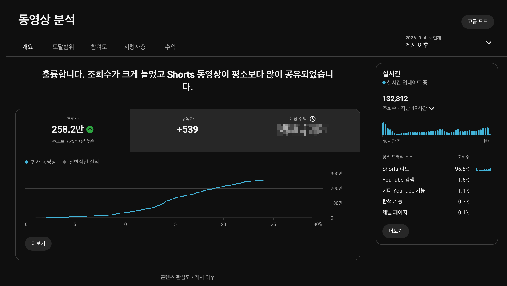
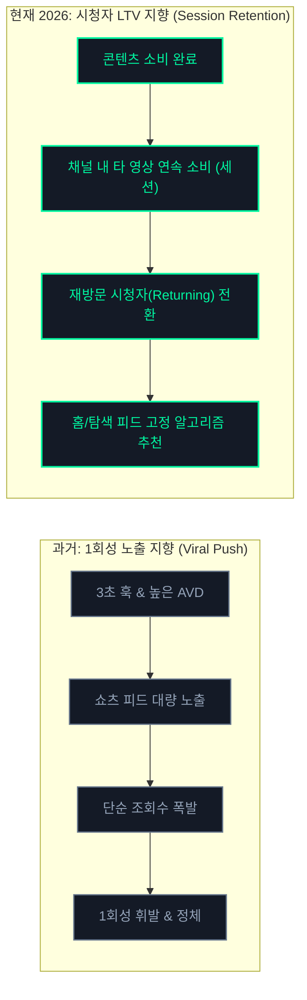
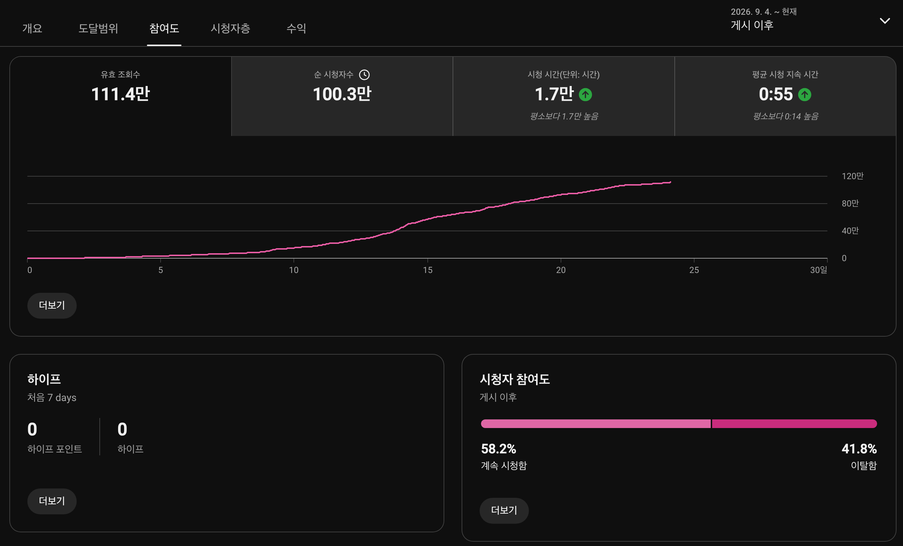
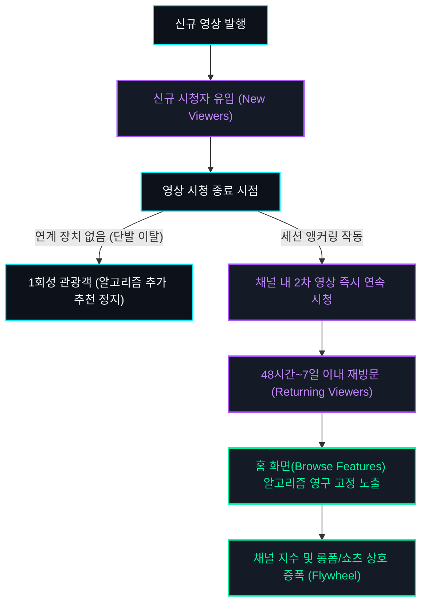

## 프롤로그: 258.2만 뷰와 순 시청자 100만 명 돌파의 이면

유튜브 채널을 운영하는 창작자에게 '100만 조회수 돌파'는 꿈의 이정표처럼 여겨집니다. 매일 아침 스튜디오 앱을 열었을 때 그래프가 가파른 수직 곡선을 그리며 지난 48시간 실시간 트래픽이 43만 회를 넘어서고, "축하합니다. 평소보다 동영상이 많이 공유되었습니다"라는 구글의 공식 축하 배너가 뜰 때의 도파민은 강렬합니다.

연구소에서 직접 기획하고 송출했던 단일 쇼츠 영상 역시 알고리즘의 강력한 추천을 타고 게시 24일 차인 오늘(2026년 9월 28일 기준) **누적 조회수 258.2만 회, 순 시청자 수 100.3만 명, 총 시청 시간 17,000시간(102만 분)**을 기록하며 250만 뷰의 거대한 고지를 넘어섰습니다.

그러나 데이터 엔지니어의 시선으로 축제 이면의 지표들을 뜯어보았을 때, 우리는 서늘한 현실을 마주하게 되었습니다.

258만 회라는 거대한 트래픽 폭풍 속에서 무려 **100만 명의 고유 시청자(Unique Viewers)**가 채널의 대문을 열고 쏟아져 들어왔지만, 지난 48시간 실시간 트래픽은 43만 회에서 13.2만 회로 서서히 둔화 곡선을 그리고 있습니다. 그리고 정작 채널의 다음 영상이나 기존 아카이브를 소비하며 머물러 준 시청자는 극히 일부에 불과했기 때문입니다.

왜 250만 명이 넘는 시청자가 스쳐 지나갔음에도 채널의 기초 체력은 그에 비례하여 10배, 20배로 확장되지 않는 것일까요? 

이 글은 화려한 조회수의 착시를 걷어내고, 2026년 하반기 현재 유튜브 추천 엔진이 **'1회성 바이럴 노출'에서 '재방문 시청자(Returning Viewers) 및 세션 점유율'로 평가 가중치를 대전환한 알고리즘의 수학적 메커니즘**을 스튜디오 실측 데이터와 함께 규명합니다.

---

## 스튜디오 실측 데이터 영상 요약: 250만 뷰 폭발 그 후 & 2대 세션 앵커링 메커니즘

본 분석에서 다루는 258.2만 뷰 폭발 지표와 2026 하반기 유튜브 추천 시스템의 재방문 세션 가중치 체계를 4분 11초 분량의 모션 그래픽으로 시각화한 공식 비디오 리포트입니다.

  <iframe
    src="https://www.youtube-nocookie.com/embed/umisSjvF7UE"
    title="250만 뷰 폭발 그 후: 유튜브 알고리즘이 재방문 시청자와 정착 세션에 가중치를 몰아주는 메커니즘"
    allow="accelerometer; autoplay; clipboard-write; encrypted-media; gyroscope; picture-in-picture; web-share"
    allowfullscreen
    loading="lazy">
  </iframe>

---

## 2026년 하반기 알고리즘의 거대한 패러다임 시프트

2024~2025년의 유튜브, 특히 쇼츠 피드는 **'자극적인 3초 훅(Hook)과 끝까지 보게 만드는 시청 지속 시간(AVD)'**만 확보하면 알고리즘이 무제한으로 노출량을 밀어주는 '바이럴의 시대'였습니다.

하지만 2026년 하반기 현재, 유튜브 생태계의 판도는 완전히 바뀌었습니다.

유튜브 플랫폼 엔지니어링 팀의 목표는 명확합니다. 광고주들에게 더 높은 단가의 광고 지면을 판매하기 위해선 시청자가 무의식적으로 화면을 위로 튕기며(Swipe-away) 쇼츠를 넘기는 단순 트래픽보다, **"특정 채널에 깊이 몰입하여 유튜브 앱에 10분, 30분 이상 체류하게 만드는 채널"**에 추천 가중치를 집중해야 하기 때문입니다.

유튜브 CEO 닐 모한(Neal Mohan)이 연례 서한에서 강조했듯, 2026년 추천 시스템의 핵심 나침반은 개별 영상의 조회수가 아닌 **'시청자 평생 가치(Viewer Lifetime Value, LTV)'와 '채널 정착률'**로 이동했습니다.

---

## 실측 데이터 분석: 258만 뷰의 화려함 뒤에 숨은 '구독자 전환율 0.02%'

우리가 관측한 258.2만 뷰(순 시청자 100.3만 명) 영상의 세부 스튜디오 지표와 151만 뷰 시점 대비 변화를 투명하게 공개합니다.

| 지표 항목 | 3차 실측 (9/20, 16일 차) | 4차 최신 실측 (9/28, 24일 차) | 누적 증감 및 알고리즘 분석 |
| :--- | :--- | :--- | :--- |
| **누적 총 조회수** | 1,516,000회 (151.6만) | **2,582,000회 (258.2만)** | **+1,066,000회 (+70.3% 추가 폭발)** / 평소 대비 254.1만 상회 |
| **유효 조회수** | 649,000회 (64.9만) | **1,114,000회 (111.4만)** | **+465,000회 (유효 조회수 110만 돌파)** |
| **순 시청자 수 (Unique)** | 538,000명 (53.8만) | **1,003,000명 (100.3만)** | **순 시청자 100만 명 메가 오디언스 돌파 (+86.4%)** |
| **총 시청 시간** | 10,000시간 (60만 분) | **17,000시간 (102만 분)** | **+7,000시간 순증 (누적 102만 분 체류 창출)** |
| **평균 시청 지속 시간** | 0:55 (55초) | **0:55 (55초 유지)** | 258만 모수 확장 속에서도 평소보다 14초 높은 55초 초견고 방어 |
| **시청 vs 이탈 비율** | 58.5% 시청 / 41.5% 이탈 | **58.2% 시청 / 41.8% 이탈** | 0.3%p 미세 조정에 불과, 58%대 피드 픽업 상위 방어 |
| **신규 구독자 순증** | +315명 | **+539명 (+224명 순증)** | **전체 조회수 대비 구독 전환율 0.0208% (1만 명당 2명)** |
| **실시간 48시간 트래픽** | 430,204회 (43만) | **132,812회 (13.2만)** | 수직 급상승기 통과 후 일 6.6만 회 수준의 롱테일 안정화 |
| **트래픽 소스 (Shorts 피드)** | 97.1% | **96.8%** | 피드 96.8%, 검색 1.6%, 기타 1.1%, 탐색 0.3%, 채널 0.1% |

### 데이터가 말해주는 뼈아픈 역설

1. **쇼츠 피드 96.8% 유입의 함정**:
   * 트래픽의 96.8%가 시청자가 능동적으로 검색하거나 클릭한 것이 아니라, 알고리즘이 피드에 밀어 넣어서 본 '수동적 유입'이었습니다.
   * 시청자는 영상의 55초 동안 깊이 몰입했지만(102만 분의 시청 시간), 영상을 다 보고 난 뒤 즉시 다음 영상으로 스와이프해 넘어갔습니다.
2. **0.0208%라는 극단적인 구독 전환율**:
   * **258만 회의 재생, 100만 명의 고유 시청자**가 영상을 보았음에도 채널 구독을 누른 사람은 총 539명에 그쳤습니다. (순 시청자 기준 전환율 0.0537%, 전체 조회수 기준 전환율 0.0208%)
   * 이는 1만 명의 시청자 중 단 2명만이 구독 버튼을 누른 셈입니다. 시청자가 "이 영상은 유익하다"고 느꼈을 뿐, **"이 채널을 운영하는 사람이 누구이며, 다음에도 이 사람의 다른 영상을 찾아보겠다"는 브랜드 인지(Brand Affinity)** 단계까지 도달하지 못했음을 뜻합니다.

---

## 유튜브 추천 엔진의 2대 비밀 지표: '재방문 시청자'와 '시청 세션'

스튜디오 애널리틱스 [시청자층] 탭을 열어보면, 구글이 가장 상단에 배치해 둔 꺾은선 그래프가 있습니다. 바로 **'신규 시청자(New Viewers)'와 '재방문 시청자(Returning Viewers)'**의 비율 곡선입니다.

### 1. 재방문 시청자(Returning Viewers)가 중요한 이유
* 신규 시청자가 100만 명 들어오는 것보다, **기존에 내 영상을 봤던 사람 1만 명이 다음 날 내 새 영상을 다시 클릭하는 것**을 알고리즘은 10배 이상 높게 평가합니다.
* 재방문율이 높은 채널은 쇼츠 피드의 무작위 배포에 의존하지 않고, 유튜브 앱을 켰을 때 첫 화면(홈 탐색 피드)에 썸네일이 자동으로 꽂히는 **'안정적 기본 트래픽 권력'**을 획득하게 됩니다.

### 2. 시청 세션 연장 시간(Session Watch Time)
* 시청자가 내 영상을 본 뒤 유튜브를 종료하지 않고, 내 채널의 다른 영상으로 넘어가거나 유튜브 전체에서 더 오랜 시간 머물렀는가를 측정하는 지표입니다.
* 유튜브 AI는 **"이 채널의 영상을 보고 난 뒤 시청 세션이 연장되었다"**는 시그널을 감지하면, 해당 채널의 전 영상에 걸쳐 노출 추천 가중치(Impression Boost)를 일괄 부여합니다.

---

## 1회성 관광객(Tourist)을 채널 정착자(Resident)로 전환시키는 3단계 세션 앵커링

그렇다면 어떻게 해야 250만 명의 스쳐 지나가는 '관광객'을 우리 채널에 영구히 거주하는 '정착자'로 바꿀 수 있을까요?

연구소에서 258만 뷰 종단 실측 분석을 통해 수립한 **3단계 세션 앵커링(Session Anchoring) 아키텍처**를 공개합니다.

### 1단계: 채널 유형별 '관련 동영상(Related Video)' 1:1 세션 직결
쇼츠 하단에 제공되는 '관련 동영상 연결 기능'은 단순한 옵션이 아니라, 시청자가 화면을 위로 넘기지 않고 채널 내에 머물게 만드는 가장 직접적인 세션 앵커입니다. 채널의 구조에 따라 다음과 같이 이원화하여 설계해야 합니다:

* **케이스 A: 숏폼이 주력인 단일 채널인 경우 (연구소 실전 운영 모델)**
  * 무리하게 존재하지 않는 롱폼으로 시청자를 유도할 수 없습니다. 대신 쇼츠의 결론부에서 파생되는 **"다음 회차 쇼츠나 가장 연관도 높은 후속 쇼츠"**를 1:1로 직결합니다.
  * `[1편: 문제 제기 및 현상 관측] ➡️ [2편: 스튜디오 데이터 실측 검증]` 형태로 쇼츠 간의 꼬리물기(Chaining) 시청을 유도하여, 단일 50초 체류를 채널 내 2분~3분의 연속 세션으로 강제 연장시킵니다.
* **케이스 B: 롱폼이 메인이고 숏폼을 유입 창구로 쓰는 하이브리드 채널인 경우**
  * 숏폼은 철저한 유입 퍼널(Funnel) 역할을 수행합니다.
  * 쇼츠의 50초 시점에서 *"이 데이터의 원본 분석과 소스코드가 어디 있지?"*라는 갈증을 느끼는 순간, 하단 링크를 통해 **"3~5분 이상의 본편 풀버전 롱폼 영상"**으로 즉시 이송하여 시청 세션 시간을 비약적으로 폭발시킵니다.

### 2단계: 시리즈형 넘버링 및 쇼츠 재생목록 번들링(Bundling)
단일 콘텐츠를 독립된 섬으로 발행하지 않고, 3부작 또는 5부작 시리즈의 일부로 설계합니다.
* 영상 도입부나 하단 자막에 `[Ep.01 알고리즘의 원리 ➡️ Ep.02 실측 데이터 검증]` 형태의 서사적 연속성을 부여합니다.
* 채널 홈 최상단에 관련 쇼츠를 묶은 테마별 재생목록을 배치하여, 1편이 끝나면 2편이 자동 재생되도록 동선을 유도합니다.

### 3단계: 고정 댓글과 채널 커뮤니티를 통한 2차 인터랙션
* 고정 댓글에 단순 인삿말이 아닌, 시청자가 댓글을 달 수밖에 없는 **'논쟁적 질문'이나 '핵심 데이터 요약'**을 배치합니다.
* 댓글을 작성하거나 읽는 동안 영상은 백그라운드에서 계속 루핑(Looping)되어 시청 지속 시간을 극대화하고, 시청자는 채널의 정체성을 한 번 더 인지하게 됩니다.

---

## 1인 스튜디오가 지금 당장 점검해야 할 체크리스트

만약 여러분의 채널에서 특정 영상이 알고리즘을 타고 수만, 수십만, 수백만 조회수를 기록하고 있다면, 축배를 들기 전에 다음 4가지를 즉시 실행해야 합니다:

- [ ] **채널 유형별 관련 동영상 링크 점검**: 숏폼 전용 채널이라면 연계 후속 쇼츠가, 롱폼 병행 채널이라면 심층 본편 영상이 하단에 1:1로 직결되어 있는가?
- [ ] **고정 댓글 세션 유도**: 다음 편 영상 링크 및 시청자의 의견을 묻는 질문이 상단 고정되어 있는가?
- [ ] **채널 홈 탭 레이아웃 최적화**: 신규 유입자가 채널 홈을 눌렀을 때 가장 전문성 높은 테마별 재생목록(쇼츠/롱폼)이 상단에 배치되어 있는가?
- [ ] **48시간 내 후속 연계 영상 발행**: 유입된 시청자의 홈 피드에 내 채널이 남아있는 골든 타임(48시간 이내)에 연계 후속편을 업로드하여 재방문(Returning) 시그널을 완성했는가?

---

## 에필로그: 알고리즘을 좇지 말고, 시청자의 '시간 점유율'을 설계하라

유튜브 추천 알고리즘은 거대한 파도와 같습니다. 때로는 아무런 이유 없이 수백만 조회수의 은총을 내려주기도 하고, 때로는 며칠 밤을 지새운 정성스러운 기획을 조회수 두 자릿수의 심연으로 밀어 넣기도 합니다.

그러나 파도가 지나간 뒤 모래사장에 남는 것은 오직 **"이 창작자의 다음 이야기가 진심으로 궁금해서 다시 찾아온 충성도 높은 시청자"**뿐입니다.

단순히 숫자에 불과한 1회성 조회수 250만 회에 일희일비하지 마십시오. 단 100명의 시청자가 보더라도, 그들이 영상을 끝까지 보고 내 다음 영상을 클릭하게 만드는 **'정착의 구조'**를 설계하는 것—그것이 바로 2026년 하반기 알고리즘의 거친 바다에서 흔들리지 않고 롱런하는 1인 크리에이터와 데이터 엔지니어의 유일한 생존 공식입니다.
