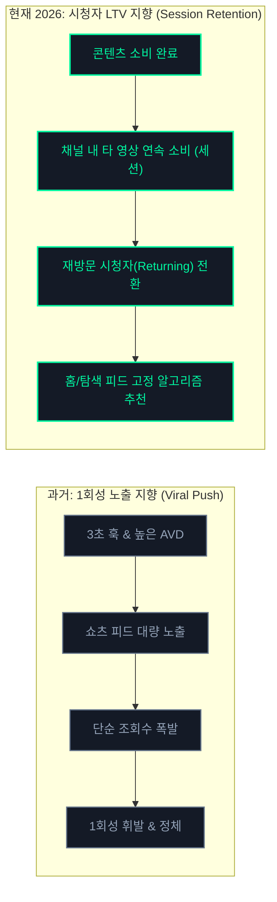
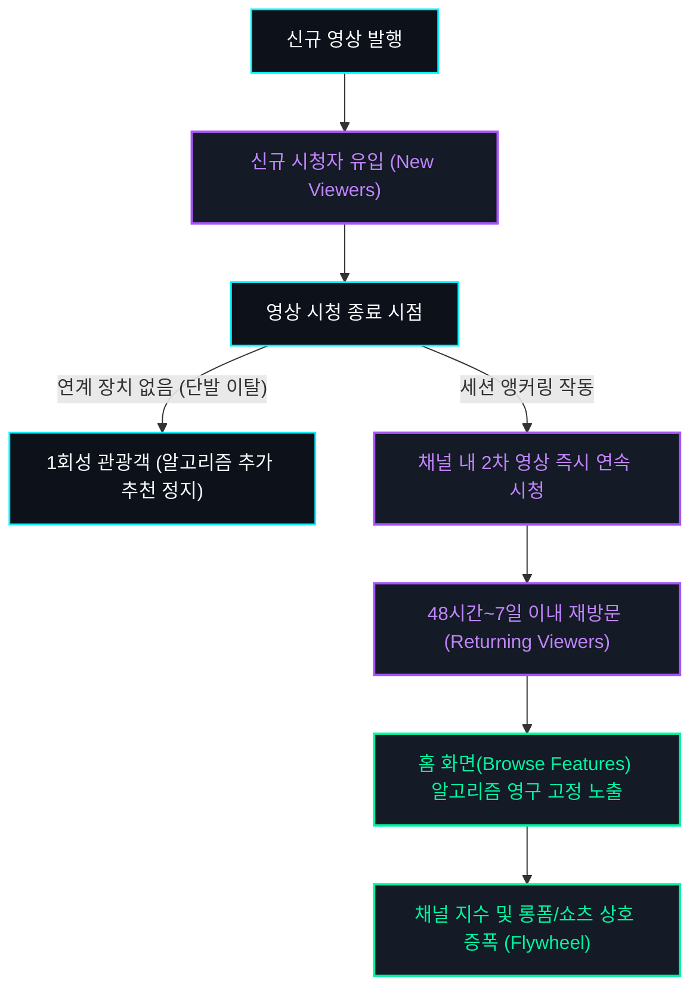

## 프롤로그: 151.6만 뷰의 축제가 지나간 자리

유튜브 채널을 운영하는 창작자에게 '100만 조회수 돌파'는 꿈의 이정표처럼 여겨집니다. 매일 아침 스튜디오 앱을 열었을 때 그래프가 가파른 수직 곡선을 그리며 지난 48시간 실시간 트래픽이 43만 회를 넘어서고, "축하합니다. 평소보다 동영상이 많이 공유되었습니다"라는 구글의 공식 축하 배너가 뜰 때의 도파민은 강렬합니다.

연구소에서 직접 기획하고 송출했던 단일 쇼츠 영상 역시 알고리즘의 강력한 추천을 타고 게시 16일 차에 **누적 조회수 151.6만 회, 순 시청자 수 53.8만 명, 총 시청 시간 10,000시간(60만 분)**을 기록했습니다. 

그러나 데이터 엔지니어의 시선으로 축제 이면의 지표들을 뜯어보았을 때, 우리는 서늘한 현실을 마주하게 되었습니다.

151만 회라는 거대한 트래픽 폭풍이 잦아들기 시작하자, 스튜디오 그래프는 다시 완만한 평지로 내려앉았습니다. 수십만 명의 인파가 채널의 대문을 열고 쏟아져 들어왔지만, 정작 채널의 다음 영상이나 기존 아카이브를 소비하며 머물러 준 시청자는 극히 일부에 불과했기 때문입니다.

왜 150만 명의 시청자가 스쳐 지나갔음에도 채널의 기초 체력은 그에 비례하여 10배, 20배로 확장되지 않는 것일까요? 

이 글은 화려한 조회수의 착시를 걷어내고, 2026년 하반기 현재 유튜브 추천 엔진이 **'1회성 바이럴 노출'에서 '재방문 시청자(Returning Viewers) 및 세션 점유율'로 평가 가중치를 대전환한 알고리즘의 수학적 메커니즘**을 스튜디오 실측 데이터와 함께 규명합니다.

---

## 2026년 하반기 알고리즘의 거대한 패러다임 시프트

2024~2025년의 유튜브, 특히 쇼츠 피드는 **'자극적인 3초 훅(Hook)과 끝까지 보게 만드는 시청 지속 시간(AVD)'**만 확보하면 알고리즘이 무제한으로 노출량을 밀어주는 '바이럴의 시대'였습니다.

하지만 2026년 하반기 현재, 유튜브 생태계의 판도는 완전히 바뀌었습니다.

유튜브 플랫폼 엔지니어링 팀의 목표는 명확합니다. 광고주들에게 더 높은 단가의 광고 지면을 판매하기 위해선 시청자가 무의식적으로 화면을 위로 튕기며(Swipe-away) 쇼츠를 넘기는 단순 트래픽보다, **"특정 채널에 깊이 몰입하여 유튜브 앱에 10분, 30분 이상 체류하게 만드는 채널"**에 추천 가중치를 집중해야 하기 때문입니다.

유튜브 CEO 닐 모한(Neal Mohan)이 연례 서한에서 강조했듯, 2026년 추천 시스템의 핵심 나침반은 개별 영상의 조회수가 아닌 **'시청자 평생 가치(Viewer Lifetime Value, LTV)'와 '채널 정착률'**로 이동했습니다.

---

## 실측 데이터 분석: 151만 뷰의 화려함 뒤에 숨은 '구독자 전환율 0.02%'

우리가 관측한 151.6만 뷰 영상의 세부 스튜디오 지표를 투명하게 공개합니다.

| 지표 항목 | 실측 수치 | 분석 및 의미 |
| :--- | :--- | :--- |
| **누적 유효 조회수** | **1,516,000회** | 평소 채널 평균치 대비 147.5만 회 높은 대형 스파이크 |
| **순 시청자 수 (Unique Viewers)** | **538,000명** | 중복 시청을 제외한 순수 유입 인구 |
| **총 시청 시간** | **10,000시간 (60만 분)** | 단일 숏폼 영상으로 YPP 롱폼 기준(4,000시간)의 2.5배 달성 |
| **평균 시청 지속 시간** | **0:55 (55초)** | 60초 풀 영상 중 91.6%를 완주하는 강력한 리텐션 |
| **시청 vs 이탈 비율** | **58.5% 시청 / 41.5% 이탈** | 쇼츠 피드 경쟁에서 상위 10% 이내의 픽업 유지 |
| **신규 구독자 순증** | **+315명** | **전체 조회수 대비 구독 전환율 0.02%** |
| **트래픽 소스 분포** | **Shorts 피드 97.1%** | 알고리즘 강제 배포 97.1%, 탐색/채널 유입 1.7% |

### 데이터가 말해주는 뼈아픈 역설

1. **쇼츠 피드 97.1% 유입의 함정**:
   * 트래픽의 97% 이상이 시청자가 능동적으로 검색하거나 클릭한 것이 아니라, 알고리즘이 피드에 밀어 넣어서 본 '수동적 유입'이었습니다.
   * 시청자는 영상의 55초 동안 재미있게 즐겼지만, 영상을 다 보고 난 뒤 즉시 다음 영상으로 스와이프해 넘어갔습니다.
2. **0.02%라는 극단적인 구독 전환율**:
   * 150만 명이 영상을 보았음에도 채널 구독을 누른 사람은 315명에 그쳤습니다.
   * 이는 시청자가 "이 영상은 유익하다"고 느꼈을 뿐, **"이 채널을 운영하는 사람이 누구이며, 다음에도 이 사람의 다른 영상을 찾아보겠다"는 브랜드 인지(Brand Affinity)** 단계까지 도달하지 못했음을 뜻합니다.

---

## 유튜브 추천 엔진의 2대 비밀 지표: '재방문 시청자'와 '시청 세션'

스튜디오 애널리틱스 [시청자층] 탭을 열어보면, 구글이 가장 상단에 배치해 둔 꺾은선 그래프가 있습니다. 바로 **'신규 시청자(New Viewers)'와 '재방문 시청자(Returning Viewers)'**의 비율 곡선입니다.

### 1. 재방문 시청자(Returning Viewers)가 중요한 이유
* 신규 시청자가 100만 명 들어오는 것보다, **기존에 내 영상을 봤던 사람 1만 명이 다음 날 내 새 영상을 다시 클릭하는 것**을 알고리즘은 10배 이상 높게 평가합니다.
* 재방문율이 높은 채널은 쇼츠 피드의 무작위 배포에 의존하지 않고, 유튜브 앱을 켰을 때 첫 화면(홈 탐색 피드)에 썸네일이 자동으로 꽂히는 **'안정적 기본 트래픽 권력'**을 획득하게 됩니다.

### 2. 시청 세션 연장 시간(Session Watch Time)
* 시청자가 내 영상을 본 뒤 유튜브를 종료하지 않고, 내 채널의 다른 영상으로 넘어가거나 유튜브 전체에서 더 오랜 시간 머물렀는가를 측정하는 지표입니다.
* 유튜브 AI는 **"이 채널의 영상을 보고 난 뒤 시청 세션이 연장되었다"**는 시그널을 감지하면, 해당 채널의 전 영상에 걸쳐 노출 추천 가중치(Impression Boost)를 일괄 부여합니다.

---

## 1회성 관광객(Tourist)을 채널 정착자(Resident)로 전환시키는 3단계 세션 앵커링

그렇다면 어떻게 해야 150만 명의 스쳐 지나가는 '관광객'을 우리 채널에 영구히 거주하는 '정착자'로 바꿀 수 있을까요?

연구소에서 150만 뷰 사후 분석을 통해 수립한 **3단계 세션 앵커링(Session Anchoring) 아키텍처**를 공개합니다.

### 1단계: 관련 동영상(Related Video)의 유기적 1:1 결합
쇼츠 하단에 제공되는 '관련 동영상 연결 기능'을 단순한 구색 맞추기로 사용해서는 안 됩니다.
* **Bad**: 숏폼 영상과 전혀 상관없는 채널 대표 영상 링크
* **Good**: 숏폼 영상의 핵심 결론이나 데이터의 소스 코드를 담은 **"더 깊은 풀버전 롱폼 영상(3~5분)"**을 정확히 1:1로 매핑.
* 시청자가 숏폼을 보며 *"이 데이터의 원본 소스가 어디지?"*라는 갈증을 느끼는 50초 시점에 하단 링크가 자연스러운 탈출구가 아닌 '심화 학습 통로'로 작동해야 합니다.

### 2단계: 시리즈형 넘버링 및 재생목록 번들링(Bundling)
단일 콘텐츠를 독립된 섬으로 발행하지 않고, 3부작 또는 5부작 시리즈의 일부로 설계합니다.
* 영상 도입부나 하단 자막에 `[Ep.01 알고리즘의 원리 ➡️ Ep.02 실측 데이터 검증]` 형태의 서사적 연속성을 부여합니다.
* 재생목록을 통해 1편이 끝나면 2편이 자동 재생되도록 동선을 유도하여, 단일 시청자의 체류 시간을 1분에서 5분, 10분으로 강제 연장시킵니다.

### 3단계: 고정 댓글과 채널 커뮤니티를 통한 2차 인터랙션
* 고정 댓글에 단순 인삿말이 아닌, 시청자가 댓글을 달 수밖에 없는 **'논쟁적 질문'이나 '무료 데이터 리포트 요약 링크'**를 배치합니다.
* 댓글을 작성하는 동안 영상은 백그라운드에서 계속 루핑(Looping)되어 시청 지속 시간을 극대화하고, 시청자는 채널의 정체성을 한 번 더 인지하게 됩니다.

---

## 1인 스튜디오가 지금 당장 점검해야 할 체크리스트

만약 여러분의 채널에서 특정 영상이 알고리즘을 타고 수만, 수십만 조회수를 기록하고 있다면, 축배를 들기 전에 다음 4가지를 즉시 실행해야 합니다:

- [ ] **관련 동영상 링크 점검**: 폭발 중인 쇼츠 하단에 가장 흡인력 높은 심층 롱폼 영상이 연결되어 있는가?
- [ ] **고정 댓글 세션 유도**: 다음 편 영상 링크 및 시청자의 의견을 묻는 질문이 상단 고정되어 있는가?
- [ ] **채널 홈 탭 레이아웃 최적화**: 신규 유입자가 채널 홈을 눌렀을 때 가장 전문성 높은 테마별 재생목록이 상단에 배치되어 있는가?
- [ ] **48시간 내 후속 연계 영상 발행**: 유입된 시청자의 홈 피드에 내 채널이 남아있는 골든 타임(48시간 이내)에 연계 후속편을 업로드하여 재방문(Returning) 시그널을 완성했는가?

---

## 에필로그: 알고리즘을 좇지 말고, 시청자의 '시간 점유율'을 설계하라

유튜브 추천 알고리즘은 거대한 파도와 같습니다. 때로는 아무런 이유 없이 수백만 조회수의 은총을 내려주기도 하고, 때로는 며칠 밤을 지새운 정성스러운 기획을 조회수 두 자릿수의 심연으로 밀어 넣기도 합니다.

그러나 파도가 지나간 뒤 모래사장에 남는 것은 오직 **"이 창작자의 다음 이야기가 진심으로 궁금해서 다시 찾아온 충성도 높은 시청자"**뿐입니다.

단순히 숫자에 불과한 1회성 조회수 100만 회에 일희일비하지 마십시오. 단 100명의 시청자가 보더라도, 그들이 영상을 끝까지 보고 내 다음 영상을 클릭하게 만드는 **'정착의 구조'**를 설계하는 것—그것이 바로 2026년 하반기 알고리즘의 거친 바다에서 흔들리지 않고 롱런하는 1인 크리에이터와 데이터 엔지니어의 유일한 생존 공식입니다.
