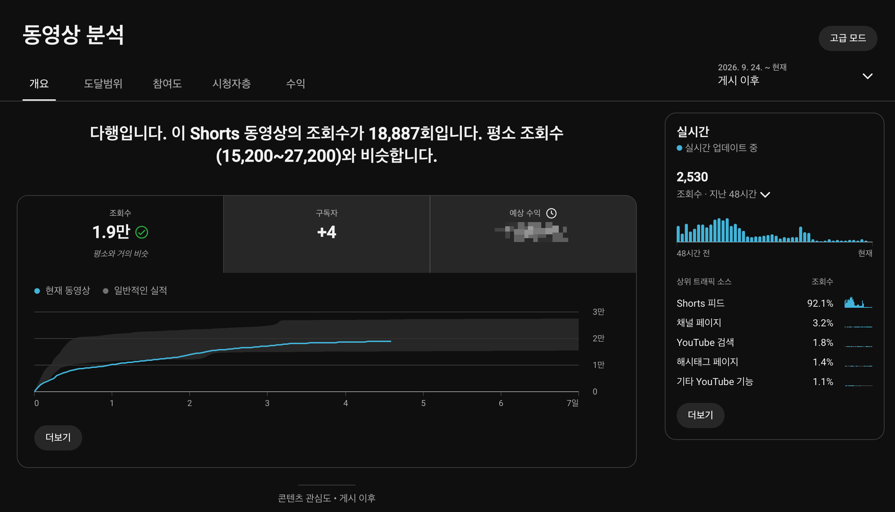
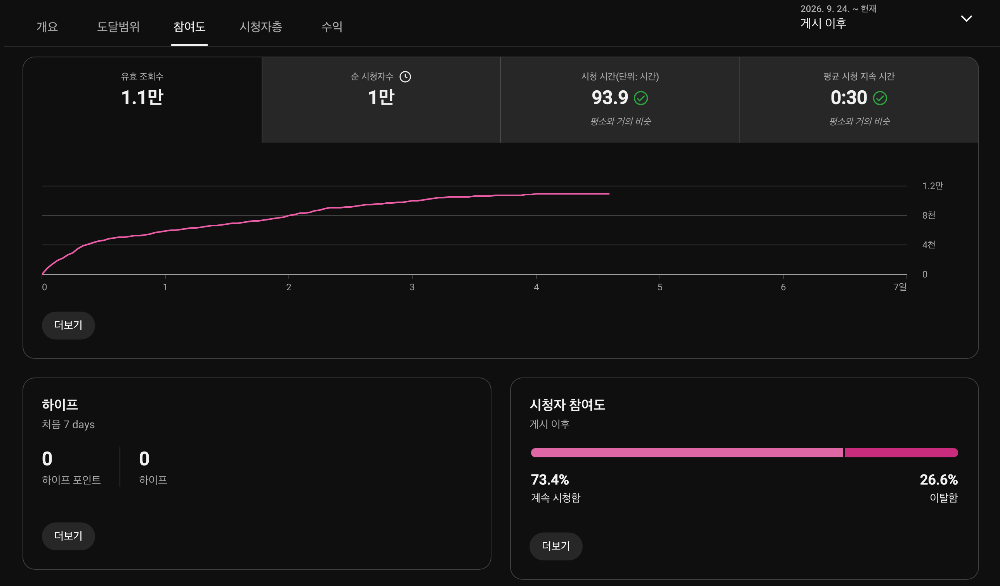
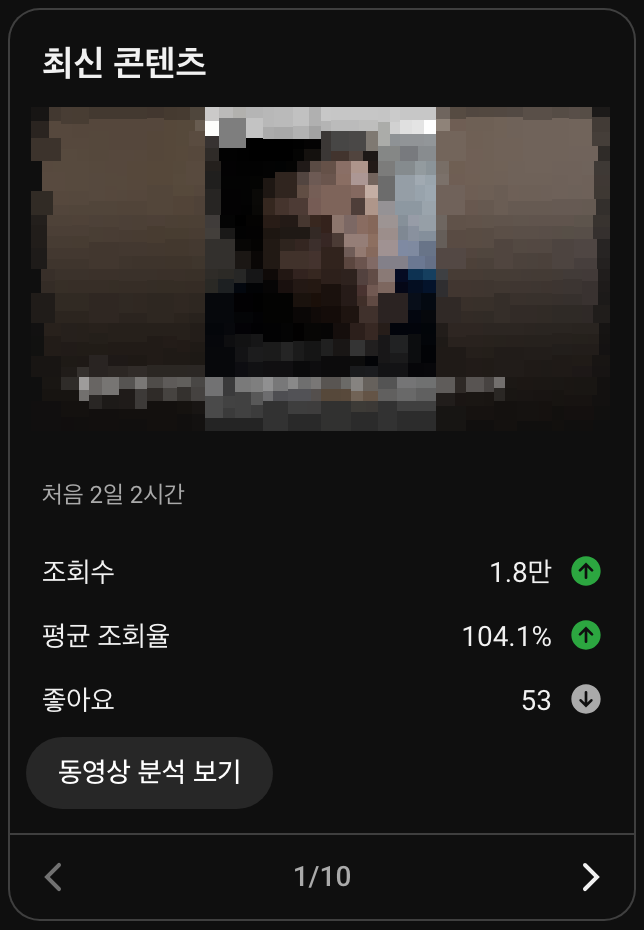
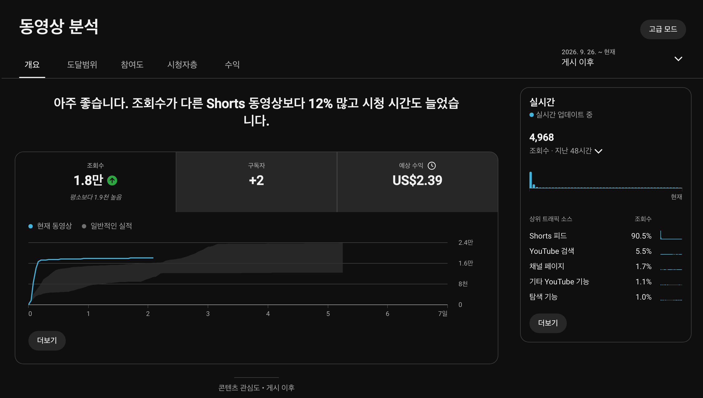
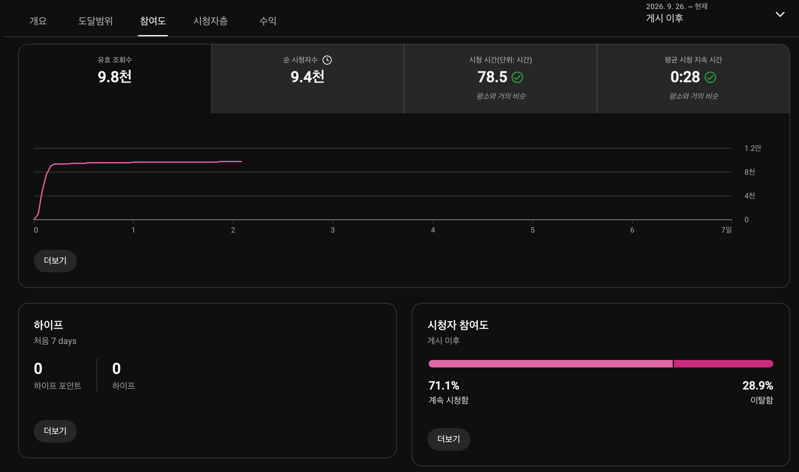
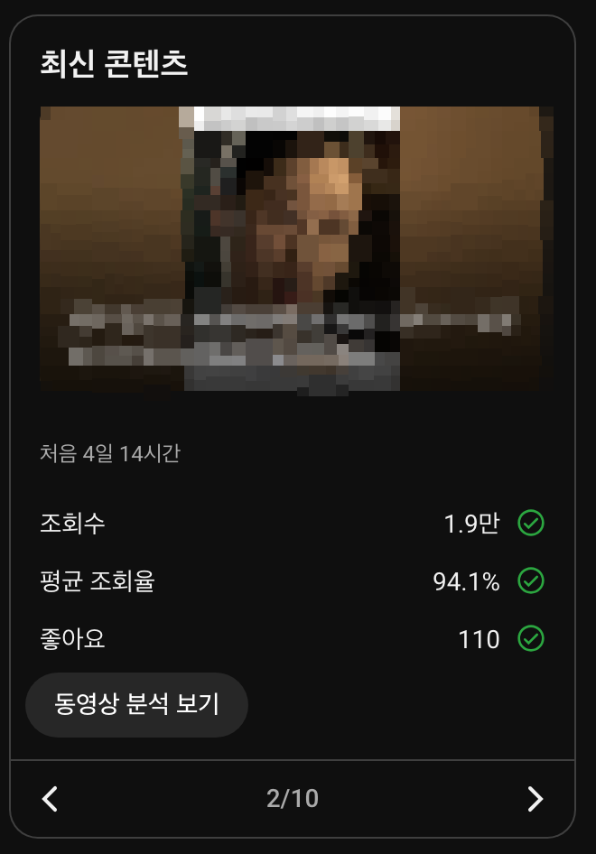
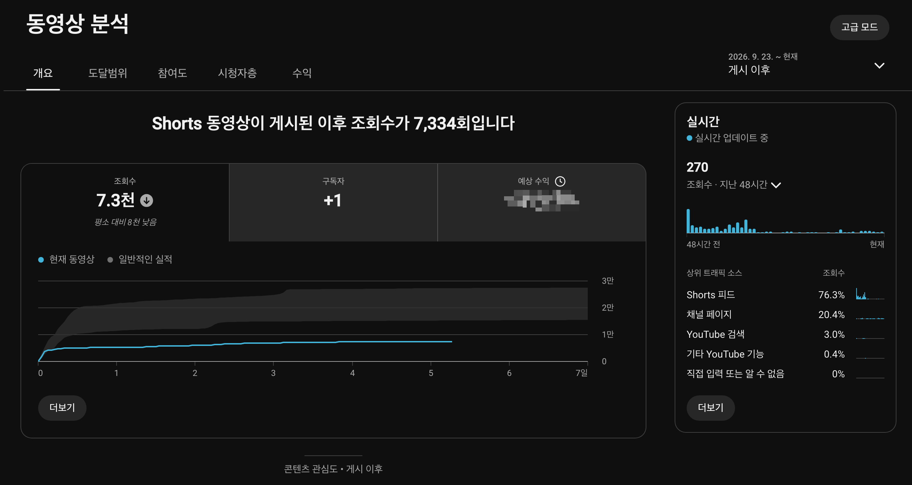
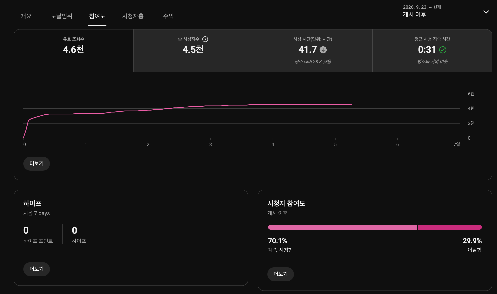
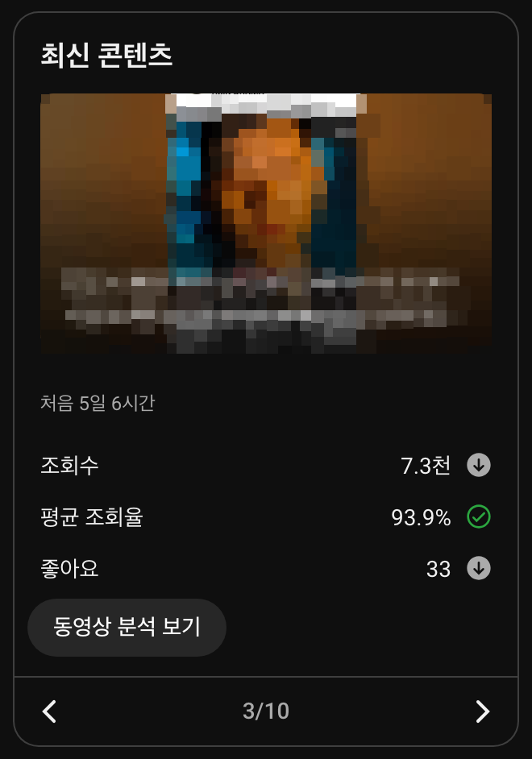
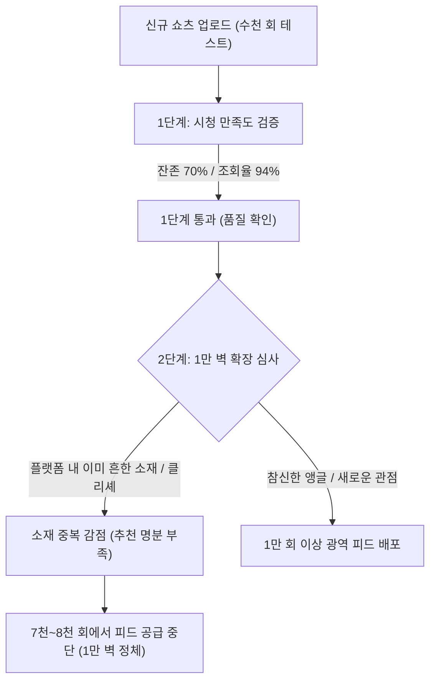

## 쇼츠 크리에이터가 마주하는 첫 번째 통곡의 벽: 조회수 1만 회

유튜브 쇼츠를 시작한 크리에이터들이 가장 먼저, 그리고 가장 깊게 좌절하는 구간이 바로 조회수 1만 회의 벽입니다. 

영상을 정성껏 기획하고 편집해서 올려도 조회수는 2천 회, 5천 회를 맴돌다 7천 회 안팎에서 뚝 멈춰 서기 일쑤입니다. 조금 반응이 좋아 1만 회를 넘기더라도 1만 후반대에서 성장이 멈추는 경우가 대부분입니다.

스튜디오 지표를 조금 더 깊이 열어 유효 조회수를 확인해보면 현실은 더 냉정합니다. 총조회수가 1만 후반대로 찍히는 영상도 실제 유효 조회수는 9천~1만 회 수준에 머물러 있어, 사실상 1만 회라는 거대한 진입 장벽에 갇혀 있는 셈입니다.

그렇다면 왜 수많은 쇼츠 영상들이 이 1만 회 언저리에서 피드 공급이 중단되는 것일까요? 

최근 자체 채널에서 발행된 영상 3편의 스튜디오 실측 캡처 9장(1-1.png ~ 3-3.png)을 바탕으로, 1만 벽을 넘지 못하고 7천 회에서 멈춘 영상과 1만 벽을 턱걸이로 넘어선 영상들의 실제 데이터를 대조해 보았습니다.

---

## 영상으로 한눈에 보기: 쇼츠 1만 벽 정체와 채널 품질 점수

본 포스팅에서 다루는 핵심 분석과 스튜디오 실측 데이터를 영상으로 더 알기 쉽게 정리했습니다. 글을 읽기 전 편하게 시청해 보세요.

  <iframe
    src="https://www.youtube-nocookie.com/embed/1u_L4M3vDxk"
    title="시청시간이 더 긴데 왜 7천 회에서 멈출까? 유튜브 쇼츠 '1만 벽'의 충격적인 진실"
    allow="accelerometer; autoplay; clipboard-write; encrypted-media; gyroscope; picture-in-picture; web-share"
    allowfullscreen
    loading="lazy">
  </iframe>

---

## 3편의 스튜디오 실측 데이터 비교

스튜디오 캡처 화면에서 확인되는 3편의 핵심 지표는 다음과 같습니다.

| 분석 지표 | [영상 1] 9/24 업로드 | [영상 2] 9/26 업로드 | [영상 3] 9/23 업로드 |
|---|:---:|:---:|:---:|
| 누적 조회수 | 18,887회 | 18,000+회 | 7,334회 (1만 벽 미도달) |
| 유효 조회수 | 1.1만 회 | 9.8천 회 | 4.6천 회 |
| 피드 잔존율 (Viewed) | 73.4% | 71.1% | 70.1% |
| 평균 조회율 (Retention) | 104.1% (루프 발생) | 94.1% | 93.9% |
| 평균 시청 지속 시간(AVD) | 0:30 | 0:28 | 0:31 (가장 긺) |
| 총 시청 시간 | 93.9시간 | 78.5시간 | 41.7시간 |
| 실시간 48시간 유입 | 2,530회 | 4,968회 | 270회 (피드 종료) |
| Shorts 피드 비중 | 92.1% | 90.5% | 76.3% |
| 채널 페이지 유입 비중 | 3.2% | 1.7% | 20.4% (비정상 급증) |

---

## 1만 벽을 턱걸이로 넘어선 영상들의 지표 특성

영상 1과 영상 2는 누적 조회수 1.8만~1.9만 회를 기록하며 일단 1만 회의 벽은 넘어섰습니다. 하지만 유효 조회수 기준으로 보면 영상 1이 1.1만 회, 영상 2가 9.8천 회로 간신히 1만 회 안팎에 턱걸이한 수준입니다.

### 영상 1: 루프 재생으로 피드 수명을 늘린 케이스

1-1.png 개요 화면을 보면 총조회수 18,887회 중 92.1%가 쇼츠 피드에서 발생했습니다. 

참여도 화면(1-2.png)에서 유효 조회수는 1.1만 회, 순 시청자 수는 1만 명으로 집계됩니다. 이 영상이 1만 벽을 넘길 수 있었던 가장 큰 요인은 요약 카드(1-3.png)에 나타난 평균 조회율 104.1%입니다. 1회 완주 후 다시 시청하는 루프가 발생하면서 알고리즘이 피드 노출을 1만 회 이상으로 연장해 준 것입니다.

### 영상 2: 71% 잔존율로 1만 벽에 안착한 케이스

영상 2 역시 누적 조회수는 1.8만 회를 넘겼지만, 실제 유효 조회수는 9.8천 회(2-2.png)로 정확히 1만 벽의 경계선에 걸쳐 있습니다. 피드 잔존율 71.1%와 평균 조회율 94.1%를 기록하며 안정적인 기본 배포를 소화했습니다.

---

## 7천 회에서 1만 벽을 넘지 못한 영상 3의 미스터리

문제는 9월 23일에 게시된 영상 3입니다.

개요 화면(3-1.png)을 보면 조회수는 7,334회에서 멈췄고 유효 조회수는 4.6천 회에 그쳤습니다. 실시간 유입도 270회로 피드가 완전히 닫혔습니다.

그런데 참여도(3-2.png)와 요약 카드(3-3.png)의 지표를 보면 의문이 커집니다.

* 피드 잔존율: 70.1% (영상 2의 71.1%와 1%p 차이)
* 평균 조회율: 93.9% (영상 2의 94.1%와 0.2%p 차이)
* 평균 시청 지속 시간: 31초 (영상 1의 30초, 영상 2의 28초보다 오히려 더 김)

시청 지속 시간은 3편 중 가장 길고, 잔존율 70%와 완주율 94%라는 탄탄한 지표를 기록했음에도 왜 이 영상만 1만 벽을 넘지 못하고 7천 회에서 피드가 멈췄을까요?

---

## 1만 벽에서 피드가 멈추는 진짜 이유: 소재의 중복과 알고리즘의 피로도 관리

유튜브 알고리즘이 쇼츠 영상을 배포할 때, 초반 수천 회 구간은 주로 영상의 시청 완성도(잔존율과 체류 시간)를 테스트합니다. 영상 3은 이 1차 테스트를 70% 잔존율과 94% 완주율로 훌륭하게 통과했습니다.

하지만 7천 회를 넘어 1만 회 이상의 광역 대중 피드로 영상을 확장할 때, 알고리즘은 또 다른 평가 잣대를 들이댑니다. 바로 소재의 참신성과 다양성(Diversity)입니다.

유튜브 추천 AI는 음성 텍스트(STT)와 영상 프레임을 분석하여 영상의 주제를 분류합니다.

만약 영상이 다루는 내용이 이미 유튜브 생태계에 수없이 업로드된 흔한 이야기나 검증된 클리셰라면, 시청자들의 시청 기록에는 이미 유사한 콘텐츠가 가득 차 있습니다.

영상을 클릭한 개별 시청자는 뛰어난 편집 덕분에 31초 동안 끝까지 시청(완주율 94%)하지만, 알고리즘 입장에서는 플랫폼 전체 시청자에게 굳이 이 영상을 대량으로 추가 추천할 명분이 부족해집니다. 유저들에게 피로감을 주지 않기 위해 추천 밸브를 잠그는 것입니다.

이것이 완성도 지표가 훌륭함에도 7천~8천 회 구간에서 1만 벽을 넘지 못하고 피드가 멈추는 핵심 원인입니다.

---

## 7천 회에 멈춘 영상이 채널에 남긴 진짜 가치

그렇다면 1만 벽을 넘지 못한 영상 3은 실패한 영상일까요? 결코 그렇지 않습니다. 오히려 스튜디오 데이터는 이 영상이 채널의 기초 체력을 단단하게 지탱해 준 핵심 자산임을 보여줍니다.

### 1. 채널 페이지 유입 20.4%가 보여주는 진성 시청자

트래픽 소스(3-1.png)를 보면 영상 3의 특이한 수치가 눈에 띕니다.

* 영상 1: 채널 페이지 유입 3.2%
* 영상 2: 채널 페이지 유입 1.7%
* 영상 3: 채널 페이지 유입 20.4%

쇼츠 피드가 알고리즘이 화면에 띄워주는 수동적 트래픽이라면, 채널 페이지 유입은 시청자가 직접 채널 홈으로 들어와 영상을 골라본 능동적 트래픽입니다.

피드가 7천 회에서 멈췄음에도 채널에 찾아온 시청자 5명 중 1명이 이 영상을 찾아보았고, 그들이 31초 동안 94%를 보고 갔다는 것은 이 영상이 시청자를 채널의 팬으로 묶어두는 앵커 역할을 완벽히 해냈다는 뜻입니다.

### 2. 채널 품질 점수 축적과 다음 영상의 1만 벽 돌파

유튜브 추천 알고리즘은 개별 영상의 성적뿐만 아니라 채널 전체의 평균적인 시청 품질(Channel Authority)을 지속적으로 평가합니다.

* 9월 23일 영상 3이 7천 회에 멈췄지만 잔존율 70.1%와 조회율 93.9%라는 최상위 데이터를 채널에 쌓아주었습니다.
* 이 데이터 덕분에 채널의 신뢰도가 올라가면서, 바로 다음 날인 9월 24일 영상 1과 9월 26일 영상 2가 1만 벽을 뚫고 1.8만~1.9만 회까지 안정적으로 피드를 배포받을 수 있었습니다.

만약 영상 3이 잔존율 40%, 완주율 50%의 낮은 품질로 멈췄다면 채널 점수가 깎여 다음 영상들이 1만 벽을 넘기 어려웠을 것입니다.

---

## 1만 벽 앞에서 멈췄을 때 크리에이터가 취해야 할 대처법

쇼츠 영상이 7천 회 안팎에서 멈춰 1만 벽을 넘지 못했을 때 기억해야 할 3가지 원칙입니다.

1. 제작 실력을 자책하지 마십시오.
참여도 탭에서 잔존율이 70%에 가깝고 평균 조회율이 90% 수준이라면 영상의 연출과 편집 완성도는 이미 충분합니다.

2. 다음 영상에서는 소재의 참신함을 한 스푼 더하십시오.
지표가 좋은데도 1만 벽을 못 넘었다면 소재의 익숙함 때문입니다. 흔한 소재를 다룰 때에는 첫 문장의 질문 방식을 바꾸거나 새로운 관점을 더해 알고리즘에게 다른 영상이라는 신호를 주어야 합니다.

3. 멈춘 영상을 절대 지우지 마십시오.
1만 벽을 넘지 못했더라도 70% 잔존율과 90% 완주율을 기록한 영상은 채널의 신뢰도를 지탱하는 자산입니다. 나중에 다른 영상이 터져 채널 홈으로 유입되는 시청자들이 이 영상을 보며 채널에 정착하게 됩니다.

---

## 요약: 1만 벽을 넘는 힘은 누적된 채널 점수에서 나온다

유튜브 쇼츠에서 조회수 1만 회의 벽은 모든 초보 크리에이터가 거쳐야 하는 필연적인 관문입니다. 

당장 1만 회를 넘지 못하고 7천 회에서 멈추더라도, 70% 잔존율과 90% 완주율을 기록하는 좋은 품질의 영상이 채널에 차곡차곡 쌓이면 채널의 평가 점수가 올라갑니다. 그 누적된 힘이 모여 결국 다음 영상, 다다음 영상이 1만 벽을 뚫고 더 넓은 피드로 나아갈 수 있게 만듭니다.
