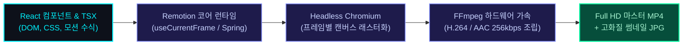

유튜브 영상을 한 편 제작할 때 가장 많은 시간을 잡아먹는 구간은 어디일까요? 

대본 작성이나 주제 기획도 많은 에너지를 소모하지만, 영상 제작자들을 가장 지치게 만드는 것은 편집 소프트웨어의 타임라인 위에서 벌어지는 끝없는 반복 노동입니다. 

자막의 폰트 크기를 40px에서 44px로 4픽셀만 키우고 싶어도 타임라인에 널려 있는 100개 이상의 텍스트 레이어를 일일이 잡고 드래그해야 합니다. 카메라 줌 효과의 속도를 조금 더 묵직하게 바꾸려면 수십 개의 키프레임 그래프를 마우스로 하나하나 곡선 조정해야 합니다. 게다가 썸네일을 만들려면 포토샵을 따로 켜서 영상에 썼던 폰트와 컬러 코드를 복사해 와야 합니다.

"웹 프론트엔드에서는 CSS 변수 하나만 바꾸면 수천 페이지의 디자인 시스템이 단 1초 만에 바뀌는데, 왜 2026년에도 영상 제작은 타임라인 위에서 일일이 손으로 노가다를 해야 하는가?"

이 근본적인 회의감에서 출발하여, 우리는 어도비 프리미어 프로(Premiere Pro)와 파이널컷을 완전히 내려놓고 React 기반의 프로그래밍 비디오 엔진인 'Remotion'을 도입했습니다. 

실제로 제가 이전에 올린 4분 49초짜리 Full HD 모션그래픽 영상과 고화질 썸네일은 단 1초의 GUI 영상 툴도 켜지 않고 오직 순수 코드로만 빌드되었습니다.

---

## 1. Remotion이란 무엇인가? 웹 기술이 영상 렌더링 파이프라인이 되는 원리

Remotion은 쉽게 말해 React 컴포넌트를 비디오 프레임으로 렌더링해 주는 프레임워크입니다.

우리가 웹 브라우저에서 화면을 만들 때 쓰는 `<div>`, CSS Flexbox, SVG, Tailwind CSS, Lucide 아이콘 등 모든 웹 생태계의 자원을 그대로 사용하여 영상 씬(Scene)을 디자인합니다. 그리고 헤드리스 크로미움(Chromium) 브라우저가 매 프레임(초당 30프레임 기준 1초에 30번) 화면을 스냅샷으로 캡처한 뒤, FFmpeg 인코더가 하나의 완전한 MP4 파일로 조립해 냅니다.



이 구조가 주는 가장 큰 변화는 "영상이 데이터와 변수로 제어되는 소프트웨어"가 된다는 점입니다.

* 시간의 축: 영상의 타임라인은 초(second)가 아니라 정수 프레임 번호(`useCurrentFrame()`)라는 상태(State) 값으로 다루어집니다.
* 애니메이션: 마우스로 드래그하는 불확실한 베지어 곡선 대신, 수학적 보간 함수 `interpolate()`와 물리 기반 감쇠 수식 `spring()`으로 완벽히 일관된 텐션을 코드로 통제합니다.
* 디자인 시스템: 컴포넌트 재사용과 전역 테마 객체로 컬러, 여백, 자막 크기를 100% 단일 진실 공급원(SSOT)으로 묶어둘 수 있습니다.

---

## 2. 실전 프로덕션: 4분 49초 분석 영상에 적용된 4대 엔지니어링

이번에 제작된 4분 49초(총 8,670 프레임) 길이의 기술 분석 영상(`ChannelGrowthVideo.tsx`)에 적용된 4가지 핵심 엔지니어링 패턴을 소개합니다.

```
lumen-video/
├── src/
│   ├── ChannelGrowthVideo.tsx          # 8,670프레임 루트 오케스트레이터
│   ├── ChannelGrowthSubtitleBar.tsx    # 193문장 동기화 고정 42px 자막 바
│   ├── ChannelGrowthThumbnail.tsx      # 120px 슈퍼 타이포 Still 썸네일
│   ├── constantsChannelGrowth.ts       # 테마 컬러 및 오디오/타임라인 상수
│   └── scenes/channel_growth/
│       ├── Scene1OpeningHook.tsx       # 48회 정체 오프닝 훅
│       ├── Scene2LifecycleDiagram.tsx  # 3대 성장 수명 주기 다이어그램
│       ├── Scene3ColdStartTunnel.tsx   # 0~100일 신생 모수 결핍 터널
│       ├── Scene4ConsistencySlump.tsx  # 1년 차 53초 시청시간 슬럼프
│       ├── Scene5FrameExpansion.tsx    # 1만 뷰 돌파 프레임 확장론
│       └── Scene6OutroCTA.tsx          # 스튜디오 체크리스트 & 아웃트로
```

### ① 193문장 자막의 '단일 진실 공급원(SSOT)' 일괄 통일

일반적인 영상 편집기에서 자막 폰트 크기를 변경하는 일은 고통 그 자체입니다. 특히 4분 이상의 긴 영상에서는 대사 길이에 따라 글자 크기를 동적으로 줄였다 늘렸다 하다가 시각적 일관성이 완전히 깨지는 참사가 자주 일어납니다.

Remotion에서는 자막 렌더러 컴포넌트를 단일 모듈(`ChannelGrowthSubtitleBar.tsx`)로 격리하고 고정 상수를 선언합니다:

```typescript
// ChannelGrowthSubtitleBar.tsx
const FIXED_FONT_SIZE = 42; // 화면 해상도 1080p 기준 고정 42px
const FIXED_LINE_HEIGHT = 1.35;

export const ChannelGrowthSubtitleBar: React.FC<{ frame: number }> = ({ frame }) => {
  // 현재 프레임에 해당하는 단일 문장 탐색
  const currentItem = SUBTITLE_DATA.find(
    (item) => frame >= item.startFrame && frame < item.endFrame
  );

  if (!currentItem) return null;

  return (
    <div style={{ position: 'absolute', bottom: 70, left: 160, right: 160, zIndex: 100 }}>
      <div style={{
        backgroundColor: 'rgba(7, 10, 15, 0.88)',
        backdropFilter: 'blur(16px)',
        border: '1.5px solid rgba(0, 242, 254, 0.35)',
        borderRadius: 20,
        padding: '18px 48px',
        textAlign: 'center',
        fontSize: FIXED_FONT_SIZE,
        fontWeight: 700,
        color: '#FFFFFF',
      }}>
        {currentItem.text}
      </div>
    </div>
  );
};
```

이렇게 구성하면 193문장의 자막 중 어떤 문장이 들어오더라도 단 1픽셀의 크기 오차도 없이 완벽한 42px 고대비 자막이 유지됩니다. 폰트 크기를 44px로 키우고 싶다면? `FIXED_FONT_SIZE = 44`로 단 한 글자만 바꾸고 빌드하면 끝납니다.

---

### ② 마우스 키프레이밍 없는 시네마틱 '슬로우 푸시인(Slow Push-in)'

영상에 몰입감을 주기 위해 카메라 줌 효과를 줄 때, 편집 프로그램에서 손으로 키프레임을 잡으면 확대 속도가 들쭉날쭉해지기 쉽습니다. 우리는 Remotion의 `interpolate` 함수와 부드러운 쿼드 감속(`Easing.quad`)을 결합하여 수학적으로 완벽한 시네마틱 푸시인을 구현했습니다:

```typescript
// 씬 시작 후 120프레임(4초) 동안 1.0배에서 1.035배로 은은하게 전진
const camScale = interpolate(
  frame,
  [0, 120],
  [1.0, 1.035],
  {
    easing: Easing.inOut(Easing.quad),
    extrapolateRight: 'clamp',
  }
);

// 루트 뷰포트에 transform 적용
<div style={{
  transform: `scale(${camScale})`,
  transformOrigin: 'center center',
  width: '100%',
  height: '100%',
}}>
  {/* 씬 그래픽 컨텐츠 */}
</div>
```

좌우로 산만하게 흔들리는 인위적 패닝(Pan)을 100% 제거하고 오직 `1.0 -> 1.035`의 미세한 스케일 전진만 유지함으로써, 시청자가 시각적 멀미를 느끼지 않고 데이터 그래픽과 자막에만 온전히 집중할 수 있는 고급스러운 다크 글래스모피즘 분위기를 완성했습니다.

---

### ③ 포토샵이 필요 없는 '1초 고화질 썸네일' 동시 추출

유튜브를 운영하면서 겪는 가장 비효율적인 프로세스 중 하나가 바로 "영상 따로, 썸네일 따로" 작업하는 것입니다. 영상에서 썼던 다이어그램이나 폰트 스타일을 포토샵에서 똑같이 구현하느라 불필요한 시간이 소모됩니다.

Remotion에서는 영상에 사용했던 React 컴포넌트를 그대로 가져와 썸네일 전용 컴포넌트(`ChannelGrowthThumbnail.tsx`)를 선언하고, 터미널 명령어 한 줄로 1920x1080 고화질 이미지를 즉시 추출할 수 있습니다.

```typescript
// Root.tsx에 Still 썸네일 등록
import { Still } from 'remotion';
import { ChannelGrowthThumbnail } from './ChannelGrowthThumbnail';

export const Root = () => {
  return (
    <>
      {/* 4분 49초 메인 비디오 컴포지션 */}
      <Composition
        id="ChannelGrowthVideo"
        component={ChannelGrowthVideo}
        durationInFrames={8670}
        fps={30}
        width={1920}
        height={1080}
      />

      {/* 16:9 고화질 썸네일 컴포지션 (단일 프레임) */}
      <Still
        id="ChannelGrowthThumbA"
        component={ChannelGrowthThumbnail}
        width={1920}
        height={1080}
        defaultProps={{ variant: 'A' }}
      />
    </>
  );
};
```

터미널에서 다음 명령어를 입력하면 단 1.2초 만에 완벽한 무손실 썸네일 JPG가 출력됩니다:

```bash
npx remotion still src/index.ts ChannelGrowthThumbA "out/thumbnail_A.jpg"
```

모바일 홈 피드에서 눈에 잘 띄도록 썸네일의 제목 폰트를 90px에서 120px로 키워달라는 피드백이 들어왔을 때, 우리는 포토샵을 열지 않았습니다. 코드에서 `fontSize: 120`으로 수치를 바꾼 뒤 1초 만에 재렌더링하여 곧바로 유튜브와 블로그 에셋에 배포했습니다.

---

## 3. 프리미어 프로 vs Remotion 생산성 비교

실제 프로덕션 환경에서 1인 크리에이터가 체감한 두 방식의 차이는 명확합니다:

| 비교 항목 | 전통적 GUI 편집 툴 (Premiere Pro) | 코드 기반 비디오 툴 (Remotion) |
| :--- | :--- | :--- |
| 자막 폰트/스타일 일괄 수정 | 수백 개 클립 다중 선택 후 노가다 수정 (누락 빈발) | CSS/상수 변수 1개 수정 ➔ 0.1초 전수 반영 |
| 모션 템포 제어 | 마우스로 키프레임 핸들러 드래그 조정 | `spring(damping: 18)` 수식으로 물리적 일관성 보장 |
| 디자인 에셋 재활용 | 영상 프로젝트와 썸네일(포토샵) 파일 분리 | 동일 React 컴포넌트를 영상과 썸네일에 100% 공유 |
| 버전 관리 (Git) | 기가바이트 단위 바이너리 프로젝트 파일 (협업 불가) | 가벼운 텍스트 코드 (`.tsx`)로 Git 커밋/이력 관리 |
| 자동화 확장성 | 사람이 수동으로 내보내기 버튼을 눌러야 함 | Node.js 스크립트로 대본만 넣으면 헤드리스 자동 렌더링 |

---

## 4. 1인 크리에이터가 얻게 되는 진짜 무기: '확장 가능한 파이프라인'

많은 분들이 "영상 편집을 왜 굳이 어렵게 코딩으로 하느냐"고 묻습니다. 

하지만 한 번 컴포넌트 아키텍처를 구축해 두면, 다음 영상을 만들 때의 생산성은 비교할 수 없을 만큼 가파르게 상승합니다. 

오프닝 훅 레이아웃, 다이어그램 시각화 모듈, 비교 분석 카드, 고정 자막 바, 그리고 아웃트로 CTA는 이미 완성된 React 컴포넌트로 존재합니다. 다음 에피소드를 제작할 때는 오디오 파일과 텍스트 데이터(JSON)만 갈아 끼우면, 5분 만에 새로운 4분짜리 고화질 영상과 썸네일이 터미널에서 자동으로 구워져 나옵니다.

수작업 편집의 늪에서 벗어나 콘텐츠의 본질인 '데이터의 깊이와 기획의 통찰'에만 온전히 시간을 쏟을 수 있는 환경을 만드는 것. 

이것이 시스템 엔지니어이자 1인 크리에이터가 코드(Code)라는 가장 강력한 도구를 영상 제작에 도입해야 하는 진짜 이유입니다.

---

참고 자료:
- [Remotion — Make videos programmatically](https://www.remotion.dev/)
- [Martin Fowler — Infrastructure As Code](https://martinfowler.com/bliki/InfrastructureAsCode.html)
