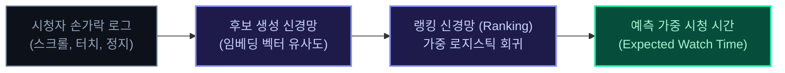
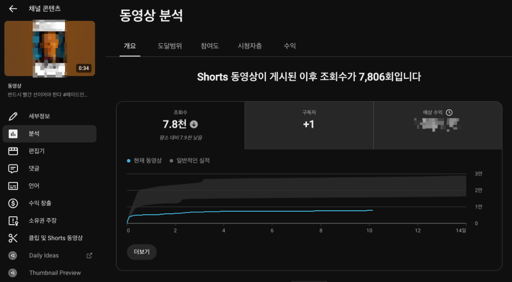
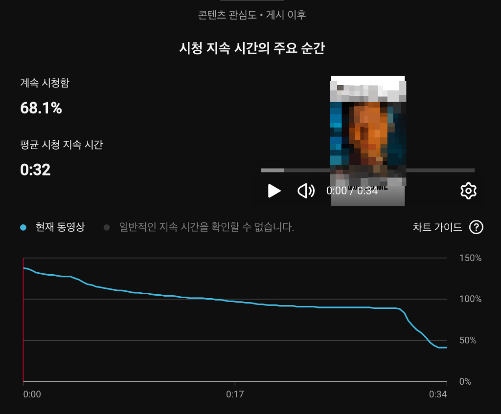
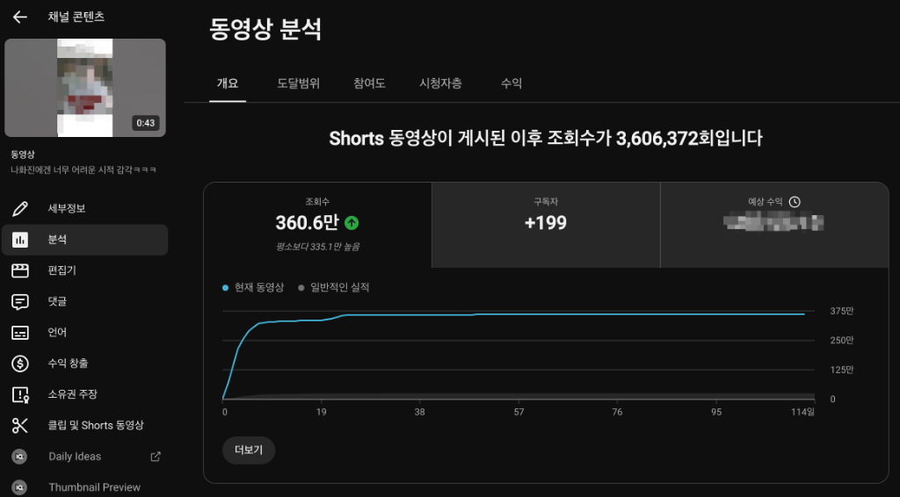
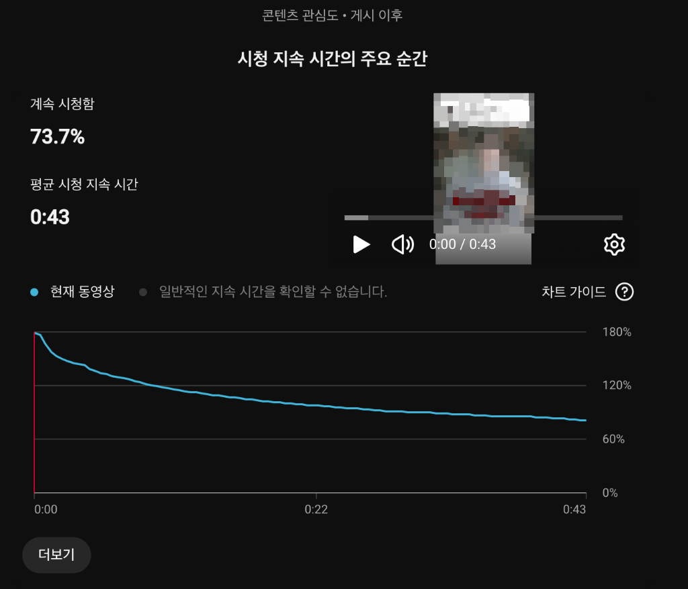
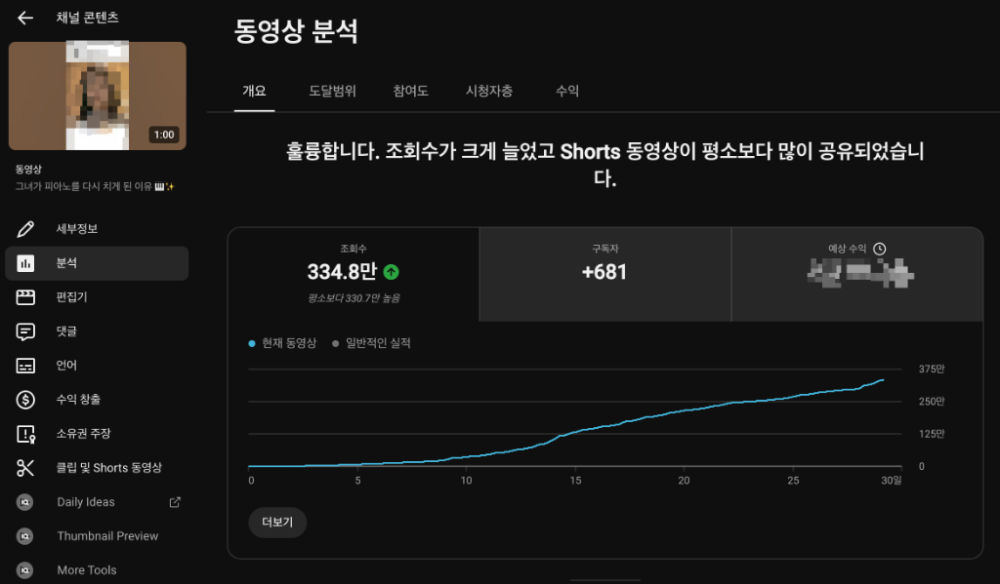
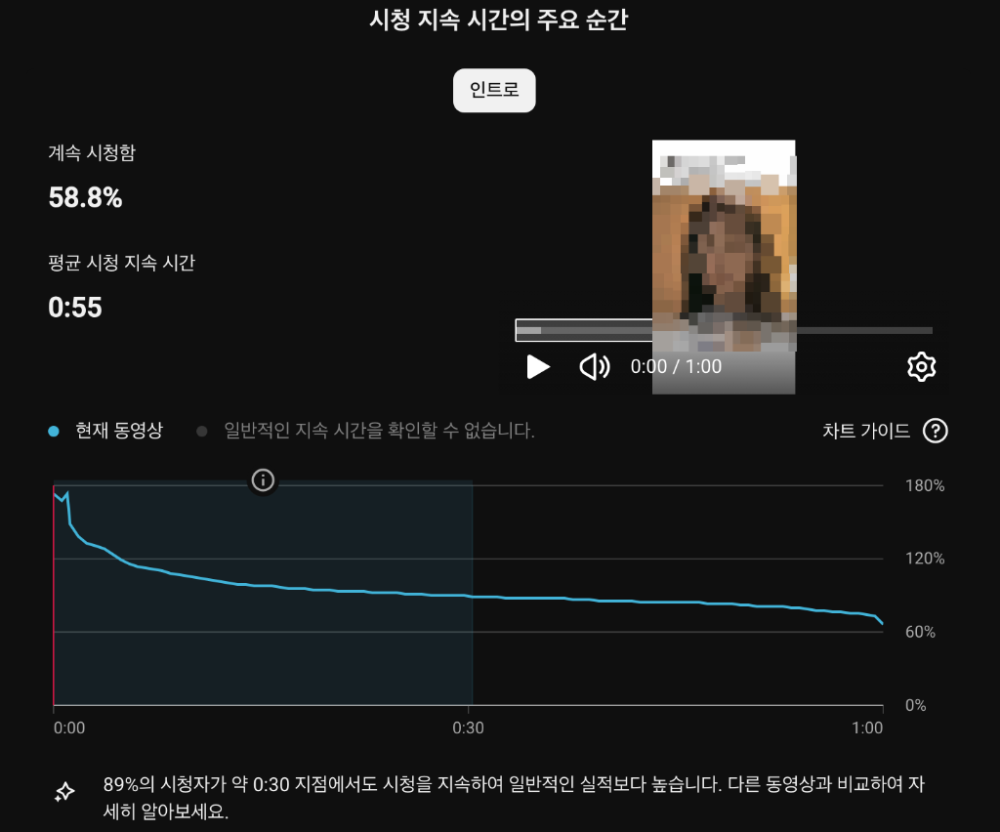
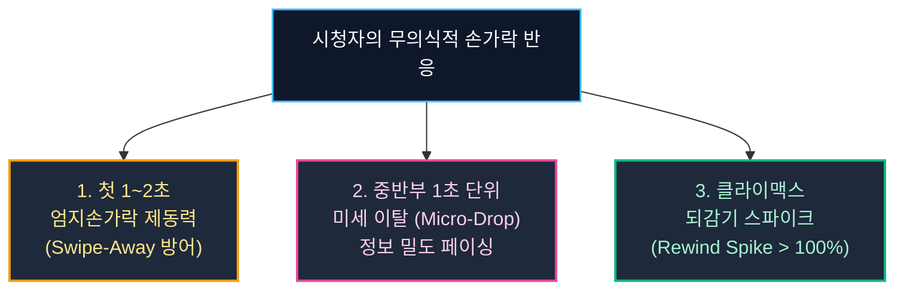
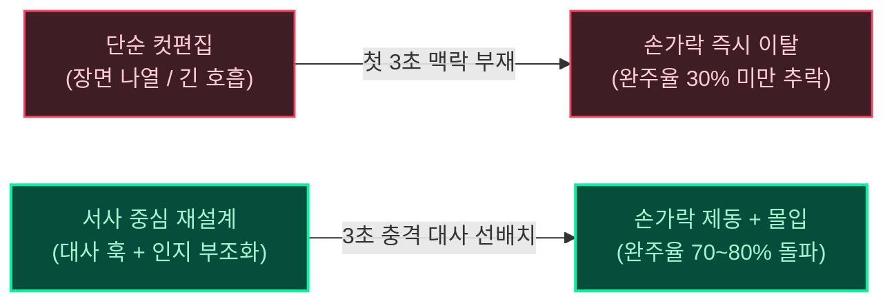

요즘 숏폼 플랫폼을 둘러보면 조회수 100만 회, 200만 회를 기록한 영상들을 심심치 않게 찾아볼 수 있습니다. 숏폼 생태계가 성숙기에 접어들면서 높은 조회수 자체는 더 이상 소수 대형 채널만의 전유물이나 기적이 아닌, 알고리즘의 파도만 제대로 탄다면 누구나 마주할 수 있는 일상적인 수치가 되었습니다.

하지만 실제 편집실에서 매일 타임라인을 쪼개고 스튜디오 대시보드를 열어보는 크리에이터들에게는 언제나 풀리지 않는 오랜 의문이 있습니다.

> "분명 이번 영상은 대본도 재미있고 편집 호흡도 완벽하다고 생각했는데, 왜 400회에서 1,000회 사이 테스트 피드 구간을 넘지 못하고 멈춰 서는 걸까?"  
> "반대로 큰 욕심 없이 올렸던 영상은 왜 80% 이상의 완주율을 기록하며 알고리즘의 추천 그물을 거침없이 뚫고 올라갈까?"

많은 사람들이 이 차이를 "영상이 재미있냐 없냐"라는 지극히 주관적인 감정의 영역으로 퉁치곤 합니다. 그러나 냉정하게 엔지니어링 관점에서 접근해 보면, 유튜브의 추천 알고리즘(AI)은 인간이 느끼는 재미나 감동, 도파민이라는 감정을 단 1밀리초도 이해하지 못합니다.

알고리즘은 영상을 시청하지 않습니다. 단지 시청자가 스마트폰 액정 위에서 움직이는 '손가락의 물리적 궤적'을 수치화된 데이터로 치환하여 행렬 연산을 수행할 뿐입니다.

그렇다면 구글의 추천 신경망은 도대체 어떤 공식과 신호를 바탕으로 "이 영상의 스토리가 시청자를 완벽히 장악했다"고 판단하는 것일까요?

구글 공식 연구 논문과 실제 스튜디오 대시보드 리텐션 지표를 바탕으로 유튜브가 '스토리의 재미'를 계산하는 3가지 결정적 물리적 메커니즘을 해체해 봅니다.

---

## 영상으로 한눈에 보기: 유튜브 알고리즘이 '스토리의 재미'를 수치화하는 법

본 칼럼에서 다루는 구글 추천 알고리즘의 심층 신경망 원리와 스튜디오 실측 3대 리텐션 데이터를 영상으로 시각화했습니다. 글을 읽기 전 편하게 시청해 보세요.

  <iframe
    src="https://www.youtube-nocookie.com/embed/7T7DCALyS8w"
    title="유튜브는 어떻게 '스토리의 재미'를 수치화할까? 알고리즘이 간파하는 시청 유지 시간의 진실"
    allow="accelerometer; autoplay; clipboard-write; encrypted-media; gyroscope; picture-in-picture; web-share"
    allowfullscreen
    loading="lazy">
  </iframe>

---

## 구글 추천 논문이 밝힌 비밀: 단순 시청 시간과 가중치 시청 시간의 차이

유튜브 추천 시스템의 핵심 두뇌가 어떻게 작동하는지 이해하려면, 지난 수년간 추천 알고리즘의 교과서로 평가받는 구글 리서치(Google Research) 팀의 공식 논문, 《Deep Neural Networks for YouTube Recommendations(유튜브 추천을 위한 심층 신경망)》을 먼저 살펴볼 필요가 있습니다.

구글의 엔지니어링 팀(Covington et al.)은 이 논문에서 유튜브의 추천 파이프라인을 크게 두 가지 단계로 분리하여 설명합니다.

1. 후보군 생성(Candidate Generation): 수억 개의 영상 중 시청자의 최근 시청 이력과 유사도를 계산해 수백 개의 후보를 추려내는 단계
2. 순위 매김(Ranking): 추려진 후보 영상들에 최종 점수를 매겨 시청자의 피드 최상단에 꽂아 넣는 단계

여기서 가장 주목해야 할 핵심은 랭킹 단계에서 사용되는 목표 함수(Objective Function), 즉 '가중 시청 시간(Weighted Watch Time)'의 개념입니다.

논문에 따르면, 알고리즘은 단순히 "시청자가 클릭했는가(CTR)"만을 보지 않습니다. 클릭률만 최적화하면 자극적인 썸네일로 낚시를 하는 어그로 영상이 판을 치게 되기 때문입니다. 그렇다고 해서 "단순히 몇 초 동안 화면을 켜두었는가"만을 절대적인 기준으로 삼지도 않습니다. 멍하니 방치된 15초와, 숨도 쉬지 않고 몰입한 15초는 플랫폼 입장에서 완전히 다른 가치를 지니기 때문입니다.

구글 신경망은 가중 로지스틱 회귀(Weighted Logistic Regression) 모델을 통해 '지속 시청 확률'과 '이탈 저항력'을 결합한 수학적 기대 시청 시간(Expected Watch Time)을 계산합니다. 즉, 알고리즘에게 '재미있는 스토리'란 시청자의 손가락이 스크롤을 시도하려는 관성을 얼마나 강하게 거슬러 멈추게 만들었는가를 나타내는 '주의력 벡터(Attention Vector)의 지속성'입니다.

다만 이 논문은 2016년에 발표된 것으로, 롱폼 중심이던 당시 유튜브 추천 시스템을 다룹니다. 쇼츠 피드가 지금도 같은 구조로 동작한다는 근거는 아니며, 아래 내용은 이 논문의 원리를 쇼츠 지표에 빗대어 해석한 저자의 분석입니다.

---

## 스튜디오 실측 데이터로 보는 피드 잔존율과 완주율의 3가지 전형적 경로

실제 스튜디오 대시보드에서 관측되는 지표를 비교해 보면, 알고리즘이 영상을 평가하는 구조가 단일 지표가 아닌 엄격한 다단계 필터링 구조임을 확인할 수 있습니다.

### 1. 1차 게이트 미달 정체군: 68.1% 피드 잔존율의 한계 (7.8천 회)

위 지표는 34초 영상에서 첫 피드 잔존율이 68.1%로 알고리즘의 안정선(70%)에 살짝 미치지 못한 채 출발한 영상입니다. 17초 이후부터 그래프가 지속적으로 하향 곡선을 그리며 마지막에 50% 밑으로 급락하자, 추천 피드가 7,800회 선에서 완전히 잠겼습니다.

- 계속 시청함(피드 잔존율): 68.1% (이탈률 31.9%)
- 평균 시청 지속 시간: 32초 / 34초
- 피드 확장 결과: 7.8천 회에서 평탄화되며 추가 추천 차단

### 2. 정석적 초기 폭발형: 73.7% 잔존율과 100% 완주의 결합 (360.6만 회)

반면 위 지표는 첫 피드 잔존율 73.7%를 안정적으로 돌파하며 알고리즘의 1차 관문을 가볍게 열어젖힌 대표적인 바이럴 모델입니다. 43초 영상에서 평균 시청 지속 시간이 43초(완주율 100%)를 기록했고, 초반 되감기 효과로 180%에서 시작해 영상 말미까지 70% 이상의 고유지율을 방어했습니다. 그 결과 게시 직후 10일 만에 360만 뷰를 폭발적으로 쓸어 담았습니다.

### 3. 고몰입 롱테일 역주행형: 30초 잔존율 89%와 공유 시그널의 결합 (334.8만 회 진행형)

가장 흥미로운 데이터는 세 번째 사례입니다. 1분 풀영상에서 첫 피드 잔존율은 58.8%로 1차 게이트 기준선보다 낮았습니다. 일반적인 영상이라면 1만 회 미만에서 멈췄어야 할 수치입니다.

하지만 이 영상은 30초 지점 잔존율이 무려 89%에 달했고, 평균 시청 시간이 55초(완주율 91.6%)를 기록했습니다. 여기에 결정적으로 "동영상이 평소보다 많이 공유되었습니다"라는 유튜브 공식 하이라이트가 붙을 만큼 강력한 공유 시그널이 발생했습니다. 

첫 2초를 버텨낸 58.8%의 시청자가 영상 끝까지 몰입하고 외부로 공유하자, 구글 신경망의 가중 시청 시간 수식이 작동하며 초반의 잔존율 패널티를 완전히 상쇄했습니다. 그 결과 10일 차부터 역주행을 시작해 334만 회를 돌파하고 지금도 우상향을 이어가고 있습니다.

---

### 실측 데이터 3종 비교 요약

| 분석 지표 항목 | 1차 게이트 정체군 | 정석적 초기 폭발형 | 고몰입 롱테일 역주행형 |
| :--- | :---: | :---: | :---: |
| 누적 조회수 실적 | 7,800회 (정체) | 3,606,000회 (완결) | 3,348,000회+ (현재 진행형) |
| 피드 계속 시청함 (Stayed) | 68.1% (기준선 미달) | 73.7% (안정 돌파) | 58.8% (초기 허들) |
| 스와이프 이탈률 (Swiped away) | 31.9% | 26.3% | 41.2% |
| 평균 시청 지속 시간 (완주율) | 32초 / 34초 (94%) | 43초 / 43초 (100%) | 55초 / 60초 (91.6%) |
| 리텐션 곡선 특징 | 후반부 급락 | 평탄형 (70%대 유지) | 30초 잔존율 89% (스튜디오 인증) |
| 알고리즘 확산 동력 | 추가 추천 차단 | 1차 게이트 돌파 + 빠른 순환 | 압도적 체류 시간 + 공유 시그널 |

이 3가지 실측 데이터가 증명하는 결론은 명확합니다. 대중적인 폭발력을 위해선 피드 잔존율 70% 이상의 훅(Hook)이 가장 확실한 고속도로이지만, 설령 초기 허들이 있더라도 중후반 정보 밀도(30초 잔존율 89%)와 공유를 이끌어내는 스토리텔링이 있다면 알고리즘은 롱테일이라는 또 다른 추천 경로를 열어준다는 점입니다.

## 알고리즘이 감지하는 3가지 결정적 물리적 신호

이러한 구글의 신경망 수식과 2단계 게이트는 실제 스마트폰 화면 위에서 시청자의 3가지 물리적 행동 신호로 관측됩니다.

### 1. 첫 1~2초: 엄지손가락 제동력(Swipe-Away Resistance)

쇼츠 피드를 넘기는 시청자의 엄지손가락은 무의식적인 자동 스크롤 상태에 있습니다. 제 관찰로는 시청자가 영상을 넘길지 판단하는 시간이 극히 짧습니다(공식 수치가 아닌 추정입니다).

이때 타이틀 자막이나 로고가 느긋하게 등장하는 영상은 뇌가 판단을 내리기도 전에 손가락에 밀려 화면 밖으로 사라집니다. 반면, 첫 1초 안에 인물의 날것 그대로의 표정이나 강렬한 대사가 귀에 꽂히는 영상은 시청자의 손가락 신경계에 즉각적인 제동을 겁니다.

스튜디오 지표 상에서 '피드에서 계속 시청함(Viewed vs Swiped Away)' 비율이 70% 이상을 안정적으로 방어하지 못하면, 뒤에 아무리 훌륭한 반전과 명장면이 숨어 있어도 알고리즘은 그 영상을 대규모 트래픽 풀로 올려 보내지 않고 폐기합니다.

### 2. 중반부: 미세 이탈(Micro-Drop-off)과 정보 밀도의 법칙

리텐션 그래프를 분석할 때 눈여겨볼 지표 중 하나가 '1초 단위 미세 이탈(Micro-Drop-off)'입니다.

시청 지속 시간 그래프를 극도로 확대해 보면 매초 미세한 잔물결이 존재합니다.
- 대사가 0.5초만 늘어지거나
- 다음 상황을 짐작할 수 있는 뻔한 호흡이 이어지거나
- 화면에 새로운 시각 정보가 3초 이상 들어오지 않을 때

시청자의 뇌는 흥미 공급이 끊겼다고 판단하고 미세하게 이탈을 시작합니다. 그래프가 완만한 곡선이 아니라 계단식(Staircase)으로 뚝뚝 떨어지는 구간은 시청자가 이탈하는 지점이므로 우선적으로 고쳐야 할 대상입니다. 성공적인 쇼츠는 매 2.5초~3초마다 새로운 인과관계나 의문, 갈등을 끊임없이 주입하는 '정보 밀도(Information Density)'를 유지함으로써 이 미세 이탈의 각도를 완벽하게 평평하게 유지해 냅니다.

### 3. 클라이맥스: 되감기 스파이크(Rewind Spike)의 파괴력

리텐션 분석에서 가장 주목할 만한 순간은 그래프가 100% 선을 뚫고 위로 솟구치는 되감기 스파이크(Rewind Spike)입니다.

- "어? 방금 무슨 일이 일어난 거지?"
- "방금 저 대사가 실화인가?"
- "뒤통수 친 진짜 범인이 저 사람이었다고?"

시청자가 충격적인 대사나 시각적 반전을 확인하기 위해 화면을 두 번 탭하여 되감거나, 루프(Loop)를 돌며 다시 확인하는 순간 리텐션 수치는 105%, 120%로 폭등합니다. 저는 이 '재시청 및 되감기' 신호가 추천에 긍정적으로 작용한다고 가정합니다(공식 확인된 가중치가 아닌 저자의 가설입니다). 실제로 제 채널에서도 곡선이 100%를 넘는 영상들이 더 넓게 확산되었습니다.

---

## 실전 프로덕션: 단순 컷편집이 실패하는 구조적 이유

많은 크리에이터들이 쇼츠를 제작할 때 흔히 저지르는 실수가 있습니다. 바로 원본 영상에서 소위 "재미있어 보이는 구간"을 앞뒤만 잘라 그대로 쇼츠로 올리는 '단순 컷편집'입니다.

그러나 프로덕션 현장에서 수많은 테스트를 거치며 확인하게 되는 진실은, 맥락이 거세된 단순 하이라이트는 시청자의 손가락을 1초도 붙잡지 못한다는 점입니다. 시청자는 앞뒤 인과관계를 모르는 상태에서 인물이 소리를 지르거나 뛰어다니는 장면을 보면 몰입하는 것이 아니라 당혹감과 피로감을 느끼며 즉시 엄지손가락을 위로 튕겨버립니다.

실제 높은 몰입도를 기록하는 킬러 클립들은 철저하게 시청자의 인지 구조에 맞춰 재구성됩니다.

1. **3초 킬러 대사의 전진 배치 (인지 부조화 유발)**:  
   상황 설명 자막 대신, 인물의 가장 황당하거나 억울한 육성을 첫 컷에 과감히 배치합니다. 시청자는 이 한마디를 듣는 순간 "도대체 무슨 상황이길래 저런 말을 하지?"라는 강력한 인지 부조화에 빠지며 손가락을 멈추게 됩니다.
2. **기대와 현실의 갭(Gap)을 이용한 반전 정점**:  
   시청자가 예상하던 흐름이 통렬하게 깨지는 순간, 뇌에서 강렬한 집중 스파이크가 발생합니다. 예측 가능한 스토리에는 반응하지 않는 것이 인간 뇌의 기본 방어기제입니다.
3. **군더더기 0.1초를 도려내는 페이싱 압축**:  
   말과 말 사이의 정적, 필요 없는 불필요한 반응 컷을 과감히 잘라내어 문장이 톱니바퀴처럼 맞물려 돌아가게 만듭니다. 시청자가 지루함을 느낄 틈을 주지 않는 속도감입니다.

---

## 스토리텔링은 문학이 아니라 '반응 속도 엔지니어링'이다

유튜브 쇼츠에서 100만 뷰를 넘나드는 영상과 수백 뷰에서 멈추는 영상의 차이는 막연한 감에 있지 않습니다. 그것은 시청자의 생리적 주의력 결핍(Attention Deficit)을 얼마나 정밀하게 예측하고, 매 프레임마다 그들의 손가락 반응을 정교하게 제어했는가의 차이입니다.

내가 만든 영상이 알고리즘의 벽 앞에서 자꾸만 멈춰 선다면, 막연히 실망하기 전에 스튜디오 대시보드의 리텐션 그래프를 1초 단위로 뜯어보아야 합니다.

- 체크 1: 첫 1.5초 구간에서 피드 계속 시청률이 70% 이상을 방어하고 있는가?
- 체크 2: 중반부 15초~30초 구간에서 계단식으로 떨어지는 0.5초의 공백이 존재하는가?
- 체크 3: 영상 후반부에 시청자가 다시 돌려보고 싶게 만드는 반전이나 명대사의 스파이크 핀이 꽂혀 있는가?

알고리즘을 원망할 필요는 없습니다. 구글의 인공지능은 그저 시청자들의 솔직한 손가락 반응을 가장 정직하게 미러링하고 있을 뿐입니다. 영상의 재미를 감이 아닌 데이터의 리듬으로 조율할 수 있을 때, 알고리즘은 비로소 당신의 가장 강력한 확성기가 되어줄 것입니다.
