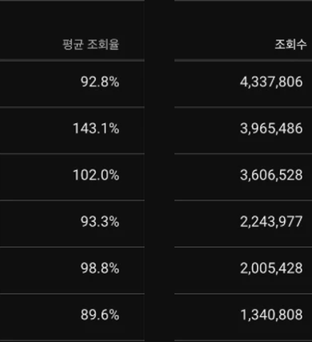

영상 한 편이 기대만큼 안 나오면 그 영상만 붙들고 이유를 찾게 됩니다.\
제목이 별로였나, 첫 3초가 약했나?

그런데 채널의 영상을 전부 한 줄로 세워 놓으면 질문이 달라집니다.\
안 나온 영상이 왜 안 나왔는지가 아니라, 잘 나온 영상은 대체 어디에 몰려 있느냐로 바뀝니다.

제가 운영하는 쇼츠 채널(이하 채널 A)로 그 줄 세우기를 해 봤습니다.\
2026년 2월 10일에 채널을 개설했고, 10월 6일 기준 61초 이하 쇼츠는 137편입니다.\
운영 도중 삭제한 영상은 빠져 있습니다.

영상 데이터는 제 채널을 YouTube API로 가져왔고, 약 140편 기준입니다.

  <iframe
    src="https://www.youtube-nocookie.com/embed/biIxTHEapvM"
    title="쇼츠 성장 방법: 137편 실제 데이터로 본 길이, 평균 조회율, 업로드 빈도"
    allow="accelerometer; autoplay; clipboard-write; encrypted-media; gyroscope; picture-in-picture; web-share"
    allowfullscreen
    loading="lazy">
  </iframe>

## 137편을 줄 세웠더니 20편이 77%를 가져갔습니다

조회수 순으로 세우면 맨 위 20편, 조회 50만 이상 영상이 전체 조회수의 77%를 차지합니다.

기준을 10만 이상으로 낮춰도 그림은 비슷합니다.\
42편은 전체 편수의 31%인데 조회수는 91%를 가져갑니다.\
나머지 95편을 다 합쳐도 9%입니다.

스튜디오에서 조회수 순으로 놓으면 위쪽이 이렇게 생겼습니다.

그러면 이 채널의 보통 영상은 어느 정도일까요?\
중앙값으로 약 4.6만입니다.

평균을 내면 큰 영상 몇 편이 숫자를 끌어올려 보통 영상의 모습이 가려집니다.\
그래서 평균 대신 중앙값과, 10만 이상이 몇 퍼센트인지를 기준으로 삼았습니다.

초보 크리에이터에게 이 분포가 건네는 말은 하나입니다.\
영상 대부분이 중앙값 근처에 머문다고 곧바로 잘못된 채널이라고 읽을 이유는 없습니다.

제 채널도 그렇게 생겼습니다.

## 잘 된 영상은 대체로 30~50초였습니다

10만을 넘은 42편 가운데 31편이 30~50초 사이였습니다.\
열에 일곱이 넘는 74%입니다.

50만을 넘은 20편으로 좁혀도 14편이 이 구간입니다.

반대로 20초도 안 되는 영상은 어땠을까요?\
평균 조회율은 오히려 높았습니다.\
중앙값이 124.8%입니다.

짧으면 끝까지 보기 쉽고 한 번 더 돌려 보는 경우도 생깁니다.\
그런데 조회수는 따라오지 않았습니다.

이 구간 7편 중 10만을 넘은 영상은 2편뿐입니다.\
그 두 편 가운데 하나는 조회수가 약 397만으로 채널에서 두 번째로 많이 본 영상입니다.

7편은 적은 숫자라 결론을 내리기엔 이릅니다.\
그래도 하나는 말할 수 있습니다.

평균 조회율이 높다는 이유로 영상을 짧게 줄이면 조회수도 같이 오르리라는 기대는 이 채널에서 맞지 않았습니다.

## 평균 조회율은 높다고 다 좋은 게 아니었습니다

평균 조회율은 영상을 평균 몇 퍼센트까지 봤는지를 말합니다.\
반복해서 보는 시청이 섞이면 100%를 넘기도 합니다.

이 채널에서 눈에 띈 구간은 세 곳입니다.

| 평균 조회율 구간 | 조회수 중앙값 |
|---|---|
| 70% 미만 | 약 1.8만 |
| 100~120% | 약 14.6만 |
| 120% 초과 | 약 3.0만 |

가장 좋았던 구간은 100~120%입니다.\
이 구간은 21편 중 11편이 10만을 넘었습니다.\
70% 미만은 한참 아래였습니다.

의외였던 건 그 위쪽입니다.\
120%를 넘는 6편은 중앙값이 약 3.0만으로 도리어 내려갔습니다.

이 구간에는 평균 조회율 143.1%에 약 397만 조회인 영상도 들어 있습니다.\
한 편이 크게 터져도 중앙값은 움직이지 않습니다.\
평균 대신 중앙값을 보는 이유가 여기서도 드러납니다.

6편이라 이것도 확정은 못 합니다.\
다만 높을수록 계속 좋아지는 직선은 아니라는 점은 분명합니다.

평균 조회율이 높은데도 조회수가 1만에서 멈춘 영상 이야기는 [평균 조회율 150%의 함정](/blog/2026-09-05-shorts-retention-rate-vs-avd-algorithm/)에서, 1만 벽에 걸린 영상이 채널에 남기는 것은 [쇼츠 조회수 1만 벽](/blog/2026-09-29-shorts-retention-paradox-channel-authority/)에서 한 편씩 따로 다뤘습니다.

이번에는 영상 하나가 아니라 채널 전체를 보고 있다는 점이 다릅니다.

## 많이 올리던 때와 덜 올리던 때

4월부터 6월 중순까지는 주 5.6편씩, 모두 62편을 올렸습니다.\
그 시기 영상의 44%가 10만 이상이었습니다.

6월 중순 이후에는 주 2.2~3.2편으로 속도가 내려갔습니다.\
7월 이후 올린 27편 중 10만 이상은 5편, 19%였습니다.

올리는 속도가 느려진 때와 10만 이상 비율이 내려간 때가 겹칩니다.\
그러면 많이 올리면 된다는 얘기일까요?

아쉽게도 이 데이터로는 그렇게 말할 수 없습니다.\
같은 기간에 채널은 나이를 먹었고 소재까지 그대로였다고 장담하기도 어렵습니다.

한 가지만 추정으로 덧붙입니다.\
많이 올릴수록 큰 영상이 걸릴 기회도 많아집니다.

앞에서 본 것처럼 큰 영상은 소수에서 나오니 시도 횟수 자체가 영향을 줬을 가능성은 있습니다.\
확인된 사실은 두 숫자가 같은 시기에 함께 움직였다는 데까지입니다.

## 180만에서 멈춘 영상을 다시 만들어 올렸더니

개설하고 처음 올린 영상은 약 두 달 동안 180만 조회에서 움직이지 않았습니다.

채널 초기에 만든 영상이라 컷 편집이 어색한 부분이 있었습니다.\
목소리도 TTS였습니다.

그 영상을 지우고 컷을 다시 다듬었습니다.\
TTS는 제 목소리로 다시 녹음했고 템플릿도 손봤습니다.

한 달쯤 뒤에 조회수는 약 430만이 됐습니다.

딱 한 번 있었던 일입니다.\
한꺼번에 바꿔서 무엇이 효과였는지는 가려내지 못합니다.\
이전 영상의 조회수는 삭제와 함께 사라졌습니다.

그래서 따라 해 보라고 권하지는 않습니다.\
멈춘 영상이 다시 움직인 적도 있다는 기록으로만 읽어 주십시오.

## 내 채널에서 먼저 해 볼 만한 계산

영상이 몇십 편만 쌓여도 할 수 있는 계산입니다.\
스튜디오에서 영상을 조회수 순으로 놓고 중앙값과, 상위 영상이 차지하는 비율부터 구해 보시길 권합니다.

영상이 적다면 10만 대신 1만이나 5만을 기준으로 잡아도 됩니다.

YouTube 고객센터의 [Content 탭 분석 도움말](https://support.google.com/youtube/answer/12942217?hl=en&co=YOUTUBE._YTVideoType%3Dshorts)은 쇼츠 조회수와 함께, 피드에서 시청자가 쇼츠를 넘기지 않고 보기로 선택한 비율을 확인하는 방법을 안내합니다.\
분석 화면의 전체 구성은 [YouTube Analytics 시작하기](https://support.google.com/youtube/answer/9002587)에 정리되어 있습니다.

그다음에는 같은 계산을 길이별, 평균 조회율 구간별로 나눠 봅니다.\
마지막으로 업로드 간격이 달라진 날짜를 경계로 앞뒤를 비교합니다.

세 가지를 하고 나면 이 채널과 어디가 닮았고 어디가 다른지 보입니다.\
다르게 나온 부분이 있다면 그쪽이 오히려 쓸모 있는 정보입니다.

## 이 숫자를 믿기 전에 알아 둘 점

이 글은 채널 하나, 영상 약 140편의 기록입니다.\
지운 영상이 빠져 있어서 왜 지웠느냐에 따라 분포가 한쪽으로 쏠렸을 수 있습니다.

구간마다 영상이 6편에서 21편뿐이라 표본도 작습니다.\
여기서 본 것은 함께 움직였다는 관계일 뿐 원인이 아닙니다.

여러분 채널에서 같은 계산을 하면 경계가 다르게 나올 수 있습니다.\
괜찮습니다.

이 글의 값은 정답표가 아니라 옆에 놓고 비교할 기준선입니다.